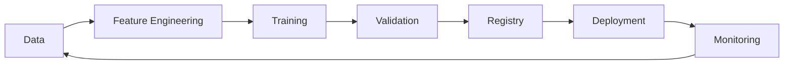

# 🔄 MLOps Pipeline Implementation

> __🏠 [Home](../../../README.md)__ | __📘 [Implementation](../README.md)__ | __🧪 [Databricks](README.md)__ | __🔄 MLOps Pipeline__


Implement end-to-end MLOps pipelines with Databricks and MLflow.

---

## 🎯 Overview

MLOps pipelines automate the ML lifecycle from development to production.



---

## 🔧 Implementation

### Step 1: Feature Pipeline

```python
# Feature pipeline job
from databricks.sdk.service.jobs import Task, NotebookTask

feature_task = Task(
    task_key="feature_engineering",
    notebook_task=NotebookTask(
        notebook_path="/Repos/ml-pipelines/feature_engineering",
        base_parameters={
            "input_table": "bronze.sales.transactions",
            "output_table": "ml.features.customer_features",
            "run_date": "{{job.start_time}}"
        }
    ),
    existing_cluster_id="cluster-123"
)
```

### Step 2: Training Pipeline

```python
import mlflow
from mlflow.tracking import MlflowClient

def train_model(training_data_path: str, model_name: str):
    mlflow.set_experiment("/Experiments/customer-churn")

    with mlflow.start_run(run_name="training-run") as run:
        # Load data
        df = spark.read.format("delta").load(training_data_path)
        X = df.drop("label").toPandas()
        y = df.select("label").toPandas()

        # Train
        model = XGBClassifier(n_estimators=100, max_depth=6)
        model.fit(X, y)

        # Evaluate
        y_pred = model.predict(X)
        accuracy = accuracy_score(y, y_pred)

        # Log
        mlflow.log_metric("accuracy", accuracy)
        mlflow.log_params(model.get_params())

        # Register model
        mlflow.sklearn.log_model(
            model,
            artifact_path="model",
            registered_model_name=model_name
        )

        return run.info.run_id
```

### Step 3: Model Validation

```python
def validate_model(model_name: str, version: int):
    client = MlflowClient()

    # Load model
    model_uri = f"models:/{model_name}/{version}"
    model = mlflow.sklearn.load_model(model_uri)

    # Load validation data
    val_df = spark.table("ml.validation.holdout_set").toPandas()

    # Evaluate
    predictions = model.predict(val_df.drop("label", axis=1))
    metrics = {
        "accuracy": accuracy_score(val_df["label"], predictions),
        "f1": f1_score(val_df["label"], predictions),
        "auc": roc_auc_score(val_df["label"], predictions)
    }

    # Check thresholds
    if metrics["accuracy"] > 0.85 and metrics["f1"] > 0.80:
        # Promote to staging
        client.transition_model_version_stage(
            name=model_name,
            version=version,
            stage="Staging"
        )
        return True

    return False
```

### Step 4: Deployment Pipeline

```python
from databricks.sdk import WorkspaceClient

def deploy_model(model_name: str):
    w = WorkspaceClient()

    # Create/update serving endpoint
    endpoint_config = {
        "name": f"{model_name}-endpoint",
        "config": {
            "served_entities": [{
                "entity_name": model_name,
                "entity_version": "1",
                "workload_size": "Small",
                "scale_to_zero_enabled": True
            }],
            "auto_capture_config": {
                "catalog_name": "ml",
                "schema_name": "inference_logs",
                "table_name_prefix": model_name
            }
        }
    }

    w.serving_endpoints.create_and_wait(**endpoint_config)
```

---

## 📊 CI/CD Integration

### Azure DevOps Pipeline

```yaml
trigger:
  branches:
    include:
      - main

stages:
  - stage: Test
    jobs:
      - job: UnitTests
        steps:
          - script: pytest tests/

  - stage: Train
    jobs:
      - job: TrainModel
        steps:
          - script: |
              databricks jobs run-now --job-id $(TRAINING_JOB_ID)

  - stage: Deploy
    condition: succeeded()
    jobs:
      - job: DeployModel
        steps:
          - script: |
              databricks model-serving update-endpoint --name $(ENDPOINT_NAME)
```

---

## 📚 Related Documentation

- [Model Monitoring](model-monitoring.md)
- [Feature Store Setup](feature-store-setup.md)
- [ML Deployment Patterns](../../03-architecture-patterns/ml-patterns/model-deployment.md)

---

*Last Updated: January 2025*
