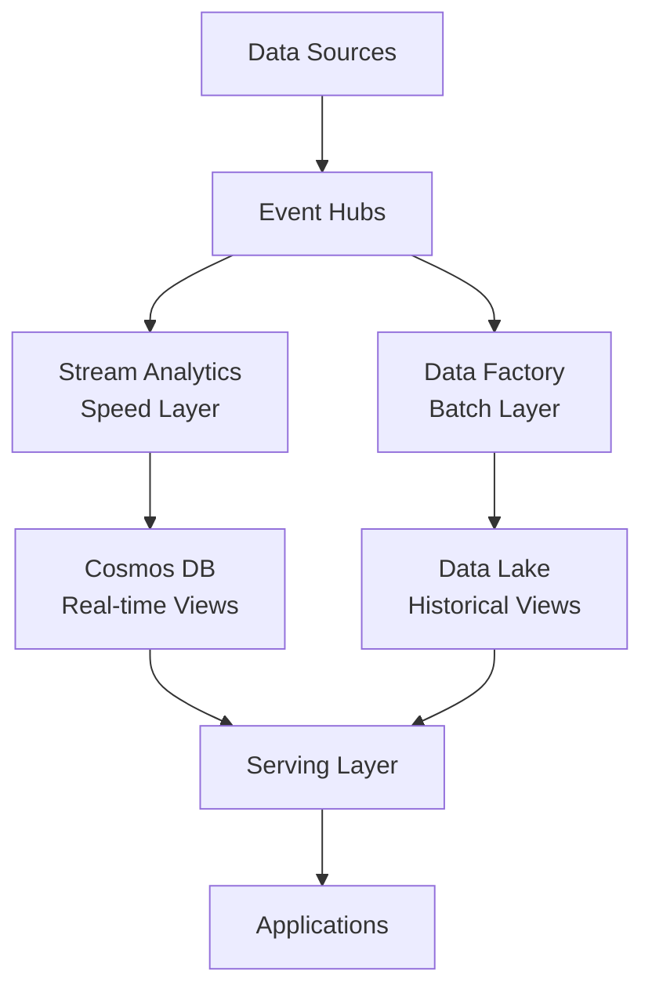
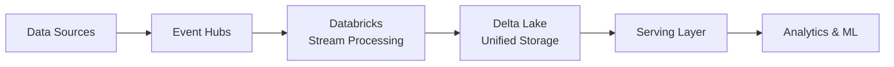
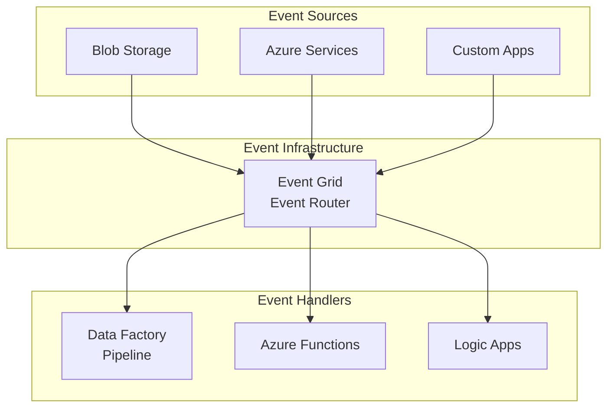
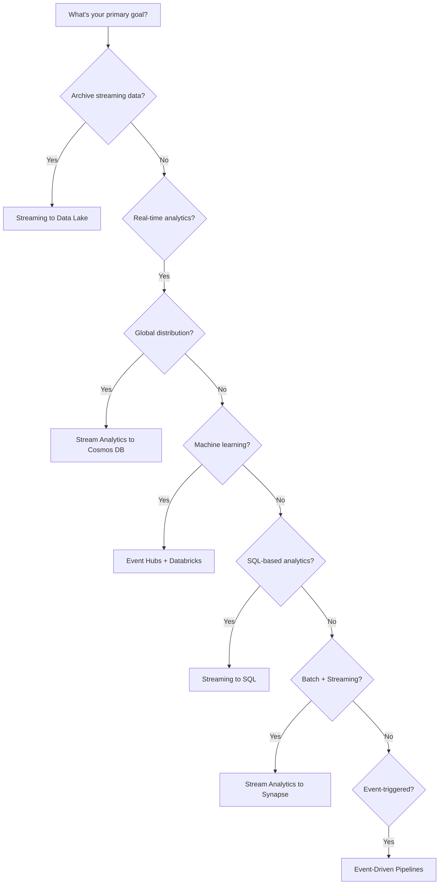

# 🔗 Integration Scenarios

> __🏠 [Home](../../../README.md)__ | __📖 [Documentation](../../README.md)__ | __🚀 [Implementation Guides](../README.md)__ | __🔗 Integration Scenarios__


Step-by-step guides for integrating Azure streaming and analytics services in common Cloud Scale Analytics scenarios.

---

## 🎯 Overview

Integration scenarios provide detailed implementation guides for connecting multiple Azure services to build complete streaming and analytics solutions. Each scenario includes infrastructure templates, configuration examples, and best practices.

### Scenario Categories

- **Streaming to Storage**: Archive and persist streaming data
- **Streaming to Databases**: Real-time operational data stores
- **Advanced Processing**: Complex streaming analytics with ML
- **Event-Driven Workflows**: Automated data pipeline triggers

---

## 📋 Available Scenarios

### 🏗️ Streaming to Storage

#### [Streaming to Data Lake](streaming-to-datalake.md)


**Description**: Configure Event Hubs Capture to automatically archive streaming data to Azure Data Lake Storage Gen2.

**Services Used**:
- Azure Event Hubs
- Azure Data Lake Storage Gen2

**What You'll Build**:
- Event Hubs namespace with capture enabled
- Data Lake Storage with hierarchical namespace
- Automatic Avro file archival
- Time and size-based partitioning

**Estimated Time**: 30 minutes

---

#### [Streaming to SQL](streaming-to-sql.md)


**Description**: Stream data from Event Hubs to Azure SQL Database or Synapse SQL using Stream Analytics.

**Services Used**:
- Azure Event Hubs
- Azure Stream Analytics
- Azure SQL Database or Synapse SQL

**What You'll Build**:
- Event Hubs for data ingestion
- Stream Analytics job with SQL queries
- SQL Database with optimized schema
- Real-time data transformation pipeline

**Estimated Time**: 45 minutes

---

### ⚡ Advanced Stream Processing

#### [Event Hubs with Databricks](eventhubs-databricks.md)


**Description**: Implement structured streaming from Event Hubs to Databricks for real-time analytics and machine learning.

**Services Used**:
- Azure Event Hubs
- Azure Databricks
- Azure Data Lake Storage Gen2 (Delta Lake)

**What You'll Build**:
- Event Hubs for high-volume ingestion
- Databricks workspace with Delta Lake
- Structured streaming pipelines with PySpark
- Real-time ML model inference

**Estimated Time**: 60 minutes

---

#### [Stream Analytics to Cosmos DB](stream-analytics-cosmos.md)


**Description**: Process streaming data with Stream Analytics and write to Cosmos DB for globally distributed operational data.

**Services Used**:
- Azure Event Hubs or IoT Hub
- Azure Stream Analytics
- Azure Cosmos DB

**What You'll Build**:
- Stream Analytics job with windowing functions
- Cosmos DB with optimized partitioning
- Real-time aggregation pipeline
- Global distribution configuration

**Estimated Time**: 40 minutes

---

### 🏢 Enterprise Integration

#### [Stream Analytics to Synapse](stream-analytics-synapse.md)


**Description**: Integrate Stream Analytics with Synapse Analytics for real-time to batch analytics workflows (Lambda Architecture).

**Services Used**:
- Azure Event Hubs
- Azure Stream Analytics
- Azure Synapse Analytics
- Azure Data Lake Storage Gen2

**What You'll Build**:
- Stream Analytics for real-time processing
- Synapse dedicated SQL pool
- Delta Lake for unified storage
- Lambda architecture implementation

**Estimated Time**: 60 minutes

---

#### [Event-Driven Data Pipelines](event-driven-pipelines.md)


**Description**: Build event-driven Data Factory pipelines triggered by Event Grid and custom events.

**Services Used**:
- Azure Event Grid
- Azure Data Factory
- Azure Storage (Blob/ADLS Gen2)

**What You'll Build**:
- Event Grid custom and system topics
- Data Factory with event triggers
- Storage blob event integration
- Automated pipeline orchestration

**Estimated Time**: 50 minutes

---

## 📊 Scenario Comparison Matrix

| Scenario | Use Case | Latency | Complexity | Throughput | Best For |
|----------|----------|---------|------------|------------|----------|
| **Streaming to Data Lake** | Archival | Seconds | 🟢 Low | Very High | Long-term storage, backup |
| **Streaming to SQL** | Operational Analytics | Sub-second | 🟡 Medium | Medium | Real-time dashboards |
| **Event Hubs + Databricks** | Real-time ML | Seconds | 🔴 High | Very High | Fraud detection, anomalies |
| **Stream Analytics + Cosmos** | Global Operations | Sub-second | 🟡 Medium | High | Multi-region apps |
| **Stream Analytics + Synapse** | Enterprise DW | Seconds | 🔴 High | High | Hybrid batch/streaming |
| **Event-Driven Pipelines** | Automated ETL | Minutes | 🟡 Medium | Medium | File-triggered workflows |

---

## 🏗️ Common Architecture Patterns

### Pattern 1: Lambda Architecture



**When to Use**:
- Need both real-time and batch processing
- Historical analysis with recent data queries
- Balance between latency and accuracy

**Scenarios**: Stream Analytics to Synapse, Streaming to Data Lake + SQL

---

### Pattern 2: Kappa Architecture



**When to Use**:
- Streaming-first architecture
- Real-time analytics only
- Simplified data pipeline

**Scenarios**: Event Hubs with Databricks

---

### Pattern 3: Event-Driven Architecture



**When to Use**:
- File arrival triggers
- Service integration and decoupling
- Workflow automation

**Scenarios**: Event-Driven Data Pipelines

---

## 🎯 Choosing the Right Scenario

### Decision Tree



### By Use Case

#### IoT Telemetry Processing

**Recommended**: Event Hubs + Databricks or Stream Analytics to Data Lake
- High-volume ingestion
- Real-time processing
- Historical analysis

#### Real-Time Dashboards

**Recommended**: Streaming to SQL or Stream Analytics to Cosmos DB
- Low latency queries
- Operational analytics
- Live visualizations

#### Fraud Detection

**Recommended**: Event Hubs + Databricks
- Real-time ML inference
- Complex event processing
- Anomaly detection

#### Enterprise Data Warehouse

**Recommended**: Stream Analytics to Synapse
- Hybrid batch and streaming
- Large-scale analytics
- BI integration

#### File Processing Automation

**Recommended**: Event-Driven Data Pipelines
- Automated workflows
- File arrival triggers
- Orchestration

---

## 🛠️ Common Prerequisites

All scenarios require the following:

### Azure Resources

- **Azure Subscription**: With appropriate permissions
- **Resource Group**: For organizing resources
- **Azure CLI or PowerShell**: For deployment
- **Service Principal** (optional): For automated deployments

### Networking (Optional but Recommended)

- **Virtual Network**: For network isolation
- **Private Endpoints**: For secure connectivity
- **DNS Configuration**: For private endpoint resolution

### Security

- **Managed Identity**: For service-to-service authentication
- **Azure Key Vault**: For secrets management
- **RBAC Roles**: Appropriate role assignments

---

## 📦 Template Repository Structure

Each scenario includes:

```text
scenario-name/
├── bicep/
│   ├── main.bicep              # Main infrastructure template
│   ├── parameters.json         # Parameter file
│   └── modules/
│       ├── eventhubs.bicep     # Event Hubs module
│       ├── storage.bicep       # Storage module
│       └── ...                 # Other service modules
├── scripts/
│   ├── deploy.sh               # Bash deployment script
│   ├── deploy.ps1              # PowerShell deployment script
│   └── configure.sh            # Post-deployment configuration
├── config/
│   ├── stream-analytics.json   # Stream Analytics query
│   └── databricks-notebook.py # Databricks notebook
└── README.md                   # Scenario-specific guide
```

---

## 🚀 Getting Started

### Step 1: Choose Your Scenario

Review the scenarios above and select one that matches your requirements.

### Step 2: Review Prerequisites

Check the common prerequisites and scenario-specific requirements.

### Step 3: Deploy Infrastructure

Use provided Bicep templates or follow manual deployment steps.

### Step 4: Configure Services

Apply configuration files and set up data flows.

### Step 5: Test and Validate

Send sample data and verify end-to-end processing.

### Step 6: Monitor and Optimize

Set up monitoring and apply optimization best practices.

---

## 💰 Cost Considerations

### Cost Factors by Scenario

| Scenario | Primary Costs | Optimization Tips |
|----------|--------------|-------------------|
| **Streaming to Data Lake** | Storage, Event Hubs TUs | Use lifecycle policies, optimize capture |
| **Streaming to SQL** | SQL Database DTUs, Stream Analytics SUs | Right-size database, optimize queries |
| **Event Hubs + Databricks** | Databricks DBUs, Event Hubs | Use auto-scaling, spot instances |
| **Stream Analytics + Cosmos** | Cosmos RUs, Stream Analytics SUs | Optimize partition key, use TTL |
| **Stream Analytics + Synapse** | Synapse DWUs, Storage | Pause when idle, use result set caching |
| **Event-Driven Pipelines** | Data Factory activities, Storage | Optimize trigger frequency, batch operations |

**[📖 Detailed Cost Guide →](../../best-practices/cost-optimization.md)**

---

## 🔒 Security Best Practices

### Network Security

- Use **Private Endpoints** for all service connections
- Deploy services within **Virtual Networks**
- Configure **Network Security Groups** (NSGs)
- Enable **Azure Firewall** for centralized protection

### Identity & Access

- Use **Managed Identities** for service authentication
- Apply **least-privilege RBAC** roles
- Store credentials in **Azure Key Vault**
- Enable **Azure AD authentication** where supported

### Data Protection

- Enable **encryption in transit** (TLS 1.2+)
- Enable **encryption at rest** for all storage
- Implement **data masking** for sensitive fields
- Configure **diagnostic logging** and auditing

**[📖 Security Guide →](../../best-practices/security.md)**

---

## 📊 Monitoring & Troubleshooting

### Key Metrics to Monitor

- **Throughput**: Events/messages per second
- **Latency**: End-to-end processing time
- **Error Rate**: Failed operations percentage
- **Resource Utilization**: CPU, memory, storage
- **Cost**: Daily spending trends

### Troubleshooting Resources

- Connectivity Issues - Network, endpoint, and firewall troubleshooting
- Performance Problems - Throughput, latency, and scaling issues
- Configuration Errors - Service setup and integration validation

**[📖 Full Troubleshooting Guide →](../../07-troubleshooting/README.md)**

---

## 📚 Additional Resources

### Architecture Patterns

- [Lambda Architecture](../../03-architecture-patterns/streaming-architectures/lambda-architecture.md)
- [Kappa Architecture](../../03-architecture-patterns/streaming-architectures/kappa-architecture.md)
- Event-Driven Architecture - Build reactive, event-based systems

### Service Documentation

- [Event Hubs Guide](../../02-services/streaming-services/azure-event-hubs/README.md)
- [Streaming Services Overview](../../02-services/streaming-services/README.md)
- [Databricks Guide](../../02-services/analytics-compute/azure-databricks/README.md)

### Code Examples

- Code samples are provided within each integration scenario guide
- Infrastructure templates (Bicep/ARM) included in scenario directories

---

## 💬 Feedback

Help us improve these scenarios!

- ✅ **Scenario worked perfectly** - [Share your success](https://github.com/fgarofalo56/csa-inabox-docs/discussions)
- ⚠️ **Encountered issues** - [Report a problem](https://github.com/fgarofalo56/csa-inabox-docs/issues/new)
- 💡 **Have suggestions** - [Share your ideas](https://github.com/fgarofalo56/csa-inabox-docs/issues/new)

---

*Last Updated: 2025-01-28*
*Total Scenarios: 6*
*Average Completion Time: 45 minutes*
