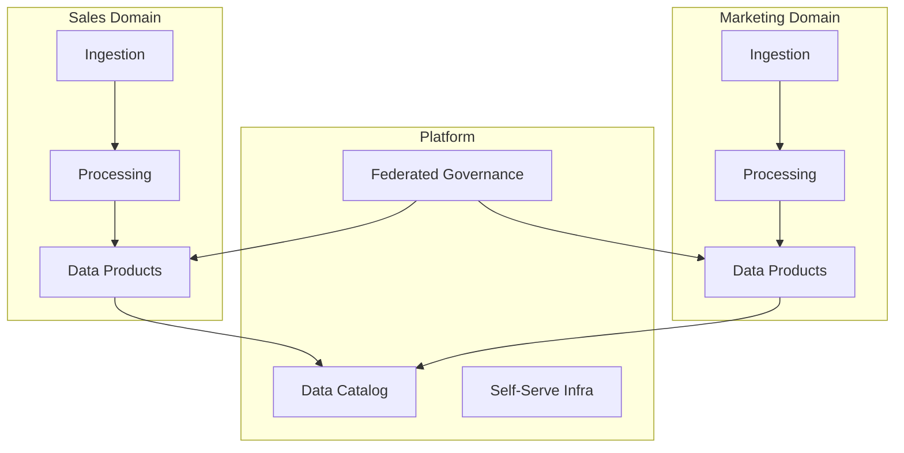

# Data Mesh Integration Patterns

> __[Home](../../../README.md)__ | __[Implementation](../README.md)__ | __[Integration](README.md)__ | __Data Mesh__


Implement data mesh architecture with domain-driven data ownership and federated governance.

---

## Overview

Data mesh principles implemented on Azure:

- **Domain Ownership**: Teams own their data products
- **Data as a Product**: Self-service, discoverable, trustworthy
- **Self-Serve Platform**: Infrastructure as a service
- **Federated Governance**: Computational policies

---

## Architecture



---

## Implementation

### Step 1: Domain Workspace Setup

```python
# Terraform module for domain workspace
resource "azurerm_synapse_workspace" "domain_workspace" {
  name                                 = "synapse-${var.domain_name}"
  resource_group_name                  = azurerm_resource_group.domain.name
  location                             = var.location
  storage_data_lake_gen2_filesystem_id = azurerm_storage_data_lake_gen2_filesystem.domain.id
  sql_administrator_login              = var.sql_admin_username
  sql_administrator_login_password     = var.sql_admin_password

  identity {
    type = "SystemAssigned"
  }

  tags = {
    domain = var.domain_name
    owner  = var.domain_owner
  }
}

# Domain-specific storage
resource "azurerm_storage_account" "domain_lake" {
  name                     = "lake${var.domain_name}"
  resource_group_name      = azurerm_resource_group.domain.name
  location                 = var.location
  account_tier             = "Standard"
  account_replication_type = "GRS"
  is_hns_enabled           = true

  tags = {
    domain = var.domain_name
  }
}
```

### Step 2: Data Product Contract

```yaml
# data_product.yaml - Data Product Definition
apiVersion: datamesh.azure.com/v1
kind: DataProduct
metadata:
  name: customer-360
  domain: sales
  owner: sales-data-team@company.com
spec:
  description: "Unified customer view combining all touchpoints"
  classification: internal
  sla:
    freshness: "1 hour"
    availability: "99.9%"
    quality_score: 0.95

  schema:
    - name: customer_id
      type: string
      description: "Unique customer identifier"
      pii: false
    - name: email
      type: string
      description: "Customer email"
      pii: true
      classification: PERSONAL.EMAIL
    - name: lifetime_value
      type: decimal
      description: "Calculated customer LTV"

  inputs:
    - source: bronze.crm.customers
      domain: sales
    - source: bronze.web.sessions
      domain: marketing
    - source: bronze.support.tickets
      domain: customer-success

  outputs:
    - name: customer_360_delta
      format: delta
      location: "abfss://gold@lakesales.dfs.core.windows.net/customer_360"
    - name: customer_360_api
      format: rest
      endpoint: "https://api.company.com/data/customer-360"

  governance:
    retention: "7 years"
    access_policy: "domain-internal"
    quality_checks:
      - name: completeness
        threshold: 0.99
      - name: uniqueness
        column: customer_id
        threshold: 1.0
```

### Step 3: Data Product Implementation

```python
# Databricks notebook for data product
from pyspark.sql.functions import *
from delta.tables import DeltaTable

class CustomerDataProduct:
    """Customer 360 Data Product implementation."""

    def __init__(self, spark):
        self.spark = spark
        self.product_path = "abfss://gold@lakesales.dfs.core.windows.net/customer_360"

    def build(self):
        """Build the data product."""

        # Read from multiple domains
        customers = self.spark.table("bronze.crm.customers")
        sessions = self.spark.table("bronze.web.sessions")
        tickets = self.spark.table("bronze.support.tickets")

        # Transform and join
        customer_360 = customers.alias("c") \
            .join(
                sessions.groupBy("customer_id").agg(
                    count("*").alias("session_count"),
                    sum("page_views").alias("total_page_views"),
                    max("session_timestamp").alias("last_session")
                ).alias("s"),
                col("c.customer_id") == col("s.customer_id"),
                "left"
            ) \
            .join(
                tickets.groupBy("customer_id").agg(
                    count("*").alias("ticket_count"),
                    avg("satisfaction_score").alias("avg_satisfaction")
                ).alias("t"),
                col("c.customer_id") == col("t.customer_id"),
                "left"
            ) \
            .select(
                col("c.customer_id"),
                col("c.email"),
                col("c.name"),
                col("c.created_at"),
                coalesce(col("s.session_count"), lit(0)).alias("session_count"),
                coalesce(col("s.total_page_views"), lit(0)).alias("total_page_views"),
                col("s.last_session"),
                coalesce(col("t.ticket_count"), lit(0)).alias("support_tickets"),
                col("t.avg_satisfaction"),
                current_timestamp().alias("updated_at")
            )

        # Apply quality checks
        self._validate_quality(customer_360)

        # Write data product
        customer_360.write \
            .format("delta") \
            .mode("overwrite") \
            .option("overwriteSchema", "true") \
            .save(self.product_path)

        # Register in catalog
        self.spark.sql(f"""
            CREATE TABLE IF NOT EXISTS gold.sales.customer_360
            USING DELTA
            LOCATION '{self.product_path}'
        """)

    def _validate_quality(self, df):
        """Validate data quality before publishing."""

        # Completeness check
        null_counts = df.select([
            (count(when(col(c).isNull(), c)) / count("*")).alias(c)
            for c in df.columns
        ]).collect()[0]

        for col_name, null_rate in null_counts.asDict().items():
            if null_rate > 0.01 and col_name not in ["last_session", "avg_satisfaction"]:
                raise ValueError(f"Column {col_name} has {null_rate:.2%} nulls")

        # Uniqueness check
        total = df.count()
        unique = df.select("customer_id").distinct().count()
        if unique != total:
            raise ValueError(f"customer_id not unique: {unique}/{total}")
```

### Step 4: Federated Governance Policies

```python
# Purview policy for data mesh
from azure.purview.administration.account import PurviewAccountClient

def create_domain_policy(domain_name: str, allowed_groups: list):
    """Create federated governance policy for domain."""

    policy = {
        "name": f"{domain_name}-data-access",
        "description": f"Access policy for {domain_name} domain data products",
        "decisionRules": [
            {
                "effect": "Permit",
                "dnfCondition": [
                    [
                        {
                            "attributeName": "resource.domain",
                            "attributeValueIncludes": domain_name
                        },
                        {
                            "attributeName": "principal.group",
                            "attributeValueIncludedIn": allowed_groups
                        }
                    ]
                ]
            },
            {
                "effect": "Permit",
                "dnfCondition": [
                    [
                        {
                            "attributeName": "resource.classification",
                            "attributeValueExcludes": ["PERSONAL.*", "SENSITIVE.*"]
                        }
                    ]
                ]
            }
        ]
    }

    return policy
```

### Step 5: Self-Serve Data Platform

```python
# Platform service for domain teams
class DataMeshPlatform:
    """Self-serve platform for domain teams."""

    def provision_domain(self, domain_config: dict):
        """Provision infrastructure for a new domain."""

        domain_name = domain_config["name"]

        # Create resource group
        self._create_resource_group(domain_name)

        # Create storage account
        storage = self._create_storage(domain_name)

        # Create Synapse/Databricks workspace
        compute = self._create_compute(domain_name, domain_config["compute_type"])

        # Register in catalog
        self._register_in_catalog(domain_name, storage, compute)

        # Apply governance policies
        self._apply_policies(domain_name, domain_config["access_groups"])

        return {
            "domain": domain_name,
            "storage": storage.primary_endpoint,
            "compute": compute.endpoint
        }

    def publish_data_product(self, product_definition: dict):
        """Publish a data product to the mesh catalog."""

        # Validate definition
        self._validate_product_definition(product_definition)

        # Register in Purview
        self._register_in_purview(product_definition)

        # Create share if cross-domain
        if product_definition.get("share_cross_domain"):
            self._create_delta_share(product_definition)

        # Set up monitoring
        self._setup_monitoring(product_definition)

    def discover_products(self, filters: dict = None):
        """Discover available data products."""

        query = {"keywords": "*", "filter": filters or {}}
        return self.purview_client.discovery.query(query)
```

---

## Data Product Discovery

```sql
-- Query data catalog for products
SELECT
    product_name,
    domain,
    owner,
    description,
    sla_freshness,
    quality_score,
    last_updated
FROM data_catalog.products
WHERE domain IN (SELECT domain FROM user_domain_access WHERE user_id = CURRENT_USER())
ORDER BY quality_score DESC;
```

---

## Related Documentation

- [Synapse + Databricks](synapse-databricks.md)
- [Purview + Synapse](purview-synapse.md)
- [Data Governance Best Practices](../../05-best-practices/cross-cutting-concerns/governance/data-governance.md)

---

*Last Updated: January 2025*
