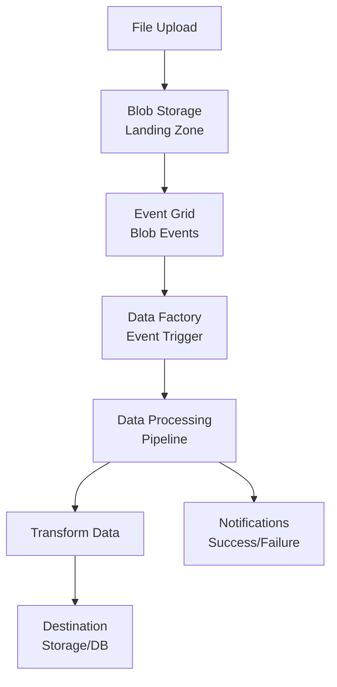

# 🎯 Event-Driven Data Pipelines - Automated ETL with Event Grid

> __🏠 [Home](../../../README.md)__ | __📖 [Documentation](../../README.md)__ | __🚀 [Implementation Guides](../README.md)__ | __🔗 [Integration Scenarios](README.md)__ | __🎯 Event-Driven Pipelines__


Build event-driven Data Factory pipelines triggered by Event Grid for automated, serverless ETL workflows.

---

## 🎯 Overview

Create serverless, event-driven data pipelines that automatically process files as they arrive in storage, triggered by Event Grid events.

### Architecture



---

## 🚀 Implementation

### Step 1: Create Storage Accounts

```bash
RESOURCE_GROUP="rg-event-driven-etl"
LOCATION="eastus"
LANDING_STORAGE="landlanding$(openssl rand -hex 4)"
PROCESSED_STORAGE="landprocessed$(openssl rand -hex 4)"

# Create resource group
az group create --name $RESOURCE_GROUP --location $LOCATION

# Create landing zone storage
az storage account create \
  --name $LANDING_STORAGE \
  --resource-group $RESOURCE_GROUP \
  --location $LOCATION \
  --sku Standard_LRS \
  --kind StorageV2 \
  --enable-hierarchical-namespace true

# Create processed storage
az storage account create \
  --name $PROCESSED_STORAGE \
  --resource-group $RESOURCE_GROUP \
  --location $LOCATION \
  --sku Standard_LRS \
  --kind StorageV2 \
  --enable-hierarchical-namespace true

# Create containers
az storage container create \
  --name "landing" \
  --account-name $LANDING_STORAGE \
  --auth-mode login

az storage container create \
  --name "processed" \
  --account-name $PROCESSED_STORAGE \
  --auth-mode login

az storage container create \
  --name "archive" \
  --account-name $LANDING_STORAGE \
  --auth-mode login

az storage container create \
  --name "errors" \
  --account-name $LANDING_STORAGE \
  --auth-mode login
```

---

### Step 2: Create Data Factory

```bash
DATA_FACTORY="adf-event-driven-$(openssl rand -hex 4)"

# Create Data Factory
az datafactory create \
  --name $DATA_FACTORY \
  --resource-group $RESOURCE_GROUP \
  --location $LOCATION

# Enable managed identity
az datafactory update \
  --name $DATA_FACTORY \
  --resource-group $RESOURCE_GROUP \
  --identity SystemAssigned

# Get managed identity principal ID
PRINCIPAL_ID=$(az datafactory show \
  --name $DATA_FACTORY \
  --resource-group $RESOURCE_GROUP \
  --query identity.principalId \
  --output tsv)

# Grant storage access to Data Factory
LANDING_STORAGE_ID=$(az storage account show \
  --name $LANDING_STORAGE \
  --resource-group $RESOURCE_GROUP \
  --query id \
  --output tsv)

PROCESSED_STORAGE_ID=$(az storage account show \
  --name $PROCESSED_STORAGE \
  --resource-group $RESOURCE_GROUP \
  --query id \
  --output tsv)

az role assignment create \
  --assignee $PRINCIPAL_ID \
  --role "Storage Blob Data Contributor" \
  --scope $LANDING_STORAGE_ID

az role assignment create \
  --assignee $PRINCIPAL_ID \
  --role "Storage Blob Data Contributor" \
  --scope $PROCESSED_STORAGE_ID
```

---

### Step 3: Create Event Grid System Topic

```bash
EVENT_GRID_TOPIC="egt-blob-events-$(openssl rand -hex 4)"

# Create Event Grid system topic for blob events
az eventgrid system-topic create \
  --name $EVENT_GRID_TOPIC \
  --resource-group $RESOURCE_GROUP \
  --location $LOCATION \
  --topic-type Microsoft.Storage.StorageAccounts \
  --source $LANDING_STORAGE_ID
```

---

### Step 4: Create Data Factory Pipeline

Create a pipeline JSON file `event-driven-pipeline.json`:

```json
{
  "name": "BlobEventPipeline",
  "properties": {
    "activities": [
      {
        "name": "ValidateFile",
        "type": "Validation",
        "typeProperties": {
          "dataset": {
            "referenceName": "LandingDataset",
            "type": "DatasetReference",
            "parameters": {
              "fileName": "@triggerBody().fileName",
              "folderPath": "@triggerBody().folderPath"
            }
          },
          "timeout": "0.00:05:00",
          "sleep": 10,
          "minimumSize": 1
        }
      },
      {
        "name": "CheckFileType",
        "type": "Switch",
        "dependsOn": [
          {
            "activity": "ValidateFile",
            "dependencyConditions": ["Succeeded"]
          }
        ],
        "typeProperties": {
          "on": "@substring(triggerBody().fileName, add(lastIndexOf(triggerBody().fileName, '.'), 1), 10)",
          "cases": [
            {
              "value": "csv",
              "activities": [
                {
                  "name": "ProcessCSV",
                  "type": "Copy",
                  "typeProperties": {
                    "source": {
                      "type": "DelimitedTextSource"
                    },
                    "sink": {
                      "type": "ParquetSink"
                    }
                  }
                }
              ]
            },
            {
              "value": "json",
              "activities": [
                {
                  "name": "ProcessJSON",
                  "type": "Copy",
                  "typeProperties": {
                    "source": {
                      "type": "JsonSource"
                    },
                    "sink": {
                      "type": "ParquetSink"
                    }
                  }
                }
              ]
            }
          ],
          "defaultActivities": [
            {
              "name": "MoveToErrors",
              "type": "Copy",
              "typeProperties": {
                "source": {
                  "type": "BinarySource"
                },
                "sink": {
                  "type": "BinarySink",
                  "storeSettings": {
                    "type": "AzureBlobFSWriteSettings",
                    "copyBehavior": "PreserveHierarchy"
                  }
                }
              }
            }
          ]
        }
      },
      {
        "name": "ArchiveFile",
        "type": "Copy",
        "dependsOn": [
          {
            "activity": "CheckFileType",
            "dependencyConditions": ["Succeeded"]
          }
        ],
        "typeProperties": {
          "source": {
            "type": "BinarySource",
            "storeSettings": {
              "type": "AzureBlobFSReadSettings"
            }
          },
          "sink": {
            "type": "BinarySink",
            "storeSettings": {
              "type": "AzureBlobFSWriteSettings"
            }
          }
        }
      },
      {
        "name": "DeleteOriginalFile",
        "type": "Delete",
        "dependsOn": [
          {
            "activity": "ArchiveFile",
            "dependencyConditions": ["Succeeded"]
          }
        ],
        "typeProperties": {
          "dataset": {
            "referenceName": "LandingDataset",
            "type": "DatasetReference"
          }
        }
      }
    ],
    "parameters": {
      "fileName": {
        "type": "String"
      },
      "folderPath": {
        "type": "String"
      }
    }
  }
}
```

---

### Step 5: Create Event-Based Trigger

```json
{
  "name": "BlobCreatedTrigger",
  "properties": {
    "type": "BlobEventsTrigger",
    "typeProperties": {
      "blobPathBeginsWith": "/landing/blobs/",
      "blobPathEndsWith": ".csv",
      "ignoreEmptyBlobs": true,
      "scope": "[resourceId('Microsoft.Storage/storageAccounts', parameters('landingStorageAccount'))]",
      "events": [
        "Microsoft.Storage.BlobCreated"
      ]
    },
    "pipelines": [
      {
        "pipelineReference": {
          "referenceName": "BlobEventPipeline",
          "type": "PipelineReference"
        },
        "parameters": {
          "fileName": "@triggerBody().fileName",
          "folderPath": "@triggerBody().folderPath"
        }
      }
    ]
  }
}
```

---

## 🎨 Advanced Patterns

### Pattern 1: Multi-Stage Processing

```json
{
  "activities": [
    {
      "name": "Stage1_Validation",
      "type": "Validation"
    },
    {
      "name": "Stage2_Transform",
      "type": "Copy",
      "dependsOn": [{"activity": "Stage1_Validation"}]
    },
    {
      "name": "Stage3_Enrich",
      "type": "Lookup",
      "dependsOn": [{"activity": "Stage2_Transform"}]
    },
    {
      "name": "Stage4_Load",
      "type": "SqlServerStoredProcedure",
      "dependsOn": [{"activity": "Stage3_Enrich"}]
    },
    {
      "name": "Stage5_Cleanup",
      "type": "Delete",
      "dependsOn": [{"activity": "Stage4_Load"}]
    }
  ]
}
```

### Pattern 2: Parallel Processing

```json
{
  "activities": [
    {
      "name": "ValidateFile",
      "type": "Validation"
    },
    {
      "name": "ProcessDataFlow1",
      "type": "ExecuteDataFlow",
      "dependsOn": [{"activity": "ValidateFile"}]
    },
    {
      "name": "ProcessDataFlow2",
      "type": "ExecuteDataFlow",
      "dependsOn": [{"activity": "ValidateFile"}]
    },
    {
      "name": "WaitForCompletion",
      "type": "Wait",
      "dependsOn": [
        {"activity": "ProcessDataFlow1"},
        {"activity": "ProcessDataFlow2"}
      ],
      "typeProperties": {
        "waitTimeInSeconds": 1
      }
    }
  ]
}
```

### Pattern 3: Error Handling

```json
{
  "activities": [
    {
      "name": "TryProcessFile",
      "type": "Copy"
    },
    {
      "name": "HandleSuccess",
      "type": "Copy",
      "dependsOn": [
        {
          "activity": "TryProcessFile",
          "dependencyConditions": ["Succeeded"]
        }
      ]
    },
    {
      "name": "HandleFailure",
      "type": "Copy",
      "dependsOn": [
        {
          "activity": "TryProcessFile",
          "dependencyConditions": ["Failed"]
        }
      ],
      "typeProperties": {
        "source": {
          "type": "BinarySource"
        },
        "sink": {
          "type": "BinarySink",
          "storeSettings": {
            "folderPath": "errors"
          }
        }
      }
    },
    {
      "name": "SendErrorNotification",
      "type": "WebActivity",
      "dependsOn": [
        {
          "activity": "HandleFailure",
          "dependencyConditions": ["Completed"]
        }
      ],
      "typeProperties": {
        "url": "https://logic-app-url",
        "method": "POST",
        "body": {
          "fileName": "@pipeline().parameters.fileName",
          "error": "@activity('TryProcessFile').error.message"
        }
      }
    }
  ]
}
```

---

## 🔔 Event Grid Filters

### Filter by File Extension

```json
{
  "filter": {
    "subjectBeginsWith": "/blobServices/default/containers/landing/blobs/",
    "subjectEndsWith": ".csv",
    "includedEventTypes": [
      "Microsoft.Storage.BlobCreated"
    ]
  }
}
```

### Advanced Filtering

```json
{
  "filter": {
    "advancedFilters": [
      {
        "operatorType": "StringEndsWith",
        "key": "subject",
        "values": [".csv", ".json", ".parquet"]
      },
      {
        "operatorType": "NumberGreaterThan",
        "key": "data.contentLength",
        "value": 1024
      },
      {
        "operatorType": "StringContains",
        "key": "data.url",
        "values": ["/landing/"]
      }
    ]
  }
}
```

---

## 📊 Complete Bicep Template

```bicep
param location string = resourceGroup().location
param namePrefix string = 'eventdriven'

// Landing storage account
resource landingStorage 'Microsoft.Storage/storageAccounts@2023-01-01' = {
  name: '${namePrefix}land${uniqueString(resourceGroup().id)}'
  location: location
  sku: {
    name: 'Standard_LRS'
  }
  kind: 'StorageV2'
  properties: {
    isHnsEnabled: true
  }
}

// Containers
resource landingContainer 'Microsoft.Storage/storageAccounts/blobServices/containers@2023-01-01' = {
  name: '${landingStorage.name}/default/landing'
  properties: {
    publicAccess: 'None'
  }
}

resource processedContainer 'Microsoft.Storage/storageAccounts/blobServices/containers@2023-01-01' = {
  name: '${landingStorage.name}/default/processed'
  properties: {
    publicAccess: 'None'
  }
}

resource archiveContainer 'Microsoft.Storage/storageAccounts/blobServices/containers@2023-01-01' = {
  name: '${landingStorage.name}/default/archive'
  properties: {
    publicAccess: 'None'
  }
}

resource errorContainer 'Microsoft.Storage/storageAccounts/blobServices/containers@2023-01-01' = {
  name: '${landingStorage.name}/default/errors'
  properties: {
    publicAccess: 'None'
  }
}

// Data Factory
resource dataFactory 'Microsoft.DataFactory/factories@2018-06-01' = {
  name: '${namePrefix}-adf-${uniqueString(resourceGroup().id)}'
  location: location
  identity: {
    type: 'SystemAssigned'
  }
}

// Event Grid System Topic
resource eventGridTopic 'Microsoft.EventGrid/systemTopics@2023-12-15-preview' = {
  name: '${namePrefix}-egt-${uniqueString(resourceGroup().id)}'
  location: location
  properties: {
    source: landingStorage.id
    topicType: 'Microsoft.Storage.StorageAccounts'
  }
}

// Role assignment for Data Factory
resource roleAssignment 'Microsoft.Authorization/roleAssignments@2022-04-01' = {
  name: guid(landingStorage.id, dataFactory.id, 'StorageBlobDataContributor')
  scope: landingStorage
  properties: {
    roleDefinitionId: subscriptionResourceId('Microsoft.Authorization/roleDefinitions', 'ba92f5b4-2d11-453d-a403-e96b0029c9fe')
    principalId: dataFactory.identity.principalId
    principalType: 'ServicePrincipal'
  }
}

output dataFactoryName string = dataFactory.name
output landingStorageName string = landingStorage.name
output eventGridTopicName string = eventGridTopic.name
```

---

## 🧪 Testing the Pipeline

### Upload Test File

```bash
# Create test CSV file
cat > test-data.csv << EOF
id,name,value,timestamp
1,device-001,25.5,2024-01-28T10:00:00Z
2,device-002,26.3,2024-01-28T10:01:00Z
3,device-003,24.8,2024-01-28T10:02:00Z
EOF

# Upload to landing zone
az storage blob upload \
  --account-name $LANDING_STORAGE \
  --container-name landing \
  --name "test-data.csv" \
  --file test-data.csv \
  --auth-mode login

# Monitor pipeline execution
az datafactory pipeline-run query-by-factory \
  --factory-name $DATA_FACTORY \
  --resource-group $RESOURCE_GROUP \
  --last-updated-after "2024-01-28T00:00:00Z" \
  --last-updated-before "2024-01-28T23:59:59Z"
```

### Monitor Event Grid Events

```bash
# Create event subscription for monitoring
az eventgrid system-topic event-subscription create \
  --name "monitor-subscription" \
  --system-topic-name $EVENT_GRID_TOPIC \
  --resource-group $RESOURCE_GROUP \
  --endpoint-type webhook \
  --endpoint "https://your-webhook-url"
```

---

## 📈 Monitoring and Alerting

### Data Factory Monitoring

```bash
# Get pipeline runs
az datafactory pipeline-run query-by-factory \
  --factory-name $DATA_FACTORY \
  --resource-group $RESOURCE_GROUP \
  --filters operand="PipelineName" operator="Equals" values="BlobEventPipeline" \
  --last-updated-after "2024-01-28T00:00:00Z"

# Get activity runs
az datafactory activity-run query-by-pipeline-run \
  --factory-name $DATA_FACTORY \
  --resource-group $RESOURCE_GROUP \
  --run-id "<pipeline-run-id>" \
  --last-updated-after "2024-01-28T00:00:00Z"
```

### Create Alerts

```bash
# Alert on pipeline failures
az monitor metrics alert create \
  --name "PipelineFailureAlert" \
  --resource-group $RESOURCE_GROUP \
  --scopes $(az datafactory show --name $DATA_FACTORY --resource-group $RESOURCE_GROUP --query id --output tsv) \
  --condition "count PipelineFailedRuns > 0" \
  --window-size 5m \
  --evaluation-frequency 1m \
  --action <action-group-id>
```

---

## 💰 Cost Optimization

### Event Grid

- Use **advanced filters** to reduce unnecessary events
- Implement **dead letter queues** for failed events
- Use **system topics** instead of custom topics where possible

### Data Factory

- Use **integration runtime auto-resolve** for optimal performance
- Implement **pipeline caching** for repeated operations
- **Minimize activity count** by combining operations
- Use **tumbling window triggers** instead of schedule triggers for batch workloads

---

## 🔒 Security Best Practices

### Network Security

```bash
# Enable private endpoints for storage
az network private-endpoint create \
  --name "pe-storage-landing" \
  --resource-group $RESOURCE_GROUP \
  --vnet-name "vnet-etl" \
  --subnet "subnet-endpoints" \
  --private-connection-resource-id $LANDING_STORAGE_ID \
  --group-id blob \
  --connection-name "storage-connection"
```

### Data Protection

- Enable **soft delete** on storage accounts
- Use **versioning** for blob storage
- Implement **lifecycle policies** for data retention
- Enable **encryption** with customer-managed keys

---

## 📚 Next Steps

- **[Add Logic Apps for complex orchestration](../../08-solutions/logic-apps-integration/README.md)**
- **[Implement data quality validation](../../best-practices/data-quality.md)**
- **[Build data lineage tracking](../../08-solutions/data-governance/lineage.md)**

---

*Last Updated: 2025-01-28*
*Complexity: Intermediate*
*Duration: 50 minutes*
