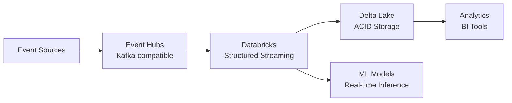

# ⚡ Event Hubs with Databricks - Structured Streaming

> __🏠 [Home](../../../README.md)__ | __📖 [Documentation](../../README.md)__ | __🚀 [Implementation Guides](../README.md)__ | __🔗 [Integration Scenarios](README.md)__ | __⚡ Event Hubs with Databricks__


Implement real-time structured streaming from Event Hubs to Databricks with Delta Lake for advanced analytics and machine learning.

---

## 🎯 Overview

Build a real-time streaming pipeline using Event Hubs, Databricks Structured Streaming, and Delta Lake for fraud detection, anomaly detection, and real-time ML inference.

### What You'll Build



---

## 🚀 Implementation

### Step 1: Create Event Hubs

```bash
RESOURCE_GROUP="rg-streaming-databricks"
LOCATION="eastus"
EVENTHUBS_NAMESPACE="evhns-databricks-$(openssl rand -hex 4)"
EVENTHUB_NAME="streaming-data"

az group create --name $RESOURCE_GROUP --location $LOCATION

az eventhubs namespace create \
  --name $EVENTHUBS_NAMESPACE \
  --resource-group $RESOURCE_GROUP \
  --location $LOCATION \
  --sku Standard \
  --capacity 2

az eventhubs eventhub create \
  --name $EVENTHUB_NAME \
  --namespace-name $EVENTHUBS_NAMESPACE \
  --resource-group $RESOURCE_GROUP \
  --partition-count 8 \
  --message-retention 7
```

### Step 2: Create Databricks Workspace

```bash
DATABRICKS_WORKSPACE="dbw-streaming-$(openssl rand -hex 4)"

az databricks workspace create \
  --name $DATABRICKS_WORKSPACE \
  --resource-group $RESOURCE_GROUP \
  --location $LOCATION \
  --sku premium
```

### Step 3: Create Data Lake Storage

```bash
STORAGE_ACCOUNT="adlsdatabricks$(openssl rand -hex 4)"

az storage account create \
  --name $STORAGE_ACCOUNT \
  --resource-group $RESOURCE_GROUP \
  --location $LOCATION \
  --sku Standard_LRS \
  --kind StorageV2 \
  --enable-hierarchical-namespace true

az storage container create \
  --name "delta-lake" \
  --account-name $STORAGE_ACCOUNT \
  --auth-mode login
```

---

## 📝 Databricks Configuration

### Create Databricks Cluster

1. Navigate to Databricks workspace
2. Create cluster with these specs:

```yaml
Cluster Name: streaming-cluster
Databricks Runtime: 14.3 LTS ML
Node Type: Standard_DS3_v2
Workers: 2-8 (auto-scaling)
Libraries:
  - azure-eventhub-spark_2.12:2.3.22
```

### Configure Event Hubs Connection

Create notebook and add connection configuration:

```python
# Event Hubs Configuration
eventhubs_namespace = "evhns-databricks-xxxxx.servicebus.windows.net"
eventhubs_name = "streaming-data"
eventhubs_key_name = "RootManageSharedAccessKey"
eventhubs_key = dbutils.secrets.get("eventhubs", "key")

# Connection string
connection_string = f"Endpoint=sb://{eventhubs_namespace}/;SharedAccessKeyName={eventhubs_key_name};SharedAccessKey={eventhubs_key};EntityPath={eventhubs_name}"

# Event Hubs configuration
ehConf = {
    'eventhubs.connectionString': sc._jvm.org.apache.spark.eventhubs.EventHubsUtils.encrypt(connection_string),
    'eventhubs.consumerGroup': "$Default",
    'maxEventsPerTrigger': 10000
}
```

---

## 🔄 Structured Streaming Pipeline

### Basic Streaming Read

```python
from pyspark.sql.functions import *
from pyspark.sql.types import *

# Define schema
schema = StructType([
    StructField("deviceId", StringType(), False),
    StructField("temperature", DoubleType(), False),
    StructField("humidity", DoubleType(), False),
    StructField("pressure", DoubleType(), True),
    StructField("timestamp", TimestampType(), False)
])

# Read from Event Hubs
df = (spark
  .readStream
  .format("eventhubs")
  .options(**ehConf)
  .load()
)

# Parse JSON body
parsed_df = (df
  .select(
    from_json(col("body").cast("string"), schema).alias("data"),
    col("enqueuedTime").alias("eventHubTimestamp")
  )
  .select("data.*", "eventHubTimestamp")
)

# Display streaming data
display(parsed_df)
```

### Write to Delta Lake

```python
# Delta Lake storage path
delta_path = f"abfss://delta-lake@{storage_account}.dfs.core.windows.net/sensor_data"

# Write stream to Delta Lake
query = (parsed_df
  .writeStream
  .format("delta")
  .outputMode("append")
  .option("checkpointLocation", f"{delta_path}/_checkpoint")
  .option("mergeSchema", "true")
  .start(delta_path)
)
```

### Real-time Aggregations

```python
# 5-minute tumbling window aggregations
aggregated_df = (parsed_df
  .withWatermark("timestamp", "10 minutes")
  .groupBy(
    col("deviceId"),
    window(col("timestamp"), "5 minutes")
  )
  .agg(
    avg("temperature").alias("avg_temperature"),
    max("temperature").alias("max_temperature"),
    min("temperature").alias("min_temperature"),
    avg("humidity").alias("avg_humidity"),
    count("*").alias("event_count")
  )
  .select(
    col("deviceId"),
    col("window.start").alias("window_start"),
    col("window.end").alias("window_end"),
    col("avg_temperature"),
    col("max_temperature"),
    col("min_temperature"),
    col("avg_humidity"),
    col("event_count")
  )
)

# Write aggregations to Delta
agg_path = f"abfss://delta-lake@{storage_account}.dfs.core.windows.net/aggregated_metrics"

agg_query = (aggregated_df
  .writeStream
  .format("delta")
  .outputMode("append")
  .option("checkpointLocation", f"{agg_path}/_checkpoint")
  .start(agg_path)
)
```

---

## 🤖 Real-time ML Inference

### Load Pre-trained Model

```python
import mlflow
from mlflow.tracking import MlflowClient

# Load model from MLflow
model_uri = "models:/anomaly_detection/production"
model = mlflow.pyfunc.spark_udf(spark, model_uri=model_uri, result_type="double")

# Apply model to streaming data
predictions_df = (parsed_df
  .withColumn(
    "anomaly_score",
    model(
      struct(
        col("temperature"),
        col("humidity"),
        col("pressure")
      )
    )
  )
  .withColumn(
    "is_anomaly",
    when(col("anomaly_score") > 0.8, True).otherwise(False)
  )
)

# Filter and write anomalies
anomalies_df = predictions_df.filter(col("is_anomaly") == True)

anomaly_path = f"abfss://delta-lake@{storage_account}.dfs.core.windows.net/anomalies"

anomaly_query = (anomalies_df
  .writeStream
  .format("delta")
  .outputMode("append")
  .option("checkpointLocation", f"{anomaly_path}/_checkpoint")
  .start(anomaly_path)
)
```

### Stateful Processing

```python
from pyspark.sql.streaming import GroupState, GroupStateTimeout

# Define state schema
state_schema = StructType([
    StructField("deviceId", StringType()),
    StructField("event_count", IntegerType()),
    StructField("last_temperature", DoubleType()),
    StructField("last_update", TimestampType())
])

# Stateful function
def update_device_state(key, values, state: GroupState):
    if state.hasTimedOut:
        # Handle timeout
        return (key, state.get)

    if state.exists:
        old_state = state.get
        event_count = old_state.event_count
        last_temp = old_state.last_temperature
    else:
        event_count = 0
        last_temp = 0.0

    # Update state with new events
    for value in values:
        event_count += 1
        last_temp = value.temperature

    new_state = {
        "deviceId": key,
        "event_count": event_count,
        "last_temperature": last_temp,
        "last_update": datetime.now()
    }

    state.update(new_state)
    state.setTimeoutDuration(600000)  # 10 minutes

    return (key, new_state)

# Apply stateful processing
stateful_df = (parsed_df
  .groupByKey(lambda x: x.deviceId)
  .mapGroupsWithState(
    update_device_state,
    state_schema,
    GroupStateTimeout.ProcessingTimeTimeout
  )
)
```

---

## 📊 Delta Lake Operations

### Query Delta Tables

```python
# Read Delta table
sensor_df = spark.read.format("delta").load(delta_path)

# Time travel
yesterday_df = (spark.read
  .format("delta")
  .option("versionAsOf", 1)  # Version number
  .load(delta_path)
)

# As of timestamp
historical_df = (spark.read
  .format("delta")
  .option("timestampAsOf", "2024-01-01T00:00:00Z")
  .load(delta_path)
)

# Show history
from delta.tables import DeltaTable
deltaTable = DeltaTable.forPath(spark, delta_path)
deltaTable.history().show()
```

### Optimize Delta Tables

```python
# Optimize table
deltaTable.optimize().executeCompaction()

# Z-order by device ID
deltaTable.optimize().executeZOrderBy("deviceId")

# Vacuum old files (retain 7 days)
deltaTable.vacuum(168)  # hours

# Auto-optimize on write
(parsed_df
  .writeStream
  .format("delta")
  .option("checkpointLocation", f"{delta_path}/_checkpoint")
  .option("optimizeWrite", "true")
  .option("autoCompact", "true")
  .start(delta_path)
)
```

---

## 🔒 Security Configuration

### Use Managed Identity

```python
# Configure storage access with managed identity
spark.conf.set(
    f"fs.azure.account.auth.type.{storage_account}.dfs.core.windows.net",
    "OAuth"
)
spark.conf.set(
    f"fs.azure.account.oauth.provider.type.{storage_account}.dfs.core.windows.net",
    "org.apache.hadoop.fs.azurebfs.oauth2.MsiTokenProvider"
)
spark.conf.set(
    f"fs.azure.account.oauth2.msi.tenant.{storage_account}.dfs.core.windows.net",
    "<tenant-id>"
)
```

### Secret Management

```bash
# Create secret scope (use Databricks CLI)
databricks secrets create-scope --scope eventhubs

# Add secret
databricks secrets put --scope eventhubs --key key --string-value "<connection-string>"
```

---

## 📈 Monitoring

### Stream Metrics

```python
# Get stream metrics
query.lastProgress

# Recent progress
query.recentProgress

# Stream status
query.status

# Await termination with timeout
query.awaitTermination(timeout=60)
```

### Performance Monitoring

```python
# Monitor processing rate
display(
    spark.sql("""
        SELECT
            inputRowsPerSecond,
            processedRowsPerSecond,
            durationMs
        FROM stream_progress
        ORDER BY timestamp DESC
        LIMIT 100
    """)
)
```

---

## 💰 Cost Optimization

- Use **auto-scaling clusters** (2-8 workers)
- Enable **auto-termination** (15 minutes idle)
- Use **spot instances** for non-critical workloads
- Optimize **Event Hubs partitions** based on parallelism
- Implement **data retention** policies

---

## 📚 Complete Bicep Template

```bicep
param location string = resourceGroup().location
param namePrefix string = 'databricks'

resource eventHubsNamespace 'Microsoft.EventHub/namespaces@2023-01-01-preview' = {
  name: '${namePrefix}-evhns-${uniqueString(resourceGroup().id)}'
  location: location
  sku: {
    name: 'Standard'
    capacity: 2
  }
}

resource eventHub 'Microsoft.EventHub/namespaces/eventhubs@2023-01-01-preview' = {
  parent: eventHubsNamespace
  name: 'streaming-data'
  properties: {
    partitionCount: 8
    messageRetentionInDays: 7
  }
}

resource databricksWorkspace 'Microsoft.Databricks/workspaces@2023-02-01' = {
  name: '${namePrefix}-dbw-${uniqueString(resourceGroup().id)}'
  location: location
  sku: {
    name: 'premium'
  }
  properties: {
    managedResourceGroupId: subscriptionResourceId('Microsoft.Resources/resourceGroups', '${namePrefix}-dbw-managed-${uniqueString(resourceGroup().id)}')
  }
}

resource storageAccount 'Microsoft.Storage/storageAccounts@2023-01-01' = {
  name: '${namePrefix}adls${uniqueString(resourceGroup().id)}'
  location: location
  sku: {
    name: 'Standard_LRS'
  }
  kind: 'StorageV2'
  properties: {
    isHnsEnabled: true
    minimumTlsVersion: 'TLS1_2'
  }
}

resource container 'Microsoft.Storage/storageAccounts/blobServices/containers@2023-01-01' = {
  name: '${storageAccount.name}/default/delta-lake'
  properties: {
    publicAccess: 'None'
  }
}

output eventHubsNamespace string = eventHubsNamespace.name
output databricksWorkspaceUrl string = databricksWorkspace.properties.workspaceUrl
output storageAccountName string = storageAccount.name
```

---

## 🔧 Troubleshooting

### Connection Issues

```python
# Test Event Hubs connectivity
test_df = (spark
  .read
  .format("eventhubs")
  .options(**ehConf)
  .load()
)
test_df.show(1)
```

### Performance Issues

```python
# Check partition skew
parsed_df.groupBy(spark_partition_id()).count().show()

# Repartition if needed
balanced_df = parsed_df.repartition(16, "deviceId")
```

---

## 📚 Next Steps

- **[Integrate with Synapse for analytics](stream-analytics-synapse.md)**
- **[Add ML model training pipeline](../../solutions/ml-pipeline/README.md)**
- **[Implement data quality checks](../../best-practices/data-quality.md)**

---

*Last Updated: 2025-01-28*
*Complexity: Advanced*
*Duration: 60 minutes*
