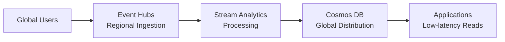

# 🌐 Stream Analytics to Cosmos DB - Global Operational Data

> __🏠 [Home](../../../README.md)__ | __📖 [Documentation](../../README.md)__ | __🚀 [Implementation Guides](../README.md)__ | __🔗 [Integration Scenarios](README.md)__ | __🌐 Stream Analytics to Cosmos DB__


Process streaming data with Stream Analytics and write to Cosmos DB for globally distributed, low-latency operational data.

---

## 🎯 Overview

Build a real-time pipeline for globally distributed operational data using Event Hubs, Stream Analytics, and Cosmos DB. Perfect for gaming leaderboards, real-time personalization, and multi-region applications.

### Architecture



---

## 🚀 Implementation

### Step 1: Create Resources

```bash
RESOURCE_GROUP="rg-streaming-cosmos"
LOCATION="eastus"
EVENTHUBS_NAMESPACE="evhns-cosmos-$(openssl rand -hex 4)"
EVENTHUB_NAME="user-events"

# Create resource group
az group create --name $RESOURCE_GROUP --location $LOCATION

# Create Event Hubs
az eventhubs namespace create \
  --name $EVENTHUBS_NAMESPACE \
  --resource-group $RESOURCE_GROUP \
  --location $LOCATION \
  --sku Standard

az eventhubs eventhub create \
  --name $EVENTHUB_NAME \
  --namespace-name $EVENTHUBS_NAMESPACE \
  --resource-group $RESOURCE_GROUP \
  --partition-count 4
```

### Step 2: Create Cosmos DB

```bash
COSMOS_ACCOUNT="cosmos-streaming-$(openssl rand -hex 4)"
COSMOS_DATABASE="StreamingDB"
COSMOS_CONTAINER="UserEvents"

# Create Cosmos DB account (NoSQL API)
az cosmosdb create \
  --name $COSMOS_ACCOUNT \
  --resource-group $RESOURCE_GROUP \
  --locations regionName=$LOCATION failoverPriority=0 \
  --default-consistency-level Session \
  --enable-automatic-failover true

# Create database
az cosmosdb sql database create \
  --account-name $COSMOS_ACCOUNT \
  --resource-group $RESOURCE_GROUP \
  --name $COSMOS_DATABASE

# Create container with partition key
az cosmosdb sql container create \
  --account-name $COSMOS_ACCOUNT \
  --resource-group $RESOURCE_GROUP \
  --database-name $COSMOS_DATABASE \
  --name $COSMOS_CONTAINER \
  --partition-key-path "/userId" \
  --throughput 400
```

### Step 3: Create Stream Analytics Job

```bash
STREAM_ANALYTICS_JOB="asa-cosmos"

az stream-analytics job create \
  --name $STREAM_ANALYTICS_JOB \
  --resource-group $RESOURCE_GROUP \
  --location $LOCATION \
  --sku Standard \
  --streaming-units 3
```

---

## 📝 Stream Analytics Query

### Real-time Aggregations

```sql
-- User activity aggregations
WITH UserActivity AS (
    SELECT
        userId,
        eventType,
        eventValue,
        location,
        System.Timestamp() AS eventTime
    FROM EventHubInput
    TIMESTAMP BY eventTimestamp
)

-- 5-minute tumbling window aggregations
SELECT
    userId,
    COUNT(*) AS eventCount,
    COLLECT() AS events,
    System.Timestamp() AS windowEnd
INTO CosmosDBOutput
FROM UserActivity
GROUP BY
    userId,
    TumblingWindow(minute, 5);

-- Real-time leaderboard
SELECT
    userId,
    SUM(eventValue) AS totalScore,
    RANK() OVER (ORDER BY SUM(eventValue) DESC) AS rank,
    System.Timestamp() AS lastUpdated
INTO CosmosDBLeaderboard
FROM UserActivity
WHERE eventType = 'score'
GROUP BY
    userId,
    TumblingWindow(second, 30);

-- Session detection with timeout
SELECT
    userId,
    sessionId,
    MIN(eventTimestamp) AS sessionStart,
    MAX(eventTimestamp) AS sessionEnd,
    COUNT(*) AS eventCount,
    DATEDIFF(minute, MIN(eventTimestamp), MAX(eventTimestamp)) AS sessionDuration
INTO CosmosDBSessions
FROM UserActivity
GROUP BY
    userId,
    sessionId,
    SessionWindow(minute, 5, 30);
```

---

## 🎮 Use Case Examples

### Gaming Leaderboard

```sql
-- Real-time game leaderboard
SELECT
    userId,
    userName,
    gameId,
    SUM(points) AS totalPoints,
    MAX(level) AS highestLevel,
    COUNT(*) AS gamesPlayed,
    RANK() OVER (PARTITION BY gameId ORDER BY SUM(points) DESC) AS rank
INTO CosmosDBLeaderboard
FROM GameEvents TIMESTAMP BY eventTime
GROUP BY
    userId,
    userName,
    gameId,
    TumblingWindow(second, 10);
```

### E-commerce User Activity

```sql
-- User session tracking
SELECT
    userId,
    sessionId,
    COLLECT(productId) AS viewedProducts,
    COLLECT(eventType) AS actions,
    COUNT(*) AS actionCount,
    System.Timestamp() AS lastActivity
INTO CosmosDBUserSessions
FROM EcommerceEvents TIMESTAMP BY eventTime
GROUP BY
    userId,
    sessionId,
    SlidingWindow(minute, 30);

-- Product recommendations
SELECT
    productId,
    COUNT(DISTINCT userId) AS uniqueViewers,
    COUNT(*) AS totalViews,
    AVG(viewDuration) AS avgViewDuration
INTO CosmosDBProductStats
FROM ProductViews TIMESTAMP BY eventTime
GROUP BY
    productId,
    TumblingWindow(minute, 5);
```

---

## ⚙️ Cosmos DB Optimization

### Partition Key Strategy

```bash
# Good partition keys
/userId          # For user-specific data
/tenantId        # For multi-tenant applications
/gameId          # For game-specific data
/region          # For geo-distributed data

# Avoid:
/timestamp       # Creates hot partitions
/id              # Too granular, no grouping
```

### Indexing Policy

```json
{
  "indexingMode": "consistent",
  "automatic": true,
  "includedPaths": [
    {
      "path": "/*"
    }
  ],
  "excludedPaths": [
    {
      "path": "/\"_etag\"/?"
    },
    {
      "path": "/largeTextField/*"
    }
  ],
  "compositeIndexes": [
    [
      {
        "path": "/userId",
        "order": "ascending"
      },
      {
        "path": "/eventTime",
        "order": "descending"
      }
    ]
  ]
}
```

### TTL Configuration

```bash
# Enable TTL on container
az cosmosdb sql container update \
  --account-name $COSMOS_ACCOUNT \
  --resource-group $RESOURCE_GROUP \
  --database-name $COSMOS_DATABASE \
  --name $COSMOS_CONTAINER \
  --ttl 86400  # 24 hours
```

---

## 🌍 Global Distribution

### Add Regions

```bash
# Add read regions
az cosmosdb update \
  --name $COSMOS_ACCOUNT \
  --resource-group $RESOURCE_GROUP \
  --locations regionName=eastus failoverPriority=0 \
              regionName=westus failoverPriority=1 \
              regionName=northeurope failoverPriority=2

# Enable multi-region writes
az cosmosdb update \
  --name $COSMOS_ACCOUNT \
  --resource-group $RESOURCE_GROUP \
  --enable-multiple-write-locations true
```

### Consistency Levels

| Level | Use Case | Latency | Throughput |
|-------|----------|---------|------------|
| **Strong** | Financial transactions | Highest | Lowest |
| **Bounded Staleness** | Gaming leaderboards | High | Low |
| **Session** | User sessions (default) | Medium | Medium |
| **Consistent Prefix** | Social media feeds | Low | High |
| **Eventual** | Telemetry, logs | Lowest | Highest |

---

## 📊 Complete Bicep Template

```bicep
param location string = resourceGroup().location
param namePrefix string = 'cosmos'

resource eventHubsNamespace 'Microsoft.EventHub/namespaces@2023-01-01-preview' = {
  name: '${namePrefix}-evhns-${uniqueString(resourceGroup().id)}'
  location: location
  sku: {
    name: 'Standard'
  }
}

resource eventHub 'Microsoft.EventHub/namespaces/eventhubs@2023-01-01-preview' = {
  parent: eventHubsNamespace
  name: 'user-events'
  properties: {
    partitionCount: 4
    messageRetentionInDays: 1
  }
}

resource cosmosAccount 'Microsoft.DocumentDB/databaseAccounts@2023-11-15' = {
  name: '${namePrefix}-cosmos-${uniqueString(resourceGroup().id)}'
  location: location
  kind: 'GlobalDocumentDB'
  properties: {
    databaseAccountOfferType: 'Standard'
    consistencyPolicy: {
      defaultConsistencyLevel: 'Session'
    }
    locations: [
      {
        locationName: location
        failoverPriority: 0
      }
    ]
    enableAutomaticFailover: true
  }
}

resource cosmosDatabase 'Microsoft.DocumentDB/databaseAccounts/sqlDatabases@2023-11-15' = {
  parent: cosmosAccount
  name: 'StreamingDB'
  properties: {
    resource: {
      id: 'StreamingDB'
    }
  }
}

resource cosmosContainer 'Microsoft.DocumentDB/databaseAccounts/sqlDatabases/containers@2023-11-15' = {
  parent: cosmosDatabase
  name: 'UserEvents'
  properties: {
    resource: {
      id: 'UserEvents'
      partitionKey: {
        paths: ['/userId']
        kind: 'Hash'
      }
      defaultTtl: 86400
    }
    options: {
      throughput: 400
    }
  }
}

resource streamAnalyticsJob 'Microsoft.StreamAnalytics/streamingjobs@2021-10-01-preview' = {
  name: '${namePrefix}-asa-${uniqueString(resourceGroup().id)}'
  location: location
  properties: {
    sku: {
      name: 'Standard'
    }
  }
}

output cosmosAccountName string = cosmosAccount.name
output cosmosDatabaseName string = cosmosDatabase.name
output cosmosContainerName string = cosmosContainer.name
```

---

## 🔍 Query Cosmos DB Data

### Using Azure Portal

```sql
-- Query recent events
SELECT * FROM c
WHERE c.eventTime > DateTimeAdd("hh", -1, GetCurrentDateTime())
ORDER BY c.eventTime DESC

-- Query by user
SELECT * FROM c
WHERE c.userId = "user123"
ORDER BY c.eventTime DESC
```

### Using Python SDK

```python
from azure.cosmos import CosmosClient

# Connect to Cosmos DB
client = CosmosClient(
    url="https://<account>.documents.azure.com:443/",
    credential="<key>"
)

database = client.get_database_client("StreamingDB")
container = database.get_container_client("UserEvents")

# Query items
query = "SELECT * FROM c WHERE c.userId = @userId"
items = container.query_items(
    query=query,
    parameters=[{"name": "@userId", "value": "user123"}],
    enable_cross_partition_query=True
)

for item in items:
    print(item)

# Point read (most efficient)
item = container.read_item(
    item="<id>",
    partition_key="user123"
)
```

---

## 💰 Cost Optimization

### Autoscale Throughput

```bash
# Enable autoscale
az cosmosdb sql container throughput update \
  --account-name $COSMOS_ACCOUNT \
  --resource-group $RESOURCE_GROUP \
  --database-name $COSMOS_DATABASE \
  --name $COSMOS_CONTAINER \
  --max-throughput 4000
```

### Optimize Queries

- Use **partition key** in all queries
- Avoid **cross-partition queries** when possible
- Use **point reads** instead of queries
- Implement **caching** for frequently accessed data
- Set appropriate **TTL** to auto-delete old data

---

## 📚 Next Steps

- **[Add Azure Functions for change feed processing](../../08-solutions/change-feed-processor/README.md)**
- **[Integrate with Synapse Link for analytics](stream-analytics-synapse.md)**
- **[Implement global distribution strategy](../../best-practices/global-distribution.md)**

---

*Last Updated: 2025-01-28*
*Complexity: Intermediate*
*Duration: 40 minutes*
