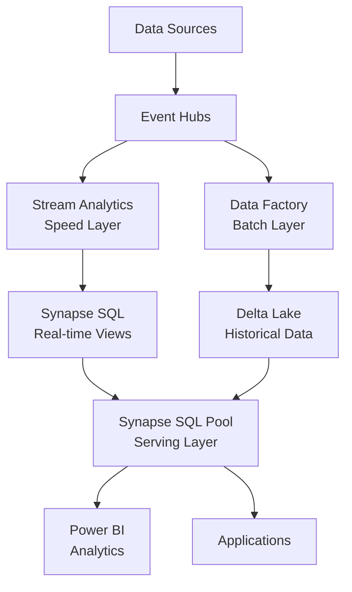

# 📊 Stream Analytics to Synapse - Lambda Architecture

> __🏠 [Home](../../../README.md)__ | __📖 [Documentation](../../README.md)__ | __🚀 [Implementation Guides](../README.md)__ | __🔗 [Integration Scenarios](README.md)__ | __📊 Stream Analytics to Synapse__


Integrate Stream Analytics with Synapse Analytics for real-time to batch analytics workflows implementing Lambda Architecture.

---

## 🎯 Overview

Build a comprehensive Lambda Architecture combining real-time (speed layer) and batch processing (batch layer) for enterprise data warehousing and analytics.

### Lambda Architecture



---

## 🚀 Implementation

### Step 1: Create Core Infrastructure

```bash
RESOURCE_GROUP="rg-lambda-architecture"
LOCATION="eastus"
STORAGE_ACCOUNT="adlslambda$(openssl rand -hex 4)"
SYNAPSE_WORKSPACE="synapse-lambda-$(openssl rand -hex 4)"

# Create resource group
az group create --name $RESOURCE_GROUP --location $LOCATION

# Create Data Lake Storage Gen2
az storage account create \
  --name $STORAGE_ACCOUNT \
  --resource-group $RESOURCE_GROUP \
  --location $LOCATION \
  --sku Standard_LRS \
  --kind StorageV2 \
  --enable-hierarchical-namespace true

# Create file systems
az storage fs create \
  --name "delta-lake" \
  --account-name $STORAGE_ACCOUNT \
  --auth-mode login

az storage fs create \
  --name "synapse" \
  --account-name $STORAGE_ACCOUNT \
  --auth-mode login
```

### Step 2: Create Synapse Workspace

```bash
# Create Synapse workspace
az synapse workspace create \
  --name $SYNAPSE_WORKSPACE \
  --resource-group $RESOURCE_GROUP \
  --location $LOCATION \
  --storage-account $STORAGE_ACCOUNT \
  --file-system synapse \
  --sql-admin-login-user sqladmin \
  --sql-admin-login-password "P@ssw0rd$(openssl rand -hex 4)!"

# Create firewall rule
az synapse workspace firewall-rule create \
  --name AllowAll \
  --workspace-name $SYNAPSE_WORKSPACE \
  --resource-group $RESOURCE_GROUP \
  --start-ip-address 0.0.0.0 \
  --end-ip-address 255.255.255.255

# Create dedicated SQL pool
az synapse sql pool create \
  --name "DWPool" \
  --workspace-name $SYNAPSE_WORKSPACE \
  --resource-group $RESOURCE_GROUP \
  --performance-level DW100c
```

### Step 3: Create Event Hubs

```bash
EVENTHUBS_NAMESPACE="evhns-lambda-$(openssl rand -hex 4)"
EVENTHUB_NAME="analytics-events"

az eventhubs namespace create \
  --name $EVENTHUBS_NAMESPACE \
  --resource-group $RESOURCE_GROUP \
  --location $LOCATION \
  --sku Standard \
  --capacity 2

az eventhubs eventhub create \
  --name $EVENTHUB_NAME \
  --namespace-name $EVENTHUBS_NAMESPACE \
  --resource-group $RESOURCE_GROUP \
  --partition-count 8 \
  --message-retention 7 \
  --capture-enabled true \
  --capture-encoding Avro \
  --capture-interval-seconds 300 \
  --capture-size-limit 314572800 \
  --destination-name EventHubArchive.AzureBlockBlob \
  --storage-account-resource-id $(az storage account show --name $STORAGE_ACCOUNT --resource-group $RESOURCE_GROUP --query id --output tsv) \
  --blob-container delta-lake \
  --archive-name-format '{Namespace}/{EventHub}/{PartitionId}/{Year}/{Month}/{Day}/{Hour}/{Minute}/{Second}'
```

---

## ⚡ Speed Layer - Stream Analytics

### Create Stream Analytics Job

```bash
STREAM_ANALYTICS_JOB="asa-speed-layer"

az stream-analytics job create \
  --name $STREAM_ANALYTICS_JOB \
  --resource-group $RESOURCE_GROUP \
  --location $LOCATION \
  --sku Standard \
  --streaming-units 6
```

### Stream Analytics Query

```sql
-- Speed Layer Query
WITH Events AS (
    SELECT
        deviceId,
        sensorType,
        value,
        timestamp,
        location,
        System.Timestamp() AS processingTime
    FROM EventHubInput
    TIMESTAMP BY timestamp
)

-- Real-time aggregations (1-minute windows)
SELECT
    sensorType,
    location,
    System.Timestamp() AS windowEnd,
    AVG(value) AS avgValue,
    MAX(value) AS maxValue,
    MIN(value) AS minValue,
    COUNT(*) AS eventCount,
    STDEV(value) AS stdDevValue
INTO SynapseOutput
FROM Events
GROUP BY
    sensorType,
    location,
    TumblingWindow(minute, 1);

-- Real-time anomaly detection
SELECT
    deviceId,
    sensorType,
    value,
    timestamp,
    AnomalyDetection_SpikeAndDip(value, 95, 120, 'spikesanddips')
        OVER(LIMIT DURATION(minute, 5)) AS anomalyScore
INTO SynapseAnomalies
FROM Events
PARTITION BY deviceId;

-- Trending metrics (5-minute sliding window)
SELECT
    sensorType,
    System.Timestamp() AS windowEnd,
    AVG(value) AS avgValue,
    PERCENTILE_CONT(0.95) WITHIN GROUP (ORDER BY value) AS p95Value
INTO SynapseTrends
FROM Events
GROUP BY
    sensorType,
    SlidingWindow(minute, 5);
```

---

## 🏭 Batch Layer - Data Factory

### Create Data Factory Pipeline

```json
{
  "name": "BatchProcessingPipeline",
  "properties": {
    "activities": [
      {
        "name": "CopyFromEventHubCapture",
        "type": "Copy",
        "inputs": [
          {
            "referenceName": "EventHubCaptureDataset",
            "type": "DatasetReference"
          }
        ],
        "outputs": [
          {
            "referenceName": "DeltaLakeDataset",
            "type": "DatasetReference"
          }
        ],
        "typeProperties": {
          "source": {
            "type": "AvroSource"
          },
          "sink": {
            "type": "ParquetSink",
            "formatSettings": {
              "type": "ParquetWriteSettings"
            }
          }
        }
      },
      {
        "name": "ProcessWithSynapseSpark",
        "type": "SynapseNotebook",
        "dependsOn": [
          {
            "activity": "CopyFromEventHubCapture",
            "dependencyConditions": ["Succeeded"]
          }
        ],
        "typeProperties": {
          "notebook": {
            "referenceName": "DeltaLakeProcessing",
            "type": "NotebookReference"
          }
        }
      },
      {
        "name": "LoadToDWPool",
        "type": "SqlServerStoredProcedure",
        "dependsOn": [
          {
            "activity": "ProcessWithSynapseSpark",
            "dependencyConditions": ["Succeeded"]
          }
        ],
        "typeProperties": {
          "storedProcedureName": "sp_LoadAggregatedData"
        }
      }
    ],
    "triggers": [
      {
        "name": "HourlyTrigger",
        "properties": {
          "type": "ScheduleTrigger",
          "typeProperties": {
            "recurrence": {
              "frequency": "Hour",
              "interval": 1
            }
          }
        }
      }
    ]
  }
}
```

---

## 🗄️ Synapse SQL Pool Schema

### Create Tables

```sql
-- Real-time aggregations table (Speed Layer)
CREATE TABLE dbo.RealTimeMetrics (
    MetricId BIGINT IDENTITY(1,1) NOT NULL,
    SensorType NVARCHAR(50) NOT NULL,
    Location NVARCHAR(100) NOT NULL,
    WindowEnd DATETIME2 NOT NULL,
    AvgValue FLOAT NOT NULL,
    MaxValue FLOAT NOT NULL,
    MinValue FLOAT NOT NULL,
    EventCount INT NOT NULL,
    StdDevValue FLOAT,
    ProcessedTime DATETIME2 DEFAULT GETUTCDATE(),
    CONSTRAINT PK_RealTimeMetrics PRIMARY KEY NONCLUSTERED (MetricId)
)
WITH (DISTRIBUTION = HASH(SensorType), CLUSTERED COLUMNSTORE INDEX);

-- Historical aggregations (Batch Layer)
CREATE TABLE dbo.HistoricalMetrics (
    MetricId BIGINT IDENTITY(1,1) NOT NULL,
    SensorType NVARCHAR(50) NOT NULL,
    Location NVARCHAR(100) NOT NULL,
    Date DATE NOT NULL,
    Hour INT NOT NULL,
    AvgValue FLOAT NOT NULL,
    MaxValue FLOAT NOT NULL,
    MinValue FLOAT NOT NULL,
    EventCount BIGINT NOT NULL,
    ProcessedTime DATETIME2 DEFAULT GETUTCDATE(),
    CONSTRAINT PK_HistoricalMetrics PRIMARY KEY NONCLUSTERED (MetricId)
)
WITH (DISTRIBUTION = HASH(SensorType), CLUSTERED COLUMNSTORE INDEX);

-- Serving layer view (combines speed and batch)
CREATE VIEW dbo.UnifiedMetrics AS
SELECT
    SensorType,
    Location,
    WindowEnd AS Timestamp,
    AvgValue,
    MaxValue,
    MinValue,
    EventCount,
    'RealTime' AS Source
FROM dbo.RealTimeMetrics
WHERE WindowEnd > DATEADD(hour, -24, GETUTCDATE())
UNION ALL
SELECT
    SensorType,
    Location,
    DATEADD(hour, Hour, CAST(Date AS DATETIME2)) AS Timestamp,
    AvgValue,
    MaxValue,
    MinValue,
    EventCount,
    'Historical' AS Source
FROM dbo.HistoricalMetrics
WHERE Date < CAST(GETUTCDATE() AS DATE);
```

---

## 🔄 Delta Lake Processing

### Synapse Spark Notebook

```python
# Delta Lake batch processing notebook
from pyspark.sql.functions import *
from delta.tables import DeltaTable

# Read captured Avro files
captured_path = "abfss://delta-lake@<storage>.dfs.core.windows.net/raw-events"
df = spark.read.format("avro").load(captured_path)

# Parse event body
parsed_df = (df
  .select(
    from_json(col("Body").cast("string"), schema).alias("event"),
    col("EnqueuedTimeUtc").alias("eventTime")
  )
  .select("event.*", "eventTime")
)

# Create hourly aggregations
hourly_agg = (parsed_df
  .withColumn("date", to_date("eventTime"))
  .withColumn("hour", hour("eventTime"))
  .groupBy("sensorType", "location", "date", "hour")
  .agg(
    avg("value").alias("avgValue"),
    max("value").alias("maxValue"),
    min("value").alias("minValue"),
    count("*").alias("eventCount")
  )
)

# Write to Delta Lake
delta_path = "abfss://delta-lake@<storage>.dfs.core.windows.net/aggregated-metrics"

(hourly_agg
  .write
  .format("delta")
  .mode("append")
  .partitionBy("date")
  .option("mergeSchema", "true")
  .save(delta_path)
)

# Optimize Delta table
deltaTable = DeltaTable.forPath(spark, delta_path)
deltaTable.optimize().executeCompaction()
deltaTable.vacuum(168)  # 7 days

# Create external table in Synapse SQL
spark.sql(f"""
    CREATE TABLE IF NOT EXISTS default.aggregated_metrics
    USING DELTA
    LOCATION '{delta_path}'
""")
```

---

## 🔍 Querying the Serving Layer

### Recent Data (Speed Layer)

```sql
-- Last hour metrics
SELECT
    SensorType,
    Location,
    WindowEnd,
    AvgValue,
    MaxValue,
    EventCount
FROM dbo.RealTimeMetrics
WHERE WindowEnd > DATEADD(hour, -1, GETUTCDATE())
ORDER BY WindowEnd DESC;
```

### Historical Data (Batch Layer)

```sql
-- Last 30 days trends
SELECT
    Date,
    SensorType,
    AVG(AvgValue) AS DailyAvg,
    MAX(MaxValue) AS DailyMax,
    SUM(EventCount) AS DailyEvents
FROM dbo.HistoricalMetrics
WHERE Date > DATEADD(day, -30, GETUTCDATE())
GROUP BY Date, SensorType
ORDER BY Date DESC, SensorType;
```

### Combined View

```sql
-- Unified metrics (last 7 days)
SELECT
    SensorType,
    Location,
    CAST(Timestamp AS DATE) AS Date,
    AVG(AvgValue) AS DailyAvg,
    MAX(MaxValue) AS DailyMax,
    SUM(EventCount) AS DailyEvents,
    MAX(Source) AS DataSource
FROM dbo.UnifiedMetrics
WHERE Timestamp > DATEADD(day, -7, GETUTCDATE())
GROUP BY
    SensorType,
    Location,
    CAST(Timestamp AS DATE)
ORDER BY Date DESC, SensorType;
```

---

## 📊 Complete Bicep Template

```bicep
param location string = resourceGroup().location
param namePrefix string = 'lambda'
param sqlAdminPassword string

resource storageAccount 'Microsoft.Storage/storageAccounts@2023-01-01' = {
  name: '${namePrefix}adls${uniqueString(resourceGroup().id)}'
  location: location
  sku: {
    name: 'Standard_LRS'
  }
  kind: 'StorageV2'
  properties: {
    isHnsEnabled: true
  }
}

resource eventHubsNamespace 'Microsoft.EventHub/namespaces@2023-01-01-preview' = {
  name: '${namePrefix}-evhns-${uniqueString(resourceGroup().id)}'
  location: location
  sku: {
    name: 'Standard'
    capacity: 2
  }
}

resource synapseWorkspace 'Microsoft.Synapse/workspaces@2021-06-01' = {
  name: '${namePrefix}-synapse-${uniqueString(resourceGroup().id)}'
  location: location
  identity: {
    type: 'SystemAssigned'
  }
  properties: {
    defaultDataLakeStorage: {
      accountUrl: storageAccount.properties.primaryEndpoints.dfs
      filesystem: 'synapse'
    }
    sqlAdministratorLogin: 'sqladmin'
    sqlAdministratorLoginPassword: sqlAdminPassword
  }
}

resource sqlPool 'Microsoft.Synapse/workspaces/sqlPools@2021-06-01' = {
  parent: synapseWorkspace
  name: 'DWPool'
  location: location
  sku: {
    name: 'DW100c'
  }
  properties: {
    collation: 'SQL_Latin1_General_CP1_CI_AS'
  }
}

output synapseWorkspaceName string = synapseWorkspace.name
output sqlPoolName string = sqlPool.name
output storageAccountName string = storageAccount.name
```

---

## 💰 Cost Optimization

### Synapse SQL Pool

```sql
-- Pause SQL pool when not in use
ALTER DATABASE DWPool PAUSE;

-- Resume when needed
ALTER DATABASE DWPool RESUME;

-- Scheduled pause/resume with automation
```

### Resource Optimization

- **Pause SQL pools** during off-hours
- **Scale down Stream Analytics SUs** during low traffic
- **Use serverless SQL** for ad-hoc queries
- **Implement data retention** policies
- **Optimize Delta Lake compaction**

---

## 📚 Next Steps

- **[Build Power BI dashboards](../../08-solutions/real-time-dashboards/README.md)**
- **[Implement ML on historical data](../../08-solutions/ml-pipeline/README.md)**
- **[Add data governance with Purview](../../best-practices/data-governance.md)**

---

*Last Updated: 2025-01-28*
*Complexity: Advanced*
*Duration: 60 minutes*
