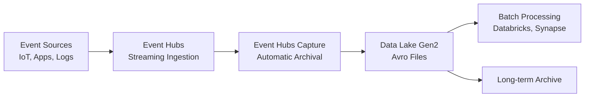

# 📨 Streaming to Data Lake - Event Hubs Capture

> __🏠 [Home](../../../README.md)__ | __📖 [Documentation](../../README.md)__ | __🚀 [Implementation Guides](../README.md)__ | __🔗 [Integration Scenarios](README.md)__ | __📨 Streaming to Data Lake__


Configure Event Hubs Capture to automatically archive streaming data to Azure Data Lake Storage Gen2 for long-term storage and batch analytics.

---

## 🎯 Overview

This guide walks you through configuring Event Hubs Capture to automatically archive streaming events to Azure Data Lake Storage Gen2. This pattern is ideal for scenarios requiring long-term data retention, compliance archival, or batch processing of streaming data.

### What You'll Build



### Architecture Components

- **Azure Event Hubs**: High-throughput event ingestion
- **Event Hubs Capture**: Automatic archival feature
- **Azure Data Lake Storage Gen2**: Hierarchical storage for big data
- **Avro Format**: Compact, schema-based file format

---

## 📋 Prerequisites

### Required Access

- [ ] Azure subscription with Contributor access
- [ ] Permission to create resource groups
- [ ] Azure CLI 2.50.0+ or Azure PowerShell 7.0+

### Required Knowledge

- Basic understanding of Event Hubs concepts
- Familiarity with Azure Storage accounts
- Understanding of Avro file format (helpful but not required)

---

## 🚀 Step-by-Step Implementation

### Step 1: Create Resource Group

Create a resource group to organize all resources for this scenario.

#### Using Azure CLI

```bash
# Set variables
RESOURCE_GROUP="rg-streaming-datalake"
LOCATION="eastus"

# Create resource group
az group create \
  --name $RESOURCE_GROUP \
  --location $LOCATION
```

#### Using PowerShell

```powershell
# Set variables
$ResourceGroup = "rg-streaming-datalake"
$Location = "eastus"

# Create resource group
New-AzResourceGroup `
  -Name $ResourceGroup `
  -Location $Location
```

---

### Step 2: Create Data Lake Storage Gen2

Create a storage account with hierarchical namespace enabled for Data Lake Gen2 capabilities.

#### Using Azure CLI

```bash
# Set variables
STORAGE_ACCOUNT="adlsstreamcapture$(openssl rand -hex 4)"
CONTAINER_NAME="eventhubs-capture"

# Create storage account with hierarchical namespace
az storage account create \
  --name $STORAGE_ACCOUNT \
  --resource-group $RESOURCE_GROUP \
  --location $LOCATION \
  --sku Standard_LRS \
  --kind StorageV2 \
  --enable-hierarchical-namespace true

# Create container
az storage container create \
  --name $CONTAINER_NAME \
  --account-name $STORAGE_ACCOUNT \
  --auth-mode login
```

#### Using PowerShell

```powershell
# Set variables
$StorageAccount = "adlsstreamcapture$(Get-Random -Maximum 9999)"
$ContainerName = "eventhubs-capture"

# Create storage account
New-AzStorageAccount `
  -ResourceGroupName $ResourceGroup `
  -Name $StorageAccount `
  -Location $Location `
  -SkuName Standard_LRS `
  -Kind StorageV2 `
  -EnableHierarchicalNamespace $true

# Get storage context
$ctx = New-AzStorageContext -StorageAccountName $StorageAccount -UseConnectedAccount

# Create container
New-AzStorageContainer `
  -Name $ContainerName `
  -Context $ctx
```

---

### Step 3: Create Event Hubs Namespace

Create an Event Hubs namespace in Standard or higher tier (Capture requires Standard or above).

#### Using Azure CLI

```bash
# Set variables
EVENTHUBS_NAMESPACE="evhns-streaming-$(openssl rand -hex 4)"
EVENTHUB_NAME="telemetry-events"

# Create Event Hubs namespace (Standard tier required for Capture)
az eventhubs namespace create \
  --name $EVENTHUBS_NAMESPACE \
  --resource-group $RESOURCE_GROUP \
  --location $LOCATION \
  --sku Standard \
  --capacity 1

# Create Event Hub
az eventhubs eventhub create \
  --name $EVENTHUB_NAME \
  --namespace-name $EVENTHUBS_NAMESPACE \
  --resource-group $RESOURCE_GROUP \
  --partition-count 4 \
  --message-retention 1
```

#### Using PowerShell

```powershell
# Set variables
$EventHubsNamespace = "evhns-streaming-$(Get-Random -Maximum 9999)"
$EventHubName = "telemetry-events"

# Create Event Hubs namespace
New-AzEventHubNamespace `
  -ResourceGroupName $ResourceGroup `
  -Name $EventHubsNamespace `
  -Location $Location `
  -SkuName Standard `
  -SkuCapacity 1

# Create Event Hub
New-AzEventHub `
  -ResourceGroupName $ResourceGroup `
  -NamespaceName $EventHubsNamespace `
  -Name $EventHubName `
  -PartitionCount 4 `
  -MessageRetentionInDays 1
```

---

### Step 4: Enable Event Hubs Capture

Configure Event Hubs Capture to automatically archive events to Data Lake Storage.

#### Using Azure CLI

```bash
# Get storage account resource ID
STORAGE_ID=$(az storage account show \
  --name $STORAGE_ACCOUNT \
  --resource-group $RESOURCE_GROUP \
  --query id \
  --output tsv)

# Enable Capture
az eventhubs eventhub update \
  --name $EVENTHUB_NAME \
  --namespace-name $EVENTHUBS_NAMESPACE \
  --resource-group $RESOURCE_GROUP \
  --enable-capture true \
  --capture-interval 300 \
  --capture-size-limit 314572800 \
  --destination-name EventHubArchive.AzureBlockBlob \
  --storage-account $STORAGE_ID \
  --blob-container $CONTAINER_NAME \
  --archive-name-format '{Namespace}/{EventHub}/{PartitionId}/{Year}/{Month}/{Day}/{Hour}/{Minute}/{Second}'
```

#### Using PowerShell

```powershell
# Get storage account resource ID
$StorageId = (Get-AzStorageAccount `
  -ResourceGroupName $ResourceGroup `
  -Name $StorageAccount).Id

# Create capture description
$CaptureDescription = New-AzEventHubCaptureDescriptionObject `
  -Destination "EventHubArchive.AzureBlockBlob" `
  -Enabled $true `
  -IntervalInSeconds 300 `
  -SizeLimitInBytes 314572800 `
  -SkipEmptyArchive $true `
  -ArchiveNameFormat '{Namespace}/{EventHub}/{PartitionId}/{Year}/{Month}/{Day}/{Hour}/{Minute}/{Second}' `
  -BlobContainer $ContainerName `
  -StorageAccountResourceId $StorageId

# Enable Capture on Event Hub
Set-AzEventHub `
  -ResourceGroupName $ResourceGroup `
  -NamespaceName $EventHubsNamespace `
  -Name $EventHubName `
  -CaptureDescription $CaptureDescription
```

---

### Step 5: Configure Managed Identity (Optional but Recommended)

Use managed identity for secure, credential-free authentication between Event Hubs and Storage.

#### Using Azure CLI

```bash
# Enable system-assigned managed identity on Event Hubs namespace
az eventhubs namespace identity assign \
  --resource-group $RESOURCE_GROUP \
  --namespace-name $EVENTHUBS_NAMESPACE

# Get the principal ID
PRINCIPAL_ID=$(az eventhubs namespace identity show \
  --resource-group $RESOURCE_GROUP \
  --namespace-name $EVENTHUBS_NAMESPACE \
  --query principalId \
  --output tsv)

# Assign Storage Blob Data Contributor role
az role assignment create \
  --assignee $PRINCIPAL_ID \
  --role "Storage Blob Data Contributor" \
  --scope $STORAGE_ID

# Update Capture to use managed identity
az eventhubs eventhub update \
  --name $EVENTHUB_NAME \
  --namespace-name $EVENTHUBS_NAMESPACE \
  --resource-group $RESOURCE_GROUP \
  --enable-capture true \
  --capture-interval 300 \
  --capture-size-limit 314572800 \
  --destination-name EventHubArchive.AzureBlockBlob \
  --storage-account $STORAGE_ID \
  --blob-container $CONTAINER_NAME \
  --archive-name-format '{Namespace}/{EventHub}/{PartitionId}/{Year}/{Month}/{Day}/{Hour}/{Minute}/{Second}' \
  --identity-type SystemAssigned
```

---

### Step 6: Test the Configuration

Send sample events to verify capture is working correctly.

#### Send Test Events (Python)

```python
# install: pip install azure-eventhub
from azure.eventhub import EventHubProducerClient, EventData
import json
from datetime import datetime

# Connection string (get from Azure Portal)
CONNECTION_STRING = "Endpoint=sb://...;SharedAccessKeyName=...;SharedAccessKey=..."
EVENTHUB_NAME = "telemetry-events"

# Create producer client
producer = EventHubProducerClient.from_connection_string(
    conn_str=CONNECTION_STRING,
    eventhub_name=EVENTHUB_NAME
)

# Create test events
events = []
for i in range(100):
    event_data = {
        "deviceId": f"device-{i % 10}",
        "temperature": 20 + (i % 15),
        "humidity": 60 + (i % 20),
        "timestamp": datetime.utcnow().isoformat()
    }
    events.append(EventData(json.dumps(event_data)))

# Send events
with producer:
    event_data_batch = producer.create_batch()
    for event in events:
        event_data_batch.add(event)
    producer.send_batch(event_data_batch)
    print(f"Sent {len(events)} events successfully!")
```

#### Verify Capture Files

Wait 5-10 minutes for capture to create files, then check storage:

```bash
# List captured files
az storage blob list \
  --account-name $STORAGE_ACCOUNT \
  --container-name $CONTAINER_NAME \
  --auth-mode login \
  --output table
```

---

## 📊 Bicep Infrastructure Template

Complete Bicep template for automated deployment:

```bicep
// main.bicep
param location string = resourceGroup().location
param namePrefix string = 'stream'

// Storage Account for Data Lake Gen2
resource storageAccount 'Microsoft.Storage/storageAccounts@2023-01-01' = {
  name: '${namePrefix}adls${uniqueString(resourceGroup().id)}'
  location: location
  sku: {
    name: 'Standard_LRS'
  }
  kind: 'StorageV2'
  properties: {
    isHnsEnabled: true // Hierarchical namespace for Data Lake Gen2
    minimumTlsVersion: 'TLS1_2'
    allowBlobPublicAccess: false
    networkAcls: {
      defaultAction: 'Allow'
    }
  }
}

// Container for captured events
resource container 'Microsoft.Storage/storageAccounts/blobServices/containers@2023-01-01' = {
  name: '${storageAccount.name}/default/eventhubs-capture'
  properties: {
    publicAccess: 'None'
  }
}

// Event Hubs Namespace
resource eventHubsNamespace 'Microsoft.EventHub/namespaces@2023-01-01-preview' = {
  name: '${namePrefix}-evhns-${uniqueString(resourceGroup().id)}'
  location: location
  sku: {
    name: 'Standard'
    tier: 'Standard'
    capacity: 1
  }
  identity: {
    type: 'SystemAssigned'
  }
  properties: {
    isAutoInflateEnabled: true
    maximumThroughputUnits: 5
  }
}

// Event Hub with Capture enabled
resource eventHub 'Microsoft.EventHub/namespaces/eventhubs@2023-01-01-preview' = {
  parent: eventHubsNamespace
  name: 'telemetry-events'
  properties: {
    partitionCount: 4
    messageRetentionInDays: 1
    captureDescription: {
      enabled: true
      encoding: 'Avro'
      intervalInSeconds: 300
      sizeLimitInBytes: 314572800
      skipEmptyArchives: true
      destination: {
        name: 'EventHubArchive.AzureBlockBlob'
        properties: {
          storageAccountResourceId: storageAccount.id
          blobContainer: 'eventhubs-capture'
          archiveNameFormat: '{Namespace}/{EventHub}/{PartitionId}/{Year}/{Month}/{Day}/{Hour}/{Minute}/{Second}'
          identity: {
            type: 'SystemAssigned'
          }
        }
      }
    }
  }
}

// Assign Storage Blob Data Contributor role to Event Hubs managed identity
resource roleAssignment 'Microsoft.Authorization/roleAssignments@2022-04-01' = {
  name: guid(storageAccount.id, eventHubsNamespace.id, 'StorageBlobDataContributor')
  scope: storageAccount
  properties: {
    roleDefinitionId: subscriptionResourceId('Microsoft.Authorization/roleDefinitions', 'ba92f5b4-2d11-453d-a403-e96b0029c9fe')
    principalId: eventHubsNamespace.identity.principalId
    principalType: 'ServicePrincipal'
  }
}

// Outputs
output eventHubsNamespace string = eventHubsNamespace.name
output eventHubName string = eventHub.name
output storageAccountName string = storageAccount.name
output containerName string = 'eventhubs-capture'
```

Deploy the template:

```bash
# Deploy using Azure CLI
az deployment group create \
  --resource-group $RESOURCE_GROUP \
  --template-file main.bicep \
  --parameters namePrefix=mystream
```

---

## ⚙️ Configuration Options

### Capture Interval

Controls how often capture files are created:

| Interval | Use Case | File Frequency |
|----------|----------|----------------|
| **60 seconds** | High-frequency capture | 60 files/hour |
| **300 seconds (default)** | Balanced approach | 12 files/hour |
| **900 seconds** | Lower file count | 4 files/hour |

```bash
# Update capture interval
az eventhubs eventhub update \
  --name $EVENTHUB_NAME \
  --namespace-name $EVENTHUBS_NAMESPACE \
  --resource-group $RESOURCE_GROUP \
  --capture-interval 60
```

### Size Limit

Controls maximum file size before creating a new file:

| Size Limit | Description | Use Case |
|------------|-------------|----------|
| **10 MB** | Small files | Frequent processing |
| **100 MB** | Medium files | Balanced |
| **300 MB (default)** | Large files | Batch processing |

```bash
# Update size limit to 100 MB
az eventhubs eventhub update \
  --name $EVENTHUB_NAME \
  --namespace-name $EVENTHUBS_NAMESPACE \
  --resource-group $RESOURCE_GROUP \
  --capture-size-limit 104857600
```

### Archive Name Format

Customize the folder structure and file naming:

**Default Format**:
```text
{Namespace}/{EventHub}/{PartitionId}/{Year}/{Month}/{Day}/{Hour}/{Minute}/{Second}
```

**Custom Formats**:

```bash
# Date-based partitioning
'{Namespace}/{EventHub}/{Year}/{Month}/{Day}/partition-{PartitionId}/{Hour}_{Minute}_{Second}'

# Time-based partitioning
'{Namespace}/{EventHub}/{Year}/{Month}/{Day}/{Hour}/partition-{PartitionId}/{Minute}_{Second}'

# Simple structure
'{Namespace}/{EventHub}/data/{PartitionId}_{Year}{Month}{Day}_{Hour}{Minute}{Second}'
```

---

## 🔍 Reading Captured Avro Files

### Using Python with Avro

```python
# install: pip install avro-python3 azure-storage-file-datalake
from avro.datafile import DataFileReader
from avro.io import DatumReader
from azure.storage.filedatalake import DataLakeServiceClient
import json

# Connect to Data Lake
service_client = DataLakeServiceClient(
    account_url=f"https://{STORAGE_ACCOUNT}.dfs.core.windows.net",
    credential="<access_key_or_token>"
)

file_system_client = service_client.get_file_system_client("eventhubs-capture")

# List and read files
paths = file_system_client.get_paths()
for path in paths:
    if path.name.endswith('.avro'):
        # Download file
        file_client = file_system_client.get_file_client(path.name)
        download = file_client.download_file()

        # Read Avro content
        with open('temp.avro', 'wb') as f:
            download.readinto(f)

        # Parse Avro
        with open('temp.avro', 'rb') as f:
            reader = DataFileReader(f, DatumReader())
            for record in reader:
                # Extract event body
                event_body = json.loads(record['Body'].decode('utf-8'))
                print(event_body)
```

### Using Apache Spark (Databricks/Synapse)

```python
# Read Avro files with Spark
df = spark.read.format("avro").load(
    "abfss://eventhubs-capture@<storage_account>.dfs.core.windows.net/*/*/*/*/*/*/*/*.avro"
)

# Extract event body from binary
from pyspark.sql.functions import col, from_json, schema_of_json

# Define schema based on your events
event_schema = "deviceId STRING, temperature DOUBLE, humidity DOUBLE, timestamp STRING"

# Parse event body
events_df = df.select(
    from_json(col("Body").cast("string"), event_schema).alias("event")
).select("event.*")

events_df.show()
```

---

## 📊 Monitoring and Validation

### Key Metrics to Monitor

#### Using Azure Portal

Navigate to Event Hubs → Metrics and monitor:

- **Captured Messages**: Number of events captured
- **Captured Bytes**: Data volume captured
- **Capture Backlog**: Events waiting to be captured

#### Using Azure CLI

```bash
# View capture metrics
az monitor metrics list \
  --resource $(az eventhubs eventhub show \
    --name $EVENTHUB_NAME \
    --namespace-name $EVENTHUBS_NAMESPACE \
    --resource-group $RESOURCE_GROUP \
    --query id \
    --output tsv) \
  --metric "CapturedMessages,CapturedBytes" \
  --start-time 2024-01-01T00:00:00Z \
  --end-time 2024-01-01T23:59:59Z
```

### Diagnostic Logging

Enable diagnostic logs for troubleshooting:

```bash
# Create Log Analytics workspace
az monitor log-analytics workspace create \
  --resource-group $RESOURCE_GROUP \
  --workspace-name "law-streaming-logs"

# Get workspace ID
WORKSPACE_ID=$(az monitor log-analytics workspace show \
  --resource-group $RESOURCE_GROUP \
  --workspace-name "law-streaming-logs" \
  --query id \
  --output tsv)

# Enable diagnostic settings
az monitor diagnostic-settings create \
  --name "eventhubs-diagnostics" \
  --resource $(az eventhubs namespace show \
    --name $EVENTHUBS_NAMESPACE \
    --resource-group $RESOURCE_GROUP \
    --query id \
    --output tsv) \
  --workspace $WORKSPACE_ID \
  --logs '[{"category":"ArchiveLogs","enabled":true}]' \
  --metrics '[{"category":"AllMetrics","enabled":true}]'
```

---

## 🔒 Security Best Practices

### Network Security

**Enable Private Endpoints**:

```bash
# Create private endpoint for Event Hubs
az network private-endpoint create \
  --name "pe-eventhubs" \
  --resource-group $RESOURCE_GROUP \
  --vnet-name "vnet-streaming" \
  --subnet "subnet-endpoints" \
  --private-connection-resource-id $(az eventhubs namespace show \
    --name $EVENTHUBS_NAMESPACE \
    --resource-group $RESOURCE_GROUP \
    --query id \
    --output tsv) \
  --group-id namespace \
  --connection-name "eventhubs-connection"

# Create private endpoint for Storage
az network private-endpoint create \
  --name "pe-storage" \
  --resource-group $RESOURCE_GROUP \
  --vnet-name "vnet-streaming" \
  --subnet "subnet-endpoints" \
  --private-connection-resource-id $STORAGE_ID \
  --group-id dfs \
  --connection-name "storage-connection"
```

### Data Encryption

**Enable Customer-Managed Keys**:

```bash
# Create Key Vault
az keyvault create \
  --name "kv-streaming-keys" \
  --resource-group $RESOURCE_GROUP \
  --location $LOCATION \
  --enable-purge-protection true

# Create encryption key
az keyvault key create \
  --vault-name "kv-streaming-keys" \
  --name "eventhubs-encryption-key" \
  --protection software

# Enable encryption on Event Hubs
az eventhubs namespace encryption create \
  --resource-group $RESOURCE_GROUP \
  --namespace-name $EVENTHUBS_NAMESPACE \
  --encryption-config key-name=eventhubs-encryption-key \
    key-vault-uri=https://kv-streaming-keys.vault.azure.net
```

---

## 💰 Cost Optimization

### Optimize Capture Settings

- **Adjust capture interval**: Balance between file count and processing frequency
- **Optimize size limits**: Larger files reduce transaction costs
- **Skip empty archives**: Avoid creating files with no events

```bash
# Enable skip empty archives
az eventhubs eventhub update \
  --name $EVENTHUB_NAME \
  --namespace-name $EVENTHUBS_NAMESPACE \
  --resource-group $RESOURCE_GROUP \
  --skip-empty-archives true
```

### Storage Lifecycle Management

```bash
# Create lifecycle policy to move old data to cool/archive tier
az storage account management-policy create \
  --account-name $STORAGE_ACCOUNT \
  --resource-group $RESOURCE_GROUP \
  --policy '{
    "rules": [
      {
        "enabled": true,
        "name": "MoveToCool",
        "type": "Lifecycle",
        "definition": {
          "actions": {
            "baseBlob": {
              "tierToCool": {
                "daysAfterModificationGreaterThan": 30
              },
              "tierToArchive": {
                "daysAfterModificationGreaterThan": 90
              },
              "delete": {
                "daysAfterModificationGreaterThan": 365
              }
            }
          },
          "filters": {
            "blobTypes": ["blockBlob"],
            "prefixMatch": ["eventhubs-capture/"]
          }
        }
      }
    ]
  }'
```

---

## 🔧 Troubleshooting

### Capture Not Creating Files

**Problem**: Events are being sent but no capture files appear in storage.

**Troubleshooting Steps**:

1. **Verify capture is enabled**:
   ```bash
   az eventhubs eventhub show \
     --name $EVENTHUB_NAME \
     --namespace-name $EVENTHUBS_NAMESPACE \
     --resource-group $RESOURCE_GROUP \
     --query "captureDescription.enabled"
   ```

2. **Check managed identity permissions**:
   ```bash
   # Verify role assignment
   az role assignment list \
     --assignee $(az eventhubs namespace identity show \
       --resource-group $RESOURCE_GROUP \
       --namespace-name $EVENTHUBS_NAMESPACE \
       --query principalId \
       --output tsv) \
     --scope $STORAGE_ID
   ```

3. **Review diagnostic logs**:
   - Navigate to Event Hubs → Diagnostic logs
   - Look for "ArchiveLogs" category
   - Check for error messages

### Avro Files Cannot Be Read

**Problem**: Captured Avro files are corrupted or cannot be parsed.

**Solution**:

1. **Verify file integrity**:
   ```bash
   # Download and check file size
   az storage blob download \
     --account-name $STORAGE_ACCOUNT \
     --container-name $CONTAINER_NAME \
     --name "<path_to_file>" \
     --file "test.avro"

   # Check if file has content
   ls -lh test.avro
   ```

2. **Use Avro tools to validate**:
   ```bash
   # Install Avro tools
   pip install avro-python3

   # Validate schema
   python -c "from avro.datafile import DataFileReader; from avro.io import DatumReader; reader = DataFileReader(open('test.avro', 'rb'), DatumReader()); print(reader.schema)"
   ```

---

## 📚 Next Steps

### Extend Your Implementation

- **[Process captured data with Databricks](eventhubs-databricks.md)**
- **[Build Lambda architecture with Synapse](stream-analytics-synapse.md)**
- **[Implement data governance with Purview](../../best-practices/data-governance.md)**

### Learn More

- [Event Hubs Capture Documentation](https://learn.microsoft.com/azure/event-hubs/event-hubs-capture-overview)
- [Storage Cost Optimization](../../05-best-practices/cross-cutting-concerns/cost-optimization/README.md#storage-cost-optimization)
- [Avro Format Specification](https://avro.apache.org/docs/current/)

---

## 💬 Feedback

Was this guide helpful?

- ✅ **Worked perfectly** - [Share your success](https://github.com/fgarofalo56/csa-inabox-docs/discussions)
- ⚠️ **Had issues** - [Report a problem](https://github.com/fgarofalo56/csa-inabox-docs/issues/new)
- 💡 **Suggestions** - [Share your ideas](https://github.com/fgarofalo56/csa-inabox-docs/issues/new)

---

*Last Updated: 2025-01-28*
*Estimated Completion Time: 30 minutes*
*Complexity: Basic*
