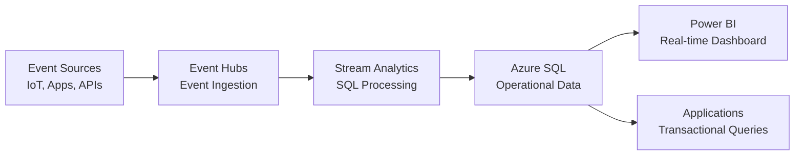

# 💾 Streaming to SQL - Stream Analytics to Azure SQL

> __🏠 [Home](../../../README.md)__ | __📖 [Documentation](../../README.md)__ | __🚀 [Implementation Guides](../README.md)__ | __🔗 [Integration Scenarios](README.md)__ | __💾 Streaming to SQL__


Stream real-time data from Event Hubs to Azure SQL Database or Synapse SQL using Stream Analytics for operational dashboards and transactional analytics.

---

## 🎯 Overview

This guide demonstrates how to build a real-time data pipeline from Event Hubs to Azure SQL Database using Stream Analytics. This pattern is ideal for operational dashboards, real-time reporting, and transactional analytics.

### What You'll Build



### Architecture Components

- **Azure Event Hubs**: Real-time event ingestion
- **Azure Stream Analytics**: SQL-based stream processing
- **Azure SQL Database**: Relational database for operational data
- **Power BI** (optional): Real-time dashboards

---

## 📋 Prerequisites

### Required Access

- [ ] Azure subscription with Contributor access
- [ ] Permission to create SQL databases
- [ ] Azure CLI 2.50.0+ or PowerShell 7.0+

### Required Knowledge

- Basic SQL query skills
- Understanding of Event Hubs and Stream Analytics
- Familiarity with database schema design

---

## 🚀 Step-by-Step Implementation

### Step 1: Create Resource Group

```bash
# Set variables
RESOURCE_GROUP="rg-streaming-sql"
LOCATION="eastus"

# Create resource group
az group create \
  --name $RESOURCE_GROUP \
  --location $LOCATION
```

---

### Step 2: Create Event Hubs Namespace and Event Hub

```bash
# Set variables
EVENTHUBS_NAMESPACE="evhns-sql-$(openssl rand -hex 4)"
EVENTHUB_NAME="sensor-events"

# Create Event Hubs namespace
az eventhubs namespace create \
  --name $EVENTHUBS_NAMESPACE \
  --resource-group $RESOURCE_GROUP \
  --location $LOCATION \
  --sku Standard \
  --capacity 1

# Create Event Hub
az eventhubs eventhub create \
  --name $EVENTHUB_NAME \
  --namespace-name $EVENTHUBS_NAMESPACE \
  --resource-group $RESOURCE_GROUP \
  --partition-count 4 \
  --message-retention 1

# Create shared access policy for Stream Analytics
az eventhubs eventhub authorization-rule create \
  --name "StreamAnalyticsRead" \
  --eventhub-name $EVENTHUB_NAME \
  --namespace-name $EVENTHUBS_NAMESPACE \
  --resource-group $RESOURCE_GROUP \
  --rights Listen
```

---

### Step 3: Create Azure SQL Database

```bash
# Set variables
SQL_SERVER="sql-streaming-$(openssl rand -hex 4)"
SQL_DATABASE="StreamingDB"
SQL_ADMIN="sqladmin"
SQL_PASSWORD="P@ssw0rd$(openssl rand -hex 4)!"

# Create SQL Server
az sql server create \
  --name $SQL_SERVER \
  --resource-group $RESOURCE_GROUP \
  --location $LOCATION \
  --admin-user $SQL_ADMIN \
  --admin-password $SQL_PASSWORD

# Create firewall rule to allow Azure services
az sql server firewall-rule create \
  --name "AllowAzureServices" \
  --server $SQL_SERVER \
  --resource-group $RESOURCE_GROUP \
  --start-ip-address 0.0.0.0 \
  --end-ip-address 0.0.0.0

# Create SQL Database (Basic tier for testing)
az sql db create \
  --name $SQL_DATABASE \
  --server $SQL_SERVER \
  --resource-group $RESOURCE_GROUP \
  --edition Basic \
  --capacity 5

echo "SQL Server: $SQL_SERVER.database.windows.net"
echo "Database: $SQL_DATABASE"
echo "Username: $SQL_ADMIN"
echo "Password: $SQL_PASSWORD"
```

---

### Step 4: Create SQL Table Schema

Connect to the database and create tables for streaming data.

#### Using Azure CLI (sqlcmd)

```bash
# Install sqlcmd if needed
# For Ubuntu/Debian: curl https://packages.microsoft.com/keys/microsoft.asc | sudo apt-key add -

# Create table
sqlcmd -S $SQL_SERVER.database.windows.net \
  -d $SQL_DATABASE \
  -U $SQL_ADMIN \
  -P $SQL_PASSWORD \
  -Q "
  CREATE TABLE SensorReadings (
      Id BIGINT IDENTITY(1,1) PRIMARY KEY,
      DeviceId NVARCHAR(50) NOT NULL,
      Temperature FLOAT NOT NULL,
      Humidity FLOAT NOT NULL,
      Pressure FLOAT,
      EventTimestamp DATETIME2 NOT NULL,
      ProcessedTimestamp DATETIME2 DEFAULT GETUTCDATE(),
      INDEX IX_DeviceId_Timestamp NONCLUSTERED (DeviceId, EventTimestamp DESC)
  );

  CREATE TABLE DeviceAlerts (
      Id BIGINT IDENTITY(1,1) PRIMARY KEY,
      DeviceId NVARCHAR(50) NOT NULL,
      AlertType NVARCHAR(50) NOT NULL,
      AlertMessage NVARCHAR(500),
      TriggerValue FLOAT,
      EventTimestamp DATETIME2 NOT NULL,
      ProcessedTimestamp DATETIME2 DEFAULT GETUTCDATE(),
      INDEX IX_DeviceId_Timestamp NONCLUSTERED (DeviceId, EventTimestamp DESC)
  );

  CREATE TABLE AggregatedMetrics (
      Id BIGINT IDENTITY(1,1) PRIMARY KEY,
      DeviceId NVARCHAR(50) NOT NULL,
      WindowEnd DATETIME2 NOT NULL,
      AvgTemperature FLOAT,
      MaxTemperature FLOAT,
      MinTemperature FLOAT,
      AvgHumidity FLOAT,
      EventCount INT,
      ProcessedTimestamp DATETIME2 DEFAULT GETUTCDATE(),
      INDEX IX_DeviceId_WindowEnd NONCLUSTERED (DeviceId, WindowEnd DESC)
  );
  "
```

#### Using Azure Data Studio or SSMS

```sql
-- Sensor readings table (raw events)
CREATE TABLE SensorReadings (
    Id BIGINT IDENTITY(1,1) PRIMARY KEY,
    DeviceId NVARCHAR(50) NOT NULL,
    Temperature FLOAT NOT NULL,
    Humidity FLOAT NOT NULL,
    Pressure FLOAT,
    EventTimestamp DATETIME2 NOT NULL,
    ProcessedTimestamp DATETIME2 DEFAULT GETUTCDATE(),
    INDEX IX_DeviceId_Timestamp NONCLUSTERED (DeviceId, EventTimestamp DESC)
);

-- Alerts table (filtered events)
CREATE TABLE DeviceAlerts (
    Id BIGINT IDENTITY(1,1) PRIMARY KEY,
    DeviceId NVARCHAR(50) NOT NULL,
    AlertType NVARCHAR(50) NOT NULL,
    AlertMessage NVARCHAR(500),
    TriggerValue FLOAT,
    EventTimestamp DATETIME2 NOT NULL,
    ProcessedTimestamp DATETIME2 DEFAULT GETUTCDATE(),
    INDEX IX_DeviceId_Timestamp NONCLUSTERED (DeviceId, EventTimestamp DESC)
);

-- Aggregated metrics table (windowed aggregations)
CREATE TABLE AggregatedMetrics (
    Id BIGINT IDENTITY(1,1) PRIMARY KEY,
    DeviceId NVARCHAR(50) NOT NULL,
    WindowEnd DATETIME2 NOT NULL,
    AvgTemperature FLOAT,
    MaxTemperature FLOAT,
    MinTemperature FLOAT,
    AvgHumidity FLOAT,
    EventCount INT,
    ProcessedTimestamp DATETIME2 DEFAULT GETUTCDATE(),
    INDEX IX_DeviceId_WindowEnd NONCLUSTERED (DeviceId, WindowEnd DESC)
);
```

---

### Step 5: Create Stream Analytics Job

```bash
# Set variables
STREAM_ANALYTICS_JOB="asa-streaming-sql"

# Create Stream Analytics job
az stream-analytics job create \
  --name $STREAM_ANALYTICS_JOB \
  --resource-group $RESOURCE_GROUP \
  --location $LOCATION \
  --sku Standard \
  --streaming-units 3

# Get Event Hubs connection string
EVENTHUBS_CONNECTION=$(az eventhubs eventhub authorization-rule keys list \
  --name "StreamAnalyticsRead" \
  --eventhub-name $EVENTHUB_NAME \
  --namespace-name $EVENTHUBS_NAMESPACE \
  --resource-group $RESOURCE_GROUP \
  --query primaryConnectionString \
  --output tsv)

# Create Event Hubs input
az stream-analytics input create \
  --job-name $STREAM_ANALYTICS_JOB \
  --resource-group $RESOURCE_GROUP \
  --name "EventHubInput" \
  --type Stream \
  --datasource '{
    "type": "Microsoft.ServiceBus/EventHub",
    "properties": {
      "serviceBusNamespace": "'$EVENTHUBS_NAMESPACE'",
      "eventHubName": "'$EVENTHUB_NAME'",
      "sharedAccessPolicyName": "StreamAnalyticsRead",
      "sharedAccessPolicyKey": "'$(az eventhubs eventhub authorization-rule keys list --name StreamAnalyticsRead --eventhub-name $EVENTHUB_NAME --namespace-name $EVENTHUBS_NAMESPACE --resource-group $RESOURCE_GROUP --query primaryKey --output tsv)'"
    }
  }' \
  --serialization '{
    "type": "Json",
    "properties": {
      "encoding": "UTF8"
    }
  }'
```

---

### Step 6: Create SQL Output

```bash
# Create SQL Database output for raw readings
az stream-analytics output create \
  --job-name $STREAM_ANALYTICS_JOB \
  --resource-group $RESOURCE_GROUP \
  --name "SqlOutputReadings" \
  --datasource '{
    "type": "Microsoft.Sql/Server/Database",
    "properties": {
      "server": "'$SQL_SERVER'",
      "database": "'$SQL_DATABASE'",
      "user": "'$SQL_ADMIN'",
      "password": "'$SQL_PASSWORD'",
      "table": "SensorReadings"
    }
  }'

# Create SQL Database output for alerts
az stream-analytics output create \
  --job-name $STREAM_ANALYTICS_JOB \
  --resource-group $RESOURCE_GROUP \
  --name "SqlOutputAlerts" \
  --datasource '{
    "type": "Microsoft.Sql/Server/Database",
    "properties": {
      "server": "'$SQL_SERVER'",
      "database": "'$SQL_DATABASE'",
      "user": "'$SQL_ADMIN'",
      "password": "'$SQL_PASSWORD'",
      "table": "DeviceAlerts"
    }
  }'

# Create SQL Database output for aggregations
az stream-analytics output create \
  --job-name $STREAM_ANALYTICS_JOB \
  --resource-group $RESOURCE_GROUP \
  --name "SqlOutputAggregations" \
  --datasource '{
    "type": "Microsoft.Sql/Server/Database",
    "properties": {
      "server": "'$SQL_SERVER'",
      "database": "'$SQL_DATABASE'",
      "user": "'$SQL_ADMIN'",
      "password": "'$SQL_PASSWORD'",
      "table": "AggregatedMetrics"
    }
  }'
```

---

### Step 7: Create Stream Analytics Query

Create a query file `stream-analytics-query.sql`:

```sql
-- Input stream from Event Hubs
WITH EventHubInput AS (
    SELECT
        DeviceId,
        Temperature,
        Humidity,
        Pressure,
        EventTimestamp
    FROM EventHubInput
    TIMESTAMP BY EventTimestamp
)

-- Output 1: All readings to SQL (with filtering for valid data)
SELECT
    DeviceId,
    Temperature,
    Humidity,
    Pressure,
    EventTimestamp
INTO SqlOutputReadings
FROM EventHubInput
WHERE
    Temperature IS NOT NULL
    AND Humidity IS NOT NULL
    AND Temperature BETWEEN -50 AND 100
    AND Humidity BETWEEN 0 AND 100;

-- Output 2: High temperature alerts
SELECT
    DeviceId,
    'HighTemperature' AS AlertType,
    'Temperature exceeded 80°C' AS AlertMessage,
    Temperature AS TriggerValue,
    EventTimestamp
INTO SqlOutputAlerts
FROM EventHubInput
WHERE Temperature > 80;

-- Output 3: Low humidity alerts
SELECT
    DeviceId,
    'LowHumidity' AS AlertType,
    'Humidity below 20%' AS AlertMessage,
    Humidity AS TriggerValue,
    EventTimestamp
INTO SqlOutputAlerts
FROM EventHubInput
WHERE Humidity < 20;

-- Output 4: 5-minute aggregations by device
SELECT
    DeviceId,
    System.Timestamp() AS WindowEnd,
    AVG(Temperature) AS AvgTemperature,
    MAX(Temperature) AS MaxTemperature,
    MIN(Temperature) AS MinTemperature,
    AVG(Humidity) AS AvgHumidity,
    COUNT(*) AS EventCount
INTO SqlOutputAggregations
FROM EventHubInput
GROUP BY
    DeviceId,
    TumblingWindow(minute, 5);
```

Update the Stream Analytics job with the query:

```bash
# Update transformation query
az stream-analytics transformation create \
  --job-name $STREAM_ANALYTICS_JOB \
  --resource-group $RESOURCE_GROUP \
  --name "Transformation" \
  --streaming-units 3 \
  --saql "$(cat stream-analytics-query.sql)"
```

---

### Step 8: Start Stream Analytics Job

```bash
# Start the job
az stream-analytics job start \
  --name $STREAM_ANALYTICS_JOB \
  --resource-group $RESOURCE_GROUP \
  --output-start-mode JobStartTime

echo "Stream Analytics job started successfully!"
```

---

### Step 9: Send Test Events

Use Python to send test sensor data:

```python
# send_events.py
from azure.eventhub import EventHubProducerClient, EventData
import json
import random
from datetime import datetime, timedelta
import time

CONNECTION_STRING = "<your_eventhubs_connection_string>"
EVENTHUB_NAME = "sensor-events"

producer = EventHubProducerClient.from_connection_string(
    conn_str=CONNECTION_STRING,
    eventhub_name=EVENTHUB_NAME
)

def generate_sensor_event(device_id):
    """Generate realistic sensor data with occasional anomalies"""
    base_temp = 25.0
    base_humidity = 60.0

    # 10% chance of high temperature alert
    if random.random() < 0.1:
        temperature = random.uniform(80, 95)
    else:
        temperature = base_temp + random.uniform(-5, 15)

    # 5% chance of low humidity alert
    if random.random() < 0.05:
        humidity = random.uniform(5, 19)
    else:
        humidity = base_humidity + random.uniform(-10, 20)

    return {
        "DeviceId": device_id,
        "Temperature": round(temperature, 2),
        "Humidity": round(humidity, 2),
        "Pressure": round(random.uniform(950, 1050), 2),
        "EventTimestamp": datetime.utcnow().isoformat() + "Z"
    }

print("Sending sensor events...")
try:
    with producer:
        for i in range(1000):
            # Generate events for 10 devices
            device_id = f"device-{random.randint(1, 10):03d}"
            event_data = generate_sensor_event(device_id)

            # Send event
            event_batch = producer.create_batch()
            event_batch.add(EventData(json.dumps(event_data)))
            producer.send_batch(event_batch)

            if (i + 1) % 100 == 0:
                print(f"Sent {i + 1} events...")

            time.sleep(0.1)  # 10 events/second

    print("All events sent successfully!")

except Exception as e:
    print(f"Error: {e}")
```

Run the script:

```bash
python send_events.py
```

---

### Step 10: Query SQL Database

Verify data is flowing into SQL:

```sql
-- Check recent sensor readings
SELECT TOP 100 *
FROM SensorReadings
ORDER BY ProcessedTimestamp DESC;

-- Check alerts
SELECT TOP 50 *
FROM DeviceAlerts
ORDER BY ProcessedTimestamp DESC;

-- Check aggregated metrics
SELECT TOP 50 *
FROM AggregatedMetrics
ORDER BY WindowEnd DESC;

-- Get latest reading per device
SELECT
    DeviceId,
    Temperature,
    Humidity,
    Pressure,
    EventTimestamp
FROM SensorReadings r1
WHERE EventTimestamp = (
    SELECT MAX(EventTimestamp)
    FROM SensorReadings r2
    WHERE r2.DeviceId = r1.DeviceId
)
ORDER BY DeviceId;

-- Alert summary by device
SELECT
    DeviceId,
    AlertType,
    COUNT(*) AS AlertCount,
    MAX(EventTimestamp) AS LastAlertTime
FROM DeviceAlerts
WHERE EventTimestamp > DATEADD(hour, -1, GETUTCDATE())
GROUP BY DeviceId, AlertType
ORDER BY DeviceId, AlertType;
```

---

## 📊 Complete Bicep Template

```bicep
// main.bicep
param location string = resourceGroup().location
param namePrefix string = 'stream'
param sqlAdminPassword string

// Event Hubs Namespace
resource eventHubsNamespace 'Microsoft.EventHub/namespaces@2023-01-01-preview' = {
  name: '${namePrefix}-evhns-${uniqueString(resourceGroup().id)}'
  location: location
  sku: {
    name: 'Standard'
    tier: 'Standard'
    capacity: 1
  }
}

// Event Hub
resource eventHub 'Microsoft.EventHub/namespaces/eventhubs@2023-01-01-preview' = {
  parent: eventHubsNamespace
  name: 'sensor-events'
  properties: {
    partitionCount: 4
    messageRetentionInDays: 1
  }
}

// Event Hub authorization rule
resource eventHubAuthRule 'Microsoft.EventHub/namespaces/eventhubs/authorizationRules@2023-01-01-preview' = {
  parent: eventHub
  name: 'StreamAnalyticsRead'
  properties: {
    rights: ['Listen']
  }
}

// SQL Server
resource sqlServer 'Microsoft.Sql/servers@2023-05-01-preview' = {
  name: '${namePrefix}-sql-${uniqueString(resourceGroup().id)}'
  location: location
  properties: {
    administratorLogin: 'sqladmin'
    administratorLoginPassword: sqlAdminPassword
    minimalTlsVersion: '1.2'
    publicNetworkAccess: 'Enabled'
  }
}

// SQL Firewall rule for Azure services
resource sqlFirewallRule 'Microsoft.Sql/servers/firewallRules@2023-05-01-preview' = {
  parent: sqlServer
  name: 'AllowAzureServices'
  properties: {
    startIpAddress: '0.0.0.0'
    endIpAddress: '0.0.0.0'
  }
}

// SQL Database
resource sqlDatabase 'Microsoft.Sql/servers/databases@2023-05-01-preview' = {
  parent: sqlServer
  name: 'StreamingDB'
  location: location
  sku: {
    name: 'Basic'
    tier: 'Basic'
    capacity: 5
  }
  properties: {
    collation: 'SQL_Latin1_General_CP1_CI_AS'
    maxSizeBytes: 2147483648 // 2 GB
  }
}

// Stream Analytics Job
resource streamAnalyticsJob 'Microsoft.StreamAnalytics/streamingjobs@2021-10-01-preview' = {
  name: '${namePrefix}-asa-${uniqueString(resourceGroup().id)}'
  location: location
  properties: {
    sku: {
      name: 'Standard'
    }
    outputErrorPolicy: 'Stop'
    eventsOutOfOrderPolicy: 'Adjust'
    eventsOutOfOrderMaxDelayInSeconds: 0
    eventsLateArrivalMaxDelayInSeconds: 5
    dataLocale: 'en-US'
    compatibilityLevel: '1.2'
  }
}

// Outputs
output eventHubsNamespace string = eventHubsNamespace.name
output eventHubName string = eventHub.name
output sqlServerName string = sqlServer.name
output sqlDatabaseName string = sqlDatabase.name
output streamAnalyticsJobName string = streamAnalyticsJob.name
```

---

## ⚙️ Performance Optimization

### SQL Database Optimization

**Create Indexes**:

```sql
-- Create filtered index for recent data
CREATE INDEX IX_SensorReadings_Recent
ON SensorReadings(DeviceId, EventTimestamp DESC)
WHERE EventTimestamp > DATEADD(day, -7, GETUTCDATE());

-- Create index for alerts
CREATE INDEX IX_DeviceAlerts_Recent
ON DeviceAlerts(DeviceId, AlertType, EventTimestamp DESC)
INCLUDE (AlertMessage, TriggerValue);

-- Create columnstore index for analytics (if using higher tier)
CREATE COLUMNSTORE INDEX IX_AggregatedMetrics_CS
ON AggregatedMetrics(DeviceId, WindowEnd, AvgTemperature);
```

**Partition Tables** (for high volume):

```sql
-- Create partition function
CREATE PARTITION FUNCTION PF_EventTimestamp (DATETIME2)
AS RANGE RIGHT FOR VALUES (
    '2024-01-01', '2024-02-01', '2024-03-01', '2024-04-01'
);

-- Create partition scheme
CREATE PARTITION SCHEME PS_EventTimestamp
AS PARTITION PF_EventTimestamp
ALL TO ([PRIMARY]);

-- Create partitioned table
CREATE TABLE SensorReadings_Partitioned (
    Id BIGINT IDENTITY(1,1),
    DeviceId NVARCHAR(50) NOT NULL,
    Temperature FLOAT NOT NULL,
    EventTimestamp DATETIME2 NOT NULL,
    CONSTRAINT PK_SensorReadings_Partitioned
        PRIMARY KEY (EventTimestamp, Id)
) ON PS_EventTimestamp(EventTimestamp);
```

### Stream Analytics Optimization

**Optimize Query**:

```sql
-- Use PARTITION BY for parallelization
SELECT
    DeviceId,
    System.Timestamp() AS WindowEnd,
    AVG(Temperature) AS AvgTemperature,
    COUNT(*) AS EventCount
INTO SqlOutputAggregations
FROM EventHubInput PARTITION BY PartitionId
GROUP BY
    DeviceId,
    TumblingWindow(minute, 5),
    PartitionId;
```

---

## 🔒 Security Enhancements

### Use Managed Identity

```bash
# Enable managed identity on Stream Analytics
az stream-analytics job update \
  --name $STREAM_ANALYTICS_JOB \
  --resource-group $RESOURCE_GROUP \
  --identity SystemAssigned

# Get principal ID
PRINCIPAL_ID=$(az stream-analytics job show \
  --name $STREAM_ANALYTICS_JOB \
  --resource-group $RESOURCE_GROUP \
  --query identity.principalId \
  --output tsv)

# Create SQL user for managed identity
sqlcmd -S $SQL_SERVER.database.windows.net \
  -d $SQL_DATABASE \
  -U $SQL_ADMIN \
  -P $SQL_PASSWORD \
  -Q "CREATE USER [$STREAM_ANALYTICS_JOB] FROM EXTERNAL PROVIDER; ALTER ROLE db_datareader ADD MEMBER [$STREAM_ANALYTICS_JOB]; ALTER ROLE db_datawriter ADD MEMBER [$STREAM_ANALYTICS_JOB];"
```

---

## 💰 Cost Optimization

- **Right-size SQL Database tier**: Start with Basic, upgrade based on DTU usage
- **Optimize Stream Analytics SUs**: Monitor SU utilization, adjust as needed
- **Implement data retention**: Delete old data to manage storage costs

```sql
-- Create retention job
CREATE PROCEDURE CleanupOldData
AS
BEGIN
    DELETE FROM SensorReadings
    WHERE EventTimestamp < DATEADD(day, -30, GETUTCDATE());

    DELETE FROM DeviceAlerts
    WHERE EventTimestamp < DATEADD(day, -90, GETUTCDATE());

    DELETE FROM AggregatedMetrics
    WHERE WindowEnd < DATEADD(day, -365, GETUTCDATE());
END;
```

---

## 📚 Next Steps

- **[Build event-driven pipelines](event-driven-pipelines.md)**
- **[Integrate with Power BI for dashboards](../../08-solutions/real-time-dashboards/README.md)**
- **[Add Cosmos DB for global distribution](stream-analytics-cosmos.md)**

---

*Last Updated: 2025-01-28*
*Estimated Completion Time: 45 minutes*
*Complexity: Intermediate*
