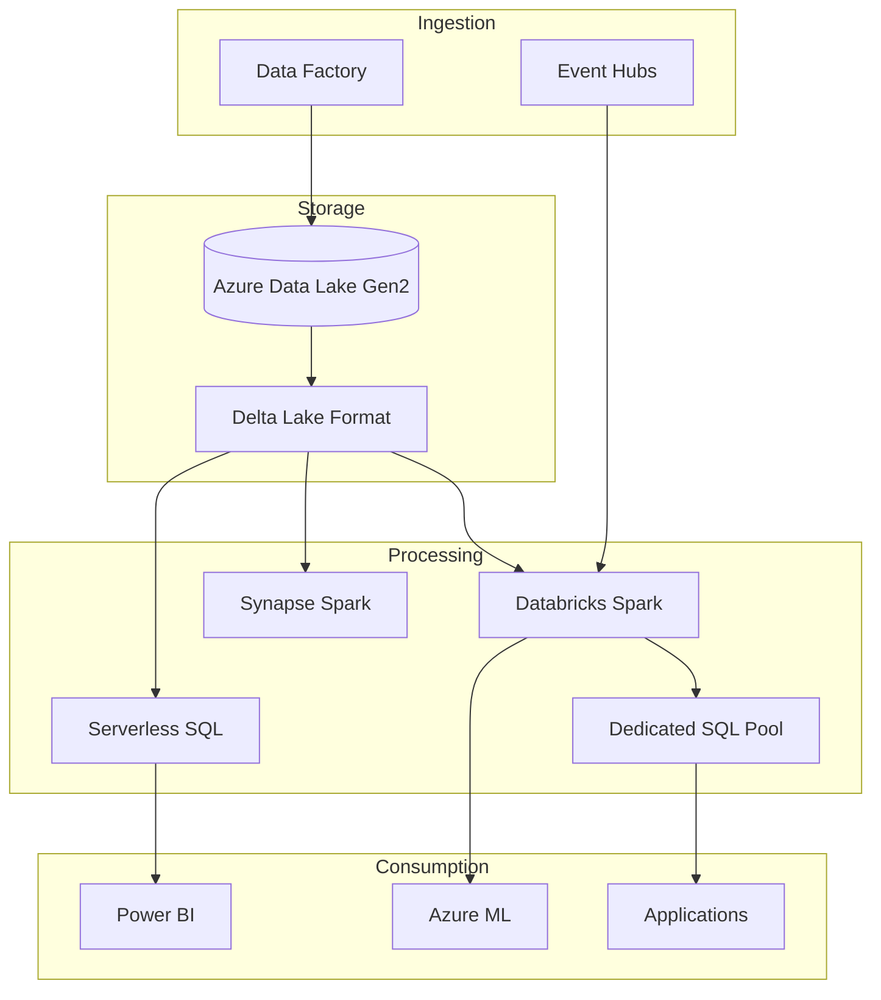

# Synapse and Databricks Integration

> __[Home](../../../README.md)__ | __[Implementation](../README.md)__ | __[Integration](README.md)__ | __Synapse + Databricks__


Build unified lakehouse architectures combining Synapse Analytics and Databricks.

---

## Overview

Combining Synapse and Databricks enables:

- Best-of-breed capabilities from both platforms
- Unified data lake with shared Delta tables
- Flexible compute for different workloads
- Seamless data sharing across teams

---

## Architecture Pattern



---

## Implementation

### Step 1: Shared Storage Configuration

```python
# Databricks - Configure access to shared storage
spark.conf.set(
    "fs.azure.account.key.sharedlake.dfs.core.windows.net",
    dbutils.secrets.get(scope="azure-keyvault", key="storage-key")
)

# Or use service principal
spark.conf.set("fs.azure.account.auth.type.sharedlake.dfs.core.windows.net", "OAuth")
spark.conf.set("fs.azure.account.oauth.provider.type.sharedlake.dfs.core.windows.net",
               "org.apache.hadoop.fs.azurebfs.oauth2.ClientCredsTokenProvider")
spark.conf.set("fs.azure.account.oauth2.client.id.sharedlake.dfs.core.windows.net", client_id)
spark.conf.set("fs.azure.account.oauth2.client.secret.sharedlake.dfs.core.windows.net", client_secret)
spark.conf.set("fs.azure.account.oauth2.client.endpoint.sharedlake.dfs.core.windows.net",
               f"https://login.microsoftonline.com/{tenant_id}/oauth2/token")
```

### Step 2: Create Shared Delta Tables

```python
# Databricks - Create curated tables
spark.sql("""
    CREATE TABLE IF NOT EXISTS gold.sales.daily_metrics
    USING DELTA
    LOCATION 'abfss://gold@sharedlake.dfs.core.windows.net/sales/daily_metrics'
    AS
    SELECT
        order_date,
        region,
        product_category,
        SUM(amount) AS total_sales,
        COUNT(DISTINCT customer_id) AS unique_customers,
        COUNT(*) AS order_count
    FROM silver.sales.orders
    GROUP BY order_date, region, product_category
""")

# Enable column statistics for query optimization
spark.sql("ANALYZE TABLE gold.sales.daily_metrics COMPUTE STATISTICS FOR ALL COLUMNS")
```

### Step 3: Query from Synapse Serverless SQL

```sql
-- Synapse Serverless - Create external data source
CREATE EXTERNAL DATA SOURCE SharedLake
WITH (
    LOCATION = 'https://sharedlake.dfs.core.windows.net',
    CREDENTIAL = StorageCredential
);

-- Create view over Delta table
CREATE OR ALTER VIEW vw_daily_metrics AS
SELECT *
FROM OPENROWSET(
    BULK 'gold/sales/daily_metrics',
    DATA_SOURCE = 'SharedLake',
    FORMAT = 'DELTA'
) AS metrics;

-- Query with pushdown optimization
SELECT
    region,
    SUM(total_sales) AS region_total,
    AVG(unique_customers) AS avg_customers
FROM vw_daily_metrics
WHERE order_date >= DATEADD(day, -30, GETDATE())
GROUP BY region;
```

### Step 4: Load into Dedicated SQL Pool

```python
# Databricks - Write to Synapse Dedicated Pool
df = spark.table("gold.sales.daily_metrics")

df.write \
    .format("com.databricks.spark.sqldw") \
    .option("url", synapse_jdbc_url) \
    .option("tempDir", "abfss://staging@sharedlake.dfs.core.windows.net/polybase") \
    .option("forwardSparkAzureStorageCredentials", "true") \
    .option("dbTable", "dbo.daily_metrics") \
    .option("tableOptions", "DISTRIBUTION = HASH(region), CLUSTERED COLUMNSTORE INDEX") \
    .mode("overwrite") \
    .save()
```

### Step 5: Synapse Pipeline Orchestration

```json
{
    "name": "Orchestrate_Databricks_Synapse",
    "properties": {
        "activities": [
            {
                "name": "Run_Databricks_ETL",
                "type": "DatabricksNotebook",
                "typeProperties": {
                    "notebookPath": "/Repos/etl/transform_sales",
                    "baseParameters": {
                        "date": "@pipeline().parameters.processDate"
                    }
                },
                "linkedServiceName": {
                    "referenceName": "DatabricksLinkedService",
                    "type": "LinkedServiceReference"
                }
            },
            {
                "name": "Refresh_Synapse_Views",
                "type": "SqlPoolStoredProcedure",
                "dependsOn": [
                    { "activity": "Run_Databricks_ETL", "dependencyConditions": ["Succeeded"] }
                ],
                "typeProperties": {
                    "storedProcedureName": "dbo.usp_RefreshMetricViews"
                }
            },
            {
                "name": "Load_To_Dedicated_Pool",
                "type": "Copy",
                "dependsOn": [
                    { "activity": "Refresh_Synapse_Views", "dependencyConditions": ["Succeeded"] }
                ],
                "typeProperties": {
                    "source": {
                        "type": "ParquetSource"
                    },
                    "sink": {
                        "type": "SqlDWSink",
                        "writeBehavior": "Upsert",
                        "upsertSettings": {
                            "keys": ["order_date", "region", "product_category"]
                        }
                    }
                }
            }
        ]
    }
}
```

### Step 6: Unified Metadata with Unity Catalog

```sql
-- Databricks Unity Catalog - Share with Synapse
CREATE SHARE sales_share;

ALTER SHARE sales_share ADD TABLE gold.sales.daily_metrics;
ALTER SHARE sales_share ADD TABLE gold.sales.customer_segments;

-- Grant access to Synapse service principal
GRANT SELECT ON SHARE sales_share TO RECIPIENT synapse_analytics;
```

---

## Best Practices

| Aspect | Recommendation |
|--------|----------------|
| Storage Format | Delta Lake for ACID and time travel |
| Partitioning | Align between platforms (date-based) |
| Statistics | Maintain in both platforms |
| Security | Shared service principal or managed identity |
| Monitoring | Unified Azure Monitor dashboards |

---

## Related Documentation

- [Purview + Synapse](purview-synapse.md)
- [Databricks Best Practices](../../05-best-practices/service-specific/databricks.md)
- [Synapse Best Practices](../../05-best-practices/service-specific/synapse-analytics.md)

---

*Last Updated: January 2025*
