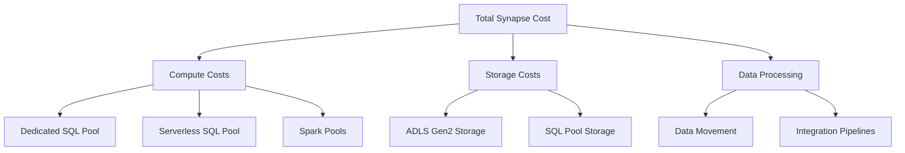

# Cost Optimization Best Practices

> **🏠 [Home](../../../../README.md)** | **📖 [Documentation](../../../README.md)** | **💡 [Best Practices](../../README.md)** | **💲 Cost Optimization**


> **💰 Cost Efficiency Strategy**
> Achieve significant cost savings while maintaining performance and reliability. This guide provides actionable strategies for optimizing Total Cost of Ownership (TCO) across all Cloud Scale Analytics services.

## 📋 Table of Contents

- [Overview](#overview)
- [Cost Model Understanding](#cost-model-understanding)
- [Compute Cost Optimization](#compute-cost-optimization)
- [Storage Cost Optimization](#storage-cost-optimization)
- [Data Transfer Optimization](#data-transfer-optimization)
- [Reserved Capacity and Commitments](#reserved-capacity-and-commitments)
- [Cost Monitoring and Governance](#cost-monitoring-and-governance)
- [Implementation Checklist](#implementation-checklist)

## Overview

### Cost Optimization Pillars

| Pillar | Description | Potential Savings |
|--------|-------------|------------------|
| **Compute Optimization** | Right-sizing, auto-scaling, pause/resume | 20-40% |
| **Storage Optimization** | Lifecycle management, compression, tiering | 15-30% |
| **Data Transfer** | Network optimization, region selection | 10-20% |
| **Reserved Capacity** | Commitment-based discounts | 30-50% |
| **Monitoring & Governance** | Cost allocation, budgets, alerts | 10-25% |

### Quick Wins

Start here for immediate cost savings:

1. **Pause Unused Resources** - Automatically pause dev/test environments
2. **Enable Auto-Scaling** - Scale down during low-usage periods
3. **Optimize Storage Tiers** - Move cold data to archive storage
4. **Review SKUs** - Ensure appropriate service tiers
5. **Clean Up Orphaned Resources** - Remove unused storage, IPs, etc.

## Cost Model Understanding

### Azure Synapse Analytics Cost Components



### Cost Breakdown by Service

| Service | Pricing Model | Cost Drivers | Optimization Focus |
|---------|---------------|--------------|-------------------|
| **Dedicated SQL Pool** | DWU-hours | Compute time, DWU size | Pause/resume, scaling |
| **Serverless SQL Pool** | TB processed | Data scanned | Query optimization, partitioning |
| **Spark Pools** | vCore-hours | Node count, runtime | Auto-scale, node sizing |
| **ADLS Gen2** | Storage + transactions | Volume, tier, operations | Lifecycle, compression |
| **Pipelines** | Activity runs | Pipeline complexity | Consolidation, scheduling |

## Compute Cost Optimization

### Dedicated SQL Pool

#### 1. Implement Pause and Resume

**Automatic Pause During Non-Business Hours:**

```powershell
# Create automation account runbook for pause/resume
$ResourceGroup = "rg-synapse-prod"
$WorkspaceName = "synapse-workspace"
$SqlPoolName = "sql-pool-prod"

# Pause SQL Pool (evenings)
$pauseScript = @"
param(
    [string]`$ResourceGroup,
    [string]`$WorkspaceName,
    [string]`$SqlPoolName
)

# Connect with managed identity
Connect-AzAccount -Identity

# Pause the SQL pool
Suspend-AzSynapseSqlPool `
    -ResourceGroupName `$ResourceGroup `
    -WorkspaceName `$WorkspaceName `
    -Name `$SqlPoolName `
    -Verbose
"@

# Resume SQL Pool (mornings)
$resumeScript = @"
param(
    [string]`$ResourceGroup,
    [string]`$WorkspaceName,
    [string]`$SqlPoolName
)

Connect-AzAccount -Identity

Resume-AzSynapseSqlPool `
    -ResourceGroupName `$ResourceGroup `
    -WorkspaceName `$WorkspaceName `
    -Name `$SqlPoolName `
    -Verbose
"@

# Create schedule for pause (6 PM weekdays)
$timezone = "Eastern Standard Time"
$pauseSchedule = New-AzAutomationSchedule `
    -ResourceGroupName $ResourceGroup `
    -AutomationAccountName "automation-synapse" `
    -Name "PauseSQLPool-Evening" `
    -StartTime (Get-Date "18:00") `
    -DayInterval 1 `
    -TimeZone $timezone

# Create schedule for resume (7 AM weekdays)
$resumeSchedule = New-AzAutomationSchedule `
    -ResourceGroupName $ResourceGroup `
    -AutomationAccountName "automation-synapse" `
    -Name "ResumeSQLPool-Morning" `
    -StartTime (Get-Date "07:00") `
    -DayInterval 1 `
    -TimeZone $timezone
```

**Cost Impact:** 60-75% savings on non-business hours (assuming 12-hour workday)

#### 2. Dynamic DWU Scaling

**Scale Based on Workload:**

```powershell
# Scale up for heavy workloads
function Set-SynapseDWU {
    param(
        [string]$ResourceGroup,
        [string]$WorkspaceName,
        [string]$SqlPoolName,
        [string]$TargetDWU
    )

    Write-Output "Scaling $SqlPoolName to $TargetDWU"

    Set-AzSynapseSqlPool `
        -ResourceGroupName $ResourceGroup `
        -WorkspaceName $WorkspaceName `
        -Name $SqlPoolName `
        -PerformanceLevel $TargetDWU
}

# Example: Scale up for ETL, down for reporting
# Morning ETL (DW1000c)
Set-SynapseDWU -ResourceGroup "rg-synapse" `
                -WorkspaceName "synapse-ws" `
                -SqlPoolName "sql-pool" `
                -TargetDWU "DW1000c"

# Afternoon reporting (DW400c)
Set-SynapseDWU -ResourceGroup "rg-synapse" `
                -WorkspaceName "synapse-ws" `
                -SqlPoolName "sql-pool" `
                -TargetDWU "DW400c"
```

**Cost Impact:** 20-40% savings by matching compute to workload needs

### Serverless SQL Pool

#### 1. Minimize Data Scanned

**Partition Pruning:**

```sql
-- ❌ BAD: Scans all partitions
SELECT customer_id, order_total
FROM OPENROWSET(
    BULK 'https://storage.dfs.core.windows.net/container/orders/**',
    FORMAT = 'PARQUET'
) AS orders
WHERE YEAR(order_date) = 2024;

-- ✅ GOOD: Scans only relevant partitions
SELECT customer_id, order_total
FROM OPENROWSET(
    BULK 'https://storage.dfs.core.windows.net/container/orders/year=2024/**',
    FORMAT = 'PARQUET'
) AS orders;
```

**Column Projection:**

```sql
-- ❌ BAD: Scans all columns
SELECT *
FROM OPENROWSET(
    BULK 'https://storage.dfs.core.windows.net/container/sales/year=2024/**',
    FORMAT = 'PARQUET'
) AS sales;

-- ✅ GOOD: Only scans needed columns
SELECT product_id, quantity, price
FROM OPENROWSET(
    BULK 'https://storage.dfs.core.windows.net/container/sales/year=2024/**',
    FORMAT = 'PARQUET'
) AS sales;
```

**Cost Impact:** 50-80% reduction in data scanning costs

#### 2. Use Efficient File Formats

**Convert to Columnar Formats:**

```sql
-- Create Parquet from CSV (one-time conversion)
CREATE EXTERNAL TABLE sales_parquet
WITH (
    LOCATION = 'sales/parquet/',
    DATA_SOURCE = data_lake,
    FILE_FORMAT = parquet_format
)
AS
SELECT *
FROM OPENROWSET(
    BULK 'sales/csv/*.csv',
    FORMAT = 'CSV',
    PARSER_VERSION = '2.0',
    HEADER_ROW = TRUE
) AS source;
```

**Cost Impact:** 60-70% reduction in scanning costs (Parquet vs CSV)

### Spark Pools

#### 1. Enable Auto-Scaling

**Configure Auto-Scale:**

```bash
# Azure CLI: Create Spark pool with auto-scale
az synapse spark pool create \
    --name spark-autoscale \
    --workspace-name synapse-workspace \
    --resource-group rg-synapse \
    --spark-version 3.3 \
    --node-count 3 \
    --node-size Medium \
    --enable-auto-scale true \
    --min-node-count 3 \
    --max-node-count 10 \
    --auto-pause-delay 15
```

**Cost Impact:** 30-50% savings by scaling to actual workload

#### 2. Right-Size Node Types

**Node Selection Guide:**

| Workload Type | Recommended Node | vCores | Memory | Use Case |
|---------------|------------------|--------|--------|----------|
| Memory-intensive | Memory Optimized | 8 | 64 GB | Large aggregations, ML |
| CPU-intensive | Compute Optimized | 16 | 32 GB | Transformations, filtering |
| Balanced | Small/Medium | 4-8 | 32 GB | General analytics |

```python
# Spark configuration for cost optimization
spark.conf.set("spark.sql.adaptive.enabled", "true")
spark.conf.set("spark.sql.adaptive.coalescePartitions.enabled", "true")
spark.conf.set("spark.sql.adaptive.skewJoin.enabled", "true")

# Configure executor memory
spark.conf.set("spark.executor.memory", "4g")
spark.conf.set("spark.executor.cores", "4")
spark.conf.set("spark.dynamicAllocation.enabled", "true")
```

**Cost Impact:** 20-30% savings with optimal node selection

## Storage Cost Optimization

### ADLS Gen2 Lifecycle Management

#### 1. Implement Lifecycle Policies

**Automated Tiering:**

```bash
# Azure CLI: Create lifecycle management policy
az storage account management-policy create \
    --account-name storagecsa \
    --resource-group rg-synapse \
    --policy @policy.json
```

**policy.json:**

```json
{
  "rules": [
    {
      "enabled": true,
      "name": "move-to-cool",
      "type": "Lifecycle",
      "definition": {
        "actions": {
          "baseBlob": {
            "tierToCool": {
              "daysAfterModificationGreaterThan": 30
            },
            "tierToArchive": {
              "daysAfterModificationGreaterThan": 90
            },
            "delete": {
              "daysAfterModificationGreaterThan": 365
            }
          }
        },
        "filters": {
          "blobTypes": ["blockBlob"],
          "prefixMatch": ["raw-data/", "archive/"]
        }
      }
    },
    {
      "enabled": true,
      "name": "delete-old-logs",
      "type": "Lifecycle",
      "definition": {
        "actions": {
          "baseBlob": {
            "delete": {
              "daysAfterModificationGreaterThan": 90
            }
          }
        },
        "filters": {
          "blobTypes": ["blockBlob"],
          "prefixMatch": ["logs/"]
        }
      }
    }
  ]
}
```

**Cost Impact:** 50-60% reduction in storage costs

#### 2. Enable Compression

**Delta Lake with Compression:**

```python
from delta.tables import DeltaTable

# Write with optimal compression
df.write \
    .format("delta") \
    .mode("overwrite") \
    .option("compression", "snappy") \
    .option("optimizeWrite", "true") \
    .option("dataChange", "false") \
    .save("/delta/optimized-table")

# Optimize existing tables
deltaTable = DeltaTable.forPath(spark, "/delta/sales")
deltaTable.optimize().executeCompaction()
```

**Cost Impact:** 40-60% storage savings with compression

### Storage Transaction Optimization

```python
# Batch operations to reduce transaction costs
from azure.storage.filedatalake import DataLakeServiceClient

service_client = DataLakeServiceClient.from_connection_string(conn_str)
file_system_client = service_client.get_file_system_client("container")

# ❌ BAD: Multiple individual transactions
for file in file_list:
    file_client = file_system_client.get_file_client(file)
    file_client.delete_file()

# ✅ GOOD: Batch deletion
batch_client = file_system_client.get_directory_client("old-data")
batch_client.delete_directory()
```

## Data Transfer Optimization

### 1. Minimize Cross-Region Traffic

**Co-locate Resources:**

```bash
# Ensure all resources in same region
az group create \
    --name rg-synapse-eastus \
    --location eastus

az synapse workspace create \
    --name synapse-eastus \
    --resource-group rg-synapse-eastus \
    --location eastus \
    --storage-account storagecsa \
    --sql-admin-login-user sqladmin
```

**Cost Impact:** Eliminate inter-region data transfer charges

### 2. Use Private Endpoints

**Reduce Egress Charges:**

```bash
# Create private endpoint
az network private-endpoint create \
    --name pe-synapse \
    --resource-group rg-synapse \
    --vnet-name vnet-synapse \
    --subnet subnet-private-endpoints \
    --private-connection-resource-id "/subscriptions/{sub-id}/resourceGroups/rg-synapse/providers/Microsoft.Synapse/workspaces/synapse-workspace" \
    --group-id Sql \
    --connection-name synapse-connection
```

## Reserved Capacity and Commitments

### Reserved Instances

**1-Year or 3-Year Commitments:**

```powershell
# Purchase reserved capacity for Synapse
$ReservationOrder = New-AzReservation `
    -ReservedResourceType "SynapseAnalytics" `
    -Sku "DW1000c" `
    -Location "East US" `
    -Term "P3Y" `
    -BillingPlan "Monthly" `
    -Quantity 1 `
    -DisplayName "Synapse-Reserved-3Year"
```

**Cost Impact:** 30-50% savings on committed capacity

### Azure Hybrid Benefit

```bash
# Apply SQL Server licenses
az synapse sql pool update \
    --name sql-pool-prod \
    --workspace-name synapse-workspace \
    --resource-group rg-synapse \
    --license-type BasePrice
```

**Cost Impact:** Up to 30% on SQL compute with existing licenses

## Cost Monitoring and Governance

### Cost Allocation with Tags

```bash
# Tag resources for cost allocation
az resource tag \
    --resource-group rg-synapse \
    --name synapse-workspace \
    --resource-type Microsoft.Synapse/workspaces \
    --tags Environment=Production CostCenter=Analytics Department=Finance
```

### Budget Alerts

```bash
# Create budget with alerts
az consumption budget create \
    --resource-group rg-synapse \
    --budget-name synapse-monthly-budget \
    --amount 10000 \
    --time-grain Monthly \
    --start-date "2024-01-01" \
    --end-date "2024-12-31" \
    --notification threshold=80 contactEmails="team@company.com" enabled=true \
    --notification threshold=100 contactEmails="team@company.com" enabled=true
```

### Cost Analysis Query

```kusto
// Azure Resource Graph query for cost analysis
Resources
| where type =~ 'microsoft.synapse/workspaces'
| extend tags = tostring(tags)
| project name, location, resourceGroup, tags
| join kind=inner (
    CostManagementResources
    | where type == 'microsoft.costmanagement/costdetails'
    | extend cost = todouble(properties.cost)
    | summarize TotalCost = sum(cost) by resourceId = tolower(tostring(properties.resourceId))
) on $left.id == $right.resourceId
| project name, resourceGroup, location, tags, TotalCost
| order by TotalCost desc
```

## Implementation Checklist

### Immediate Actions (Week 1)

- [ ] Identify and pause unused dedicated SQL pools
- [ ] Enable auto-pause on dev/test environments
- [ ] Review and right-size Spark pool configurations
- [ ] Implement partition pruning in serverless queries
- [ ] Convert CSV files to Parquet format

### Short-Term (Month 1)

- [ ] Set up automated pause/resume schedules
- [ ] Implement lifecycle policies for storage
- [ ] Enable compression on Delta tables
- [ ] Configure budget alerts
- [ ] Tag all resources for cost allocation

### Mid-Term (Quarter 1)

- [ ] Analyze reserved capacity opportunities
- [ ] Optimize data partitioning strategy
- [ ] Implement dynamic DWU scaling
- [ ] Review and optimize pipeline schedules
- [ ] Set up cost dashboards and reporting

### Long-Term (Year 1)

- [ ] Evaluate and purchase reserved instances
- [ ] Implement comprehensive cost governance
- [ ] Optimize cross-service data flows
- [ ] Regular cost optimization reviews
- [ ] FinOps maturity assessment

## Cost Optimization ROI

### Expected Savings by Category

| Optimization | Implementation Effort | Time to Value | Annual Savings Potential |
|--------------|----------------------|---------------|-------------------------|
| Pause/Resume | Low | Immediate | 60-75% on non-prod |
| Auto-Scaling | Low | Immediate | 30-50% on variable workloads |
| Storage Lifecycle | Medium | 30 days | 50-60% on storage |
| Query Optimization | Medium | 14 days | 40-80% on serverless |
| Reserved Capacity | Low | Immediate | 30-50% on committed workloads |

## Related Resources

- [Performance Optimization](../performance/README.md)
- Security Best Practices - Secure cost-effective architectures
- [Synapse-Specific Optimization](../../service-specific/synapse/README.md)
- [Azure Cost Management Documentation](https://learn.microsoft.com/azure/cost-management-billing/)

---

> **💰 Cost Optimization is Continuous**
> Regularly review costs, monitor usage patterns, and adjust optimizations as workloads evolve. Set quarterly reviews to assess new opportunities for savings.
