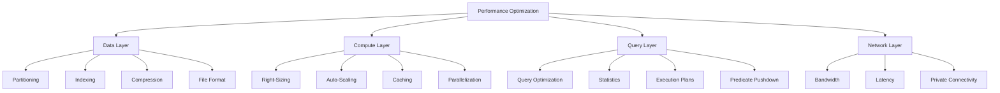

# Performance Optimization Overview

> **🏠 [Home](../../../../README.md)** | **📖 [Documentation](../../../README.md)** | **💡 [Best Practices](../../README.md)** | **⚡ Performance**


> **⚡ Performance Philosophy**
> Performance optimization in Cloud Scale Analytics requires a multi-layered approach spanning query optimization, data organization, resource configuration, and workload management.

## 📋 Table of Contents

- [Overview](#overview)
- [Performance Framework](#performance-framework)
- [General Optimization Strategies](#general-optimization-strategies)
- [Service-Specific Guidance](#service-specific-guidance)
- [Performance Monitoring](#performance-monitoring)
- [Implementation Roadmap](#implementation-roadmap)

## Overview

### Performance Optimization Layers



### Performance Impact Matrix

| Optimization Technique | Implementation Effort | Performance Gain | Cost Impact |
|------------------------|----------------------|------------------|-------------|
| Data Partitioning | Medium | 40-70% | Neutral |
| Query Optimization | Low-Medium | 50-80% | Positive (lower costs) |
| Result Caching | Low | 60-90% | Positive |
| Columnstore Indexes | Low | 30-50% | Neutral |
| Compute Right-Sizing | Low | 20-40% | Positive/Neutral |
| File Format Optimization | Medium | 60-70% | Positive |

## Performance Framework

### 1. Establish Performance Baseline

**Define Performance SLOs:**

| Metric | Target | Measurement |
|--------|--------|-------------|
| Query Response Time (p95) | < 3 seconds | Azure Monitor |
| ETL Job Duration | < 2 hours | Pipeline metrics |
| Dashboard Load Time | < 5 seconds | Application logs |
| Data Freshness | < 15 minutes | Custom metrics |
| Concurrent Users | 100+ | Connection metrics |

**Baseline Measurement Script:**

```sql
-- Capture query performance baseline
CREATE TABLE query_performance_baseline (
    query_id VARCHAR(100),
    query_text VARCHAR(MAX),
    execution_time_ms BIGINT,
    rows_affected BIGINT,
    io_reads BIGINT,
    cpu_time_ms BIGINT,
    execution_date DATETIME DEFAULT GETDATE()
);

-- Insert baseline measurements
INSERT INTO query_performance_baseline
SELECT
    query_id,
    query_text,
    total_elapsed_time as execution_time_ms,
    row_count as rows_affected,
    logical_reads as io_reads,
    cpu_time as cpu_time_ms,
    start_time as execution_date
FROM sys.dm_pdw_exec_requests
WHERE status = 'Completed'
AND submit_time >= DATEADD(day, -7, GETDATE());
```

### 2. Performance Testing Framework

**Load Testing with Azure Load Testing:**

```yaml
# load-test-config.yaml
version: v0.1
testName: SynapseQueryLoadTest
testPlan: query-load-test.jmx
engineInstances: 5
failureCriteria:
  - avg(response_time_ms) > 3000
  - percentage(error) > 5
autoStop:
  errorPercentage: 10
  timeWindow: 60
```

**JMeter Test Plan Example:**

```xml
<?xml version="1.0" encoding="UTF-8"?>
<jmeterTestPlan version="1.2">
  <hashTree>
    <TestPlan>
      <elementProp name="TestPlan.user_defined_variables">
        <Arguments>
          <Argument>
            <stringProp name="Argument.name">SERVER</stringProp>
            <stringProp name="Argument.value">synapse-workspace.sql.azuresynapse.net</stringProp>
          </Argument>
        </Arguments>
      </elementProp>
    </TestPlan>
  </hashTree>
</jmeterTestPlan>
```

## General Optimization Strategies

### Data Organization

#### 1. Partitioning Strategy

**Partition Design Principles:**

```python
# Delta Lake partitioning example
from pyspark.sql import SparkSession

spark = SparkSession.builder.appName("PartitionOptimization").getOrCreate()

# ✅ GOOD: Partition by date hierarchy
df.write \
    .format("delta") \
    .partitionBy("year", "month", "day") \
    .mode("overwrite") \
    .save("/delta/sales_partitioned")

# Query benefits from partition pruning
filtered_df = spark.read \
    .format("delta") \
    .load("/delta/sales_partitioned") \
    .filter("year = 2024 AND month = 12")
```

**Partition Size Guidelines:**

| Data Volume | Recommended Partition Size | Partition Strategy |
|-------------|---------------------------|-------------------|
| < 1 TB | 1-2 GB per partition | Single column (date) |
| 1-10 TB | 128 MB - 1 GB | Two columns (date + region) |
| > 10 TB | 256 MB - 512 MB | Multi-column (date + region + category) |

#### 2. File Format Optimization

**Format Comparison:**

| Format | Compression Ratio | Query Performance | Write Performance | Use Case |
|--------|------------------|-------------------|-------------------|----------|
| Parquet | 85-90% | Excellent | Good | Analytics, columnar queries |
| ORC | 80-85% | Excellent | Good | Large-scale analytics |
| Delta | 85-90% | Excellent | Excellent | ACID transactions, updates |
| CSV | 0-30% | Poor | Excellent | Data ingestion only |
| JSON | 20-40% | Poor | Good | Semi-structured data |

**Conversion Example:**

```python
# Convert CSV to optimized Parquet
from pyspark.sql.types import *

# Define schema explicitly (faster than inference)
schema = StructType([
    StructField("order_id", IntegerType(), False),
    StructField("customer_id", IntegerType(), False),
    StructField("order_date", DateType(), False),
    StructField("amount", DecimalType(10, 2), False)
])

# Read CSV with schema
df = spark.read \
    .option("header", "true") \
    .schema(schema) \
    .csv("/raw/orders/*.csv")

# Write as Parquet with compression
df.write \
    .format("parquet") \
    .option("compression", "snappy") \
    .mode("overwrite") \
    .save("/optimized/orders")

# Verify improvement
print(f"CSV Size: {get_folder_size('/raw/orders')} MB")
print(f"Parquet Size: {get_folder_size('/optimized/orders')} MB")
```

### Query Optimization

#### 1. Statistics Management

**Create and Update Statistics:**

```sql
-- Dedicated SQL Pool: Create statistics
CREATE STATISTICS stats_order_date ON sales(order_date);
CREATE STATISTICS stats_customer_id ON sales(customer_id);
CREATE STATISTICS stats_product_id ON sales(product_id);

-- Update statistics after data loads
UPDATE STATISTICS sales;

-- View statistics information
SELECT
    sm.name AS schema_name,
    tb.name AS table_name,
    st.name AS stats_name,
    st.stats_id,
    st.auto_created,
    st.user_created
FROM sys.stats st
JOIN sys.tables tb ON st.object_id = tb.object_id
JOIN sys.schemas sm ON tb.schema_id = sm.schema_id
WHERE tb.name = 'sales';
```

#### 2. Query Pattern Optimization

**Avoid Common Anti-Patterns:**

```sql
-- ❌ BAD: SELECT *
SELECT * FROM large_table;

-- ✅ GOOD: Explicit column selection
SELECT customer_id, order_date, total_amount
FROM large_table;

-- ❌ BAD: Non-SARGable predicates
SELECT * FROM orders
WHERE YEAR(order_date) = 2024;

-- ✅ GOOD: SARGable predicates
SELECT * FROM orders
WHERE order_date >= '2024-01-01'
AND order_date < '2025-01-01';

-- ❌ BAD: Scalar subqueries
SELECT customer_id,
       (SELECT COUNT(*) FROM orders o WHERE o.customer_id = c.customer_id) as order_count
FROM customers c;

-- ✅ GOOD: JOIN with aggregation
SELECT c.customer_id,
       COUNT(o.order_id) as order_count
FROM customers c
LEFT JOIN orders o ON c.customer_id = o.customer_id
GROUP BY c.customer_id;
```

### Caching Strategies

#### 1. Result Set Caching

**Dedicated SQL Pool Result Caching:**

```sql
-- Enable result set caching (database level)
ALTER DATABASE sales_db
SET RESULT_SET_CACHING ON;

-- Check if query used cache
SELECT
    request_id,
    command,
    result_cache_hit,
    total_elapsed_time
FROM sys.dm_pdw_exec_requests
WHERE result_cache_hit = 1
ORDER BY end_time DESC;

-- Clear cache for specific query pattern
DBCC DROPCLEANBUFFERS;
DBCC FREEPROCCACHE;
```

#### 2. Spark Caching

**DataFrame Caching:**

```python
from pyspark.sql import SparkSession
from pyspark.storagelevel import StorageLevel

spark = SparkSession.builder.getOrCreate()

# Load and cache frequently used data
customers_df = spark.read \
    .format("delta") \
    .load("/delta/customers")

# Cache with different storage levels
customers_df.persist(StorageLevel.MEMORY_AND_DISK)

# Use cached dataframe in multiple operations
high_value = customers_df.filter("lifetime_value > 10000")
active_users = customers_df.filter("last_login_date > current_date() - 30")

# Unpersist when done
customers_df.unpersist()
```

## Service-Specific Guidance

### Quick Links to Detailed Guides

| Service | Guide | Key Optimizations |
|---------|-------|-------------------|
| **Synapse Analytics** | [Synapse Optimization](./synapse-optimization.md) | SQL Pools, Spark Pools, Pipelines |
| **Streaming Services** | [Streaming Optimization](./streaming-optimization.md) | Event Hubs, Stream Analytics |
| **Data Lake Storage** | [Storage Cost Optimization](../cost-optimization/README.md#storage-cost-optimization) | Partitioning, compression, lifecycle |

## Performance Monitoring

### Azure Monitor Queries

**Query Performance Analysis:**

```kusto
// Synapse Analytics query performance
AzureDiagnostics
| where ResourceProvider == "MICROSOFT.SYNAPSE"
| where Category == "SqlRequests"
| where TimeGenerated > ago(24h)
| extend Duration = todouble(duration_d) / 1000
| summarize
    AvgDuration = avg(Duration),
    P50 = percentile(Duration, 50),
    P95 = percentile(Duration, 95),
    P99 = percentile(Duration, 99),
    Count = count()
by bin(TimeGenerated, 1h), OperationName
| render timechart
```

**Resource Utilization:**

```kusto
// Spark pool resource utilization
AzureDiagnostics
| where ResourceProvider == "MICROSOFT.SYNAPSE"
| where Category == "BigDataPoolAppsEnded"
| extend
    vCoreSeconds = todouble(total_v_core_seconds_d),
    MemoryGB = todouble(total_memory_gb_seconds_d) / 3600,
    Duration = todouble(duration_d) / 1000
| summarize
    TotalvCoreHours = sum(vCoreSeconds) / 3600,
    AvgMemoryGB = avg(MemoryGB),
    JobCount = count()
by bin(TimeGenerated, 1h), ApplicationName
| render columnchart
```

### Performance Dashboard

**Azure Workbook JSON:**

```json
{
  "version": "Notebook/1.0",
  "items": [
    {
      "type": 3,
      "content": {
        "version": "KqlItem/1.0",
        "query": "AzureDiagnostics\n| where ResourceProvider == 'MICROSOFT.SYNAPSE'\n| summarize QueryCount = count() by bin(TimeGenerated, 5m)\n| render timechart",
        "size": 0,
        "title": "Query Volume Over Time"
      }
    },
    {
      "type": 3,
      "content": {
        "version": "KqlItem/1.0",
        "query": "AzureDiagnostics\n| where ResourceProvider == 'MICROSOFT.SYNAPSE'\n| extend Duration = todouble(duration_d) / 1000\n| summarize P95 = percentile(Duration, 95) by bin(TimeGenerated, 5m)\n| render timechart",
        "size": 0,
        "title": "Query Performance (P95)"
      }
    }
  ]
}
```

## Implementation Roadmap

### Phase 1: Quick Wins (Week 1)

- [ ] Create statistics on frequently queried columns
- [ ] Enable result set caching
- [ ] Identify and optimize top 10 slowest queries
- [ ] Review and optimize partition strategy
- [ ] Enable Spark DataFrame caching for reference data

**Expected Impact:** 30-50% performance improvement

### Phase 2: Data Optimization (Weeks 2-4)

- [ ] Convert CSV/JSON to Parquet/Delta
- [ ] Implement partition pruning
- [ ] Optimize file sizes (avoid small files)
- [ ] Create columnstore indexes
- [ ] Implement data compression

**Expected Impact:** 40-60% performance improvement

### Phase 3: Compute Optimization (Month 2)

- [ ] Right-size Spark pools
- [ ] Configure auto-scaling
- [ ] Optimize workload management
- [ ] Implement query concurrency controls
- [ ] Tune Spark configurations

**Expected Impact:** 20-40% performance improvement

### Phase 4: Advanced Optimization (Month 3+)

- [ ] Implement materialized views
- [ ] Set up incremental processing
- [ ] Optimize join strategies
- [ ] Implement adaptive query execution
- [ ] Create performance test suite

**Expected Impact:** 20-30% additional improvement

## Performance Optimization Checklist

### Data Layer

- [ ] Data partitioned by query patterns
- [ ] Using columnar file formats (Parquet/ORC)
- [ ] Files sized between 128 MB - 1 GB
- [ ] Compression enabled
- [ ] Statistics up to date

### Query Layer

- [ ] Explicit column selection (no SELECT *)
- [ ] SARGable predicates
- [ ] Appropriate JOIN types
- [ ] Aggregations pushed down
- [ ] Query plans reviewed

### Compute Layer

- [ ] Resources right-sized
- [ ] Auto-scaling configured
- [ ] Caching implemented
- [ ] Workload management configured
- [ ] Monitoring and alerts set up

### Network Layer

- [ ] Private endpoints configured
- [ ] Co-located resources
- [ ] Bandwidth optimized
- [ ] Compression for data transfer

## Related Resources

- [Synapse Optimization Guide](./synapse-optimization.md)
- [Streaming Optimization Guide](./streaming-optimization.md)
- [Cost Optimization](../cost-optimization/README.md)
- Security Best Practices - Performance with security controls

---

> **⚡ Performance is a Journey**
> Performance optimization is continuous. Regularly review query patterns, monitor resource utilization, and adjust configurations as workloads evolve. Establish quarterly performance reviews to identify new optimization opportunities.
