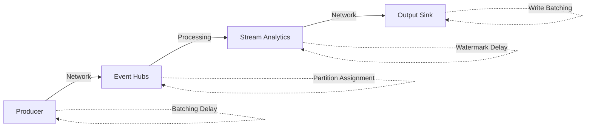

# Streaming Workload Optimization

> **🏠 [Home](../../../../README.md)** | **📖 [Documentation](../../../README.md)** | **💡 [Best Practices](../../README.md)** | **⚡ [Performance](./README.md)** | **🌊 Streaming**


> **🌊 Real-Time Performance Excellence**
> Optimize streaming analytics workloads for low latency, high throughput, and reliable event processing.

## 📋 Table of Contents

- [Event Hubs Optimization](#event-hubs-optimization)
- [Stream Analytics Optimization](#stream-analytics-optimization)
- [End-to-End Latency Optimization](#end-to-end-latency-optimization)
- [Monitoring and Troubleshooting](#monitoring-and-troubleshooting)

## Event Hubs Optimization

### Throughput Units and Partitions

#### Partition Strategy

```bash
# Create Event Hub with optimal partition count
az eventhubs eventhub create \
    --resource-group rg-streaming \
    --namespace-name eventhub-namespace \
    --name telemetry-events \
    --partition-count 32 \
    --message-retention 7 \
    --cleanup-policy Delete

# Enable auto-inflate for throughput units
az eventhubs namespace update \
    --resource-group rg-streaming \
    --name eventhub-namespace \
    --enable-auto-inflate true \
    --maximum-throughput-units 20
```

**Partition Count Guidelines:**

| Expected Throughput | Partition Count | TU Allocation | Use Case |
|---------------------|-----------------|---------------|----------|
| < 1 MB/s | 2-4 | 1-2 | Development, low volume |
| 1-10 MB/s | 8-16 | 2-5 | Standard production |
| 10-50 MB/s | 16-32 | 5-10 | High volume |
| > 50 MB/s | 32+ | 10-20 | Very high volume |

#### Partition Key Selection

```python
from azure.eventhub import EventHubProducerClient, EventData

# ✅ GOOD: Partition by device ID for ordered processing
producer = EventHubProducerClient.from_connection_string(
    conn_str="<connection-string>",
    eventhub_name="telemetry"
)

event_data_batch = producer.create_batch(partition_key="device-001")
event_data_batch.add(EventData("Temperature: 72F"))

# ✅ GOOD: Round-robin for maximum throughput (no ordering required)
event_data_batch = producer.create_batch()  # No partition key
event_data_batch.add(EventData("Log entry"))

# ❌ BAD: Using same partition key for all events (hotspot)
event_data_batch = producer.create_batch(partition_key="default")
```

### Producer Optimization

#### Batching Strategy

```python
from azure.eventhub import EventHubProducerClient, EventData
import asyncio

async def send_events_batched(producer, events):
    """Optimized batch sending"""
    batch_size = 100  # Adjust based on event size

    for i in range(0, len(events), batch_size):
        event_batch = producer.create_batch()

        for event in events[i:i+batch_size]:
            try:
                event_batch.add(EventData(event))
            except ValueError:
                # Batch is full, send and create new batch
                await producer.send_batch(event_batch)
                event_batch = producer.create_batch()
                event_batch.add(EventData(event))

        if len(event_batch) > 0:
            await producer.send_batch(event_batch)

# Example usage
async def main():
    producer = EventHubProducerClient.from_connection_string(
        conn_str="<connection-string>",
        eventhub_name="telemetry"
    )

    events = ["event1", "event2", "event3"]  # Your events
    await send_events_batched(producer, events)

    await producer.close()

asyncio.run(main())
```

### Consumer Optimization

#### Checkpoint Strategy

```python
from azure.eventhub import EventHubConsumerClient
from azure.eventhub.extensions.checkpointstoreblobaio import BlobCheckpointStore

async def on_event(partition_context, event):
    """Process event with optimized checkpointing"""

    # Process event
    process_telemetry(event.body_as_str())

    # Checkpoint every N events (not every event)
    if partition_context.last_enqueued_event_properties:
        if int(event.sequence_number) % 100 == 0:  # Checkpoint every 100 events
            await partition_context.update_checkpoint(event)

# Create consumer with checkpoint store
checkpoint_store = BlobCheckpointStore.from_connection_string(
    conn_str="<storage-connection-string>",
    container_name="checkpoints"
)

consumer = EventHubConsumerClient.from_connection_string(
    conn_str="<eventhub-connection-string>",
    consumer_group="$Default",
    eventhub_name="telemetry",
    checkpoint_store=checkpoint_store
)

# Process events
async with consumer:
    await consumer.receive(
        on_event=on_event,
        starting_position="-1"  # From beginning
    )
```

## Stream Analytics Optimization

### Query Optimization

#### Temporal Joins

```sql
-- ✅ GOOD: Use DATEDIFF to limit join window
SELECT
    t.DeviceId,
    t.Temperature,
    r.Threshold
INTO
    [output-alerts]
FROM
    [telemetry-input] t TIMESTAMP BY EventTime
    JOIN [reference-input] r
    ON t.DeviceId = r.DeviceId
    AND DATEDIFF(minute, t, r) BETWEEN 0 AND 5  -- 5-minute window

-- ❌ BAD: Unbounded join (grows infinitely)
SELECT
    t.DeviceId,
    t.Temperature,
    r.Threshold
FROM
    [telemetry-input] t TIMESTAMP BY EventTime
    JOIN [reference-input] r
    ON t.DeviceId = r.DeviceId
```

#### Window Functions

```sql
-- Tumbling Window (non-overlapping)
SELECT
    DeviceId,
    AVG(Temperature) AS AvgTemp,
    COUNT(*) AS EventCount,
    System.Timestamp() AS WindowEnd
INTO
    [output-aggregated]
FROM
    [telemetry-input] TIMESTAMP BY EventTime
GROUP BY
    DeviceId,
    TumblingWindow(minute, 5)

-- Hopping Window (overlapping, for moving averages)
SELECT
    DeviceId,
    AVG(Temperature) AS MovingAvgTemp
INTO
    [output-moving-avg]
FROM
    [telemetry-input] TIMESTAMP BY EventTime
GROUP BY
    DeviceId,
    HoppingWindow(minute, 10, 5)  -- 10-min window, 5-min hop

-- Sliding Window (continuous)
SELECT
    DeviceId,
    COUNT(*) AS EventsLast10Min
INTO
    [output-sliding]
FROM
    [telemetry-input] TIMESTAMP BY EventTime
GROUP BY
    DeviceId,
    SlidingWindow(minute, 10)
HAVING
    COUNT(*) > 100  -- Alert on high frequency
```

#### Partition Alignment

```sql
-- ✅ GOOD: Partitioned input and output aligned
SELECT
    DeviceId,
    AVG(Temperature) AS AvgTemp
INTO
    [output-partitioned] PARTITION BY DeviceId
FROM
    [input-partitioned] PARTITION BY DeviceId TIMESTAMP BY EventTime
GROUP BY
    DeviceId,
    TumblingWindow(minute, 5)

-- Benefit: Parallel processing per partition
```

### Streaming Units Optimization

```bash
# Scale Stream Analytics job
az stream-analytics job update \
    --resource-group rg-streaming \
    --name streaming-job \
    --streaming-units 12  # Must be multiple of 6 for optimal parallelization
```

**SU Sizing Guidelines:**

| Input Throughput | Query Complexity | Recommended SUs | Parallelization |
|------------------|------------------|-----------------|-----------------|
| < 1 MB/s | Simple (filters, projections) | 3-6 | Low |
| 1-5 MB/s | Medium (aggregations, joins) | 6-12 | Medium |
| 5-20 MB/s | Complex (multiple joins, UDFs) | 12-24 | High |
| > 20 MB/s | Very complex | 24-48 | Very High |

### User-Defined Functions

```javascript
// JavaScript UDF for efficient processing
function parseJSON(jsonString) {
    try {
        return JSON.parse(jsonString);
    } catch (e) {
        return null;
    }
}

// Use in query
SELECT
    DeviceId,
    udf.parseJSON(Payload).temperature AS Temperature,
    udf.parseJSON(Payload).humidity AS Humidity
INTO
    [output-parsed]
FROM
    [input-raw]
WHERE
    udf.parseJSON(Payload) IS NOT NULL
```

## End-to-End Latency Optimization

### Latency Breakdown



### Latency Optimization Techniques

#### 1. Producer-Side Optimization

```python
from azure.eventhub import EventHubProducerClient, EventData
from azure.eventhub.aio import EventHubProducerClient as AsyncProducerClient

# ✅ Low latency: Async send with small batches
async def send_low_latency(producer, event):
    """Optimized for low latency"""
    event_batch = producer.create_batch()
    event_batch.add(EventData(event))
    await producer.send_batch(event_batch)

# ✅ High throughput: Larger batches
async def send_high_throughput(producer, events):
    """Optimized for throughput"""
    event_batch = producer.create_batch()
    for event in events:
        try:
            event_batch.add(EventData(event))
        except ValueError:
            await producer.send_batch(event_batch)
            event_batch = producer.create_batch()
            event_batch.add(EventData(event))
    await producer.send_batch(event_batch)
```

#### 2. Stream Analytics Configuration

```json
{
  "name": "low-latency-job",
  "properties": {
    "compatibilityLevel": "1.2",
    "outputErrorPolicy": "Stop",
    "eventsLateArrivalMaxDelayInSeconds": 5,
    "eventsOutOfOrderMaxDelayInSeconds": 0,
    "eventsOutOfOrderPolicy": "Adjust",
    "outputStartMode": "JobStartTime",
    "streamingUnits": 12
  }
}
```

#### 3. Output Optimization

```sql
-- Configure output for low latency
SELECT
    DeviceId,
    Temperature,
    System.Timestamp() AS ProcessTime
INTO
    [output-cosmosdb]  -- CosmosDB for low-latency writes
FROM
    [input-eventhub]
WHERE
    Temperature > 100

-- For high throughput, batch to Data Lake
SELECT
    DeviceId,
    AVG(Temperature) AS AvgTemp,
    COUNT(*) AS Count
INTO
    [output-datalake]  -- Batched writes
FROM
    [input-eventhub] TIMESTAMP BY EventTime
GROUP BY
    DeviceId,
    TumblingWindow(minute, 1)
```

## Monitoring and Troubleshooting

### Key Metrics

#### Event Hubs Metrics

```bash
# Query Event Hubs metrics
az monitor metrics list \
    --resource "/subscriptions/{sub-id}/resourceGroups/rg-streaming/providers/Microsoft.EventHub/namespaces/eventhub-ns" \
    --metric IncomingMessages OutgoingMessages ThrottledRequests \
    --start-time 2024-01-01T00:00:00Z \
    --end-time 2024-01-01T23:59:59Z \
    --interval PT1M
```

**Key Metrics to Monitor:**

| Metric | Target | Alert Threshold |
|--------|--------|-----------------|
| Incoming Messages/sec | Baseline dependent | > 80% of TU capacity |
| Outgoing Messages/sec | Match incoming | < 90% of incoming |
| Throttled Requests | 0 | > 0 |
| Capture Backlog | 0 | > 1000 events |

#### Stream Analytics Metrics

```kusto
// Stream Analytics watermark delay
AzureDiagnostics
| where ResourceProvider == "MICROSOFT.STREAMANALYTICS"
| where MetricName == "WatermarkDelay"
| summarize
    AvgDelay = avg(Maximum),
    P95Delay = percentile(Maximum, 95)
by bin(TimeGenerated, 5m)
| render timechart
```

### Troubleshooting Queries

```kusto
// Identify processing delays
AzureDiagnostics
| where ResourceProvider == "MICROSOFT.STREAMANALYTICS"
| where Category == "Execution"
| extend Details = parse_json(properties_s)
| extend
    InputEvents = tolong(Details.inputEvents),
    OutputEvents = tolong(Details.outputEvents),
    ProcessingTime = tolong(Details.processingTimeMs)
| summarize
    TotalInput = sum(InputEvents),
    TotalOutput = sum(OutputEvents),
    AvgProcessingTime = avg(ProcessingTime)
by bin(TimeGenerated, 5m)
| where TotalOutput < TotalInput * 0.9  // Output < 90% of input
| render timechart

// Detect backpressure
AzureDiagnostics
| where ResourceProvider == "MICROSOFT.EVENTHUB"
| where MetricName == "IncomingMessages" or MetricName == "OutgoingMessages"
| summarize
    Incoming = sumif(Total, MetricName == "IncomingMessages"),
    Outgoing = sumif(Total, MetricName == "OutgoingMessages")
by bin(TimeGenerated, 1m)
| extend BackpressureRatio = (Incoming - Outgoing) * 100.0 / Incoming
| where BackpressureRatio > 10  // More than 10% backlog
```

## Performance Checklist

### Event Hubs

- [ ] Partition count appropriate for throughput
- [ ] Partition key selected for even distribution
- [ ] Auto-inflate enabled for TUs
- [ ] Producer batching optimized
- [ ] Consumer checkpoint frequency tuned
- [ ] Capture enabled for archival (if needed)

### Stream Analytics

- [ ] Input partitioning aligned with Event Hubs
- [ ] Query optimized (temporal joins bounded)
- [ ] Window functions used appropriately
- [ ] Streaming units scaled for workload
- [ ] Watermark delay monitored
- [ ] Output batching configured

### End-to-End

- [ ] Latency SLOs defined
- [ ] Metrics and alerts configured
- [ ] Error handling implemented
- [ ] Dead letter queue configured
- [ ] Load testing performed
- [ ] Scaling policies defined

## Performance Tuning Examples

### Example: High-Throughput IoT Telemetry

```python
# Producer: Batched sending
from azure.eventhub.aio import EventHubProducerClient
from azure.eventhub import EventData
import asyncio

async def send_telemetry_batch(devices):
    producer = EventHubProducerClient.from_connection_string(
        conn_str="<connection>",
        eventhub_name="telemetry"
    )

    async with producer:
        # Create batches per device for ordering
        for device_id in devices:
            batch = producer.create_batch(partition_key=device_id)

            for reading in get_device_readings(device_id):
                batch.add(EventData(reading))

            await producer.send_batch(batch)

# Stream Analytics: Aggregation with tumbling windows
"""
SELECT
    DeviceId,
    AVG(Temperature) AS AvgTemp,
    MIN(Temperature) AS MinTemp,
    MAX(Temperature) AS MaxTemp,
    COUNT(*) AS ReadingCount
INTO
    [output-aggregated]
FROM
    [input-telemetry] TIMESTAMP BY EventTime
    PARTITION BY DeviceId
GROUP BY
    DeviceId,
    TumblingWindow(minute, 5)
"""
```

### Example: Low-Latency Alerting

```sql
-- Stream Analytics: Real-time anomaly detection
WITH Baseline AS (
    SELECT
        DeviceId,
        AVG(Temperature) AS AvgTemp,
        STDEV(Temperature) AS StdDevTemp
    FROM
        [input-telemetry] TIMESTAMP BY EventTime
    GROUP BY
        DeviceId,
        TumblingWindow(hour, 1)
)
SELECT
    t.DeviceId,
    t.Temperature,
    b.AvgTemp,
    b.StdDevTemp,
    ABS(t.Temperature - b.AvgTemp) / b.StdDevTemp AS ZScore,
    System.Timestamp() AS AlertTime
INTO
    [output-alerts]
FROM
    [input-telemetry] t TIMESTAMP BY EventTime
    JOIN Baseline b ON t.DeviceId = b.DeviceId
    AND DATEDIFF(minute, b, t) BETWEEN 0 AND 5
WHERE
    ABS(t.Temperature - b.AvgTemp) / b.StdDevTemp > 3  -- 3 sigma threshold
```

---

> **🌊 Streaming Performance is Critical**
> Monitor latency metrics continuously, test under peak loads, and have scaling policies ready. Real-time systems require proactive monitoring and rapid response to performance issues.
