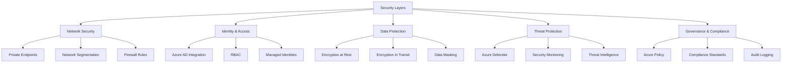

# Security Best Practices

> **🏠 [Home](../../../../README.md)** | **📖 [Documentation](../../../README.md)** | **💡 [Best Practices](../../README.md)** | **🔒 Security**


> **🔒 Security-First Approach**
> Security must be foundational, not an afterthought. Implement defense-in-depth across network, identity, data, and application layers.

## 📋 Table of Contents

- [Security Framework](#security-framework)
- [Network Security](#network-security)
- [Identity and Access Management](#identity-and-access-management)
- [Data Protection](#data-protection)
- [Threat Protection and Monitoring](#threat-protection-and-monitoring)
- [Compliance and Governance](#compliance-and-governance)
- [Security Checklist](#security-checklist)

## Security Framework

### Defense-in-Depth Layers



## Network Security

### Private Endpoints

**Eliminate Public Internet Exposure:**

```bash
# Create private endpoint for Synapse workspace
az network private-endpoint create \
    --name pe-synapse-sql \
    --resource-group rg-synapse \
    --vnet-name vnet-synapse \
    --subnet subnet-private-endpoints \
    --private-connection-resource-id "/subscriptions/{sub-id}/resourceGroups/rg-synapse/providers/Microsoft.Synapse/workspaces/synapse-workspace" \
    --group-id Sql \
    --connection-name synapse-sql-connection

# Create private DNS zone
az network private-dns zone create \
    --resource-group rg-synapse \
    --name privatelink.sql.azuresynapse.net

# Link DNS zone to VNet
az network private-dns link vnet create \
    --resource-group rg-synapse \
    --zone-name privatelink.sql.azuresynapse.net \
    --name synapse-dns-link \
    --virtual-network vnet-synapse \
    --registration-enabled false

# Create private DNS zone group
az network private-endpoint dns-zone-group create \
    --resource-group rg-synapse \
    --endpoint-name pe-synapse-sql \
    --name synapse-zone-group \
    --private-dns-zone privatelink.sql.azuresynapse.net \
    --zone-name sql
```

### Network Segmentation

```bash
# Create network security group
az network nsg create \
    --resource-group rg-synapse \
    --name nsg-synapse-private

# Allow inbound from application subnet only
az network nsg rule create \
    --resource-group rg-synapse \
    --nsg-name nsg-synapse-private \
    --name Allow-AppSubnet-Inbound \
    --priority 100 \
    --source-address-prefixes 10.0.2.0/24 \
    --destination-address-prefixes 10.0.1.0/24 \
    --destination-port-ranges 1433 \
    --protocol Tcp \
    --access Allow \
    --direction Inbound

# Deny all other inbound
az network nsg rule create \
    --resource-group rg-synapse \
    --nsg-name nsg-synapse-private \
    --name Deny-All-Inbound \
    --priority 4096 \
    --source-address-prefixes '*' \
    --destination-address-prefixes '*' \
    --access Deny \
    --direction Inbound

# Associate NSG with subnet
az network vnet subnet update \
    --resource-group rg-synapse \
    --vnet-name vnet-synapse \
    --name subnet-private-endpoints \
    --network-security-group nsg-synapse-private
```

### Firewall Configuration

```bash
# Configure Synapse workspace firewall (allow specific IPs only)
az synapse workspace firewall-rule create \
    --name AllowCorporateNetwork \
    --workspace-name synapse-workspace \
    --resource-group rg-synapse \
    --start-ip-address 203.0.113.0 \
    --end-ip-address 203.0.113.255

# Disable public network access entirely
az synapse workspace update \
    --name synapse-workspace \
    --resource-group rg-synapse \
    --public-network-access Disabled
```

## Identity and Access Management

### Azure AD Integration

```bash
# Set Azure AD admin for Synapse
az synapse sql ad-admin create \
    --workspace-name synapse-workspace \
    --resource-group rg-synapse \
    --display-name "Analytics Admins" \
    --object-id "aaaaaaaa-bbbb-cccc-dddd-eeeeeeeeeeee"

# Disable SQL authentication (Azure AD only)
az synapse workspace update \
    --name synapse-workspace \
    --resource-group rg-synapse \
    --enable-aad-only-auth true
```

### Role-Based Access Control (RBAC)

**Synapse RBAC Roles:**

```bash
# Assign Synapse Administrator role
az synapse role assignment create \
    --workspace-name synapse-workspace \
    --role "Synapse Administrator" \
    --assignee user@company.com

# Assign Synapse SQL Administrator
az synapse role assignment create \
    --workspace-name synapse-workspace \
    --role "Synapse SQL Administrator" \
    --assignee group-sql-admins@company.com

# Assign Synapse Apache Spark Administrator
az synapse role assignment create \
    --workspace-name synapse-workspace \
    --role "Synapse Apache Spark Administrator" \
    --assignee group-data-engineers@company.com

# Assign Synapse Contributor (can run pipelines, notebooks)
az synapse role assignment create \
    --workspace-name synapse-workspace \
    --role "Synapse Contributor" \
    --assignee group-analysts@company.com

# Assign Synapse Artifact Publisher
az synapse role assignment create \
    --workspace-name synapse-workspace \
    --role "Synapse Artifact Publisher" \
    --assignee service-principal-ci-cd
```

**SQL-Level Permissions:**

```sql
-- Create Azure AD user in SQL pool
CREATE USER [user@company.com] FROM EXTERNAL PROVIDER;

-- Create Azure AD group
CREATE USER [analytics-team@company.com] FROM EXTERNAL PROVIDER;

-- Grant database roles
ALTER ROLE db_datareader ADD MEMBER [user@company.com];
ALTER ROLE db_datawriter ADD MEMBER [analytics-team@company.com];

-- Grant schema permissions
GRANT SELECT, INSERT, UPDATE ON SCHEMA::sales TO [analytics-team@company.com];

-- Column-level security
GRANT SELECT ON sales.customers(customer_id, name) TO [analysts@company.com];
DENY SELECT ON sales.customers(ssn, credit_card) TO [analysts@company.com];
```

### Managed Identities

```bash
# Enable system-assigned managed identity for Synapse
az synapse workspace update \
    --name synapse-workspace \
    --resource-group rg-synapse \
    --assign-identity

# Grant managed identity access to Data Lake
az role assignment create \
    --assignee-object-id $(az synapse workspace show --name synapse-workspace --resource-group rg-synapse --query identity.principalId -o tsv) \
    --assignee-principal-type ServicePrincipal \
    --role "Storage Blob Data Contributor" \
    --scope "/subscriptions/{sub-id}/resourceGroups/rg-synapse/providers/Microsoft.Storage/storageAccounts/datalake"

# Use managed identity in linked service
# (Configure in Synapse Studio - no secrets needed)
```

## Data Protection

### Encryption at Rest

```bash
# Enable customer-managed key (CMK) for Synapse workspace
az synapse workspace key create \
    --workspace-name synapse-workspace \
    --resource-group rg-synapse \
    --name workspace-encryption-key \
    --key-vault-url https://keyvault-synapse.vault.azure.net/keys/synapse-key/version

az synapse workspace update \
    --name synapse-workspace \
    --resource-group rg-synapse \
    --encryption-key workspace-encryption-key

# Enable encryption for Data Lake
az storage account update \
    --name datalakestorage \
    --resource-group rg-synapse \
    --encryption-key-source Microsoft.Keyvault \
    --encryption-key-vault https://keyvault-synapse.vault.azure.net \
    --encryption-key-name storage-key
```

### Encryption in Transit

```bash
# Require secure transfer for storage
az storage account update \
    --name datalakestorage \
    --resource-group rg-synapse \
    --https-only true \
    --min-tls-version TLS1_2

# Synapse workspace (TLS 1.2 enforced by default)
# Verify in Azure Portal: Synapse > Networking > Minimum TLS version
```

### Data Masking

**Dynamic Data Masking:**

```sql
-- Create table with masked columns
CREATE TABLE customers (
    customer_id INT,
    name VARCHAR(100),
    email VARCHAR(255) MASKED WITH (FUNCTION = 'email()'),
    phone VARCHAR(20) MASKED WITH (FUNCTION = 'partial(1, "XXX-XXX-", 4)'),
    ssn VARCHAR(11) MASKED WITH (FUNCTION = 'default()'),
    credit_card VARCHAR(16) MASKED WITH (FUNCTION = 'partial(0, "XXXX-XXXX-XXXX-", 4)')
);

-- Grant unmask permission to specific users
GRANT UNMASK ON customers TO [data-steward@company.com];

-- Revoke unmask permission
REVOKE UNMASK ON customers TO [analyst@company.com];
```

**Row-Level Security:**

```sql
-- Create security predicate function
CREATE FUNCTION dbo.fn_security_predicate(@region VARCHAR(50))
RETURNS TABLE
WITH SCHEMABINDING
AS
RETURN
    SELECT 1 AS access_result
    WHERE @region = USER_NAME()
    OR IS_MEMBER('db_owner') = 1;

-- Create security policy
CREATE SECURITY POLICY region_filter
ADD FILTER PREDICATE dbo.fn_security_predicate(region)
ON dbo.sales
WITH (STATE = ON);

-- Users now only see their region's data
-- User "US-EAST" sees only region = 'US-EAST'
```

### Sensitive Data Discovery

```bash
# Enable Microsoft Purview for data discovery
az purview account create \
    --resource-group rg-governance \
    --name purview-analytics \
    --location eastus \
    --managed-resource-group-name purview-managed-rg

# Scan Synapse workspace
# (Configure in Purview Studio)
```

## Threat Protection and Monitoring

### Azure Defender for SQL

```bash
# Enable Azure Defender
az security pricing create \
    --name SqlServers \
    --tier Standard

# Configure advanced threat protection
az synapse sql pool threat-policy update \
    --workspace-name synapse-workspace \
    --sql-pool-name sql-pool \
    --resource-group rg-synapse \
    --state Enabled \
    --email-addresses security@company.com \
    --email-account-admins Enabled
```

### Vulnerability Assessment

```bash
# Enable vulnerability assessment
az synapse sql pool audit-policy update \
    --workspace-name synapse-workspace \
    --sql-pool-name sql-pool \
    --resource-group rg-synapse \
    --state Enabled \
    --storage-account datalakestorage \
    --storage-key $(az storage account keys list --account-name datalakestorage --query '[0].value' -o tsv)

# Run assessment
# (Use Azure Portal or PowerShell to trigger scans)
```

### Security Monitoring

```kusto
// Detect suspicious login attempts
AzureDiagnostics
| where ResourceProvider == "MICROSOFT.SYNAPSE"
| where Category == "SqlSecurityAuditEvents"
| where action_name_s == "LOGIN FAILED"
| summarize FailedAttempts = count() by client_ip_s, server_principal_name_s, bin(TimeGenerated, 5m)
| where FailedAttempts > 5
| order by FailedAttempts desc

// Monitor privileged operations
AzureDiagnostics
| where ResourceProvider == "MICROSOFT.SYNAPSE"
| where Category == "SqlSecurityAuditEvents"
| where statement_s contains "GRANT" or statement_s contains "ALTER ROLE"
| project TimeGenerated, server_principal_name_s, statement_s, client_ip_s
```

## Compliance and Governance

### Azure Policy

```bash
# Assign built-in policy: Require private endpoints
az policy assignment create \
    --name require-private-endpoints \
    --display-name "Synapse workspaces should use private endpoints" \
    --policy "/providers/Microsoft.Authorization/policyDefinitions/72d11df1-dd8a-41f7-8925-b05b960ebafc" \
    --scope "/subscriptions/{sub-id}/resourceGroups/rg-synapse"

# Assign policy: Require encryption
az policy assignment create \
    --name require-cmk-encryption \
    --display-name "Synapse workspaces should use customer-managed keys" \
    --policy "/providers/Microsoft.Authorization/policyDefinitions/f7d52b2d-e161-4dfa-a82b-55e564167385" \
    --scope "/subscriptions/{sub-id}/resourceGroups/rg-synapse"
```

### Audit Logging

```bash
# Enable diagnostic settings
az monitor diagnostic-settings create \
    --name synapse-audit-logs \
    --resource "/subscriptions/{sub-id}/resourceGroups/rg-synapse/providers/Microsoft.Synapse/workspaces/synapse-workspace" \
    --logs '[{"category":"SqlSecurityAuditEvents","enabled":true},{"category":"BuiltinSqlReqsEnded","enabled":true}]' \
    --workspace "/subscriptions/{sub-id}/resourceGroups/rg-synapse/providers/Microsoft.OperationalInsights/workspaces/log-analytics"
```

## Security Checklist

### Network Security

- [ ] Private endpoints configured for all services
- [ ] Public internet access disabled
- [ ] Network security groups (NSGs) applied
- [ ] Firewall rules minimally scoped
- [ ] VNet integration configured
- [ ] Private DNS zones created

### Identity and Access

- [ ] Azure AD integration enabled
- [ ] SQL authentication disabled
- [ ] RBAC roles assigned (least privilege)
- [ ] Managed identities used (no secrets)
- [ ] Conditional access policies applied
- [ ] MFA enabled for admins

### Data Protection

- [ ] Encryption at rest enabled (TDE)
- [ ] Customer-managed keys (CMK) configured
- [ ] Encryption in transit enforced (TLS 1.2+)
- [ ] Dynamic data masking applied
- [ ] Row-level security implemented
- [ ] Column-level permissions set

### Threat Protection

- [ ] Azure Defender enabled
- [ ] Vulnerability assessment configured
- [ ] Threat detection policies active
- [ ] Security alerts configured
- [ ] Incident response plan documented
- [ ] Penetration testing scheduled

### Compliance and Governance

- [ ] Azure Policy assignments active
- [ ] Audit logging enabled
- [ ] Compliance standards mapped
- [ ] Data classification implemented
- [ ] Retention policies configured
- [ ] Regulatory requirements validated

### Monitoring

- [ ] Security monitoring dashboards created
- [ ] Alert rules configured
- [ ] Log Analytics integration enabled
- [ ] Sentinel integration (if applicable)
- [ ] Security reviews scheduled quarterly
- [ ] Access reviews automated

## Security Incident Response

### Incident Response Runbook

```markdown
## Security Incident Response Process

### Phase 1: Detection and Analysis (0-2 hours)
1. Alert received from Azure Security Center/Defender
2. Triage and prioritize incident severity
3. Contain affected resources (disable accounts, isolate networks)
4. Collect logs and evidence

### Phase 2: Containment and Eradication (2-8 hours)
1. Identify root cause
2. Remove threat actor access
3. Patch vulnerabilities
4. Reset compromised credentials

### Phase 3: Recovery (8-24 hours)
1. Restore affected systems
2. Verify security controls
3. Monitor for re-infection
4. Resume normal operations

### Phase 4: Post-Incident (24-72 hours)
1. Document incident timeline
2. Conduct root cause analysis
3. Update security controls
4. Brief stakeholders
5. Implement lessons learned
```

## Related Resources

- [Cost Optimization](../cost-optimization/README.md)
- [Performance Optimization](../performance/README.md)
- [Disaster Recovery](../../operational-excellence/disaster-recovery.md)
- [Azure Security Center Documentation](https://learn.microsoft.com/azure/security-center/)

---

> **🔒 Security is Continuous**
> Regularly review security configurations, conduct assessments, and update controls based on evolving threats. Security is not a one-time implementation but an ongoing process.
