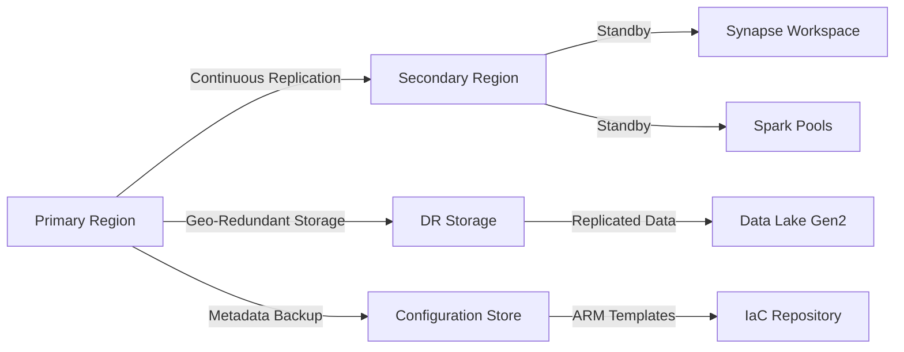

# Disaster Recovery for Analytics Workloads

> **🏠 [Home](../../../README.md)** | **📖 [Documentation](../../README.md)** | **💡 [Best Practices](../README.md)** | **🛡️ Disaster Recovery**


> **🛡️ Business Continuity Strategy**
> Implement comprehensive disaster recovery to ensure analytics workloads remain available and data remains protected during regional failures or service disruptions.

## 📋 Table of Contents

- [DR Strategy Overview](#dr-strategy-overview)
- [RPO and RTO Targets](#rpo-and-rto-targets)
- [Backup Strategies](#backup-strategies)
- [Geo-Redundancy and Replication](#geo-redundancy-and-replication)
- [Failover Procedures](#failover-procedures)
- [DR Testing](#dr-testing)
- [Recovery Procedures](#recovery-procedures)

## DR Strategy Overview

### Disaster Recovery Tiers

| Tier | RTO | RPO | Cost | Use Case |
|------|-----|-----|------|----------|
| **Tier 1 - Critical** | 1-2 hours | 5-15 min | High | Production analytics, real-time dashboards |
| **Tier 2 - Important** | 4-8 hours | 30-60 min | Medium | Business reporting, scheduled ETL |
| **Tier 3 - Standard** | 24-48 hours | 4-12 hours | Low | Historical analysis, dev/test |

### Architecture Patterns



## RPO and RTO Targets

### Azure Synapse Analytics

| Component | RPO Target | RTO Target | DR Strategy |
|-----------|------------|------------|-------------|
| **Dedicated SQL Pool** | 15-30 min | 2-4 hours | Geo-backup restore |
| **Serverless SQL Pool** | N/A (stateless) | 5-15 min | Metadata recreation |
| **Spark Pools** | N/A (stateless) | 15-30 min | Configuration recreation |
| **Pipelines** | 5-15 min | 30-60 min | Git integration, ARM templates |
| **Notebooks** | 5-15 min | 30-60 min | Git integration |

### Data Lake Storage

| Storage Tier | RPO Target | RTO Target | Replication Strategy |
|--------------|------------|------------|---------------------|
| **Hot (Operational)** | 5-15 min | 30-60 min | GRS or GZRS |
| **Cool (Archive)** | 1-4 hours | 4-8 hours | GRS |
| **Archive** | 4-24 hours | 24-48 hours | GRS |

## Backup Strategies

### Dedicated SQL Pool Backups

#### Automatic Backup Configuration

```bash
# Dedicated SQL pools automatically create snapshots
# Retention: 7 days for user-defined restore points

# Create user-defined restore point
az synapse sql pool restore-point create \
    --resource-group rg-synapse \
    --workspace-name synapse-workspace \
    --sql-pool-name sql-pool-prod \
    --name "pre-deployment-snapshot"

# List restore points
az synapse sql pool restore-point list \
    --resource-group rg-synapse \
    --workspace-name synapse-workspace \
    --sql-pool-name sql-pool-prod

# Delete old restore points
az synapse sql pool restore-point delete \
    --resource-group rg-synapse \
    --workspace-name synapse-workspace \
    --sql-pool-name sql-pool-prod \
    --name "old-snapshot"
```

#### Geo-Backup

```powershell
# SQL Pool geo-backups are automatic (enabled by default)
# Retention: 7 days

# Check geo-backup status
Get-AzSynapseSqlPool `
    -ResourceGroupName "rg-synapse" `
    -WorkspaceName "synapse-workspace" `
    -Name "sql-pool-prod" | Select-Object BackupStoragePolicy

# Restore from geo-backup (different region)
Restore-AzSynapseSqlPool `
    -FromBackup `
    -ResourceGroupName "rg-synapse-dr" `
    -WorkspaceName "synapse-workspace-dr" `
    -Name "sql-pool-prod-restored" `
    -PerformanceLevel "DW1000c" `
    -SourceDatabaseId "/subscriptions/{sub-id}/resourceGroups/rg-synapse/providers/Microsoft.Synapse/workspaces/synapse-workspace/sqlPools/sql-pool-prod" `
    -RestorePoint "2024-12-01T10:00:00Z"
```

### Data Lake Backup

#### Geo-Redundant Storage (GRS)

```bash
# Create storage account with GRS
az storage account create \
    --name datalakeprod \
    --resource-group rg-synapse \
    --location eastus \
    --sku Standard_GRS \
    --kind StorageV2 \
    --hierarchical-namespace true \
    --enable-large-file-share

# Verify replication status
az storage account show \
    --name datalakeprod \
    --resource-group rg-synapse \
    --query '{name:name, sku:sku.name, primaryLocation:primaryLocation, secondaryLocation:secondaryLocation}'
```

#### Lifecycle Management for Backups

```json
{
  "rules": [
    {
      "enabled": true,
      "name": "backup-retention-policy",
      "type": "Lifecycle",
      "definition": {
        "actions": {
          "baseBlob": {
            "tierToCool": {
              "daysAfterModificationGreaterThan": 30
            },
            "tierToArchive": {
              "daysAfterModificationGreaterThan": 90
            },
            "delete": {
              "daysAfterModificationGreaterThan": 2555
            }
          },
          "snapshot": {
            "tierToCool": {
              "daysAfterCreationGreaterThan": 30
            },
            "tierToArchive": {
              "daysAfterCreationGreaterThan": 90
            },
            "delete": {
              "daysAfterCreationGreaterThan": 365
            }
          }
        },
        "filters": {
          "blobTypes": ["blockBlob"],
          "prefixMatch": ["backups/", "snapshots/"]
        }
      }
    }
  ]
}
```

### Pipeline and Code Artifacts

#### Git Integration

```bash
# Configure Git integration for Synapse
# (Done via Synapse Studio UI)

# Backup approach: Use Azure DevOps/GitHub

# Clone repository for backup
git clone https://dev.azure.com/org/project/_git/synapse-artifacts

# Automated backup script
#!/bin/bash
BACKUP_DIR="/backups/synapse-artifacts/$(date +%Y%m%d)"
mkdir -p $BACKUP_DIR

# Export ARM templates
az synapse workspace export \
    --name synapse-workspace \
    --resource-group rg-synapse \
    --output-folder $BACKUP_DIR/workspace

# Backup to secondary region storage
az storage blob upload-batch \
    --destination backups \
    --source $BACKUP_DIR \
    --account-name datalakedr \
    --account-key $(az storage account keys list --account-name datalakedr --query '[0].value' -o tsv)
```

## Geo-Redundancy and Replication

### Storage Account Replication

```bash
# Enable Read-Access Geo-Redundant Storage (RA-GRS)
az storage account update \
    --name datalakeprod \
    --resource-group rg-synapse \
    --sku Standard_RAGRS

# Configure for Zone-Redundant Storage (ZRS) + GRS = GZRS
az storage account update \
    --name datalakeprod \
    --resource-group rg-synapse \
    --sku Standard_GZRS

# Verify secondary endpoint is accessible
az storage account show \
    --name datalakeprod \
    --resource-group rg-synapse \
    --query 'secondaryEndpoints'
```

### Cross-Region Data Replication

**AzCopy for Manual Replication:**

```bash
# Replicate critical data to DR region
azcopy copy \
    "https://datalakeprod.dfs.core.windows.net/gold/*?<SAS-token>" \
    "https://datalakedr.dfs.core.windows.net/gold/" \
    --recursive=true \
    --s2s-preserve-access-tier=false
```

**Azure Data Factory for Scheduled Replication:**

```json
{
  "name": "DR-Replication-Pipeline",
  "properties": {
    "activities": [
      {
        "name": "ReplicateToSecondaryRegion",
        "type": "Copy",
        "inputs": [
          {
            "referenceName": "PrimaryDataLake",
            "type": "DatasetReference"
          }
        ],
        "outputs": [
          {
            "referenceName": "SecondaryDataLake",
            "type": "DatasetReference"
          }
        ],
        "typeProperties": {
          "source": {
            "type": "BinarySource",
            "storeSettings": {
              "type": "AzureBlobFSReadSettings",
              "recursive": true
            }
          },
          "sink": {
            "type": "BinarySink",
            "storeSettings": {
              "type": "AzureBlobFSWriteSettings"
            }
          }
        }
      }
    ],
    "triggers": [
      {
        "name": "HourlyReplication",
        "properties": {
          "type": "ScheduleTrigger",
          "recurrence": {
            "frequency": "Hour",
            "interval": 1
          }
        }
      }
    ]
  }
}
```

## Failover Procedures

### Pre-Failover Checklist

- [ ] Verify DR environment is provisioned
- [ ] Confirm data replication is current (check last sync time)
- [ ] Validate DNS records are prepared
- [ ] Review runbook procedures
- [ ] Notify stakeholders of planned failover
- [ ] Test authentication to DR environment

### Failover Runbook

#### 1. Initiate Storage Account Failover

```bash
# Initiate storage account failover to secondary region
# WARNING: This will make secondary region the new primary

az storage account failover \
    --name datalakeprod \
    --resource-group rg-synapse \
    --no-wait

# Monitor failover status
az storage account show \
    --name datalakeprod \
    --resource-group rg-synapse \
    --query 'statusOfPrimary'
```

#### 2. Restore Synapse SQL Pool

```powershell
# Restore SQL pool from geo-backup to DR region
$restorePoint = (Get-AzSynapseSqlPoolRestorePoint `
    -ResourceGroupName "rg-synapse" `
    -WorkspaceName "synapse-workspace" `
    -Name "sql-pool-prod" | Sort-Object RestorePointCreationDate -Descending | Select-Object -First 1).RestorePointCreationDate

Restore-AzSynapseSqlPool `
    -FromBackup `
    -ResourceGroupName "rg-synapse-dr" `
    -WorkspaceName "synapse-workspace-dr" `
    -Name "sql-pool-prod" `
    -PerformanceLevel "DW1000c" `
    -SourceDatabaseId "/subscriptions/{sub-id}/resourceGroups/rg-synapse/providers/Microsoft.Synapse/workspaces/synapse-workspace/sqlPools/sql-pool-prod" `
    -RestorePoint $restorePoint
```

#### 3. Redeploy Synapse Workspace Components

```bash
# Deploy workspace infrastructure in DR region
az deployment group create \
    --resource-group rg-synapse-dr \
    --template-file synapse-workspace.bicep \
    --parameters @synapse-workspace-dr.parameters.json

# Deploy pipelines and notebooks from Git
# (Automated via CI/CD or manual via Synapse Studio)

# Verify deployment
az synapse workspace show \
    --name synapse-workspace-dr \
    --resource-group rg-synapse-dr
```

#### 4. Update DNS and Networking

```bash
# Update Traffic Manager or Front Door to point to DR region
az network traffic-manager endpoint update \
    --resource-group rg-networking \
    --profile-name tm-synapse \
    --name primary-endpoint \
    --type azureEndpoints \
    --target-resource-id "/subscriptions/{sub-id}/resourceGroups/rg-synapse-dr/providers/Microsoft.Synapse/workspaces/synapse-workspace-dr" \
    --endpoint-status Enabled

# Update private DNS records (if applicable)
az network private-dns record-set a update \
    --resource-group rg-networking \
    --zone-name privatelink.sql.azuresynapse.net \
    --name synapse-workspace \
    --set aRecords[0].ipv4Address=10.1.0.5  # DR region private IP
```

#### 5. Validate Failover

```bash
# Test SQL pool connectivity
sqlcmd -S synapse-workspace-dr.sql.azuresynapse.net -U admin -P <password> -Q "SELECT @@VERSION"

# Test Data Lake accessibility
az storage blob list \
    --account-name datalakedr \
    --container-name gold \
    --num-results 10

# Run smoke tests on pipelines
az synapse pipeline create-run \
    --workspace-name synapse-workspace-dr \
    --name validation-pipeline
```

## DR Testing

### Quarterly DR Drill

```markdown
## DR Test Procedure

### Preparation (Week -1)
- [ ] Schedule DR test date/time
- [ ] Notify all stakeholders
- [ ] Review current runbooks
- [ ] Verify DR environment is ready

### Execution (Test Day)
1. **T+0:00** - Declare simulated disaster
2. **T+0:15** - Begin failover procedures
3. **T+1:00** - Complete infrastructure failover
4. **T+2:00** - Restore data and validate
5. **T+3:00** - Run application tests
6. **T+4:00** - Declare DR test complete

### Validation
- [ ] All critical pipelines operational
- [ ] Data accessible in DR region
- [ ] Performance meets SLAs
- [ ] Security controls functional
- [ ] Monitoring and alerting active

### Post-Test (Week +1)
- [ ] Document issues encountered
- [ ] Update runbooks with learnings
- [ ] Brief executive leadership
- [ ] Schedule remediation work
```

### Automated DR Validation

```bash
#!/bin/bash
# dr-validation-test.sh

echo "Starting DR validation..."

# Check storage replication status
REPL_STATUS=$(az storage account show \
    --name datalakeprod \
    --resource-group rg-synapse \
    --query 'geoReplicationStats.status' -o tsv)

if [ "$REPL_STATUS" != "Live" ]; then
    echo "ERROR: Storage replication not live"
    exit 1
fi

# Verify secondary endpoint accessibility
HTTP_CODE=$(curl -s -o /dev/null -w "%{http_code}" \
    "https://datalakeprod-secondary.dfs.core.windows.net/gold?<SAS>")

if [ "$HTTP_CODE" != "200" ]; then
    echo "ERROR: Secondary endpoint not accessible"
    exit 1
fi

# Check SQL pool geo-backup age
LATEST_BACKUP=$(az synapse sql pool restore-point list \
    --resource-group rg-synapse \
    --workspace-name synapse-workspace \
    --sql-pool-name sql-pool-prod \
    --query 'max([].restorePointCreationDate)' -o tsv)

BACKUP_AGE_HOURS=$(( ($(date +%s) - $(date -d "$LATEST_BACKUP" +%s)) / 3600 ))

if [ $BACKUP_AGE_HOURS -gt 24 ]; then
    echo "WARNING: Latest backup is $BACKUP_AGE_HOURS hours old"
fi

echo "DR validation passed"
```

## Recovery Procedures

### Failback to Primary Region

```bash
# 1. Verify primary region is operational
az synapse workspace show \
    --name synapse-workspace \
    --resource-group rg-synapse

# 2. Synchronize data from DR to primary
azcopy sync \
    "https://datalakedr.dfs.core.windows.net/gold?<SAS>" \
    "https://datalakeprod.dfs.core.windows.net/gold?<SAS>" \
    --recursive=true

# 3. Restore SQL pool to primary region
Restore-AzSynapseSqlPool `
    -FromBackup `
    -ResourceGroupName "rg-synapse" `
    -WorkspaceName "synapse-workspace" `
    -Name "sql-pool-prod" `
    -PerformanceLevel "DW1000c" `
    -SourceDatabaseId "/subscriptions/{sub-id}/resourceGroups/rg-synapse-dr/providers/Microsoft.Synapse/workspaces/synapse-workspace-dr/sqlPools/sql-pool-prod"

# 4. Update Traffic Manager to primary
az network traffic-manager endpoint update \
    --resource-group rg-networking \
    --profile-name tm-synapse \
    --name primary-endpoint \
    --target-resource-id "/subscriptions/{sub-id}/resourceGroups/rg-synapse/providers/Microsoft.Synapse/workspaces/synapse-workspace"

# 5. Resume normal operations monitoring
```

## DR Cost Optimization

| Strategy | Description | Cost Savings |
|----------|-------------|--------------|
| **Paused DR Resources** | Keep DR SQL pools paused until needed | 60-80% on compute |
| **GRS vs GZRS** | Use GRS for non-critical data | 20-30% on storage |
| **Lifecycle Management** | Auto-archive old backups | 50-70% on backup storage |
| **Serverless SQL** | Use serverless for DR queries | Pay-per-query model |

## Related Resources

- [Streaming DR Guide](./streaming-dr.md)
- [Security Best Practices](../cross-cutting-concerns/security/README.md)
- [Cost Optimization](../cross-cutting-concerns/cost-optimization/README.md)

---

> **🛡️ DR is Insurance**
> Regular testing, updated runbooks, and automated validation are critical. Hope for the best, but always be prepared for the worst.
