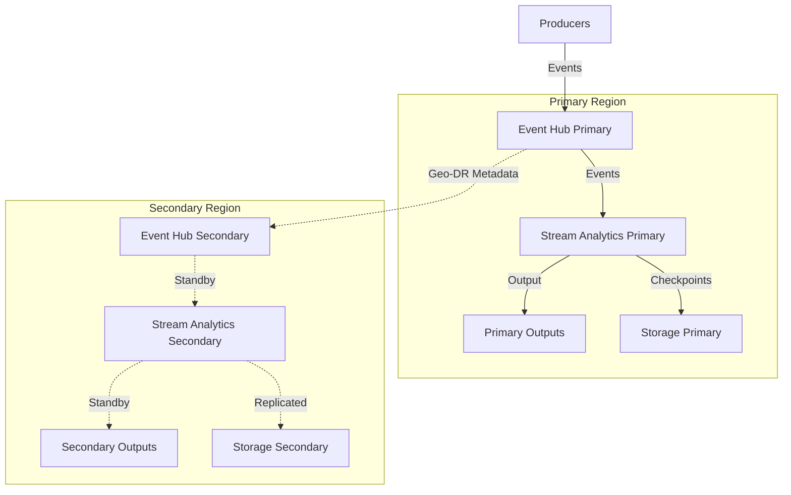

# Disaster Recovery for Streaming Workloads

> **🏠 [Home](../../../README.md)** | **📖 [Documentation](../../README.md)** | **💡 [Best Practices](../README.md)** | **🌊 Streaming DR**


> **🌊 Real-Time Resilience**
> Ensure continuous operation of streaming analytics pipelines with geo-DR, high availability, and automatic failover capabilities.

## 📋 Table of Contents

- [Streaming DR Architecture](#streaming-dr-architecture)
- [Event Hubs Geo-DR](#event-hubs-geo-dr)
- [Stream Analytics High Availability](#stream-analytics-high-availability)
- [Failover Procedures](#failover-procedures)
- [State Management and Recovery](#state-management-and-recovery)
- [Testing and Validation](#testing-and-validation)

## Streaming DR Architecture

### Reference Architecture



### Availability Targets

| Component | SLA | RTO Target | RPO Target | Failover Type |
|-----------|-----|------------|------------|---------------|
| Event Hubs Geo-DR | 99.9% | 5-15 min | 0 (metadata only) | Manual |
| Event Hubs Standard | 99.95% | N/A | Real-time | N/A |
| Stream Analytics | 99.9% | 15-30 min | 5-15 min | Manual |
| Storage (GRS) | 99.99% | 1-2 hours | 15 min | Microsoft-initiated |

## Event Hubs Geo-DR

### Geo-DR Configuration

#### Create Geo-DR Pairing

```bash
# Create primary Event Hubs namespace
az eventhubs namespace create \
    --resource-group rg-streaming-primary \
    --name eventhub-primary \
    --location eastus \
    --sku Standard \
    --capacity 2

# Create secondary Event Hubs namespace
az eventhubs namespace create \
    --resource-group rg-streaming-secondary \
    --name eventhub-secondary \
    --location westus \
    --sku Standard \
    --capacity 2

# Create Geo-DR pairing (alias)
az eventhubs georecovery-alias set \
    --resource-group rg-streaming-primary \
    --namespace-name eventhub-primary \
    --alias eventhub-dr-alias \
    --partner-namespace "/subscriptions/{sub-id}/resourceGroups/rg-streaming-secondary/providers/Microsoft.EventHub/namespaces/eventhub-secondary"

# Verify pairing status
az eventhubs georecovery-alias show \
    --resource-group rg-streaming-primary \
    --namespace-name eventhub-primary \
    --alias eventhub-dr-alias \
    --query '{role:role, partnerNamespace:partnerNamespace, provisioningState:provisioningState}'
```

### Producer Configuration for Geo-DR

```python
from azure.eventhub import EventHubProducerClient, EventData

# Use alias endpoint (automatically routes to active namespace)
ALIAS_CONNECTION_STRING = "Endpoint=sb://eventhub-dr-alias.servicebus.windows.net/..."

producer = EventHubProducerClient.from_connection_string(
    conn_str=ALIAS_CONNECTION_STRING,
    eventhub_name="telemetry"
)

# Implement retry logic for transient failures
from azure.core.exceptions import ServiceBusError
from tenacity import retry, stop_after_attempt, wait_exponential

@retry(
    stop=stop_after_attempt(5),
    wait=wait_exponential(multiplier=1, min=2, max=60)
)
async def send_event_with_retry(event_data):
    """Send event with automatic retry"""
    async with producer:
        batch = producer.create_batch()
        batch.add(EventData(event_data))
        await producer.send_batch(batch)
```

### Consumer Configuration for Geo-DR

```python
from azure.eventhub import EventHubConsumerClient
from azure.eventhub.extensions.checkpointstoreblobaio import BlobCheckpointStore

# Use alias for consumer as well
consumer = EventHubConsumerClient.from_connection_string(
    conn_str=ALIAS_CONNECTION_STRING,
    consumer_group="$Default",
    eventhub_name="telemetry",
    checkpoint_store=BlobCheckpointStore.from_connection_string(
        conn_str=STORAGE_CONNECTION_STRING,
        container_name="checkpoints"
    )
)

async def on_event(partition_context, event):
    """Process events with checkpointing"""
    try:
        # Process event
        await process_telemetry(event.body_as_str())

        # Checkpoint every 100 events
        if int(event.sequence_number) % 100 == 0:
            await partition_context.update_checkpoint(event)

    except Exception as e:
        # Log error but continue processing
        print(f"Error processing event: {e}")

# Start receiving (will automatically reconnect on failover)
async with consumer:
    await consumer.receive(
        on_event=on_event,
        starting_position="-1"
    )
```

## Stream Analytics High Availability

### Job Configuration for HA

#### Geo-Redundant Input Configuration

```json
{
  "name": "input-eventhub-primary",
  "type": "Microsoft.StreamAnalytics/streamingjobs/inputs",
  "properties": {
    "type": "Stream",
    "datasource": {
      "type": "Microsoft.ServiceBus/EventHub",
      "properties": {
        "serviceBusNamespace": "eventhub-dr-alias",
        "eventHubName": "telemetry",
        "consumerGroupName": "$Default",
        "authenticationMode": "Msi"
      }
    },
    "serialization": {
      "type": "Json",
      "properties": {
        "encoding": "UTF8"
      }
    }
  }
}
```

#### Geo-Redundant Output Configuration

```json
{
  "name": "output-cosmos-primary",
  "type": "Microsoft.StreamAnalytics/streamingjobs/outputs",
  "properties": {
    "datasource": {
      "type": "Microsoft.Storage/DocumentDB",
      "properties": {
        "accountId": "cosmosdb-account",
        "accountKey": null,
        "database": "telemetry-db",
        "collectionNamePattern": "events",
        "partitionKey": "deviceId",
        "authenticationMode": "Msi"
      }
    }
  }
}
```

### Active-Passive Stream Analytics Deployment

```bash
# Deploy primary Stream Analytics job
az stream-analytics job create \
    --resource-group rg-streaming-primary \
    --name streaming-job-primary \
    --location eastus \
    --output-error-policy Stop \
    --events-out-of-order-policy Adjust \
    --events-out-of-order-max-delay 5 \
    --data-locale en-US

# Deploy secondary Stream Analytics job (paused)
az stream-analytics job create \
    --resource-group rg-streaming-secondary \
    --name streaming-job-secondary \
    --location westus \
    --output-error-policy Stop \
    --events-out-of-order-policy Adjust \
    --events-out-of-order-max-delay 5 \
    --data-locale en-US

# Start primary job
az stream-analytics job start \
    --resource-group rg-streaming-primary \
    --name streaming-job-primary \
    --output-start-mode JobStartTime
```

## Failover Procedures

### Event Hubs Failover

#### Initiate Planned Failover

```bash
# Break pairing (initiates failover to secondary)
az eventhubs georecovery-alias break-pair \
    --resource-group rg-streaming-primary \
    --namespace-name eventhub-primary \
    --alias eventhub-dr-alias

# Verify secondary is now primary
az eventhubs georecovery-alias show \
    --resource-group rg-streaming-secondary \
    --namespace-name eventhub-secondary \
    --alias eventhub-dr-alias \
    --query 'role'

# Re-create pairing with roles reversed
az eventhubs georecovery-alias set \
    --resource-group rg-streaming-secondary \
    --namespace-name eventhub-secondary \
    --alias eventhub-dr-alias \
    --partner-namespace "/subscriptions/{sub-id}/resourceGroups/rg-streaming-primary/providers/Microsoft.EventHub/namespaces/eventhub-primary"
```

#### Automated Failover Detection

```python
import asyncio
from azure.eventhub import EventHubProducerClient
from azure.core.exceptions import ServiceUnavailableError

async def monitor_and_failover():
    """Monitor Event Hub health and log failover events"""
    while True:
        try:
            # Test connection
            producer = EventHubProducerClient.from_connection_string(
                conn_str=ALIAS_CONNECTION_STRING,
                eventhub_name="telemetry"
            )
            async with producer:
                # Connection successful
                print("Event Hub connection healthy")
                await asyncio.sleep(60)

        except ServiceUnavailableError as e:
            # Connection failed - failover may be in progress
            print(f"Event Hub unavailable: {e}")
            print("Failover may be in progress, will retry...")
            await asyncio.sleep(10)

        except Exception as e:
            print(f"Unexpected error: {e}")
            await asyncio.sleep(30)
```

### Stream Analytics Failover

#### Failover Runbook

```bash
#!/bin/bash
# stream-analytics-failover.sh

echo "Starting Stream Analytics failover..."

# 1. Stop primary job
az stream-analytics job stop \
    --resource-group rg-streaming-primary \
    --name streaming-job-primary

# 2. Start secondary job (with last output time of primary)
LAST_OUTPUT=$(az stream-analytics job show \
    --resource-group rg-streaming-primary \
    --name streaming-job-primary \
    --query 'outputStartTime' -o tsv)

az stream-analytics job start \
    --resource-group rg-streaming-secondary \
    --name streaming-job-secondary \
    --output-start-mode CustomTime \
    --output-start-time "$LAST_OUTPUT"

# 3. Monitor secondary job status
az stream-analytics job show \
    --resource-group rg-streaming-secondary \
    --name streaming-job-secondary \
    --query '{state:jobState, startTime:outputStartTime}'

echo "Failover completed"
```

## State Management and Recovery

### Checkpoint Management

```bash
# Replicate checkpoints to secondary region
# Using GRS storage for checkpoint store
az storage account create \
    --name streamcheckpoints \
    --resource-group rg-streaming-primary \
    --location eastus \
    --sku Standard_GRS \
    --kind StorageV2

# Verify replication status
az storage account show \
    --name streamcheckpoints \
    --resource-group rg-streaming-primary \
    --query '{primaryLocation:primaryLocation, secondaryLocation:secondaryLocation, geoReplicationStats:geoReplicationStats}'
```

### Stream Analytics State Recovery

```bash
# Export job configuration
az stream-analytics job show \
    --resource-group rg-streaming-primary \
    --name streaming-job-primary \
    > streaming-job-config.json

# Deploy to secondary region with same configuration
az stream-analytics job create \
    --resource-group rg-streaming-secondary \
    --name streaming-job-secondary \
    --location westus \
    --definition streaming-job-config.json
```

## Testing and Validation

### DR Drill Procedure

```markdown
## Monthly DR Drill Checklist

### Pre-Test (T-24 hours)
- [ ] Notify stakeholders of test window
- [ ] Verify secondary region resources are deployed
- [ ] Check checkpoint replication lag
- [ ] Document baseline metrics (throughput, latency)

### Test Execution
1. **T+0:00** - Initiate Event Hubs failover
   ```bash
   az eventhubs georecovery-alias break-pair ...
   ```

2. **T+0:05** - Monitor producer reconnection
   - Verify producers connect to secondary
   - Check for message loss (should be zero)

3. **T+0:10** - Failover Stream Analytics
   ```bash
   ./stream-analytics-failover.sh
   ```

4. **T+0:20** - Validate end-to-end flow
   - Send test events
   - Verify output in target systems
   - Check latency metrics

5. **T+0:30** - Measure recovery metrics
   - RTO actual vs target
   - RPO actual vs target
   - Data loss (if any)

### Post-Test
- [ ] Document lessons learned
- [ ] Update runbooks
- [ ] Failback to primary region
- [ ] Resume normal operations
```

### Automated Health Checks

```python
import asyncio
from azure.monitor.query import LogsQueryClient
from azure.identity import DefaultAzureCredential

async def validate_streaming_health():
    """Automated health validation"""
    credential = DefaultAzureCredential()
    client = LogsQueryClient(credential)

    # Query Event Hubs metrics
    eventhub_query = """
    AzureDiagnostics
    | where ResourceProvider == "MICROSOFT.EVENTHUB"
    | where TimeGenerated > ago(5m)
    | summarize
        IncomingMessages = sum(IncomingMessages_d),
        OutgoingMessages = sum(OutgoingMessages_d),
        ThrottledRequests = sum(ThrottledRequests_d)
    """

    # Query Stream Analytics metrics
    streamanalytics_query = """
    AzureDiagnostics
    | where ResourceProvider == "MICROSOFT.STREAMANALYTICS"
    | where TimeGenerated > ago(5m)
    | summarize
        InputEvents = sum(inputEvents_d),
        OutputEvents = sum(outputEvents_d),
        WatermarkDelay = max(watermarkDelay_d)
    """

    # Execute queries and validate
    # (Implementation details omitted for brevity)

    print("Health check completed")

# Run health checks every 5 minutes
asyncio.create_task(validate_streaming_health())
```

## Performance During DR Events

### Minimize Disruption

| Best Practice | Description | Impact |
|---------------|-------------|--------|
| **Use Alias Endpoints** | Clients connect via alias, not direct namespace | Transparent failover |
| **Implement Retry Logic** | Exponential backoff for transient failures | Automatic recovery |
| **Checkpoint Frequently** | Balance between performance and recovery | Faster recovery |
| **Monitor Replication Lag** | Alert on checkpoint storage replication delays | Proactive issue detection |
| **Pre-warm Secondary** | Keep secondary Stream Analytics job deployed | Faster activation |

## Cost Optimization for DR

```bash
# Use serverless Event Hubs for secondary (if suitable)
az eventhubs namespace create \
    --resource-group rg-streaming-secondary \
    --name eventhub-secondary \
    --location westus \
    --sku Standard  # Or Premium for higher throughput

# Keep secondary Stream Analytics job stopped until needed
az stream-analytics job stop \
    --resource-group rg-streaming-secondary \
    --name streaming-job-secondary

# Use lifecycle policies for old checkpoints
# (See disaster-recovery.md for storage lifecycle examples)
```

## Related Resources

- [Analytics DR Guide](./disaster-recovery.md)
- [Streaming Performance Optimization](../cross-cutting-concerns/performance/streaming-optimization.md)
- [Event Hubs Documentation](https://learn.microsoft.com/azure/event-hubs/event-hubs-geo-dr)

---

> **🌊 Streaming Never Stops**
> Real-time systems require real-time resilience. Test failover procedures regularly and monitor continuously to ensure seamless operations during disasters.
