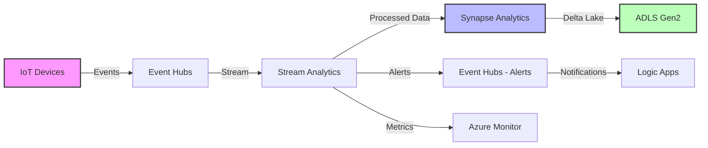

# End-to-End Streaming Data Pipeline

> **🏠 [Home](../../../../README.md)** | **📖 [Documentation](../../../README.md)** | **💻 [Code Examples](../../README.md)** | **🔄 Streaming Pipeline**


Complete implementation of a production-ready streaming data pipeline integrating Azure Event Hubs, Stream Analytics, and Synapse Analytics.

---

## Overview

This example demonstrates a complete streaming analytics solution that:

- **Ingests** real-time telemetry data from IoT devices
- **Processes** streaming data with complex analytics
- **Stores** processed data in Delta Lake format
- **Monitors** pipeline health and performance
- **Alerts** on anomalies and system issues

### Architecture



---

## Table of Contents

- [Architecture Components](#architecture-components)
- [Setup Instructions](#setup-instructions)
- [Event Producer](#event-producer)
- [Data Storage](#data-storage)
- [Monitoring and Alerts](#monitoring-and-alerts)
- [Complete Example](#complete-example)

---

## Architecture Components

### Component Overview

| Component | Purpose | Technology |
|-----------|---------|------------|
| **Event Producers** | Generate telemetry events | Python/IoT SDK |
| **Event Ingestion** | Receive and buffer events | Azure Event Hubs |
| **Stream Processing** | Real-time analytics | Azure Stream Analytics |
| **Data Storage** | Persistent storage | Azure Synapse Analytics |
| **Delta Lake** | Data lake storage | ADLS Gen2 + Delta |
| **Alerting** | Anomaly notifications | Event Hubs + Logic Apps |
| **Monitoring** | Pipeline observability | Azure Monitor |

### Data Flow

1. **IoT devices** send telemetry to Event Hubs
2. **Event Hubs** ingests and partitions events
3. **Stream Analytics** processes events with SQL queries
4. **Processed data** flows to Synapse Analytics
5. **Synapse** stores data in Delta Lake format
6. **Alerts** route to Event Hubs for notification
7. **Metrics** flow to Azure Monitor for observability

---

## Setup Instructions

### Prerequisites

- Azure subscription with appropriate permissions
- Azure CLI installed and configured
- Python 3.8+ for event producer
- Basic understanding of streaming concepts

### Step 1: Create Azure Resources

```bash
#!/bin/bash
# setup-streaming-pipeline.sh
# Script to create all required Azure resources

# Variables
RESOURCE_GROUP="rg-streaming-pipeline"
LOCATION="eastus"
NAMESPACE_NAME="eh-telemetry-ns"
EVENTHUB_NAME="device-telemetry"
ALERT_EVENTHUB_NAME="telemetry-alerts"
SA_JOB_NAME="sa-telemetry-processor"
SYNAPSE_WORKSPACE="synapse-analytics-ws"
STORAGE_ACCOUNT="sttelemetry$(date +%s)"
CONTAINER_NAME="telemetry-data"

echo "Creating Resource Group..."
az group create --name $RESOURCE_GROUP --location $LOCATION

echo "Creating Storage Account..."
az storage account create \
  --name $STORAGE_ACCOUNT \
  --resource-group $RESOURCE_GROUP \
  --location $LOCATION \
  --sku Standard_LRS \
  --kind StorageV2 \
  --enable-hierarchical-namespace true

echo "Creating Container..."
az storage container create \
  --name $CONTAINER_NAME \
  --account-name $STORAGE_ACCOUNT

echo "Creating Event Hubs Namespace..."
az eventhubs namespace create \
  --name $NAMESPACE_NAME \
  --resource-group $RESOURCE_GROUP \
  --location $LOCATION \
  --sku Standard \
  --capacity 2

echo "Creating Event Hubs..."
az eventhubs eventhub create \
  --name $EVENTHUB_NAME \
  --resource-group $RESOURCE_GROUP \
  --namespace-name $NAMESPACE_NAME \
  --partition-count 4 \
  --message-retention 7

az eventhubs eventhub create \
  --name $ALERT_EVENTHUB_NAME \
  --resource-group $RESOURCE_GROUP \
  --namespace-name $NAMESPACE_NAME \
  --partition-count 2 \
  --message-retention 1

echo "Creating Stream Analytics Job..."
az stream-analytics job create \
  --resource-group $RESOURCE_GROUP \
  --name $SA_JOB_NAME \
  --location $LOCATION \
  --output-error-policy Drop \
  --events-outoforder-policy Adjust \
  --streaming-units 3

echo "Creating Synapse Workspace..."
az synapse workspace create \
  --name $SYNAPSE_WORKSPACE \
  --resource-group $RESOURCE_GROUP \
  --storage-account $STORAGE_ACCOUNT \
  --file-system $CONTAINER_NAME \
  --sql-admin-login-user sqladmin \
  --sql-admin-login-password "P@ssw0rd123!" \
  --location $LOCATION

echo "Creating Spark Pool..."
az synapse spark pool create \
  --name sparkpool \
  --workspace-name $SYNAPSE_WORKSPACE \
  --resource-group $RESOURCE_GROUP \
  --spark-version 3.3 \
  --node-count 3 \
  --node-size Medium

echo "✅ All resources created successfully!"
```

### Step 2: Configure Stream Analytics

Create the Stream Analytics query file `telemetry-processing.asaql`:

```sql
-- =====================================================
-- Telemetry Processing Stream Analytics Query
-- =====================================================

-- Input: device-telemetry Event Hub
-- Outputs: Synapse Analytics, Alert Event Hub

-- =====================================================
-- 1. Real-Time Aggregation
-- =====================================================
WITH AggregatedTelemetry AS (
    SELECT
        DeviceId,
        Location,
        DeviceType,
        COUNT(*) AS EventCount,
        AVG(Temperature) AS AvgTemperature,
        MIN(Temperature) AS MinTemperature,
        MAX(Temperature) AS MaxTemperature,
        AVG(Humidity) AS AvgHumidity,
        AVG(Pressure) AS AvgPressure,
        System.Timestamp() AS WindowEndTime
    FROM
        [device-telemetry] TIMESTAMP BY EventEnqueuedUtcTime
    GROUP BY
        DeviceId,
        Location,
        DeviceType,
        TumblingWindow(minute, 5)
)

-- Write aggregated data to Synapse
SELECT
    DeviceId,
    Location,
    DeviceType,
    EventCount,
    AvgTemperature,
    MinTemperature,
    MaxTemperature,
    AvgHumidity,
    AvgPressure,
    WindowEndTime
INTO
    [synapse-output]
FROM
    AggregatedTelemetry;

-- =====================================================
-- 2. Anomaly Detection
-- =====================================================
WITH TemperatureAnomalies AS (
    SELECT
        DeviceId,
        Location,
        Temperature,
        System.Timestamp() AS EventTime,
        LAG(Temperature, 1) OVER (
            PARTITION BY DeviceId
            LIMIT DURATION(minute, 5)
        ) AS PrevTemperature
    FROM
        [device-telemetry] TIMESTAMP BY EventEnqueuedUtcTime
),
DetectedAnomalies AS (
    SELECT
        DeviceId,
        Location,
        Temperature,
        PrevTemperature,
        (Temperature - PrevTemperature) AS TempDelta,
        EventTime
    FROM
        TemperatureAnomalies
    WHERE
        ABS(Temperature - PrevTemperature) > 15.0  -- Sudden change
        OR Temperature > 80.0                       -- Critical threshold
        OR Temperature < 0.0
)

-- Send alerts to Event Hub
SELECT
    DeviceId,
    Location,
    Temperature,
    PrevTemperature,
    TempDelta,
    EventTime,
    'TemperatureAnomaly' AS AlertType,
    CASE
        WHEN Temperature > 80.0 THEN 'Critical'
        WHEN ABS(TempDelta) > 20.0 THEN 'High'
        ELSE 'Medium'
    END AS Severity
INTO
    [alert-eventhub]
FROM
    DetectedAnomalies;

-- =====================================================
-- 3. Device Health Monitoring
-- =====================================================
WITH DeviceMetrics AS (
    SELECT
        DeviceId,
        Location,
        COUNT(*) AS MessageCount,
        AVG(BatteryLevel) AS AvgBattery,
        AVG(SignalStrength) AS AvgSignal,
        System.Timestamp() AS WindowEnd
    FROM
        [device-telemetry] TIMESTAMP BY EventEnqueuedUtcTime
    GROUP BY
        DeviceId,
        Location,
        TumblingWindow(minute, 10)
),
UnhealthyDevices AS (
    SELECT
        DeviceId,
        Location,
        MessageCount,
        AvgBattery,
        AvgSignal,
        WindowEnd
    FROM
        DeviceMetrics
    WHERE
        MessageCount < 10              -- Low message rate
        OR AvgBattery < 20.0          -- Low battery
        OR AvgSignal < -80.0          -- Poor signal
)

-- Alert on unhealthy devices
SELECT
    DeviceId,
    Location,
    MessageCount,
    AvgBattery,
    AvgSignal,
    WindowEnd,
    'DeviceHealth' AS AlertType,
    CASE
        WHEN AvgBattery < 10.0 THEN 'Critical'
        WHEN MessageCount < 5 THEN 'High'
        ELSE 'Medium'
    END AS Severity
INTO
    [alert-eventhub]
FROM
    UnhealthyDevices;
```

---

## Event Producer

### Python Event Producer

```python
"""
IoT Device Telemetry Simulator
Generates realistic telemetry data and sends to Event Hubs
"""

import asyncio
import json
import random
import os
from datetime import datetime, timedelta
from typing import List, Dict
from azure.eventhub.aio import EventHubProducerClient
from azure.eventhub import EventData

class IoTDeviceSimulator:
    """Simulates IoT device telemetry"""

    def __init__(self, device_id: str, location: str, device_type: str):
        self.device_id = device_id
        self.location = location
        self.device_type = device_type
        self.temperature = 25.0  # Base temperature
        self.humidity = 60.0     # Base humidity
        self.pressure = 1013.25  # Base pressure in hPa
        self.battery_level = 100.0
        self.signal_strength = -65.0

    def generate_telemetry(self) -> Dict:
        """Generate realistic telemetry data"""

        # Simulate gradual changes and occasional spikes
        self.temperature += random.uniform(-0.5, 0.5)
        self.humidity += random.uniform(-1.0, 1.0)
        self.pressure += random.uniform(-0.1, 0.1)
        self.battery_level -= random.uniform(0.01, 0.05)
        self.signal_strength += random.uniform(-2.0, 2.0)

        # Occasional anomalies (5% chance)
        if random.random() < 0.05:
            self.temperature += random.uniform(-20, 20)

        # Keep values in realistic ranges
        self.temperature = max(-10, min(50, self.temperature))
        self.humidity = max(0, min(100, self.humidity))
        self.pressure = max(950, min(1050, self.pressure))
        self.battery_level = max(0, min(100, self.battery_level))
        self.signal_strength = max(-100, min(-50, self.signal_strength))

        return {
            "DeviceId": self.device_id,
            "Location": self.location,
            "DeviceType": self.device_type,
            "Temperature": round(self.temperature, 2),
            "Humidity": round(self.humidity, 2),
            "Pressure": round(self.pressure, 2),
            "BatteryLevel": round(self.battery_level, 2),
            "SignalStrength": round(self.signal_strength, 2),
            "Timestamp": datetime.utcnow().isoformat(),
            "EventId": f"{self.device_id}-{datetime.utcnow().timestamp()}"
        }


class TelemetryProducer:
    """Sends telemetry to Event Hubs"""

    def __init__(self, connection_string: str, event_hub_name: str):
        self.connection_string = connection_string
        self.event_hub_name = event_hub_name
        self.devices: List[IoTDeviceSimulator] = []

    def create_devices(self, count: int = 10):
        """Create simulated IoT devices"""
        locations = ["Factory-A", "Factory-B", "Warehouse-1", "Warehouse-2", "Office"]
        device_types = ["Temperature", "Environmental", "HVAC", "Industrial"]

        for i in range(count):
            device = IoTDeviceSimulator(
                device_id=f"device-{i:03d}",
                location=random.choice(locations),
                device_type=random.choice(device_types)
            )
            self.devices.append(device)

        print(f"✅ Created {count} simulated devices")

    async def send_telemetry_batch(self, producer_client: EventHubProducerClient):
        """Send batch of telemetry from all devices"""
        try:
            event_data_batch = await producer_client.create_batch()

            for device in self.devices:
                telemetry = device.generate_telemetry()
                event = EventData(json.dumps(telemetry))
                event.properties = {
                    "DeviceType": device.device_type,
                    "Location": device.location
                }

                try:
                    event_data_batch.add(event)
                except ValueError:
                    # Batch full, send and create new one
                    await producer_client.send_batch(event_data_batch)
                    event_data_batch = await producer_client.create_batch()
                    event_data_batch.add(event)

            # Send remaining events
            if len(event_data_batch) > 0:
                await producer_client.send_batch(event_data_batch)

        except Exception as e:
            print(f"❌ Error sending batch: {str(e)}")

    async def run(self, duration_minutes: int = 60, interval_seconds: int = 5):
        """Run telemetry generation"""
        print(f"🚀 Starting telemetry generation...")
        print(f"   Duration: {duration_minutes} minutes")
        print(f"   Interval: {interval_seconds} seconds")
        print(f"   Devices: {len(self.devices)}")

        async with EventHubProducerClient.from_connection_string(
            conn_str=self.connection_string,
            eventhub_name=self.event_hub_name
        ) as producer:

            end_time = datetime.utcnow() + timedelta(minutes=duration_minutes)
            batch_count = 0

            while datetime.utcnow() < end_time:
                await self.send_telemetry_batch(producer)
                batch_count += 1

                if batch_count % 10 == 0:
                    print(f"📊 Sent {batch_count} batches ({batch_count * len(self.devices)} events)")

                await asyncio.sleep(interval_seconds)

        print(f"✅ Completed! Sent {batch_count} batches")


# Main execution
async def main():
    """Main execution function"""

    # Configuration
    connection_string = os.getenv("EVENT_HUB_CONNECTION_STRING")
    event_hub_name = os.getenv("EVENT_HUB_NAME", "device-telemetry")

    if not connection_string:
        raise ValueError("EVENT_HUB_CONNECTION_STRING environment variable not set")

    # Create and run producer
    producer = TelemetryProducer(connection_string, event_hub_name)
    producer.create_devices(count=20)

    # Run for 1 hour, sending every 5 seconds
    await producer.run(duration_minutes=60, interval_seconds=5)


if __name__ == "__main__":
    asyncio.run(main())
```

---

## Data Storage

### Synapse Spark Notebook - Delta Lake Processing

```python
# =====================================================
# Delta Lake Processing in Synapse Spark
# =====================================================

from pyspark.sql import SparkSession
from pyspark.sql.functions import *
from pyspark.sql.types import *
from delta.tables import DeltaTable

# Initialize Spark session
spark = SparkSession.builder \
    .appName("TelemetryDeltaProcessing") \
    .config("spark.sql.extensions", "io.delta.sql.DeltaSparkSessionExtension") \
    .config("spark.sql.catalog.spark_catalog", "org.apache.spark.sql.delta.catalog.DeltaCatalog") \
    .getOrCreate()

# Storage configuration
storage_account = "<your-storage-account>"
container = "telemetry-data"
base_path = f"abfss://{container}@{storage_account}.dfs.core.windows.net"

# =====================================================
# 1. Create Delta Lake Tables
# =====================================================

# Create database
spark.sql("CREATE DATABASE IF NOT EXISTS telemetry")
spark.sql("USE telemetry")

# Create raw telemetry table
raw_table_path = f"{base_path}/delta/raw_telemetry"

spark.sql(f"""
CREATE TABLE IF NOT EXISTS raw_telemetry (
    EventId STRING,
    DeviceId STRING,
    Location STRING,
    DeviceType STRING,
    Temperature DOUBLE,
    Humidity DOUBLE,
    Pressure DOUBLE,
    BatteryLevel DOUBLE,
    SignalStrength DOUBLE,
    Timestamp TIMESTAMP,
    IngestionTime TIMESTAMP
)
USING DELTA
LOCATION '{raw_table_path}'
PARTITIONED BY (DATE(Timestamp))
""")

# Create aggregated metrics table
agg_table_path = f"{base_path}/delta/aggregated_metrics"

spark.sql(f"""
CREATE TABLE IF NOT EXISTS aggregated_metrics (
    DeviceId STRING,
    Location STRING,
    DeviceType STRING,
    WindowStart TIMESTAMP,
    WindowEnd TIMESTAMP,
    EventCount LONG,
    AvgTemperature DOUBLE,
    MinTemperature DOUBLE,
    MaxTemperature DOUBLE,
    AvgHumidity DOUBLE,
    AvgPressure DOUBLE
)
USING DELTA
LOCATION '{agg_table_path}'
PARTITIONED BY (DATE(WindowEnd))
""")

# =====================================================
# 2. Process Streaming Data
# =====================================================

# Read from Event Hub (or Synapse table)
# In this example, we'll read from the Synapse table written by Stream Analytics

raw_df = spark.table("raw_telemetry")

print("📊 Data Statistics:")
raw_df.select(
    count("*").alias("total_events"),
    countDistinct("DeviceId").alias("unique_devices"),
    min("Timestamp").alias("earliest_event"),
    max("Timestamp").alias("latest_event")
).show()

# =====================================================
# 3. Data Quality Checks
# =====================================================

# Identify anomalies
anomalies_df = raw_df.filter(
    (col("Temperature") > 80) | (col("Temperature") < -10) |
    (col("Humidity") > 100) | (col("Humidity") < 0) |
    (col("BatteryLevel") < 10)
).withColumn("AnomalyType",
    when(col("Temperature") > 80, "HighTemp")
    .when(col("Temperature") < -10, "LowTemp")
    .when(col("Humidity") > 100, "InvalidHumidity")
    .when(col("BatteryLevel") < 10, "LowBattery")
    .otherwise("Unknown")
)

print("\n⚠️  Detected Anomalies:")
anomalies_df.groupBy("AnomalyType", "DeviceId") \
    .count() \
    .orderBy(desc("count")) \
    .show()

# =====================================================
# 4. Optimize Delta Tables
# =====================================================

# Optimize raw telemetry table
print("\n🔧 Optimizing raw_telemetry table...")
spark.sql(f"OPTIMIZE telemetry.raw_telemetry ZORDER BY (DeviceId, Timestamp)")

# Vacuum old files (keep 7 days)
print("🧹 Running VACUUM...")
spark.sql(f"VACUUM telemetry.raw_telemetry RETAIN 168 HOURS")

# Update table statistics
print("📈 Updating statistics...")
spark.sql("ANALYZE TABLE telemetry.raw_telemetry COMPUTE STATISTICS")

# =====================================================
# 5. Create Aggregated Views
# =====================================================

# Device summary view
device_summary = raw_df.groupBy("DeviceId", "Location", "DeviceType") \
    .agg(
        count("*").alias("TotalEvents"),
        avg("Temperature").alias("AvgTemperature"),
        avg("Humidity").alias("AvgHumidity"),
        avg("BatteryLevel").alias("AvgBatteryLevel"),
        min("Timestamp").alias("FirstSeen"),
        max("Timestamp").alias("LastSeen")
    )

print("\n📊 Device Summary:")
device_summary.orderBy(desc("TotalEvents")).show(10)

# Save to Delta table
device_summary_path = f"{base_path}/delta/device_summary"
device_summary.write \
    .format("delta") \
    .mode("overwrite") \
    .save(device_summary_path)

print(f"✅ Delta Lake processing complete!")
print(f"   Raw telemetry: {raw_table_path}")
print(f"   Device summary: {device_summary_path}")
```

---

## Monitoring and Alerts

### Azure Monitor Alerts Configuration

```bash
# Create alert for high temperature events
az monitor metrics alert create \
  --name "High Temperature Alert" \
  --resource-group rg-streaming-pipeline \
  --scopes "/subscriptions/<sub-id>/resourceGroups/rg-streaming-pipeline/providers/Microsoft.EventHub/namespaces/eh-telemetry-ns/eventhubs/telemetry-alerts" \
  --condition "count IncomingMessages > 10" \
  --window-size 5m \
  --evaluation-frequency 1m \
  --action-group <action-group-id>

# Create alert for Stream Analytics errors
az monitor metrics alert create \
  --name "Stream Analytics Errors" \
  --resource-group rg-streaming-pipeline \
  --scopes "/subscriptions/<sub-id>/resourceGroups/rg-streaming-pipeline/providers/Microsoft.StreamAnalytics/streamingjobs/sa-telemetry-processor" \
  --condition "count Errors > 5" \
  --window-size 5m \
  --evaluation-frequency 1m \
  --action-group <action-group-id>
```

---

## Complete Example

### Running the Complete Pipeline

1. **Deploy Infrastructure**

```bash
# Run the setup script
chmod +x setup-streaming-pipeline.sh
./setup-streaming-pipeline.sh
```

2. **Start Event Producer**

```bash
# Set environment variables
export EVENT_HUB_CONNECTION_STRING="<your-connection-string>"
export EVENT_HUB_NAME="device-telemetry"

# Install dependencies
pip install azure-eventhub

# Run producer
python iot_device_simulator.py
```

3. **Start Stream Analytics Job**

```bash
# Start the Stream Analytics job
az stream-analytics job start \
  --resource-group rg-streaming-pipeline \
  --name sa-telemetry-processor \
  --output-start-mode JobStartTime
```

4. **Monitor Pipeline**

```bash
# View Stream Analytics metrics
az monitor metrics list \
  --resource "/subscriptions/<sub-id>/resourceGroups/rg-streaming-pipeline/providers/Microsoft.StreamAnalytics/streamingjobs/sa-telemetry-processor" \
  --metric InputEvents,OutputEvents,Errors \
  --interval PT1M

# View Event Hubs metrics
az monitor metrics list \
  --resource "/subscriptions/<sub-id>/resourceGroups/rg-streaming-pipeline/providers/Microsoft.EventHub/namespaces/eh-telemetry-ns" \
  --metric IncomingMessages,OutgoingMessages \
  --interval PT1M
```

5. **Query Results in Synapse**

Connect to Synapse workspace and run queries:

```sql
-- View recent telemetry
SELECT TOP 100 *
FROM telemetry.raw_telemetry
ORDER BY Timestamp DESC;

-- View aggregated metrics
SELECT *
FROM telemetry.aggregated_metrics
WHERE WindowEnd >= DATEADD(hour, -1, GETUTCDATE())
ORDER BY WindowEnd DESC;
```

---

## Performance Metrics

### Expected Throughput

| Component | Metric | Expected Value |
|-----------|--------|----------------|
| Event Hubs | Ingestion Rate | 1000-5000 events/sec |
| Stream Analytics | Processing Latency | < 5 seconds |
| Synapse | Write Throughput | 500-1000 events/sec |
| Delta Lake | Query Latency | < 2 seconds |

### Cost Optimization

- Use **Standard tier** Event Hubs for development
- Start with **3 Streaming Units** for Stream Analytics
- Enable **auto-pause** on Synapse Spark pools
- Implement **data retention** policies

---

## Troubleshooting

### Common Issues

1. **Event Hubs Throttling**
   - Increase throughput units
   - Enable auto-inflate

2. **Stream Analytics Lag**
   - Increase streaming units
   - Optimize query performance
   - Check for data skew

3. **Synapse Write Failures**
   - Verify permissions
   - Check table schema
   - Monitor resource utilization

---

## Next Steps

- [Synapse Examples](../../by-service/synapse/README.md) - Advanced data processing
- [Event Hubs Examples](../../by-service/event-hubs/README.md) - Event streaming patterns
- [Stream Analytics Examples](../../by-service/stream-analytics/README.md) - Query optimization

---

## Additional Resources

- [Architecture Patterns](../../../03-architecture-patterns/README.md)
- [Best Practices](../../../best-practices/README.md)
- [Troubleshooting Guide](../../../troubleshooting/README.md)

---

**Last Updated:** 2025-12-09
**Version:** 1.0.0
**Maintainer:** CSA-in-a-Box Documentation Team
