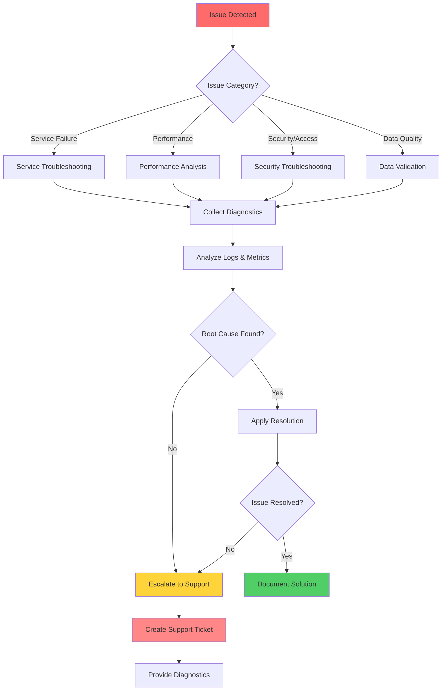
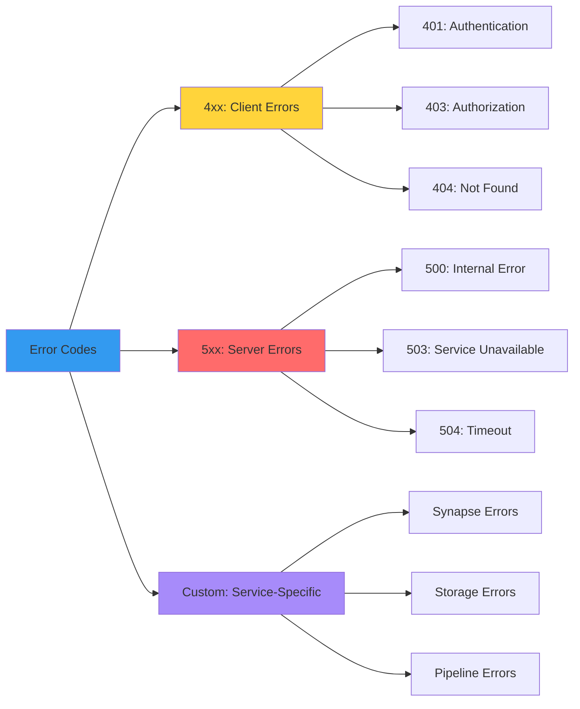
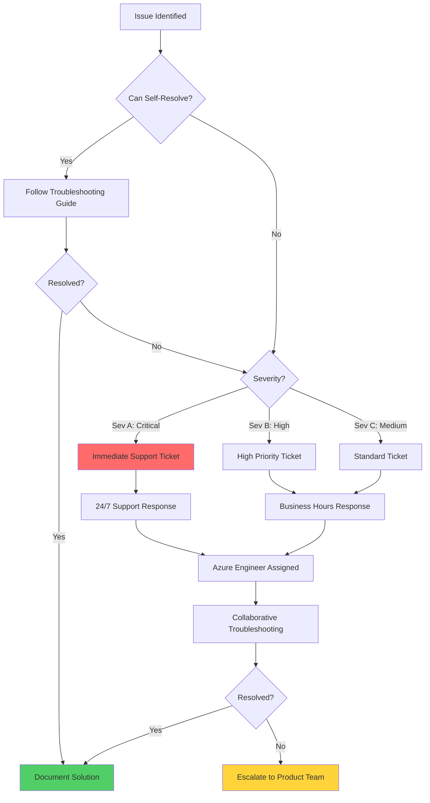

# 🔧 Troubleshooting - CSA in-a-Box

> **🏠 [Home](../../README.md)** | **📖 [Documentation](../README.md)** | **🔧 Troubleshooting**


Comprehensive troubleshooting guides for Cloud Scale Analytics in-a-box, covering diagnostic procedures, error resolution, and Azure support escalation paths.

---

## 📋 Table of Contents

- [Overview](#overview)
- [Troubleshooting Framework](#troubleshooting-framework)
- [Service-Specific Guides](#service-specific-guides)
- [Common Issues](#common-issues)
- [Diagnostic Tools](#diagnostic-tools)
- [Support Escalation](#support-escalation)
- [Related Resources](#related-resources)

---

## 🎯 Overview

This section provides systematic troubleshooting guidance for all Cloud Scale Analytics components, including Azure Synapse Analytics, Azure Data Lake Storage, Azure Data Factory, and related services.

### Quick Navigation

| Category | Description | Guide |
|----------|-------------|-------|
| 🔥 **Service Issues** | Component-specific troubleshooting | [Service Guides](#service-specific-guides) |
| ⚠️ **Common Errors** | Frequently encountered problems | [Common Errors](common-errors.md) |
| 🔒 **Security Issues** | Authentication and authorization | [Security Guide](security-troubleshooting.md) |
| ⚡ **Performance** | Performance degradation issues | [Performance Guide](performance-issues.md) |

---

## 🔍 Troubleshooting Framework

### Systematic Approach

Follow this standardized troubleshooting workflow for all issues:



### Troubleshooting Phases

| Phase | Action | Tools | Output |
|-------|--------|-------|--------|
| 1️⃣ **Detection** | Identify and categorize issue | Monitoring, alerts | Issue classification |
| 2️⃣ **Collection** | Gather diagnostic data | Azure Monitor, logs | Diagnostic package |
| 3️⃣ **Analysis** | Review logs and metrics | Log Analytics, KQL | Root cause hypothesis |
| 4️⃣ **Resolution** | Apply fix or workaround | Azure Portal, scripts | Issue resolution |
| 5️⃣ **Validation** | Verify fix effectiveness | Testing, monitoring | Confirmation |
| 6️⃣ **Documentation** | Record solution | Knowledge base | Solution documentation |

---

## 🔥 Service-Specific Guides

### Azure Synapse Analytics

Comprehensive troubleshooting for Synapse workspace components:

| Component | Common Issues | Guide |
|-----------|---------------|-------|
| 🔥 **Synapse Workspace** | General workspace issues, connectivity | [Synapse README](service-troubleshooting/synapse/README.md) |
| 🌐 **Connectivity** | Network, firewall, private endpoints | [Connectivity Guide](service-troubleshooting/synapse/connectivity.md) |
| 📊 **Query Performance** | SQL pools, Spark pools performance | [Performance Guide](service-troubleshooting/synapse/query-performance.md) |
| ⚙️ **Scaling** | Resource allocation, autoscale issues | [Scaling Guide](service-troubleshooting/synapse/scaling.md) |

### Cross-Service Issues

| Service Integration | Guide |
|---------------------|-------|
| 📁 **Azure Data Lake Storage** | ADLS Troubleshooting |
| 🔄 **Azure Data Factory** | ADF Troubleshooting |
| 🔐 **Azure Key Vault** | Key Vault Issues |
| 📊 **Azure Monitor** | Monitoring Issues |

---

## ⚠️ Common Issues

### Quick Reference Guide

Access common error patterns and solutions:

| Issue Type | Description | Quick Link |
|------------|-------------|------------|
| 🔴 **Common Errors** | Error codes and resolutions | [Common Errors](common-errors.md) |
| 🔒 **Security** | Authentication, authorization failures | Security Guide |
| ⚡ **Performance** | Slow queries, resource exhaustion | Performance Guide |
| 🌐 **Connectivity** | Network and connection problems | [Connectivity](service-troubleshooting/synapse/connectivity.md) |

### Error Code Categories



---

## 🛠️ Diagnostic Tools

### Azure Native Tools

| Tool | Purpose | Access |
|------|---------|--------|
| 📊 **Azure Monitor** | Logs, metrics, alerts | [Azure Portal](https://portal.azure.com) |
| 📈 **Log Analytics** | Query logs with KQL | Workspace > Logs |
| 🔍 **Application Insights** | Application performance monitoring | App Insights resource |
| 🌐 **Network Watcher** | Network diagnostics | Network Watcher |
| 🏥 **Service Health** | Azure service status | Portal > Service Health |

### Common Diagnostic Commands

#### Azure CLI

```bash
# Check resource health
az synapse workspace show --name <workspace-name> --resource-group <rg-name>

# View activity logs
az monitor activity-log list --resource-group <rg-name> --offset 1h

# Check service health
az rest --method get --url "https://management.azure.com/subscriptions/{subscription-id}/providers/Microsoft.ResourceHealth/events?api-version=2022-10-01"
```

#### PowerShell

```powershell
# Get workspace status
Get-AzSynapseWorkspace -Name <workspace-name> -ResourceGroupName <rg-name>

# Check diagnostic settings
Get-AzDiagnosticSetting -ResourceId <resource-id>

# View recent errors
Get-AzActivityLog -ResourceGroupName <rg-name> -StartTime (Get-Date).AddHours(-1) | Where-Object {$_.Level -eq "Error"}
```

#### KQL Queries

```kusto
// Recent errors across all services
AzureDiagnostics
| where TimeGenerated > ago(1h)
| where Level == "Error"
| summarize Count=count() by Resource, Category, OperationName
| order by Count desc

// Failed Synapse operations
SynapseIntegrationPipelineRuns
| where Status == "Failed"
| where TimeGenerated > ago(24h)
| project TimeGenerated, PipelineName, RunId, ErrorMessage
| order by TimeGenerated desc
```

---

## 📊 Diagnostic Data Collection

### Essential Information Checklist

Before opening a support ticket, collect the following:

| Information Type | What to Collect | Why It Matters |
|------------------|-----------------|----------------|
| ⏰ **Timestamp** | Exact time of issue (UTC) | Correlates with logs |
| 🆔 **Resource IDs** | Subscription, resource group, resource name | Identifies affected resources |
| 🔍 **Error Messages** | Full error text, error codes | Provides diagnostic clues |
| 📊 **Activity Logs** | Recent operations and events | Shows sequence of events |
| 📈 **Metrics** | Resource utilization at time of issue | Identifies resource constraints |
| 🔧 **Configuration** | Recent changes to settings | Identifies potential causes |
| 🌐 **Network Info** | Firewall rules, NSGs, routes | For connectivity issues |

### Automated Collection Script

```powershell
# Comprehensive diagnostics collection script
param(
    [Parameter(Mandatory=$true)]
    [string]$WorkspaceName,

    [Parameter(Mandatory=$true)]
    [string]$ResourceGroupName,

    [Parameter(Mandatory=$false)]
    [int]$HoursBack = 24
)

$outputPath = ".\diagnostics_$(Get-Date -Format 'yyyyMMdd_HHmmss')"
New-Item -ItemType Directory -Path $outputPath -Force

# Workspace details
Get-AzSynapseWorkspace -Name $WorkspaceName -ResourceGroupName $ResourceGroupName |
    ConvertTo-Json -Depth 10 | Out-File "$outputPath\workspace.json"

# Activity logs
$startTime = (Get-Date).AddHours(-$HoursBack)
Get-AzActivityLog -ResourceGroupName $ResourceGroupName -StartTime $startTime |
    ConvertTo-Json -Depth 10 | Out-File "$outputPath\activity_logs.json"

# Diagnostic settings
$workspace = Get-AzSynapseWorkspace -Name $WorkspaceName -ResourceGroupName $ResourceGroupName
Get-AzDiagnosticSetting -ResourceId $workspace.Id |
    ConvertTo-Json -Depth 10 | Out-File "$outputPath\diagnostic_settings.json"

Write-Host "Diagnostics collected in: $outputPath"
```

---

## 🚨 Support Escalation

### When to Escalate

Escalate to Azure Support when:

- ✅ Issue persists after following troubleshooting guides
- ✅ Service-level issues affecting multiple components
- ✅ Data loss or corruption suspected
- ✅ Security incident requiring immediate attention
- ✅ Performance degradation without clear cause

### Escalation Path



### Support Ticket Guidelines

#### Severity Definitions

| Severity | Description | Response Time | Example |
|----------|-------------|---------------|---------|
| **Sev A** | Critical business impact, production down | 1 hour | Complete service outage |
| **Sev B** | Significant business impact | 4 hours | Performance degradation affecting users |
| **Sev C** | Minimal business impact | 8 hours | Non-critical feature not working |
| **Sev D** | General guidance | 24 hours | How-to questions |

#### Creating Effective Support Tickets

**Include the following information:**

1. **Problem Summary**
   - Clear, concise description
   - Business impact statement
   - Affected users/services

2. **Timeline**
   - When did issue start?
   - When was it first detected?
   - Any related changes?

3. **Diagnostic Data**
   - Error messages (full text)
   - Resource IDs
   - Activity logs
   - Screenshots

4. **Troubleshooting Performed**
   - Steps already taken
   - Results of each step
   - Current workarounds

5. **Expected vs Actual**
   - What should happen
   - What actually happens
   - Reproduction steps

### Support Resources

| Resource | Purpose | Access |
|----------|---------|--------|
| 🎫 **Azure Support Portal** | Create and manage tickets | [Azure Portal](https://portal.azure.com/#blade/Microsoft_Azure_Support/HelpAndSupportBlade) |
| 📚 **Microsoft Docs** | Official documentation | [docs.microsoft.com](https://docs.microsoft.com/azure) |
| 💬 **Community Forums** | Community support | [Microsoft Q&A](https://docs.microsoft.com/answers) |
| 📧 **Premier Support** | Premium support services | Contact your TAM |

---

## 📚 Related Resources

### Internal Documentation

| Resource | Description |
|----------|-------------|
| [Architecture Overview](../03-architecture-patterns/README.md) | System architecture documentation |
| Monitoring Guide | Monitoring and alerting setup |
| Security Best Practices | Security configuration guidance |
| Performance Optimization | Performance tuning guides |

### External Resources

| Resource | Link |
|----------|------|
| **Azure Status** | [status.azure.com](https://status.azure.com) |
| **Azure Updates** | [azure.microsoft.com/updates](https://azure.microsoft.com/updates) |
| **Azure Architecture Center** | [docs.microsoft.com/azure/architecture](https://docs.microsoft.com/azure/architecture) |
| **Azure Support Plans** | [azure.microsoft.com/support/plans](https://azure.microsoft.com/support/plans) |

---

## 💡 Best Practices

### Proactive Troubleshooting

1. **Monitoring**
   - Configure comprehensive monitoring
   - Set up meaningful alerts
   - Review dashboards regularly

2. **Documentation**
   - Document all configurations
   - Maintain runbooks
   - Record known issues and solutions

3. **Testing**
   - Validate changes in non-production
   - Perform regular DR testing
   - Test monitoring and alerting

4. **Maintenance**
   - Keep systems updated
   - Review and optimize regularly
   - Clean up unused resources

---

> **💡 Tip:** Bookmark this page and the service-specific guides for quick access during troubleshooting scenarios.

**Last Updated:** 2025-12-09
**Version:** 1.0.0
