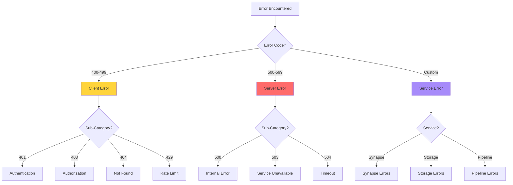
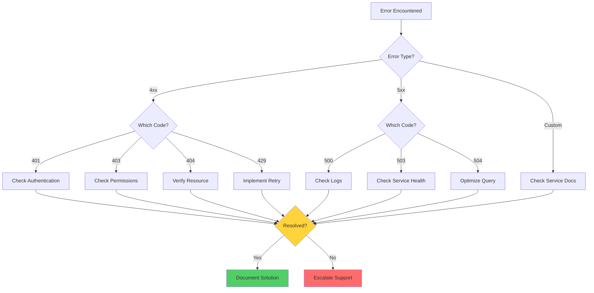

# ⚠️ Common Errors - CSA in-a-Box

> **🏠 [Home](../../README.md)** | **📖 [Documentation](../README.md)** | **🔧 [Troubleshooting](README.md)** | **⚠️ Common Errors**


Comprehensive guide to common error codes, messages, and resolution procedures for Cloud Scale Analytics components.

---

## 📋 Table of Contents

- [Overview](#overview)
- [Error Code Categories](#error-code-categories)
- [Authentication Errors](#authentication-errors)
- [Authorization Errors](#authorization-errors)
- [Resource Errors](#resource-errors)
- [Network Errors](#network-errors)
- [Data Access Errors](#data-access-errors)
- [Query Errors](#query-errors)
- [Pipeline Errors](#pipeline-errors)
- [Error Resolution Matrix](#error-resolution-matrix)

---

## 🎯 Overview

This guide provides quick reference solutions for the most commonly encountered errors in Cloud Scale Analytics environments, organized by error code and category.

### How to Use This Guide

1. **Locate your error code** in the relevant category
2. **Read the error description** to confirm the issue
3. **Follow the resolution steps** in order
4. **Validate the fix** using the provided verification methods

---

## 🔢 Error Code Categories

### Error Code Ranges

| Range | Category | Service Area |
|-------|----------|--------------|
| **400-499** | Client Errors | Request issues, authentication, authorization |
| **500-599** | Server Errors | Service failures, timeouts, internal errors |
| **Custom** | Service-Specific | Azure Synapse, Storage, Data Factory errors |



---

## 🔐 Authentication Errors

### Error 401: Unauthorized

**Error Code:** `401`

**Description:** Authentication credentials are missing, invalid, or expired.

#### Common Causes

| Cause | Symptoms | Resolution Priority |
|-------|----------|-------------------|
| Expired token | "Token has expired" message | High |
| Invalid credentials | "Authentication failed" | High |
| Missing authentication | "Authorization header not found" | High |
| Clock skew | Intermittent auth failures | Medium |

#### Resolution Steps

**1. Verify Token Validity**

```powershell
# Check Azure AD token
$token = Get-AzAccessToken -ResourceUrl "https://database.windows.net/"
$token.ExpiresOn
```

**2. Refresh Credentials**

```bash
# Azure CLI
az login --use-device-code

# Get new access token
az account get-access-token --resource https://database.windows.net/
```

**3. Check Service Principal**

```powershell
# Verify service principal
$sp = Get-AzADServicePrincipal -ApplicationId <app-id>
$sp.PasswordCredentials | Select-Object StartDate, EndDate

# Create new credential if expired
$credential = New-AzADAppCredential -ApplicationId <app-id> -EndDate (Get-Date).AddYears(1)
```

**4. Validate Managed Identity**

```powershell
# Check if managed identity is enabled
$workspace = Get-AzSynapseWorkspace -Name <workspace-name> -ResourceGroupName <rg-name>
$workspace.Identity

# Test managed identity token
$response = Invoke-RestMethod -Uri 'http://169.254.169.254/metadata/identity/oauth2/token?api-version=2018-02-01&resource=https://database.windows.net/' -Method GET -Headers @{Metadata="true"}
$response.access_token
```

#### Verification

```bash
# Test authentication
az synapse workspace show --name <workspace-name> --resource-group <rg-name>
```

---

### Error: Token Signature Verification Failed

**Error Message:** `Token signature verification failed`

**Description:** The authentication token's signature cannot be verified.

#### Resolution Steps

1. **Verify Token Issuer**

```bash
# Decode token at https://jwt.ms
# Check 'iss' claim matches Azure AD tenant
```

2. **Check Time Synchronization**

```powershell
# Verify system time
w32tm /query /status

# Sync time if needed
w32tm /resync
```

3. **Validate Certificate**

```powershell
# Check certificate validity
$cert = Get-ChildItem Cert:\CurrentUser\My | Where-Object {$_.Thumbprint -eq "<thumbprint>"}
$cert.NotBefore
$cert.NotAfter
```

---

## 🚫 Authorization Errors

### Error 403: Forbidden

**Error Code:** `403`

**Description:** Authenticated user lacks permission to perform the requested operation.

#### Common Scenarios

| Scenario | Error Message | Resolution |
|----------|--------------|------------|
| Missing RBAC role | "User does not have permission" | Assign appropriate role |
| Insufficient permissions | "Access denied" | Grant required permissions |
| Resource-level restriction | "Operation not allowed" | Check resource policies |
| Conditional access | "Access blocked by policy" | Review conditional access |

#### Resolution Steps

**1. Check Current Role Assignments**

```powershell
# Get user's roles
$user = Get-AzADUser -UserPrincipalName user@domain.com
Get-AzRoleAssignment -ObjectId $user.Id

# Get service principal's roles
$sp = Get-AzADServicePrincipal -ApplicationId <app-id>
Get-AzRoleAssignment -ObjectId $sp.Id
```

**2. Assign Required Roles**

```powershell
# Synapse Administrator
New-AzRoleAssignment -ObjectId <object-id> `
    -RoleDefinitionName "Synapse Administrator" `
    -Scope "/subscriptions/<subscription-id>/resourceGroups/<rg-name>/providers/Microsoft.Synapse/workspaces/<workspace-name>"

# Storage Blob Data Contributor
$storage = Get-AzStorageAccount -ResourceGroupName <rg-name> -Name <storage-name>
New-AzRoleAssignment -ObjectId <object-id> `
    -RoleDefinitionName "Storage Blob Data Contributor" `
    -Scope $storage.Id
```

**3. Verify Synapse RBAC**

```powershell
# Check Synapse workspace roles
$workspace = Get-AzSynapseWorkspace -Name <workspace-name> -ResourceGroupName <rg-name>

# Assign Synapse workspace role
New-AzSynapseRoleAssignment -WorkspaceName <workspace-name> `
    -RoleDefinitionName "Synapse SQL Administrator" `
    -ObjectId <object-id>
```

**4. Check Access Policies**

```powershell
# For Key Vault
Get-AzKeyVault -VaultName <vault-name> | Select-Object -ExpandProperty AccessPolicies

# Grant Key Vault access
Set-AzKeyVaultAccessPolicy -VaultName <vault-name> `
    -ObjectId <object-id> `
    -PermissionsToSecrets Get,List `
    -PermissionsToKeys Get,List
```

#### Common RBAC Roles

| Role | Scope | Use Case |
|------|-------|----------|
| **Synapse Administrator** | Workspace | Full workspace management |
| **Synapse SQL Administrator** | SQL pools | SQL pool administration |
| **Synapse Apache Spark Administrator** | Spark pools | Spark pool administration |
| **Synapse Contributor** | Workspace | Development and testing |
| **Storage Blob Data Contributor** | Storage | Read/write data access |
| **Storage Blob Data Reader** | Storage | Read-only data access |

---

## 📦 Resource Errors

### Error 404: Resource Not Found

**Error Code:** `404`

**Description:** Requested resource does not exist or has been deleted.

#### Resolution Steps

**1. Verify Resource Exists**

```powershell
# Check if workspace exists
Get-AzSynapseWorkspace -Name <workspace-name> -ResourceGroupName <rg-name>

# List all workspaces in subscription
Get-AzSynapseWorkspace

# Check specific resource
Get-AzResource -ResourceGroupName <rg-name> -Name <resource-name>
```

**2. Check Resource State**

```bash
# Azure CLI
az synapse workspace show --name <workspace-name> --resource-group <rg-name>

# Check provisioning state
az resource show --ids <resource-id> --query "properties.provisioningState"
```

**3. Verify Naming**

```powershell
# Common naming issues
$correctName = "<workspace-name>"  # Check for typos
$correctRG = "<rg-name>"          # Verify resource group name

# Case sensitivity check (for some resources)
Get-AzResource | Where-Object {$_.Name -like "*<partial-name>*"}
```

---

### Error: Resource Quota Exceeded

**Error Message:** `Quota exceeded for resource type`

**Description:** Subscription or resource group has reached quota limits.

#### Resolution Steps

**1. Check Current Quota Usage**

```bash
# View quota usage
az synapse workspace show --name <workspace-name> --resource-group <rg-name> --query "properties.connectivityEndpoints"

# Check subscription limits
az vm list-usage --location <location> -o table
```

**2. Request Quota Increase**

```powershell
# View current quotas
Get-AzVMUsage -Location <location>

# Submit quota increase request via Azure Portal:
# Portal > Subscriptions > Usage + quotas > Request increase
```

**3. Clean Up Unused Resources**

```powershell
# List unused Spark pools
Get-AzSynapseSparkPool -WorkspaceName <workspace-name> -ResourceGroupName <rg-name> |
    Where-Object {$_.ProvisioningState -eq "Succeeded"}

# Delete unused pool
Remove-AzSynapseSparkPool -WorkspaceName <workspace-name> -Name <pool-name> -ResourceGroupName <rg-name>
```

---

## 🌐 Network Errors

### Error: Connection Timeout

**Error Message:** `Connection timeout` or `A network-related or instance-specific error occurred`

**Description:** Unable to establish network connection within timeout period.

#### Resolution Steps

**1. Check Firewall Rules**

```powershell
# View firewall rules
Get-AzSynapseFirewallRule -WorkspaceName <workspace-name> -ResourceGroupName <rg-name>

# Add client IP
$clientIP = (Invoke-WebRequest -uri "https://api.ipify.org/").Content
New-AzSynapseFirewallRule -WorkspaceName <workspace-name> `
    -ResourceGroupName <rg-name> `
    -Name "AllowClientIP" `
    -StartIpAddress $clientIP `
    -EndIpAddress $clientIP
```

**2. Verify Network Connectivity**

```powershell
# Test port connectivity
Test-NetConnection -ComputerName <workspace-name>.sql.azuresynapse.net -Port 1433

# Test DNS resolution
Resolve-DnsName <workspace-name>.sql.azuresynapse.net
```

**3. Check Private Endpoint**

```powershell
# Verify private endpoint
$pe = Get-AzPrivateEndpoint -ResourceGroupName <rg-name> -Name <pe-name>
$pe.ProvisioningState

# Check private DNS zone
Get-AzPrivateDnsZone -ResourceGroupName <rg-name>
```

**4. Review NSG Rules**

```bash
# Check NSG rules
az network nsg show --name <nsg-name> --resource-group <rg-name>

# View effective security rules
az network nic show-effective-nsg --name <nic-name> --resource-group <rg-name>
```

---

### Error 429: Too Many Requests

**Error Code:** `429`

**Description:** Rate limit exceeded for API requests.

#### Resolution Steps

**1. Implement Retry Logic**

```python
import time
from azure.core.exceptions import HttpResponseError

def retry_with_backoff(func, max_retries=3):
    for attempt in range(max_retries):
        try:
            return func()
        except HttpResponseError as e:
            if e.status_code == 429:
                wait_time = 2 ** attempt  # Exponential backoff
                time.sleep(wait_time)
            else:
                raise
    raise Exception("Max retries exceeded")
```

**2. Check Rate Limits**

```powershell
# Review service limits
# https://docs.microsoft.com/azure/synapse-analytics/sql-data-warehouse/sql-data-warehouse-service-capacity-limits

# Monitor request rates in Application Insights
$query = @"
requests
| where timestamp > ago(1h)
| summarize RequestCount = count() by bin(timestamp, 1m)
| order by timestamp desc
"@
```

**3. Optimize Request Patterns**

- Implement caching for frequent queries
- Batch operations where possible
- Use connection pooling
- Implement circuit breaker pattern

---

## 💾 Data Access Errors

### Error: Access Denied to Storage Account

**Error Message:** `This request is not authorized to perform this operation` or `AuthorizationPermissionMismatch`

**Description:** Insufficient permissions to access Azure Storage.

#### Resolution Steps

**1. Verify Storage Permissions**

```powershell
# Check current role assignments on storage account
$storage = Get-AzStorageAccount -ResourceGroupName <rg-name> -Name <storage-name>
Get-AzRoleAssignment -Scope $storage.Id

# Assign Storage Blob Data Contributor
New-AzRoleAssignment -ObjectId <identity-object-id> `
    -RoleDefinitionName "Storage Blob Data Contributor" `
    -Scope $storage.Id
```

**2. Check Storage Account Settings**

```bash
# Verify storage account configuration
az storage account show --name <storage-name> --resource-group <rg-name>

# Check if "Allow trusted Microsoft services" is enabled
az storage account update --name <storage-name> --resource-group <rg-name> --bypass AzureServices
```

**3. Test Access**

```sql
-- Test from Synapse Serverless SQL
SELECT TOP 10 *
FROM OPENROWSET(
    BULK 'https://<storage-name>.dfs.core.windows.net/<container>/<path>/*.parquet',
    FORMAT = 'PARQUET'
) AS [result];
```

**4. Check ACLs (if using ADLS Gen2)**

```bash
# View ACLs
az storage fs access show --path <path> --file-system <container> --account-name <storage-name>

# Set ACL
az storage fs access set --acl "user:<object-id>:rwx" --path <path> --file-system <container> --account-name <storage-name>
```

---

### Error: File Not Found in Storage

**Error Message:** `File not found` or `BlobNotFound`

**Description:** Specified file or directory does not exist in storage.

#### Resolution Steps

**1. Verify Path**

```powershell
# List files in container
$ctx = New-AzStorageContext -StorageAccountName <storage-name> -UseConnectedAccount
Get-AzStorageBlob -Container <container-name> -Context $ctx -Prefix <path>
```

**2. Check File System Case Sensitivity**

```bash
# ADLS Gen2 is case-sensitive
# Verify exact path including case
az storage fs file list --file-system <container> --account-name <storage-name> --path <directory>
```

---

## 📊 Query Errors

### Error: Query Timeout

**Error Message:** `Query timeout expired` or `Execution Timeout Expired`

**Description:** Query execution exceeded the configured timeout period.

#### Resolution Steps

**1. Increase Query Timeout**

```sql
-- Set query timeout (SQL)
SET LOCK_TIMEOUT 600000;  -- 10 minutes in milliseconds

-- Session-level timeout
SET QUERY_TIMEOUT 3600;  -- 1 hour in seconds
```

```python
# Spark configuration
spark.conf.set("spark.sql.broadcastTimeout", "3600")
spark.conf.set("spark.network.timeout", "800s")
```

**2. Optimize Query**

```sql
-- Add appropriate indexes
CREATE STATISTICS stat_name ON table_name (column_name);

-- Use query hints
SELECT * FROM table_name
OPTION (MAXDOP 4);

-- Check execution plan
EXPLAIN SELECT * FROM large_table WHERE condition = 'value';
```

**3. Check Resource Utilization**

```kusto
// Monitor query performance
SynapseSqlPoolExecRequests
| where TimeGenerated > ago(1h)
| where Status == "Timeout"
| summarize Count=count() by QueryText, DurationMs
| order by Count desc
```

---

### Error: Out of Memory

**Error Message:** `OutOfMemoryError` or `Insufficient memory available`

**Description:** Query or operation requires more memory than available.

#### Resolution Steps

**1. Increase Resource Allocation (Spark)**

```python
# Increase executor memory
spark = SparkSession.builder \
    .config("spark.executor.memory", "8g") \
    .config("spark.driver.memory", "4g") \
    .config("spark.memory.fraction", "0.8") \
    .getOrCreate()
```

**2. Optimize Data Processing**

```python
# Use partitioning
df = spark.read.parquet("abfss://container@storage.dfs.core.windows.net/path")
df_partitioned = df.repartition(100)

# Enable adaptive query execution
spark.conf.set("spark.sql.adaptive.enabled", "true")
spark.conf.set("spark.sql.adaptive.coalescePartitions.enabled", "true")
```

**3. Process Data in Batches**

```python
# Read data in chunks
chunk_size = 100000
for chunk in pd.read_csv(file_path, chunksize=chunk_size):
    process_chunk(chunk)
```

---

## 🔄 Pipeline Errors

### Error: Pipeline Run Failed

**Error Message:** Various pipeline-specific errors

**Description:** Azure Data Factory or Synapse pipeline execution failure.

#### Common Pipeline Errors

| Error Code | Description | Common Cause |
|------------|-------------|--------------|
| **2200** | Activity failed | Source/sink configuration |
| **2300** | Timeout | Long-running activity |
| **2400** | Invalid configuration | Missing parameters |
| **2600** | Forbidden | Permission issues |

#### Resolution Steps

**1. Review Pipeline Run Details**

```powershell
# Get pipeline run details
$run = Get-AzSynapsePipelineRun -WorkspaceName <workspace-name> -PipelineRunId <run-id>
$run.Message

# Get activity run details
Get-AzSynapseActivityRun -WorkspaceName <workspace-name> -PipelineRunId <run-id> |
    Select-Object ActivityName, Status, Error
```

**2. Check Activity Configuration**

```bash
# Validate linked service
az synapse linked-service show --workspace-name <workspace-name> --name <linked-service-name>

# Test connection
az synapse linked-service test-connection --workspace-name <workspace-name> --name <linked-service-name>
```

**3. Review Integration Runtime**

```powershell
# Check IR status
Get-AzSynapseIntegrationRuntime -WorkspaceName <workspace-name> -Name <ir-name>

# Get IR metrics
Get-AzSynapseIntegrationRuntimeMetric -WorkspaceName <workspace-name> -Name <ir-name>
```

**4. Enable Detailed Logging**

```json
{
  "name": "CopyActivity",
  "type": "Copy",
  "typeProperties": {
    "enableLogging": true,
    "logSettings": {
      "enableCopyActivityLog": true,
      "copyActivityLogSettings": {
        "logLevel": "Info",
        "enableReliableLogging": true
      }
    }
  }
}
```

---

## 📋 Error Resolution Matrix

### Quick Reference Table

| Error Code | Category | Priority | Avg Resolution Time |
|------------|----------|----------|-------------------|
| **401** | Authentication | 🔴 High | 15 mins |
| **403** | Authorization | 🔴 High | 30 mins |
| **404** | Resource | 🟡 Medium | 10 mins |
| **429** | Rate Limit | 🟡 Medium | 5 mins |
| **500** | Server Error | 🔴 High | Varies |
| **503** | Service Unavailable | 🔴 High | Varies |
| **504** | Timeout | 🟡 Medium | 20 mins |

### Troubleshooting Decision Tree



---

## 🔍 Additional Resources

### Diagnostic Queries

```kusto
// All errors in last 24 hours
AzureDiagnostics
| where TimeGenerated > ago(24h)
| where Level == "Error"
| summarize ErrorCount=count() by OperationName, Category, Message
| order by ErrorCount desc

// Authentication failures
AzureDiagnostics
| where Category == "SynapseRbacOperations"
| where OperationName == "AccessDenied"
| project TimeGenerated, Identity, Resource, Message

// Pipeline failures
SynapseIntegrationPipelineRuns
| where Status == "Failed"
| where TimeGenerated > ago(7d)
| summarize FailureCount=count() by PipelineName, ErrorMessage
| order by FailureCount desc
```

### Related Documentation

| Guide | Link |
|-------|------|
| **Service-Specific Troubleshooting** | [Synapse Guide](service-troubleshooting/synapse/README.md) |
| **Security Troubleshooting** | [Security Guide](security-troubleshooting.md) |
| **Performance Issues** | [Performance Guide](performance-issues.md) |
| **Support Escalation** | [Main Guide](README.md#support-escalation) |

---

> **💡 Tip:** Bookmark this page for quick reference when troubleshooting errors. Use Ctrl+F to search for specific error codes or messages.

**Last Updated:** 2025-12-09
**Version:** 1.0.0
