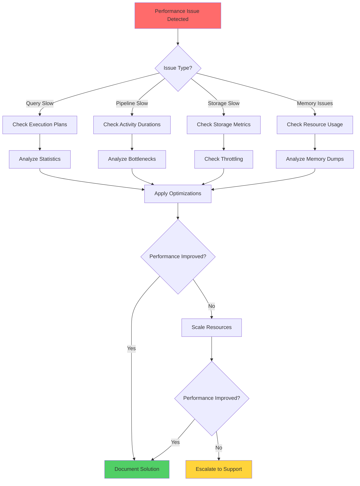

# General Performance Troubleshooting - CSA in-a-Box

> **[🏠 Home](../../README.md)** | **[📖 Documentation](../README.md)** | **[🔧 Troubleshooting](README.md)** | **👤 Performance Issues**

 

Comprehensive guide for diagnosing and resolving performance issues across Cloud Scale Analytics services including Azure Synapse Analytics, Azure Data Factory, Azure Data Lake Storage, and streaming services.

## Table of Contents

- [Overview](#overview)
- [Performance Baseline Metrics](#performance-baseline-metrics)
- [Common Performance Issues](#common-performance-issues)
- [Cross-Service Performance](#cross-service-performance)
- [Diagnostic Approach](#diagnostic-approach)
- [Resolution Strategies](#resolution-strategies)
- [Prevention Best Practices](#prevention-best-practices)
- [Related Resources](#related-resources)

---

## Overview

Performance issues in Cloud Scale Analytics can stem from multiple sources: inefficient queries, resource constraints, network bottlenecks, or suboptimal configurations. This guide provides a systematic approach to identifying and resolving performance problems across the entire analytics platform.

> **⚠️ Important:** Always establish performance baselines during normal operations to effectively identify degradation.

---

## Performance Baseline Metrics

### Key Performance Indicators

| Metric Category | KPI | Good | Warning | Critical | Tool |
|:----------------|:----|:-----|:--------|:---------|:-----|
| **Query Execution** | Average query time | < 5s | 5-30s | > 30s | Azure Synapse |
| **Data Ingestion** | Pipeline duration | < 10min | 10-30min | > 30min | Azure Data Factory |
| **Storage I/O** | ADLS latency | < 100ms | 100-500ms | > 500ms | Azure Monitor |
| **Streaming** | Event processing lag | < 1s | 1-5s | > 5s | Stream Analytics |
| **Resource Usage** | CPU utilization | < 70% | 70-85% | > 85% | Azure Monitor |
| **Memory Usage** | Memory pressure | < 80% | 80-90% | > 90% | Azure Monitor |

### Establishing Baselines

**Azure Monitor Query:**

```kusto
// Establish performance baseline over 30 days
let timeRange = 30d;
let metricName = "QueryDuration";

AzureDiagnostics
| where TimeGenerated > ago(timeRange)
| where MetricName == metricName
| summarize
    P50 = percentile(MetricValue, 50),
    P95 = percentile(MetricValue, 95),
    P99 = percentile(MetricValue, 99),
    Avg = avg(MetricValue),
    Max = max(MetricValue)
    by bin(TimeGenerated, 1d), Resource
| render timechart
```

---

## Common Performance Issues

### Issue 1: Slow Data Processing

**Symptoms:**
- Pipelines taking longer than expected
- Increasing backlog in processing queues
- Timeout errors in downstream services

**Common Causes:**

| Cause | Service | Impact | Quick Check |
|:------|:--------|:-------|:------------|
| Insufficient compute | Synapse/ADF | High | Check DWU/IR capacity |
| Data skew | Spark/Synapse | High | Review partition distribution |
| Large datasets | All | Medium | Check data volumes |
| Network throttling | Storage | Medium | Monitor network metrics |
| Inefficient transformations | ADF/Spark | High | Review activity execution times |

**Step-by-Step Resolution:**

#### 1. Identify Bottleneck Component

**Azure Data Factory:**

```bash
# Get pipeline run details
az datafactory pipeline-run show \
    --factory-name <factory-name> \
    --resource-group <rg-name> \
    --run-id <run-id>

# Query activity-level metrics
az monitor metrics list \
    --resource <resource-id> \
    --metric "PipelineSucceededRuns" "ActivitySucceededRuns" \
    --start-time 2025-01-01T00:00:00Z \
    --end-time 2025-01-10T00:00:00Z
```

**KQL Query for ADF Performance:**

```kusto
ADFPipelineRun
| where TimeGenerated > ago(24h)
| where Status == "Succeeded"
| extend Duration = datetime_diff('second', End, Start)
| summarize
    AvgDuration = avg(Duration),
    P95Duration = percentile(Duration, 95),
    RunCount = count()
    by PipelineName
| where AvgDuration > 600  // Pipelines averaging > 10 minutes
| order by AvgDuration desc
```

#### 2. Analyze Resource Utilization

```kusto
// Check Integration Runtime utilization
ADFActivityRun
| where TimeGenerated > ago(24h)
| extend Duration = datetime_diff('second', End, Start)
| summarize
    TotalDuration = sum(Duration),
    MaxDuration = max(Duration),
    ActivityCount = count()
    by IntegrationRuntimeName, ActivityType
| order by TotalDuration desc
```

#### 3. Scale Resources

**Azure Synapse:**

```bash
# Scale SQL pool
az synapse sql pool update \
    --name <pool-name> \
    --workspace-name <workspace-name> \
    --resource-group <rg-name> \
    --performance-level DW500c

# Scale Spark pool
az synapse spark pool update \
    --name <pool-name> \
    --workspace-name <workspace-name> \
    --resource-group <rg-name> \
    --node-count 10 \
    --node-size Medium
```

**Azure Data Factory:**

```bash
# Scale Integration Runtime
az datafactory integration-runtime update \
    --factory-name <factory-name> \
    --resource-group <rg-name> \
    --name <ir-name> \
    --core-count 8 \
    --time-to-live 30
```

---

### Issue 2: High Storage Latency

**Symptoms:**
- Slow read/write operations to Data Lake
- Storage throttling errors (503)
- Increased pipeline execution times

**Error Messages:**

```text
OperationTimedOut: The operation did not complete in the allotted timeout
Status: 503 Server Busy
```

**Resolution Steps:**

#### 1. Check Storage Metrics

```kusto
// Storage performance metrics
StorageBlobLogs
| where TimeGenerated > ago(1h)
| where StatusCode >= 500
| summarize
    ErrorCount = count(),
    AvgLatency = avg(DurationMs),
    MaxLatency = max(DurationMs)
    by OperationName, StatusCode
| order by ErrorCount desc
```

#### 2. Identify Throttling

```bash
# Check storage account metrics
az monitor metrics list \
    --resource <storage-account-id> \
    --metric "Availability" "SuccessE2ELatency" "Transactions" \
    --aggregation Average \
    --interval PT1H
```

#### 3. Optimize Access Patterns

**Implement Retry Logic:**

```python
from azure.storage.blob import BlobServiceClient
from azure.core.exceptions import ServiceRequestError
from tenacity import retry, wait_exponential, stop_after_attempt

@retry(
    wait=wait_exponential(multiplier=1, min=4, max=60),
    stop=stop_after_attempt(5)
)
def read_blob_with_retry(container_name, blob_name):
    """Read blob with exponential backoff retry."""
    blob_service_client = BlobServiceClient.from_connection_string(conn_str)
    blob_client = blob_service_client.get_blob_client(
        container=container_name,
        blob=blob_name
    )

    try:
        return blob_client.download_blob().readall()
    except ServiceRequestError as e:
        print(f"Storage request failed: {e}")
        raise
```

**Optimize Partition Strategy:**

```text
# Poor partition strategy (hot partition)
/data/2025/01/01/all_data.parquet  (10GB single file)

# Good partition strategy (distributed load)
/data/year=2025/month=01/day=01/part-00001.parquet (100MB)
/data/year=2025/month=01/day=01/part-00002.parquet (100MB)
...
/data/year=2025/month=01/day=01/part-00100.parquet (100MB)
```

#### 4. Implement Caching

```python
from azure.identity import DefaultAzureCredential
from azure.storage.filedatalake import DataLakeServiceClient
import diskcache

cache = diskcache.Cache('./cache')

@cache.memoize(expire=3600)  # Cache for 1 hour
def read_metadata(file_path):
    """Cache frequently accessed metadata."""
    service_client = DataLakeServiceClient(
        account_url=f"https://{account_name}.dfs.core.windows.net",
        credential=DefaultAzureCredential()
    )

    file_client = service_client.get_file_client(
        file_system="data",
        file_path=file_path
    )

    return file_client.get_file_properties()
```

---

### Issue 3: Memory Pressure

**Symptoms:**
- Out of memory errors in Spark jobs
- Slow garbage collection
- Job failures with resource exhaustion

**Error Messages:**

```text
java.lang.OutOfMemoryError: Java heap space
org.apache.spark.shuffle.FetchFailedException: Failed to fetch shuffle blocks
```

**Resolution:**

#### 1. Analyze Memory Usage

**Spark Monitoring Query:**

```kusto
SparkMetrics
| where TimeGenerated > ago(1h)
| where MetricName in ("ExecutorMemoryUsed", "JVMHeapMemory", "ExecutorGCTime")
| summarize
    AvgMemory = avg(MetricValue),
    MaxMemory = max(MetricValue)
    by bin(TimeGenerated, 5m), ExecutorId
| render timechart
```

#### 2. Optimize Spark Configuration

```python
# Spark configuration for memory optimization
spark_config = {
    "spark.executor.memory": "16g",
    "spark.executor.memoryOverhead": "4g",
    "spark.driver.memory": "8g",
    "spark.memory.fraction": "0.8",
    "spark.memory.storageFraction": "0.3",
    "spark.sql.shuffle.partitions": "200",
    "spark.default.parallelism": "200",
    "spark.sql.adaptive.enabled": "true",
    "spark.sql.adaptive.coalescePartitions.enabled": "true"
}

from pyspark.sql import SparkSession

spark = SparkSession.builder \
    .appName("OptimizedApp") \
    .config(spark_config) \
    .getOrCreate()
```

#### 3. Reduce Data Shuffling

```python
# Poor: Forces full shuffle
large_df.groupBy("category").count()

# Better: Use broadcast join for small tables
from pyspark.sql.functions import broadcast

large_df.join(
    broadcast(small_dim_df),
    "category_id"
)

# Best: Pre-partition data
large_df.repartition("category").write.partitionBy("category").parquet("/output")
```

---

## Cross-Service Performance

### Data Pipeline End-to-End Performance

**Monitor Complete Pipeline:**

```kusto
// Correlate performance across services
let startTime = ago(24h);
let endTime = now();

// ADF pipeline execution
let pipelineRuns = ADFPipelineRun
| where TimeGenerated between (startTime .. endTime)
| extend PipelineDuration = datetime_diff('second', End, Start)
| project TimeGenerated, PipelineName, PipelineDuration, Status, RunId;

// Synapse query execution
let synapseQueries = SynapseSqlPoolExecRequests
| where TimeGenerated between (startTime .. endTime)
| extend QueryDuration = TotalElapsedTimeMs / 1000.0
| project TimeGenerated, RequestId, QueryDuration, Status;

// Join and analyze
pipelineRuns
| join kind=inner (synapseQueries) on $left.TimeGenerated == $right.TimeGenerated
| summarize
    TotalDuration = sum(PipelineDuration + QueryDuration),
    AvgDuration = avg(PipelineDuration + QueryDuration)
    by PipelineName
| order by TotalDuration desc
```

### Network Performance

**Check Network Latency:**

```bash
# Test connectivity to storage account
az network watcher test-connectivity \
    --source-resource <vm-resource-id> \
    --dest-address <storage-account>.blob.core.windows.net \
    --protocol Tcp \
    --dest-port 443

# Check ExpressRoute/VPN performance
az network watcher connection-monitor test-connectivity \
    --endpoint <source-endpoint> \
    --dest <destination>
```

**Monitor Private Endpoint Performance:**

```kusto
AzureNetworkAnalytics_CL
| where SubType_s == "FlowLog"
| where TimeGenerated > ago(1h)
| summarize
    TotalFlows = sum(FlowCount_d),
    AvgBytes = avg(BytesSentToSource_d + BytesSentToDest_d)
    by SrcIP_s, DestIP_s, DestPort_d
| order by TotalFlows desc
```

---

## Diagnostic Approach

### Performance Troubleshooting Workflow



### Comprehensive Diagnostics Script

```powershell
# Performance diagnostics collection script
param(
    [string]$SubscriptionId,
    [string]$ResourceGroupName,
    [string]$WorkspaceName,
    [int]$HoursBack = 24
)

$outputPath = ".\performance_diagnostics_$(Get-Date -Format 'yyyyMMdd_HHmmss')"
New-Item -ItemType Directory -Path $outputPath -Force

# Set context
Set-AzContext -SubscriptionId $SubscriptionId

# Collect Synapse metrics
$synapseWorkspace = Get-AzSynapseWorkspace -ResourceGroupName $ResourceGroupName -Name $WorkspaceName
$metrics = @("CPUPercent", "MemoryPercent", "DWULimit", "DWUUsed")

foreach ($metric in $metrics) {
    $data = Get-AzMetric -ResourceId $synapseWorkspace.Id `
        -MetricName $metric `
        -StartTime (Get-Date).AddHours(-$HoursBack) `
        -EndTime (Get-Date) `
        -TimeGrain 00:05:00 `
        -AggregationType Average

    $data | ConvertTo-Json -Depth 10 | Out-File "$outputPath\metric_$metric.json"
}

# Collect activity logs
$startTime = (Get-Date).AddHours(-$HoursBack)
$logs = Get-AzActivityLog -ResourceGroupName $ResourceGroupName -StartTime $startTime
$logs | ConvertTo-Json -Depth 10 | Out-File "$outputPath\activity_logs.json"

# Collect pipeline runs (if ADF exists)
$dataFactories = Get-AzDataFactoryV2 -ResourceGroupName $ResourceGroupName
foreach ($df in $dataFactories) {
    $pipelineRuns = Get-AzDataFactoryV2PipelineRun `
        -ResourceGroupName $ResourceGroupName `
        -DataFactoryName $df.DataFactoryName `
        -LastUpdatedAfter $startTime

    $pipelineRuns | ConvertTo-Json -Depth 10 | Out-File "$outputPath\pipeline_runs_$($df.DataFactoryName).json"
}

Write-Host "Performance diagnostics collected in: $outputPath" -ForegroundColor Green
```

---

## Resolution Strategies

### Quick Wins

| Optimization | Impact | Effort | Service |
|:-------------|:-------|:-------|:--------|
| Update statistics | High | Low | Synapse SQL |
| Enable result caching | High | Low | Synapse SQL |
| Increase partition count | Medium | Low | Spark |
| Use broadcast joins | High | Low | Spark |
| Enable data compression | Medium | Low | Storage |
| Implement retry logic | Medium | Low | All |

### Long-Term Optimizations

#### 1. Implement Data Lifecycle Management

```python
from azure.storage.blob import BlobServiceClient, BlobManagementPolicy

# Configure lifecycle management
lifecycle_policy = {
    "rules": [
        {
            "enabled": True,
            "name": "move-old-data-to-cool",
            "type": "Lifecycle",
            "definition": {
                "actions": {
                    "baseBlob": {
                        "tierToCool": {
                            "daysAfterModificationGreaterThan": 30
                        },
                        "tierToArchive": {
                            "daysAfterModificationGreaterThan": 90
                        }
                    }
                },
                "filters": {
                    "prefixMatch": ["data/raw/"],
                    "blobTypes": ["blockBlob"]
                }
            }
        }
    ]
}
```

#### 2. Optimize Table Design

```sql
-- Create optimized table with appropriate distribution
CREATE TABLE dbo.FactSales_Optimized
WITH (
    DISTRIBUTION = HASH(CustomerID),  -- Distribute on frequently joined column
    CLUSTERED COLUMNSTORE INDEX,       -- Best for analytics workloads
    PARTITION (
        OrderDate RANGE RIGHT FOR VALUES (
            '2024-01-01', '2024-02-01', '2024-03-01',
            '2024-04-01', '2024-05-01', '2024-06-01'
        )
    )
)
AS
SELECT * FROM dbo.FactSales;

-- Create statistics on key columns
CREATE STATISTICS stat_customer ON dbo.FactSales_Optimized (CustomerID) WITH FULLSCAN;
CREATE STATISTICS stat_date ON dbo.FactSales_Optimized (OrderDate) WITH FULLSCAN;
```

#### 3. Implement Caching Strategy

```python
from functools import lru_cache
from datetime import datetime, timedelta

class PerformanceOptimizedDataLoader:
    """Data loader with multi-level caching."""

    def __init__(self, storage_account, container):
        self.storage_account = storage_account
        self.container = container
        self._cache = {}
        self._cache_expiry = {}

    @lru_cache(maxsize=128)
    def get_metadata(self, file_path):
        """Cache metadata lookups."""
        # Implementation
        pass

    def get_data_with_cache(self, file_path, ttl_minutes=60):
        """Get data with time-based cache."""
        cache_key = f"{self.container}/{file_path}"

        # Check cache validity
        if cache_key in self._cache:
            if datetime.now() < self._cache_expiry.get(cache_key, datetime.min):
                return self._cache[cache_key]

        # Load data
        data = self._load_data(file_path)

        # Update cache
        self._cache[cache_key] = data
        self._cache_expiry[cache_key] = datetime.now() + timedelta(minutes=ttl_minutes)

        return data
```

---

## Prevention Best Practices

### Proactive Monitoring

#### 1. Set Up Performance Alerts

```bash
# Create alert rule for high query duration
az monitor metrics alert create \
    --name "HighQueryDuration" \
    --resource-group <rg-name> \
    --scopes <synapse-workspace-id> \
    --condition "avg QueryDuration > 30000" \
    --window-size 5m \
    --evaluation-frequency 1m \
    --action <action-group-id>

# Create alert for pipeline failures
az monitor metrics alert create \
    --name "PipelineFailures" \
    --resource-group <rg-name> \
    --scopes <data-factory-id> \
    --condition "count PipelineFailedRuns > 3" \
    --window-size 15m \
    --action <action-group-id>
```

#### 2. Performance Dashboard

```kusto
// Create performance dashboard query
let timeRange = 24h;

// Query performance over time
SynapseSqlPoolExecRequests
| where TimeGenerated > ago(timeRange)
| summarize
    P50 = percentile(TotalElapsedTimeMs, 50),
    P95 = percentile(TotalElapsedTimeMs, 95),
    P99 = percentile(TotalElapsedTimeMs, 99)
    by bin(TimeGenerated, 1h)
| render timechart with (title="Query Performance Percentiles")
```

### Regular Maintenance

**Weekly Performance Review Checklist:**

- [ ] Review slow query reports
- [ ] Update statistics on large tables
- [ ] Check storage account metrics
- [ ] Review pipeline execution times
- [ ] Analyze resource utilization trends
- [ ] Review and optimize costly queries
- [ ] Check for data skew issues
- [ ] Validate partition strategies

**Monthly Optimization Tasks:**

- [ ] Comprehensive performance audit
- [ ] Review and update baselines
- [ ] Optimize frequently accessed datasets
- [ ] Review and tune Spark configurations
- [ ] Analyze storage access patterns
- [ ] Review and optimize data retention policies
- [ ] Update documentation with new optimizations

---

## Related Resources

### Internal Documentation

| Resource | Description |
|----------|-------------|
| [Synapse Query Performance](service-troubleshooting/synapse/query-performance.md) | Synapse-specific query optimization |
| [Databricks Performance](service-troubleshooting/databricks/query-performance.md) | Databricks query and job optimization |
| [Best Practices: Performance](../best-practices/performance-optimization.md) | General performance best practices |
| [Monitoring Setup](../monitoring/monitoring-setup.md) | Configure comprehensive monitoring |

### External Resources

| Resource | Link |
|----------|------|
| **Azure Synapse Performance** | [Microsoft Docs](https://docs.microsoft.com/azure/synapse-analytics/sql-data-warehouse/sql-data-warehouse-best-practices) |
| **Spark Performance Tuning** | [Azure Databricks Docs](https://docs.microsoft.com/azure/databricks/kb/performance) |
| **Storage Performance** | [ADLS Gen2 Best Practices](https://docs.microsoft.com/azure/storage/blobs/data-lake-storage-best-practices) |
| **ADF Performance** | [Data Factory Performance Guide](https://docs.microsoft.com/azure/data-factory/concepts-performance) |

---

## When to Escalate

Contact Azure Support if:

- [ ] Performance degraded significantly without configuration changes
- [ ] Resource scaling doesn't improve performance
- [ ] Consistent throttling despite optimization
- [ ] Platform-level issues suspected
- [ ] Performance SLAs not being met
- [ ] Need assistance with capacity planning

**Information to Provide:**
- Performance baseline metrics
- Recent metric trends and graphs
- Executed optimization attempts
- Resource configuration details
- Sample slow queries with execution plans
- Storage access patterns

---

> **💡 Performance Tip:** Establish clear performance baselines and monitor trends proactively. Most performance issues are easier to prevent than to troubleshoot after they occur.

**Last Updated:** 2025-12-10
**Version:** 1.0.0
