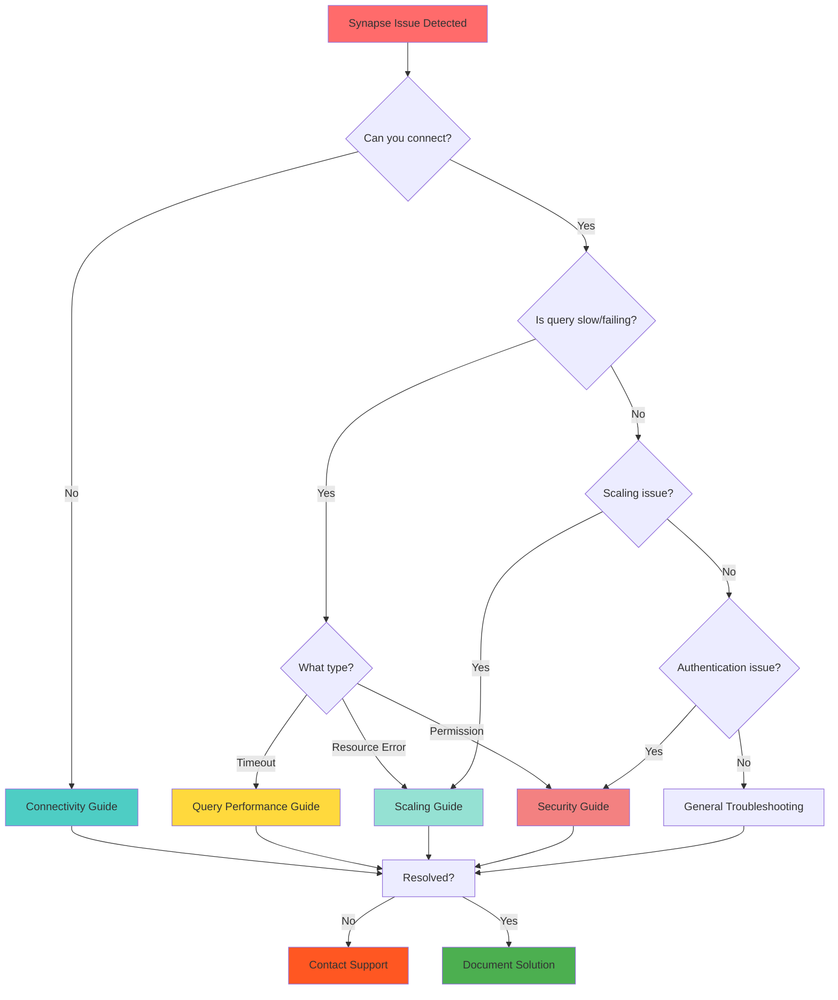

# Azure Synapse Troubleshooting Overview

> **[🏠 Home](../../../../README.md)** | **[📖 Documentation](../../../README.md)** | **[🔧 Troubleshooting](../../README.md)** | **👤 Azure Synapse**

 

Comprehensive troubleshooting guide for Azure Synapse Analytics service-specific issues.

## Table of Contents

- [Overview](#overview)
- [Common Synapse Issues](#common-synapse-issues)
- [Troubleshooting Categories](#troubleshooting-categories)
- [Quick Diagnostics](#quick-diagnostics)
- [When to Contact Support](#when-to-contact-support)

---

## Overview

This section provides detailed troubleshooting guidance for Azure Synapse Analytics-specific issues. Azure Synapse is a comprehensive analytics service that combines multiple components, each with its own set of potential issues.

> **💡 Tip:** Start with the most specific guide that matches your symptoms. If unclear, use the Quick Diagnostics section below.

---

## Common Synapse Issues

### Most Frequent Problems

| Issue Type | Frequency | Impact | Resolution Guide |
|:-----------|:---------:|:------:|:-----------------|
| **Connectivity Failures** | High | Critical | [Connectivity Guide](connectivity.md) |
| **Query Performance** | High | Medium | [Query Performance Guide](query-performance.md) |
| **Scaling Issues** | Medium | High | [Scaling Guide](scaling.md) |
| **Authentication Errors** | Medium | Critical | [Authentication Guide](../../../troubleshooting/authentication-troubleshooting.md) |
| **Pipeline Failures** | Medium | Medium | [Pipeline Guide](../../../troubleshooting/pipeline-troubleshooting.md) |

---

## Troubleshooting Categories

### 1. Connectivity Issues

**Symptoms:**
- Cannot connect to Synapse workspace
- Timeout errors
- Network-related failures
- Private endpoint connection problems

**Guide:** [Connectivity Troubleshooting](connectivity.md)

**Quick Checks:**
```bash
# Test network connectivity
Test-NetConnection -ComputerName <workspace-name>.sql.azuresynapse.net -Port 1433

# Check firewall rules
az synapse workspace firewall-rule list --workspace-name <workspace-name> --resource-group <rg-name>
```

---

### 2. Query Performance

**Symptoms:**
- Slow query execution
- High resource consumption
- Timeout errors
- Poor execution plans

**Guide:** [Query Performance Troubleshooting](query-performance.md)

**Quick Checks:**
```sql
-- Check active queries
SELECT * FROM sys.dm_pdw_exec_requests
WHERE status IN ('Running', 'Suspended')
ORDER BY start_time DESC;

-- Check resource utilization
SELECT * FROM sys.dm_pdw_resource_waits
WHERE state = 'Queued'
ORDER BY request_time DESC;
```

---

### 3. Scaling Issues

**Symptoms:**
- Resource contention
- Failed scaling operations
- Unexpected costs
- Performance degradation

**Guide:** [Scaling Troubleshooting](scaling.md)

**Quick Checks:**
```bash
# Check current DWU settings
az synapse sql pool show --name <pool-name> --workspace-name <workspace-name> --resource-group <rg-name> --query "sku.capacity"

# Check pool status
az synapse sql pool show --name <pool-name> --workspace-name <workspace-name> --resource-group <rg-name> --query "status"
```

---

## Quick Diagnostics

### Decision Tree



### Diagnostic Checklist

Before diving into specific guides, collect this information:

- [ ] **Error Message**: Full text of any error messages
- [ ] **Timestamp**: When the issue occurred (include timezone)
- [ ] **Workspace Details**: Name, region, service tier
- [ ] **Component**: Which Synapse component (SQL pool, Spark pool, Pipeline, etc.)
- [ ] **Recent Changes**: Any recent configuration or code changes
- [ ] **Scope**: Does it affect all users or specific operations?

---

## Common Error Messages

### Quick Resolution Guide

| Error Code/Message | Likely Cause | Quick Fix | Detailed Guide |
|:-------------------|:-------------|:----------|:---------------|
| `Error 40613` | Resource limit reached | Scale up or wait | [Scaling](scaling.md#resource-limits) |
| `Error 40501` | Service busy | Retry with backoff | [Query Performance](query-performance.md#service-busy) |
| `Error 18456` | Authentication failed | Check credentials | [Security](../../../troubleshooting/authentication-troubleshooting.md) |
| `Timeout expired` | Query too slow | Optimize query | [Query Performance](query-performance.md#timeout-errors) |
| `Connection failed` | Network issue | Check firewall | [Connectivity](connectivity.md#firewall-issues) |

---

## Essential Diagnostic Queries

### Check Workspace Health

```sql
-- Check pool status
SELECT
    name,
    state,
    state_desc,
    create_date
FROM sys.databases;

-- Check active sessions
SELECT
    session_id,
    login_name,
    status,
    command,
    cpu_time,
    memory_usage
FROM sys.dm_exec_sessions
WHERE is_user_process = 1
ORDER BY cpu_time DESC;

-- Check current operations
SELECT
    request_id,
    status,
    command,
    total_elapsed_time,
    start_time
FROM sys.dm_pdw_exec_requests
WHERE status NOT IN ('Completed', 'Failed', 'Cancelled')
ORDER BY start_time DESC;
```

### Monitor Resource Usage

```sql
-- Check DWU consumption
SELECT
    GETDATE() AS measurement_time,
    db_name() AS database_name,
    SUM(user_objects_alloc_page_count) * 8.0 / 1024 / 1024 AS user_objects_gb,
    SUM(internal_objects_alloc_page_count) * 8.0 / 1024 / 1024 AS internal_objects_gb,
    SUM(unallocated_extent_page_count) * 8.0 / 1024 / 1024 AS unallocated_gb
FROM sys.dm_db_session_space_usage;

-- Check wait statistics
SELECT TOP 10
    wait_type,
    SUM(wait_time_ms) / 1000.0 AS total_wait_seconds,
    SUM(signal_wait_time_ms) / 1000.0 AS total_signal_wait_seconds,
    MAX(wait_time_ms) AS max_wait_ms,
    waiting_tasks_count
FROM sys.dm_pdw_waits
WHERE wait_type NOT IN ('SLEEP_TASK', 'BROKER_TASK_SLEEP', 'SQLTRACE_BUFFER_FLUSH')
GROUP BY wait_type
ORDER BY total_wait_seconds DESC;
```

---

## Azure CLI Diagnostics

### Check Workspace Status

```bash
# Get workspace details
az synapse workspace show \
    --name <workspace-name> \
    --resource-group <rg-name> \
    --output table

# List all SQL pools
az synapse sql pool list \
    --workspace-name <workspace-name> \
    --resource-group <rg-name> \
    --output table

# List all Spark pools
az synapse spark pool list \
    --workspace-name <workspace-name> \
    --resource-group <rg-name> \
    --output table

# Check firewall rules
az synapse workspace firewall-rule list \
    --workspace-name <workspace-name> \
    --resource-group <rg-name> \
    --output table
```

### Check Activity Logs

```bash
# Get recent activity logs
az monitor activity-log list \
    --resource-group <rg-name> \
    --namespace Microsoft.Synapse \
    --start-time 2025-12-08T00:00:00Z \
    --offset 24h \
    --query "[?level=='Error' || level=='Warning']" \
    --output table

# Get metrics
az monitor metrics list \
    --resource "/subscriptions/<sub-id>/resourceGroups/<rg-name>/providers/Microsoft.Synapse/workspaces/<workspace-name>" \
    --metric-names "IntegrationPipelineRunsEnded" \
    --start-time 2025-12-08T00:00:00Z \
    --interval PT1H \
    --output table
```

---

## When to Contact Support

### Contact Microsoft Support If

- [ ] Issue persists after following all troubleshooting guides
- [ ] Service health dashboard shows no issues
- [ ] Multiple workspaces are affected
- [ ] Data loss or corruption is suspected
- [ ] Security incident is suspected
- [ ] Issue affects production workloads critically

### Information to Provide

When opening a support ticket, have ready:

1. **Subscription ID**: Your Azure subscription identifier
2. **Workspace Name**: Full workspace name and region
3. **Error Details**: Complete error messages with codes
4. **Timeline**: When issue started and any patterns observed
5. **Diagnostic Data**: Results from diagnostic queries above
6. **Impact Assessment**: Number of users affected, business impact
7. **Troubleshooting Steps**: What you've already tried

### Support Ticket Priority

| Priority | Use When | Response SLA |
|:---------|:---------|:-------------|
| **Critical** | Production down, data loss | 1 hour |
| **High** | Production degraded, no workaround | 4 hours |
| **Medium** | Non-production issue, workaround exists | 8 hours |
| **Low** | General guidance, questions | 24 hours |

---

## Best Practices for Prevention

### 1. Implement Monitoring

- Set up Azure Monitor alerts for critical metrics
- Configure diagnostic logging
- Create custom dashboards for key indicators
- Enable Application Insights integration

### 2. Regular Maintenance

- Review and optimize slow queries weekly
- Update statistics on large tables regularly
- Clean up temporary objects
- Review and right-size resource allocations

### 3. Change Management

- Test changes in non-production first
- Document all configuration changes
- Maintain backup of critical data
- Have rollback procedures ready

### 4. Access Management

- Use Azure AD authentication
- Implement least-privilege access
- Regular audit of permissions
- Enable Multi-Factor Authentication

---

## Related Resources

### Internal Documentation

- General Troubleshooting
- Authentication Issues
- Pipeline Troubleshooting
- Spark Troubleshooting
- Monitoring Setup

### External Resources

- [Microsoft Synapse Documentation](https://docs.microsoft.com/azure/synapse-analytics/)
- [Azure Status Dashboard](https://status.azure.com/)
- [Synapse Community Forums](https://techcommunity.microsoft.com/t5/azure-synapse-analytics/bd-p/AzureSynapseAnalytics)
- [Stack Overflow - Azure Synapse](https://stackoverflow.com/questions/tagged/azure-synapse)

---

> **🚀 Quick Start:** Choose the guide that best matches your issue symptoms and start troubleshooting. Most issues can be resolved by following the step-by-step procedures in each guide.
