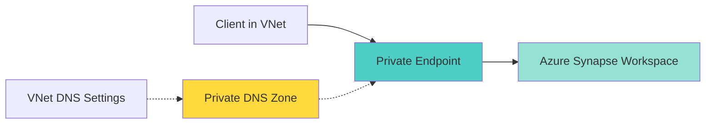

# Azure Synapse Connectivity Troubleshooting

> **[🏠 Home](../../../../README.md)** | **[📖 Documentation](../../../README.md)** | **[🔧 Troubleshooting](../../README.md)** | **[⚡ Synapse](README.md)** | **👤 Connectivity**

 

Comprehensive guide for resolving Azure Synapse connectivity, firewall, and private endpoint issues.

## Table of Contents

- [Overview](#overview)
- [Common Connection Issues](#common-connection-issues)
- [Firewall Configuration](#firewall-configuration)
- [Private Endpoints](#private-endpoints)
- [Authentication Issues](#authentication-issues)
- [Network Diagnostics](#network-diagnostics)
- [Resolution Procedures](#resolution-procedures)

---

## Overview

Connectivity issues in Azure Synapse can stem from various sources including network configuration, firewall rules, authentication, and DNS resolution. This guide provides systematic troubleshooting for all connection-related problems.

> **⚠️ Warning:** Connection issues can prevent access to your entire workspace. Follow this guide systematically to identify and resolve the root cause.

---

## Common Connection Issues

### Error: "Cannot connect to server"

**Error Code:** 40615, 40613, 18456

**Symptoms:**
- Connection timeout
- "Login failed for user" messages
- "Server is not currently available"
- Client cannot reach Synapse endpoint

**Common Causes:**
1. Firewall rules blocking IP address
2. Private endpoint misconfiguration
3. DNS resolution failure
4. Network security group (NSG) rules
5. Service outage or maintenance

---

## Firewall Configuration

### Issue: IP Address Not Allowed

**Error Message:**
```text
Client with IP address 'XXX.XXX.XXX.XXX' is not allowed to access the server.
```

**Step-by-Step Resolution:**

#### 1. Check Current Firewall Rules

```bash
# Azure CLI: List all firewall rules
az synapse workspace firewall-rule list \
    --workspace-name <workspace-name> \
    --resource-group <rg-name> \
    --output table
```

**PowerShell:**
```powershell
# Get firewall rules
Get-AzSynapseFirewallRule `
    -WorkspaceName <workspace-name> `
    -ResourceGroupName <rg-name>
```

#### 2. Identify Your Public IP

```bash
# Get your current public IP
curl https://api.ipify.org
# or
curl ifconfig.me
```

**Windows PowerShell:**
```powershell
(Invoke-WebRequest -Uri "https://api.ipify.org").Content
```

#### 3. Add Firewall Rule

```bash
# Azure CLI: Add IP to firewall
az synapse workspace firewall-rule create \
    --name "AllowMyIP" \
    --workspace-name <workspace-name> \
    --resource-group <rg-name> \
    --start-ip-address <your-ip> \
    --end-ip-address <your-ip>
```

**PowerShell:**
```powershell
# Add firewall rule
New-AzSynapseFirewallRule `
    -WorkspaceName <workspace-name> `
    -Name "AllowMyIP" `
    -StartIpAddress <your-ip> `
    -EndIpAddress <your-ip>
```

**Azure Portal:**
1. Navigate to Synapse workspace
2. Select **Networking** under Security
3. Click **Add client IP** or **Add IP range**
4. Enter IP details and save

> **💡 Tip:** Use IP ranges for office networks or VPN exit points to avoid frequent updates.

#### 4. Allow Azure Services

```bash
# Allow other Azure services to connect
az synapse workspace firewall-rule create \
    --name "AllowAllWindowsAzureIps" \
    --workspace-name <workspace-name> \
    --resource-group <rg-name> \
    --start-ip-address 0.0.0.0 \
    --end-ip-address 0.0.0.0
```

> **⚠️ Warning:** Only enable "Allow Azure services" if you need Azure services (like Azure Data Factory, Logic Apps) to access your workspace.

#### 5. Verify Rule Propagation

```sql
-- Test connection with SQL query
SELECT GETDATE() AS CurrentTime;
```

**Wait Time:** Firewall rule changes can take 1-5 minutes to propagate.

---

### Issue: Firewall Rules Not Working

**Symptoms:**
- Rules are configured but connection still fails
- Intermittent connectivity

**Diagnostic Steps:**

```bash
# Check if rules are applied
az synapse workspace show \
    --name <workspace-name> \
    --resource-group <rg-name> \
    --query "firewallRules" \
    --output table

# Verify workspace connectivity settings
az synapse workspace show \
    --name <workspace-name> \
    --resource-group <rg-name> \
    --query "{Name:name, PublicNetworkAccess:publicNetworkAccess, ManagedVNet:managedVirtualNetwork}" \
    --output table
```

**Common Solutions:**

1. **Check Public Network Access:**
   - Must be set to "Enabled" for firewall rules to work
   - If using private endpoints exclusively, public access should be "Disabled"

2. **Verify IP Address:**
   ```bash
   # Your IP might change if using dynamic IP
   # Use nslookup to verify DNS resolution
   nslookup <workspace-name>.sql.azuresynapse.net
   ```

3. **Check for Overlapping Rules:**
   - Remove duplicate or conflicting rules
   - Ensure start IP ≤ end IP in range rules

---

## Private Endpoints

### Issue: Private Endpoint Connection Failure

**Symptoms:**
- Cannot connect through private endpoint
- DNS resolution returns public IP instead of private IP
- Connection works from Azure but not from on-premises

**Architecture Check:**



#### 1. Verify Private Endpoint Status

```bash
# List private endpoints
az network private-endpoint list \
    --resource-group <rg-name> \
    --output table

# Get private endpoint details
az network private-endpoint show \
    --name <pe-name> \
    --resource-group <rg-name> \
    --query "{Name:name, ProvisioningState:provisioningState, ConnectionState:privateLinkServiceConnections[0].privateLinkServiceConnectionState.status}"
```

**Expected State:**
- Provisioning State: `Succeeded`
- Connection State: `Approved`

#### 2. Check Private DNS Configuration

```bash
# List Private DNS zones
az network private-dns zone list \
    --resource-group <rg-name> \
    --output table

# Expected zones for Synapse:
# - privatelink.sql.azuresynapse.net (SQL pools)
# - privatelink.dev.azuresynapse.net (Dev endpoint)
# - privatelink.azuresynapse.net (Workspace endpoint)
```

#### 3. Verify DNS Resolution

**From VM in VNet:**
```bash
# Should return private IP (10.x.x.x)
nslookup <workspace-name>.sql.azuresynapse.net

# Check specific endpoints
nslookup <workspace-name>.dev.azuresynapse.net
nslookup <workspace-name>-ondemand.sql.azuresynapse.net
```

**Expected Output:**
```text
Server:  UnKnown
Address:  168.63.129.16

Non-authoritative answer:
Name:    <workspace-name>.sql.azuresynapse.net
Address:  10.1.2.3  # Private IP in your VNet range
```

> **⚠️ Warning:** If you see a public IP (not 10.x.x.x, 172.x.x.x, or 192.168.x.x), DNS is not configured correctly.

#### 4. Fix DNS Resolution Issues

**Option A: Use Private DNS Zone**

```bash
# Link Private DNS zone to VNet
az network private-dns link vnet create \
    --resource-group <rg-name> \
    --zone-name privatelink.sql.azuresynapse.net \
    --name <link-name> \
    --virtual-network <vnet-name> \
    --registration-enabled false
```

**Option B: Configure Custom DNS Servers**

If using custom DNS servers, add conditional forwarders:

```text
Zone: privatelink.sql.azuresynapse.net
Forwarder: 168.63.129.16 (Azure DNS)
```

**Windows DNS Server:**
```powershell
Add-DnsServerConditionalForwarderZone `
    -Name "privatelink.sql.azuresynapse.net" `
    -MasterServers 168.63.129.16
```

#### 5. Test Private Endpoint Connectivity

```powershell
# PowerShell: Test connection
Test-NetConnection `
    -ComputerName <workspace-name>.sql.azuresynapse.net `
    -Port 1433

# Should show:
# TcpTestSucceeded : True
# RemoteAddress    : 10.x.x.x (private IP)
```

**Linux/Mac:**
```bash
# Test TCP connection
nc -zv <workspace-name>.sql.azuresynapse.net 1433

# or
telnet <workspace-name>.sql.azuresynapse.net 1433
```

---

### Issue: Private Endpoint + Public Access Conflict

**Symptoms:**
- Inconsistent connectivity
- Works from some locations but not others

**Solution:**

```bash
# Check current configuration
az synapse workspace show \
    --name <workspace-name> \
    --resource-group <rg-name> \
    --query "{PublicNetworkAccess:publicNetworkAccess, ManagedVNet:managedVirtualNetwork, PrivateEndpoints:privateEndpointConnections[].id}" \
    --output json
```

**Decision Matrix:**

| Scenario | Public Network Access | Firewall Rules | Private Endpoint |
|:---------|:---------------------|:---------------|:-----------------|
| **Public Only** | Enabled | Required | None |
| **Private Only** | Disabled | Not Used | Required |
| **Hybrid** | Enabled | Required | Optional |

**Best Practice:**
```bash
# For private-only access:
az synapse workspace update \
    --name <workspace-name> \
    --resource-group <rg-name> \
    --public-network-access Disabled
```

---

## Authentication Issues

### Issue: Login Failed Despite Correct Credentials

**Error Message:**
```text
Login failed for user 'username'. (Microsoft SQL Server, Error: 18456)
```

**Step-by-Step Resolution:**

#### 1. Verify Authentication Type

Azure Synapse supports two authentication types:
- **SQL Authentication**: Username and password
- **Azure AD Authentication**: Integrated, password, or MFA

**Check Current Setup:**
```bash
# Get workspace administrator
az synapse workspace show \
    --name <workspace-name> \
    --resource-group <rg-name> \
    --query "{SQLAdmin:sqlAdministratorLogin, AADAdmin:azureADOnlyAuthentication}"
```

#### 2. SQL Authentication Issues

**Test Connection:**
```bash
# Using sqlcmd
sqlcmd -S <workspace-name>.sql.azuresynapse.net -U <username> -P <password> -d master
```

**Common Fixes:**

1. **Reset SQL Admin Password:**
   ```bash
   az synapse workspace update \
       --name <workspace-name> \
       --resource-group <rg-name> \
       --sql-admin-login-password <new-password>
   ```

2. **Check Password Complexity:**
   - Minimum 8 characters
   - Must include uppercase, lowercase, number, special character

#### 3. Azure AD Authentication Issues

**Connection String Example:**
```text
Server=<workspace-name>.sql.azuresynapse.net;
Authentication=Active Directory Interactive;
Database=<db-name>;
```

**Verify Azure AD Admin:**
```bash
# Set Azure AD admin
az synapse workspace show \
    --name <workspace-name> \
    --resource-group <rg-name> \
    --query "azureActiveDirectoryAdminInfo"
```

**Grant User Access:**
```sql
-- Connect as Azure AD admin and run:
CREATE USER [user@domain.com] FROM EXTERNAL PROVIDER;
ALTER ROLE db_datareader ADD MEMBER [user@domain.com];
ALTER ROLE db_datawriter ADD MEMBER [user@domain.com];
```

---

## Network Diagnostics

### Comprehensive Network Test

```bash
#!/bin/bash
# Synapse Connectivity Test Script

WORKSPACE_NAME="<workspace-name>"
RESOURCE_GROUP="<rg-name>"

echo "=== Synapse Connectivity Diagnostics ==="
echo ""

# 1. DNS Resolution
echo "1. Testing DNS Resolution..."
nslookup ${WORKSPACE_NAME}.sql.azuresynapse.net
echo ""

# 2. Port Connectivity
echo "2. Testing Port 1433 Connectivity..."
nc -zv ${WORKSPACE_NAME}.sql.azuresynapse.net 1433
echo ""

# 3. Firewall Rules
echo "3. Checking Firewall Rules..."
az synapse workspace firewall-rule list \
    --workspace-name ${WORKSPACE_NAME} \
    --resource-group ${RESOURCE_GROUP} \
    --output table
echo ""

# 4. Public IP
echo "4. Your Public IP Address..."
curl -s https://api.ipify.org
echo ""

# 5. Workspace Status
echo "5. Workspace Status..."
az synapse workspace show \
    --name ${WORKSPACE_NAME} \
    --resource-group ${RESOURCE_GROUP} \
    --query "{Name:name, State:provisioningState, PublicAccess:publicNetworkAccess}" \
    --output table
echo ""

echo "=== Diagnostics Complete ==="
```

**PowerShell Version:**
```powershell
# Synapse-Connectivity-Test.ps1
param(
    [string]$WorkspaceName = "<workspace-name>",
    [string]$ResourceGroup = "<rg-name>"
)

Write-Host "=== Synapse Connectivity Diagnostics ===" -ForegroundColor Cyan

# 1. DNS Resolution
Write-Host "`n1. Testing DNS Resolution..." -ForegroundColor Yellow
Resolve-DnsName "$WorkspaceName.sql.azuresynapse.net"

# 2. Port Connectivity
Write-Host "`n2. Testing Port 1433 Connectivity..." -ForegroundColor Yellow
Test-NetConnection -ComputerName "$WorkspaceName.sql.azuresynapse.net" -Port 1433

# 3. Firewall Rules
Write-Host "`n3. Checking Firewall Rules..." -ForegroundColor Yellow
Get-AzSynapseFirewallRule -WorkspaceName $WorkspaceName -ResourceGroupName $ResourceGroup

# 4. Public IP
Write-Host "`n4. Your Public IP Address..." -ForegroundColor Yellow
(Invoke-WebRequest -Uri "https://api.ipify.org").Content

# 5. Workspace Status
Write-Host "`n5. Workspace Status..." -ForegroundColor Yellow
Get-AzSynapseWorkspace -Name $WorkspaceName -ResourceGroupName $ResourceGroup |
    Select-Object Name, ProvisioningState, PublicNetworkAccess

Write-Host "`n=== Diagnostics Complete ===" -ForegroundColor Cyan
```

---

## Resolution Procedures

### Procedure 1: Basic Connectivity Reset

**When to Use:** General connection failures

**Steps:**
1. Verify workspace is running
2. Check public IP and update firewall
3. Test connection with simple query
4. Verify authentication credentials
5. Check Azure service health

**Commands:**
```bash
# Step 1: Check workspace state
az synapse workspace show --name <workspace-name> --resource-group <rg-name> --query "provisioningState"

# Step 2: Add current IP
MY_IP=$(curl -s https://api.ipify.org)
az synapse workspace firewall-rule create \
    --name "MyCurrentIP" \
    --workspace-name <workspace-name> \
    --resource-group <rg-name> \
    --start-ip-address $MY_IP \
    --end-ip-address $MY_IP

# Step 3: Test connection
sqlcmd -S <workspace-name>.sql.azuresynapse.net -U <username> -P <password> -Q "SELECT GETDATE()"

# Step 4: Check service health
az rest --method get --uri "https://management.azure.com/subscriptions/<sub-id>/providers/Microsoft.ResourceHealth/availabilityStatuses?api-version=2020-05-01" | grep -A 5 "Synapse"
```

---

### Procedure 2: Private Endpoint Full Setup

**When to Use:** Setting up or fixing private endpoint connectivity

**Steps:**
1. Create private endpoint
2. Configure private DNS zone
3. Link DNS zone to VNet
4. Update DNS servers (if custom)
5. Test connectivity

**Full Script:**
```bash
#!/bin/bash
# Private Endpoint Setup for Synapse

WORKSPACE_NAME="<workspace-name>"
RESOURCE_GROUP="<rg-name>"
VNET_NAME="<vnet-name>"
SUBNET_NAME="<subnet-name>"
LOCATION="eastus"
PE_NAME="${WORKSPACE_NAME}-pe"

# 1. Get workspace resource ID
WORKSPACE_ID=$(az synapse workspace show \
    --name $WORKSPACE_NAME \
    --resource-group $RESOURCE_GROUP \
    --query "id" -o tsv)

# 2. Disable private endpoint network policies
az network vnet subnet update \
    --name $SUBNET_NAME \
    --resource-group $RESOURCE_GROUP \
    --vnet-name $VNET_NAME \
    --disable-private-endpoint-network-policies true

# 3. Create private endpoint
az network private-endpoint create \
    --name $PE_NAME \
    --resource-group $RESOURCE_GROUP \
    --vnet-name $VNET_NAME \
    --subnet $SUBNET_NAME \
    --private-connection-resource-id $WORKSPACE_ID \
    --group-id Sql \
    --connection-name "${PE_NAME}-connection" \
    --location $LOCATION

# 4. Create private DNS zone
az network private-dns zone create \
    --resource-group $RESOURCE_GROUP \
    --name "privatelink.sql.azuresynapse.net"

# 5. Link DNS zone to VNet
az network private-dns link vnet create \
    --resource-group $RESOURCE_GROUP \
    --zone-name "privatelink.sql.azuresynapse.net" \
    --name "${VNET_NAME}-link" \
    --virtual-network $VNET_NAME \
    --registration-enabled false

# 6. Create DNS zone group
az network private-endpoint dns-zone-group create \
    --resource-group $RESOURCE_GROUP \
    --endpoint-name $PE_NAME \
    --name "default" \
    --private-dns-zone "privatelink.sql.azuresynapse.net" \
    --zone-name sql

echo "Private endpoint setup complete!"
echo "Wait 5 minutes for DNS propagation, then test connectivity."
```

---

### Procedure 3: Troubleshoot VPN/ExpressRoute

**When to Use:** On-premises connectivity issues

**Diagnostic Commands:**
```bash
# Check VPN/ExpressRoute connection status
az network vpn-connection show \
    --name <connection-name> \
    --resource-group <rg-name> \
    --query "connectionStatus"

# Check route table
az network route-table show \
    --name <route-table-name> \
    --resource-group <rg-name> \
    --query "routes"

# Check NSG rules
az network nsg show \
    --name <nsg-name> \
    --resource-group <rg-name> \
    --query "securityRules[?direction=='Outbound' && destinationPortRange=='1433']"
```

**Resolution Steps:**

1. **Verify VPN/ExpressRoute is Connected:**
   ```bash
   # Should show "Connected"
   az network vpn-connection show --name <connection-name> --resource-group <rg-name> --query "connectionStatus"
   ```

2. **Check Route Propagation:**
   ```bash
   # Ensure routes to Azure are advertised
   az network nic show-effective-route-table \
       --resource-group <rg-name> \
       --name <nic-name> \
       --output table
   ```

3. **Verify NSG Rules Allow Traffic:**
   ```bash
   # Add rule if needed
   az network nsg rule create \
       --resource-group <rg-name> \
       --nsg-name <nsg-name> \
       --name AllowSynapse \
       --priority 100 \
       --direction Outbound \
       --access Allow \
       --protocol Tcp \
       --destination-port-ranges 1433 \
       --destination-address-prefixes Sql
   ```

4. **Test Connectivity from On-Premises:**
   ```bash
   # From on-premises machine
   Test-NetConnection -ComputerName <workspace-name>.sql.azuresynapse.net -Port 1433
   ```

---

## When to Contact Support

Contact Microsoft Support if:

- [ ] Firewall rules configured correctly but connection still fails
- [ ] Private endpoint shows "Approved" but connection fails
- [ ] DNS returns correct private IP but connection times out
- [ ] Issue affects multiple workspaces
- [ ] Azure service health shows degradation
- [ ] On-premises connectivity works to other Azure services but not Synapse

**Information to Provide:**
- Workspace name and resource group
- Source IP address or location
- Connection string used (without credentials)
- Error messages with timestamps
- Results from diagnostic scripts above
- Network topology diagram (if using private endpoints)

---

## Related Resources

- [Query Performance Troubleshooting](query-performance.md)
- [Scaling Issues](scaling.md)
- Authentication Troubleshooting
- [Azure Synapse Networking Documentation](https://docs.microsoft.com/azure/synapse-analytics/security/connectivity-settings)
- [Private Link Documentation](https://docs.microsoft.com/azure/private-link/)

---

> **💡 Did This Solve Your Problem?** Let us know by providing feedback or contributing additional solutions you discovered.
