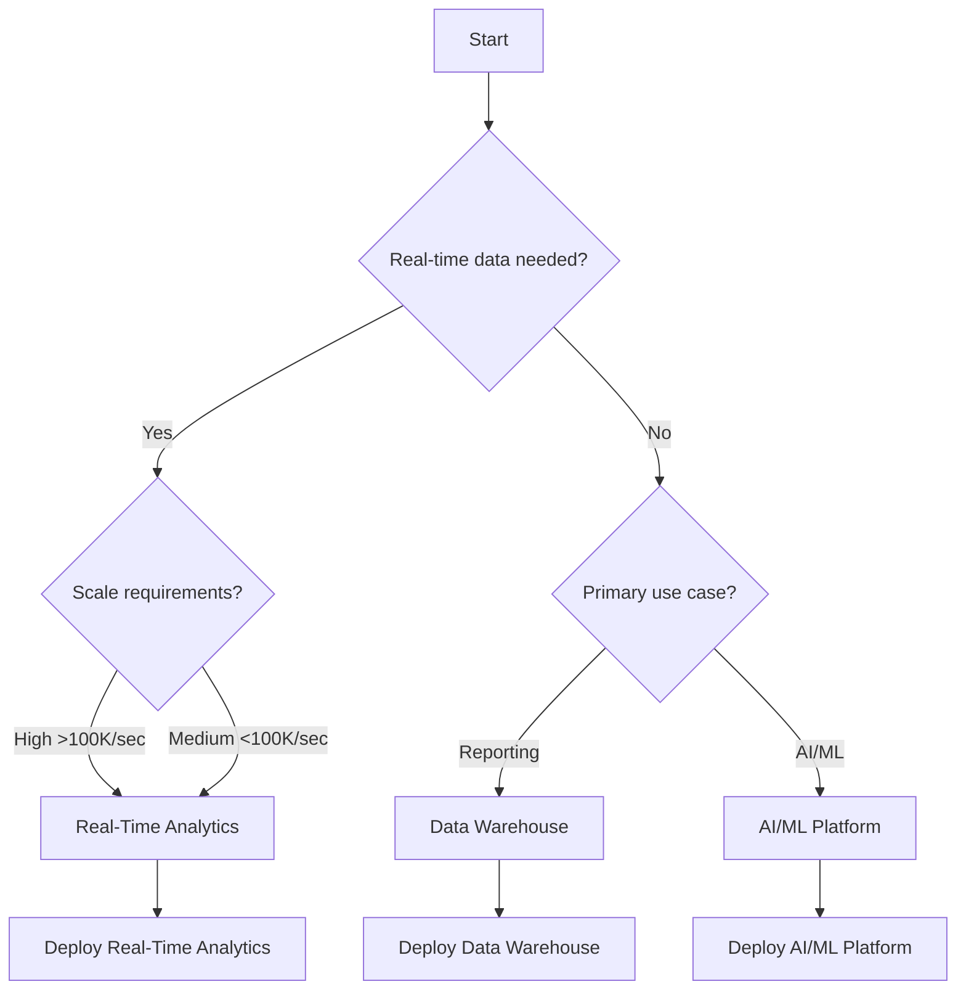

# 🏗️ Cloud Scale Analytics Solutions

> __🏠 [Home](../../README.md)__ | __📚 Documentation__ | __🏗️ Solutions__

---

## 📋 Overview

This section contains complete, production-ready solution architectures for Cloud Scale Analytics implementations on Azure. Each solution includes comprehensive documentation, implementation guides, operational procedures, and best practices derived from real-world deployments.

## 🎯 Available Solutions

### 🚀 [Azure Real-Time Analytics](./azure-realtime-analytics/README.md)

__Enterprise real-time analytics platform processing 1.2M+ events/second__

| Aspect | Details |
|--------|---------|
| __Use Cases__ | IoT analytics, fraud detection, customer 360, supply chain |
| __Core Technologies__ | Databricks, Delta Lake, Kafka, Power BI |
| __Scale__ | 1.2M events/sec, <5 sec latency, 99.99% availability |
| __Status__ | ✅ Production Ready |

__Key Features:__

- Real-time stream processing with Databricks
- Delta Lake for ACID-compliant storage
- Power BI Direct Lake for instant insights
- Azure OpenAI integration for AI enrichment
- Zero-trust security architecture

[→ View Solution](./azure-realtime-analytics/README.md)

---

### 🏭 Modern Data Warehouse (Coming Soon)

__Cloud-native data warehouse with Synapse Analytics__

| Aspect | Details |
|--------|---------|
| __Use Cases__ | Enterprise reporting, historical analytics, data marts |
| __Core Technologies__ | Synapse Analytics, Dedicated SQL Pools |
| __Scale__ | Petabyte-scale, 10,000+ concurrent users |
| __Status__ | 📝 In Development |

---

### 🤖 AI/ML Platform (Coming Soon)

__End-to-end machine learning platform__

| Aspect | Details |
|--------|---------|
| __Use Cases__ | Model training, deployment, monitoring, MLOps |
| __Core Technologies__ | Azure ML, Databricks MLflow, Azure OpenAI |
| __Scale__ | 1000+ models, automated retraining |
| __Status__ | 📝 In Development |

---

## 📊 Solution Comparison

| Solution | Real-Time | Batch | AI/ML | BI | Cost | Complexity |
|----------|-----------|-------|-------|-----|------|------------|
| __Real-Time Analytics__ | ⭐⭐⭐⭐⭐ | ⭐⭐⭐⭐ | ⭐⭐⭐⭐ | ⭐⭐⭐⭐⭐ | $$$$ | High |
| __Modern Data Warehouse__ | ⭐⭐ | ⭐⭐⭐⭐⭐ | ⭐⭐⭐ | ⭐⭐⭐⭐⭐ | $$$ | Medium |
| __AI/ML Platform__ | ⭐⭐⭐ | ⭐⭐⭐⭐ | ⭐⭐⭐⭐⭐ | ⭐⭐⭐ | $$$$ | High |

## 🎯 Choosing the Right Solution

### Decision Tree

### Selection Criteria

| If You Need... | Choose... | Why |
|----------------|-----------|-----|
| Sub-second insights | Real-Time Analytics | Optimized for streaming |
| Historical reporting | Data Warehouse | Cost-effective for batch |
| Machine learning at scale | AI/ML Platform | Complete MLOps pipeline |
| Mixed workloads | Real-Time Analytics | Supports both patterns |
| Maximum cost efficiency | Data Warehouse | Lowest cost per query |

## 📚 Solution Components

### Common Architecture Patterns

All solutions follow these architectural principles:

1. __Medallion Architecture__ - Bronze, Silver, Gold data layers
2. __Zero Trust Security__ - Defense in depth approach
3. __Infrastructure as Code__ - Automated deployment
4. __GitOps__ - Version-controlled operations
5. __Observability First__ - Comprehensive monitoring

### Technology Stack

| Layer | Technologies | Purpose |
|-------|-------------|---------|
| __Ingestion__ | Event Hubs, Kafka, Data Factory | Data collection |
| __Processing__ | Databricks, Synapse, Stream Analytics | Data transformation |
| __Storage__ | ADLS Gen2, Delta Lake, Cosmos DB | Data persistence |
| __Analytics__ | Power BI, Azure ML, Synapse SQL | Insights generation |
| __Governance__ | Purview, Unity Catalog | Data management |

## 🚀 Getting Started

### Prerequisites

All solutions require:

- ✅ Azure subscription (Owner/Contributor access)
- ✅ Azure DevOps or GitHub account
- ✅ Power BI Pro or Premium license
- ✅ Basic knowledge of Azure services

### Deployment Process

1. __Choose Solution__ - Select based on requirements
2. __Review Architecture__ - Understand components
3. __Prepare Environment__ - Set up prerequisites
4. __Deploy Infrastructure__ - Use provided IaC templates
5. __Configure Services__ - Follow implementation guides
6. __Validate Deployment__ - Run test scenarios
7. __Operationalize__ - Set up monitoring and maintenance

### Time to Deploy

| Solution | Infrastructure | Configuration | Testing | Total |
|----------|---------------|---------------|---------|-------|
| Real-Time Analytics | 2 hours | 4 hours | 2 hours | 8 hours |
| Data Warehouse | 1 hour | 2 hours | 1 hour | 4 hours |
| AI/ML Platform | 3 hours | 6 hours | 3 hours | 12 hours |

## 📈 Success Stories

### Real-Time Analytics Implementation

__Customer:__ Global Retail Chain  
__Challenge:__ Process 500M daily transactions in real-time  
__Solution:__ Azure Real-Time Analytics with Databricks  
__Results:__

- 🚀 Sub-second fraud detection
- 💰 32% cost reduction vs previous solution
- 📊 Real-time inventory optimization
- 🎯 99.99% availability achieved

### Key Metrics Achieved

| Metric | Before | After | Improvement |
|--------|--------|-------|-------------|
| Processing Latency | 15 minutes | 3 seconds | 300x faster |
| Data Freshness | 1 hour | Real-time | Instant |
| Cost per Transaction | $0.0012 | $0.0008 | 33% reduction |
| System Availability | 99.5% | 99.99% | 10x improvement |

## 🛡️ Security & Compliance

All solutions include:

- __Zero Trust Architecture__ - Never trust, always verify
- __Encryption__ - At rest and in transit
- __Identity Management__ - Azure AD integration
- __Network Security__ - Private endpoints, NSGs
- __Compliance__ - SOC 2, ISO 27001, GDPR ready
- __Monitoring__ - Security Center, Sentinel

## 📊 Cost Optimization

### Built-in Cost Controls

- __Auto-scaling__ - Scale based on demand
- __Spot Instances__ - Up to 90% compute savings
- __Data Tiering__ - Hot/cool/archive storage
- __Reserved Capacity__ - Predictable workload savings
- __Resource Tagging__ - Cost tracking and allocation

### Typical Monthly Costs

| Solution | Small | Medium | Large | Enterprise |
|----------|-------|--------|-------|------------|
| Real-Time Analytics | $5K | $15K | $50K | $100K+ |
| Data Warehouse | $3K | $10K | $30K | $75K+ |
| AI/ML Platform | $4K | $12K | $40K | $80K+ |

*Costs vary based on data volume, processing requirements, and region*

## 🤝 Support & Resources

### Documentation

Each solution includes:

- 📖 Architecture documentation
- 🚀 Implementation guides
- 🔧 Operational runbooks
- 📊 Performance tuning guides
- 🔒 Security best practices
- 💰 Cost optimization strategies

### Community

- 💬 [Discussion Forum](https://github.com/fgarofalo56/csa-inabox-docs/discussions)
- 🐛 [Issue Tracker](https://github.com/fgarofalo56/csa-inabox-docs/issues)
- 📧 [Email Support](mailto:csa-support@microsoft.com)
- 📚 [Knowledge Base](https://learn.microsoft.com/azure)

### Training Resources

- 🎓 [Azure Architecture Center](https://docs.microsoft.com/azure/architecture/)
- 📖 [Databricks Academy](https://academy.databricks.com/)
- 🎯 [Power BI Learning Path](https://docs.microsoft.com/learn/powerbi/)
- 🔧 [Azure Training](https://azure.microsoft.com/training/)

## 🔄 Contributing

We welcome contributions:

1. __Share Your Solution__ - Submit PR with your architecture
2. __Improve Documentation__ - Enhance existing content
3. __Report Issues__ - Help us improve
4. __Suggest Features__ - Request new solutions

See [Contributing Guide](../guides/CONTRIBUTING_GUIDE.md) for details.

---

__Last Updated:__ January 28, 2025  
__Version:__ 1.0.0  
__Maintainer:__ Cloud Scale Analytics Team
