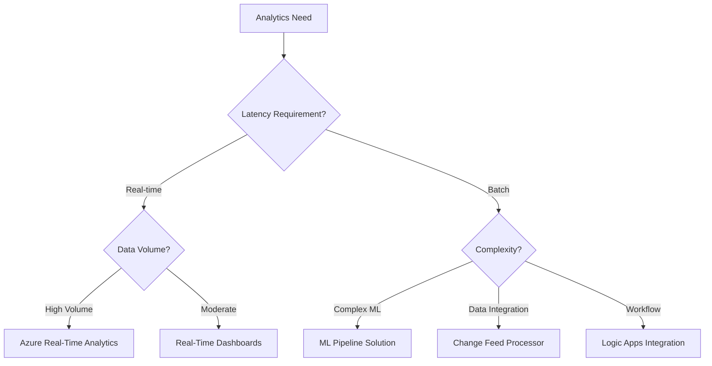

# Solutions

> __[Home](../../README.md)__ | __Solutions__


End-to-end solution architectures and implementation guides for common analytics scenarios.

---

## Overview

This section provides complete, production-ready solutions that combine multiple Azure services to solve real-world analytics challenges.

---

## Solution Catalog

### Real-Time Analytics

| Solution | Services | Use Case |
|----------|----------|----------|
| [Azure Real-Time Analytics](../solutions/azure-realtime-analytics/README.md) | Event Hubs, Stream Analytics, Synapse | IoT and streaming analytics |
| [Real-Time Dashboards](../solutions/real-time-dashboards/README.md) | Event Hubs, ASA, Power BI | Live operational dashboards |

### Data Integration

| Solution | Services | Use Case |
|----------|----------|----------|
| [Change Feed Processor](../solutions/change-feed-processor/README.md) | Cosmos DB, Functions, Event Hubs | Event-driven data sync |
| [Logic Apps Integration](../solutions/logic-apps-integration/README.md) | Logic Apps, Event Grid, Functions | Workflow automation |

### Machine Learning

| Solution | Services | Use Case |
|----------|----------|----------|
| [ML Pipeline](../solutions/ml-pipeline/README.md) | Databricks, MLflow, Azure ML | End-to-end MLOps |

### Data Governance

| Solution | Services | Use Case |
|----------|----------|----------|
| [Data Lineage Solution](../solutions/data-governance/lineage.md) | Purview, Synapse, Databricks | Enterprise data lineage |

---

## Solution Selection Guide



---

## Common Architecture Patterns

### Event-Driven Architecture

```
Event Source → Event Hubs → Stream Analytics → Data Lake → Power BI
                    ↓
               Functions → Cosmos DB
```

### Lakehouse Architecture

```
Sources → Data Factory → Bronze → Spark/Databricks → Silver → Gold → Synapse
                                                              ↓
                                                         Power BI
```

### MLOps Architecture

```
Data Lake → Feature Store → Training → MLflow → Deployment → Monitoring
                              ↑                      ↓
                          Experiment              Inference
```

---

## Getting Started

1. **Choose a Solution**: Review the catalog above
2. **Check Prerequisites**: Each solution lists required resources
3. **Deploy Infrastructure**: Use provided ARM/Terraform templates
4. **Configure Services**: Follow step-by-step guides
5. **Test and Validate**: Use included test scenarios
6. **Monitor Operations**: Set up recommended alerting

---

## Related Documentation

- [Architecture Patterns](../03-architecture-patterns/README.md)
- [Implementation Guides](../04-implementation-guides/README.md)
- [Best Practices](../05-best-practices/README.md)

---

*Last Updated: January 2025*
