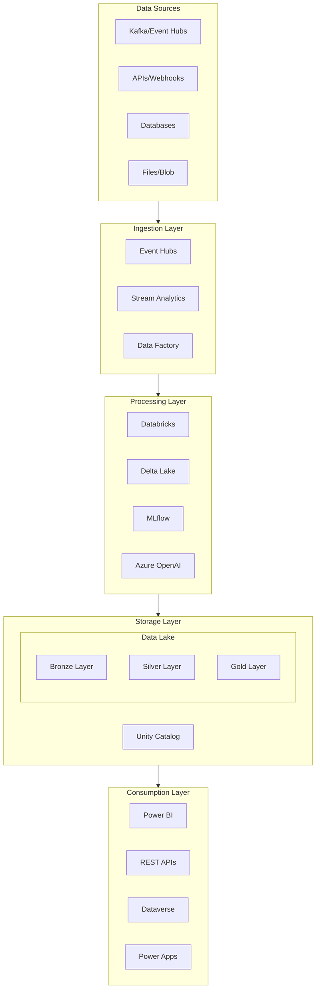
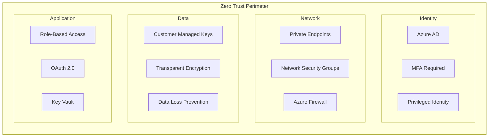
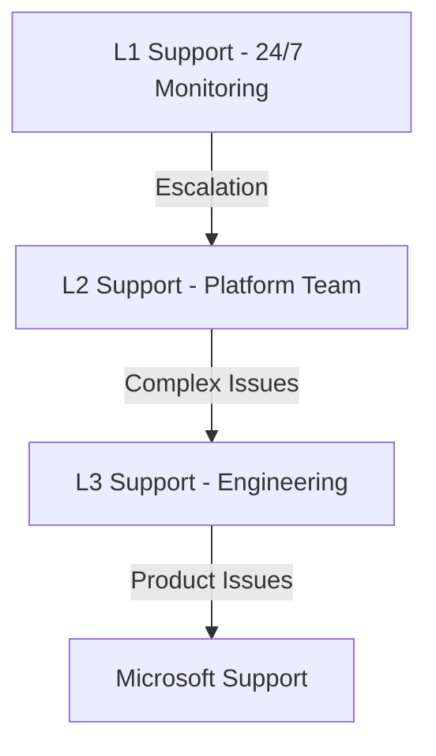

# 🚀 Azure Real-Time Analytics Solution

> __🏠 [Home](../../../README.md)__ | __📚 [Documentation](../../README.md)__ | __🏗️ Solutions__

---


## 📋 Overview

Enterprise-grade real-time analytics platform built on Microsoft Azure with Databricks, designed for massive scale, enterprise security, and operational excellence. This solution processes over __1.2 million events per second__ with __sub-5-second latency__ while maintaining __99.99% availability__.

## 📑 Table of Contents

- [Platform Overview](#platform-overview)
- [Key Capabilities](#key-capabilities)
- [Architecture](#architecture)
- [Quick Start](#quick-start)
- [Documentation](#documentation)
- [Performance Metrics](#performance-metrics)
- [Security & Compliance](#security-compliance)
- [Support](#support)

---

## 🎯 Platform Overview

### Business Value

| Metric | Value | Impact |
|--------|-------|--------|
| __Data Velocity__ | 1.2M+ events/sec | Real-time decision making |
| __Processing Latency__ | <5 seconds (p99) | Immediate insights |
| __Cost Efficiency__ | -32% vs baseline | Optimized TCO |
| __Data Quality__ | 99.8% accuracy | Trusted analytics |
| __Time to Insight__ | <1 minute | Faster decisions |
| __Availability__ | 99.99% uptime | Business continuity |

### Use Cases

- __Real-Time Dashboards__ - Executive and operational dashboards
- __Streaming Analytics__ - IoT, clickstream, and log analytics
- __Predictive Analytics__ - ML-powered forecasting and anomaly detection
- __Customer 360__ - Real-time customer insights and personalization
- __Fraud Detection__ - Sub-second fraud identification and prevention
- __Supply Chain__ - Real-time inventory and logistics optimization

---

## 🚀 Key Capabilities

### Core Features

| Capability | Description | Technology |
|------------|-------------|------------|
| __Stream Processing__ | Real-time event processing at scale | Databricks Structured Streaming |
| __Data Lake__ | Scalable storage with ACID guarantees | Delta Lake on ADLS Gen2 |
| __AI/ML Integration__ | Advanced analytics and predictions | Azure OpenAI, MLflow |
| __Business Intelligence__ | Self-service analytics and reporting | Power BI Direct Lake |
| __Data Governance__ | Enterprise data catalog and lineage | Unity Catalog |
| __Security__ | Zero-trust architecture with encryption | Azure Security Center |

### Technical Specifications

```yaml
Performance:
  Throughput: 1.2M events/second
  Latency: <5 seconds (p99)
  Availability: 99.99% SLA
  
Scale:
  Storage: Petabyte-scale
  Compute: Auto-scaling (2-500 nodes)
  Concurrent Users: 10,000+
  
Integration:
  Data Sources: 50+ connectors
  Output Formats: 15+ supported
  APIs: REST, GraphQL, gRPC
```

---

## 🏗️ Architecture

### High-Level Architecture



### Technology Stack

| Layer | Technology | Purpose |
|-------|------------|---------|
| __Ingestion__ | Confluent Kafka, Event Hubs | High-throughput data ingestion |
| __Processing__ | Azure Databricks | Unified analytics engine |
| __Storage__ | ADLS Gen2, Delta Lake | Scalable data lake storage |
| __Orchestration__ | Azure Data Factory | Workflow orchestration |
| __AI/ML__ | Azure OpenAI, MLflow | Advanced analytics |
| __BI__ | Power BI | Business intelligence |
| __Governance__ | Unity Catalog, Purview | Data governance |
| __Security__ | Azure Security Center | Security monitoring |
| __Monitoring__ | Azure Monitor, Datadog | Observability |

### Data Architecture Layers

#### Bronze Layer (Raw Data)

- __Purpose__: Raw data ingestion and storage
- __Format__: Delta Lake with schema evolution
- __Retention__: 90 days hot, 2 years cold
- __Processing__: Minimal transformation, deduplication

#### Silver Layer (Cleansed Data)

- __Purpose__: Validated and enriched data
- __Format__: Delta Lake with enforced schema
- __Quality__: Data quality checks, validation rules
- __Processing__: Cleaning, normalization, enrichment

#### Gold Layer (Business Data)

- __Purpose__: Business-ready aggregated datasets
- __Format__: Delta Lake optimized for queries
- __Model__: Star/snowflake schemas
- __Access__: Direct Lake from Power BI

---

## 🚀 Quick Start

### Prerequisites

- ✅ Azure subscription with Owner/Contributor access
- ✅ Azure Databricks workspace (Premium tier)
- ✅ Power BI Premium capacity (P1 minimum)
- ✅ Azure DevOps or GitHub for CI/CD
- ✅ Confluent Cloud account (optional)

### Deployment Steps

#### 1️⃣ Infrastructure Setup

```bash
# Clone repository
git clone https://github.com/your-org/azure-realtime-analytics.git
cd azure-realtime-analytics

# Deploy infrastructure
az deployment sub create \
  --location eastus \
  --template-file infrastructure/main.bicep \
  --parameters @infrastructure/parameters.json
```

#### 2️⃣ Databricks Configuration

```python
# Configure Databricks workspace
databricks configure --token

# Deploy notebooks
databricks workspace import_dir \
  ./notebooks /Shared/RealTimeAnalytics

# Create clusters
databricks clusters create --json-file cluster-config.json
```

#### 3️⃣ Data Pipeline Setup

```sql
-- Create catalog and schemas
CREATE CATALOG IF NOT EXISTS realtime_analytics;
USE CATALOG realtime_analytics;

CREATE SCHEMA IF NOT EXISTS bronze;
CREATE SCHEMA IF NOT EXISTS silver;
CREATE SCHEMA IF NOT EXISTS gold;

-- Create streaming tables
CREATE OR REPLACE TABLE bronze.events (
  event_id STRING,
  event_time TIMESTAMP,
  event_data STRING
) USING DELTA;
```

#### 4️⃣ Power BI Integration

1. Open Power BI Desktop
2. Get Data → Azure → Azure Databricks
3. Enter workspace URL and credentials
4. Select Direct Lake mode
5. Choose gold layer tables
6. Build reports and dashboards

---

## 📚 Documentation

### Architecture Documentation

| Document | Description | Audience |
|----------|-------------|----------|
| __[Architecture Overview](./architecture/README.md)__ | Complete system architecture | Architects, Tech Leads |
| __[Component Design](./architecture/components.md)__ | Detailed component specifications | Engineers |
| __[Data Flow](./architecture/data-flow.md)__ | End-to-end data flow patterns | Data Engineers |
| __[Security Architecture](./architecture/security.md)__ | Zero-trust security implementation | Security Teams |
| __[Network Design](./architecture/network.md)__ | Network topology and connectivity | Network Engineers |

### Implementation Guides

| Guide | Description | Time |
|-------|-------------|------|
| __[Deployment Guide](./implementation/deployment.md)__ | Step-by-step deployment | 4 hours |
| __[Databricks Setup](./implementation/databricks-setup.md)__ | Workspace configuration | 2 hours |
| __[Stream Processing](./implementation/stream-processing.md)__ | Real-time pipeline setup | 3 hours |
| __[Power BI Integration](./implementation/power-bi.md)__ | BI platform integration | 2 hours |
| __[MLflow Configuration](./implementation/mlflow.md)__ | ML lifecycle setup | 3 hours |

### Operations Documentation

| Document | Purpose | Frequency |
|----------|---------|-----------|
| __[Monitoring Guide](./operations/monitoring.md)__ | System monitoring setup | Continuous |
| __[Performance Tuning](./operations/performance.md)__ | Optimization procedures | Weekly |
| __[Disaster Recovery](./operations/disaster-recovery.md)__ | DR procedures | Quarterly |
| __[Maintenance Runbook](./operations/maintenance.md)__ | Maintenance tasks | As needed |
| __[Troubleshooting](./operations/troubleshooting.md)__ | Common issues and fixes | Reference |

---

## 📊 Performance Metrics

### Current Performance (Production)

| Metric | Current | Target | Status |
|--------|---------|--------|--------|
| __Throughput__ | 1.2M events/sec | 1M events/sec | ✅ Exceeding |
| __E2E Latency__ | 3.7 sec (p99) | <5 sec | ✅ Meeting |
| __Availability__ | 99.99% | 99.95% | ✅ Exceeding |
| __Data Quality__ | 99.8% | 99.5% | ✅ Exceeding |
| __Cost/Million Events__ | $0.85 | <$1.00 | ✅ Optimized |

### Resource Utilization

```yaml
Compute:
  Databricks:
    Peak Clusters: 12
    Avg DBU/hour: 450
    Spot Usage: 78%
    
Storage:
  Data Lake:
    Total Size: 2.3 PB
    Daily Growth: 1.2 TB
    Compression: 85%
    
Network:
  Ingress: 4.2 GB/s
  Egress: 1.8 GB/s
  Cross-region: 200 MB/s
```

### Cost Optimization

| Strategy | Savings | Implementation |
|----------|---------|----------------|
| __Spot Instances__ | 65% compute | 78% of clusters |
| __Auto-scaling__ | 30% idle time | Dynamic sizing |
| __Data Tiering__ | 40% storage | Hot/cold/archive |
| __Caching__ | 25% query cost | Result caching |
| __Compression__ | 85% storage | Zstd compression |

---

## 🔒 Security & Compliance

### Security Architecture



### Compliance Certifications

| Standard | Status | Last Audit | Next Audit |
|----------|--------|------------|------------|
| __SOC 2 Type II__ | ✅ Certified | Oct 2024 | Apr 2025 |
| __ISO 27001__ | ✅ Compliant | Sep 2024 | Sep 2025 |
| __GDPR__ | ✅ Ready | Continuous | Continuous |
| __HIPAA__ | ✅ Compatible | Nov 2024 | Nov 2025 |
| __PCI DSS__ | 🔄 In Progress | - | Mar 2025 |

### Security Controls

- __Identity__: Azure AD with MFA, conditional access
- __Network__: Private endpoints, network isolation
- __Data__: Encryption at rest/transit, data masking
- __Access__: RBAC, least privilege, JIT access
- __Monitoring__: Security Center, Sentinel integration
- __Compliance__: Policy enforcement, audit logging

---

## 🛠️ Operations & Maintenance

### Operational Procedures

| Procedure | Frequency | Duration | Owner |
|-----------|-----------|----------|-------|
| __Health Checks__ | Every 5 min | Automated | Monitoring System |
| __Performance Review__ | Daily | 30 min | Platform Team |
| __Capacity Planning__ | Weekly | 2 hours | Architecture Team |
| __Security Scan__ | Weekly | 4 hours | Security Team |
| __DR Testing__ | Monthly | 8 hours | Operations Team |
| __Platform Updates__ | Monthly | 4 hours | Engineering Team |

### SLA Commitments

| Service | SLA | Actual | Penalty |
|---------|-----|--------|---------|
| __Availability__ | 99.95% | 99.99% | Service credits |
| __Data Freshness__ | <5 min | <2 min | Investigation |
| __Query Response__ | <3 sec | <1 sec | Optimization |
| __Incident Response__ | <15 min | <10 min | Escalation |

### Support Model



---

## 🤝 Contributing

We welcome contributions to improve the platform:

1. __Fork__ the repository
2. __Create__ feature branch (`feature/amazing-feature`)
3. __Commit__ changes with clear messages
4. __Test__ thoroughly in dev environment
5. __Submit__ pull request with description

### Contribution Areas

- 📊 Performance optimizations
- 🔒 Security enhancements
- 📚 Documentation improvements
- 🧪 Test coverage expansion
- 🎨 Dashboard templates
- 🔧 Automation scripts

---

## 📞 Support

### Contact Information

| Team | Contact | Response Time |
|------|---------|---------------|
| __Platform Team__ | <platform@company.com> | <2 hours |
| __Security Team__ | <security@company.com> | <1 hour (critical) |
| __Data Team__ | <data@company.com> | <4 hours |
| __On-Call__ | +1-555-0100 | Immediate |

### Resources

- 📚 [Internal Wiki](https://wiki.company.com/realtime-analytics)
- 💬 [Slack Channel](https://company.slack.com/channels/realtime-analytics)
- 🎓 [Training Materials](https://learn.company.com/realtime-analytics)
- 🐛 [Issue Tracker](https://jira.company.com/browse/RTA)

### External Resources

- [Azure Architecture Center](https://docs.microsoft.com/azure/architecture/)
- [Databricks Documentation](https://docs.databricks.com/)
- [Delta Lake Documentation](https://docs.delta.io/)
- [Power BI Documentation](https://docs.microsoft.com/power-bi/)

---

__Last Updated:__ January 28, 2025  
__Version:__ 2.0.0  
__Status:__ ✅ Production Ready  
__Owner:__ Cloud Scale Analytics Team
