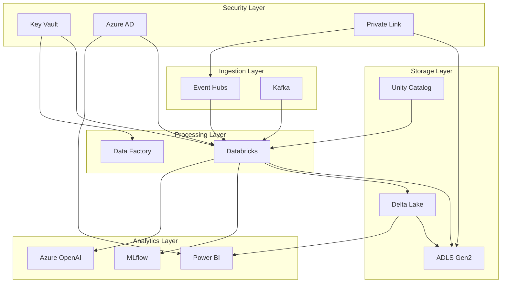

# Solution Components Overview

> __🏠 [Home](../../../../README.md)__ | __📚 [Documentation](../../../README.md)__ | __🏗️ [Solutions](../../README.md)__ | __⚡ [Real-Time Analytics](../README.md)__ | __🏛️ [Architecture](README.md)__ | __🔧 Components__

---


## Overview

This document provides detailed specifications for all components in the Azure Real-Time Analytics solution. Each component is designed for high availability, scalability, and enterprise-grade security.

## Table of Contents

- [Data Ingestion Components](#data-ingestion-components)
- [Processing Components](#processing-components)
- [Storage Components](#storage-components)
- [Analytics Components](#analytics-components)
- [Governance Components](#governance-components)
- [Security Components](#security-components)
- [Monitoring Components](#monitoring-components)
- [Component Dependencies](#component-dependencies)

---

## Data Ingestion Components

### Azure Event Hubs

**Purpose:** High-throughput event streaming platform

**Specifications:**

| Aspect | Configuration | Notes |
|--------|--------------|-------|
| __Tier__ | Premium | Dedicated capacity |
| __Throughput Units__ | 20-100 (auto-inflate) | Dynamic scaling |
| __Partitions__ | 32 per hub | Parallel processing |
| __Retention__ | 7 days | Extended retention |
| __Capture__ | Enabled to ADLS Gen2 | Automatic backup |

**Features:**

- Kafka protocol compatibility
- Geo-disaster recovery
- Virtual network integration
- Managed identity authentication
- Auto-inflate enabled

**Configuration Example:**

```bash
az eventhubs namespace create \
  --name realtime-events-prod \
  --resource-group realtime-analytics-rg \
  --location eastus \
  --sku Premium \
  --capacity 20 \
  --enable-auto-inflate true \
  --maximum-throughput-units 100
```

### Confluent Kafka

**Purpose:** Enterprise-grade streaming platform for high-volume data

**Specifications:**

| Component | Configuration | Purpose |
|-----------|--------------|---------|
| __Cluster Type__ | Dedicated | Isolated resources |
| __Brokers__ | 3-9 nodes | High availability |
| __Storage__ | 1-10 TB per broker | Message retention |
| __Replication__ | Factor 3 | Data durability |
| __Availability Zones__ | Multi-AZ | Fault tolerance |

**Features:**

- Schema Registry integration
- ksqlDB for stream processing
- Cluster linking for geo-replication
- Role-based access control
- Confluent Control Center monitoring

**Topics Configuration:**

```properties
# Production topics
events.raw.v1
  partitions: 32
  replication.factor: 3
  retention.ms: 604800000  # 7 days

events.processed.v1
  partitions: 16
  replication.factor: 3
  retention.ms: 259200000  # 3 days
```

### Azure Stream Analytics

**Purpose:** Real-time stream processing for simple transformations

**Specifications:**

| Aspect | Value | Description |
|--------|-------|-------------|
| __Streaming Units__ | 6-120 (auto-scale) | Processing capacity |
| __Compatibility Level__ | 1.2 | Latest features |
| __Output Error Policy__ | Drop | Error handling |
| __Event Ordering__ | Adjust | 5-second tolerance |

**Use Cases:**

- IoT telemetry processing
- Log aggregation and filtering
- Real-time alerting
- Stream-to-storage routing

---

## Processing Components

### Azure Databricks

**Purpose:** Unified analytics platform for batch and streaming

**Workspace Configuration:**

| Component | Specification | Notes |
|-----------|--------------|-------|
| __Tier__ | Premium | Unity Catalog enabled |
| __Runtime__ | 13.3 LTS ML | Long-term support |
| __Cluster Policy__ | Job, Interactive | Enforced policies |
| __Network__ | VNet injection | Private networking |
| __Storage__ | ADLS Gen2 | Delta Lake storage |

**Cluster Configurations:**

#### High Concurrency Cluster

```python
{
  "cluster_name": "shared-analytics-cluster",
  "spark_version": "13.3.x-scala2.12",
  "node_type_id": "Standard_DS3_v2",
  "autoscale": {
    "min_workers": 2,
    "max_workers": 50
  },
  "spark_conf": {
    "spark.databricks.delta.preview.enabled": "true",
    "spark.databricks.delta.optimizeWrite.enabled": "true",
    "spark.databricks.delta.autoCompact.enabled": "true"
  },
  "enable_elastic_disk": true,
  "data_security_mode": "USER_ISOLATION"
}
```

#### Streaming Job Cluster

```python
{
  "cluster_name": "streaming-processor",
  "spark_version": "13.3.x-scala2.12",
  "node_type_id": "Standard_L8s_v2",
  "num_workers": 12,
  "spark_conf": {
    "spark.streaming.backpressure.enabled": "true",
    "spark.databricks.delta.properties.defaults.autoOptimize.optimizeWrite": "true"
  },
  "spot_bid_price_percent": 100,
  "enable_local_disk_encryption": true
}
```

### Delta Lake

**Purpose:** ACID-compliant data lake storage layer

**Configuration:**

| Feature | Setting | Benefit |
|---------|---------|---------|
| __Auto Optimize__ | Enabled | Automatic file compaction |
| __Optimize Write__ | Enabled | Better file sizes |
| __Data Skipping__ | Enabled | Query performance |
| __Z-Ordering__ | Business keys | Colocation optimization |
| __Vacuum__ | 7 days retention | Storage cleanup |

**Table Properties:**

```sql
CREATE TABLE gold.customer_analytics (
  customer_id STRING NOT NULL,
  event_timestamp TIMESTAMP,
  metrics MAP<STRING, DOUBLE>,
  aggregations STRUCT<...>
)
USING DELTA
PARTITIONED BY (DATE(event_timestamp))
TBLPROPERTIES (
  'delta.autoOptimize.optimizeWrite' = 'true',
  'delta.autoOptimize.autoCompact' = 'true',
  'delta.enableChangeDataFeed' = 'true',
  'delta.deletedFileRetentionDuration' = 'interval 7 days'
);
```

### Azure Data Factory

**Purpose:** Orchestration and ETL pipeline management

**Components:**

| Component | Purpose | Count |
|-----------|---------|-------|
| __Pipelines__ | Workflow orchestration | 50+ |
| __Linked Services__ | Connection management | 25+ |
| __Datasets__ | Data definitions | 100+ |
| __Triggers__ | Schedule/event-based | 30+ |
| __Integration Runtime__ | Compute environment | 3 |

**Pipeline Patterns:**

- Incremental data loading
- Full refresh with validation
- Change data capture (CDC)
- Event-driven processing
- Scheduled batch jobs

---

## Storage Components

### Azure Data Lake Storage Gen2

**Purpose:** Scalable, secure data lake storage

**Configuration:**

| Feature | Setting | Purpose |
|---------|---------|---------|
| __Tier__ | Premium | Low latency |
| __Replication__ | ZRS | Zone redundancy |
| __Hierarchical Namespace__ | Enabled | Directory operations |
| __Encryption__ | Customer-managed keys | Data security |
| __Lifecycle Management__ | Hot/Cool/Archive | Cost optimization |

**Container Structure:**

```text
realtime-analytics/
├── bronze/              # Raw ingested data
│   ├── events/
│   ├── logs/
│   └── telemetry/
├── silver/              # Cleansed data
│   ├── validated/
│   ├── enriched/
│   └── deduplicated/
├── gold/                # Business-ready data
│   ├── aggregations/
│   ├── dimensions/
│   └── facts/
└── checkpoints/         # Streaming checkpoints
    └── streaming/
```

**Lifecycle Policies:**

```json
{
  "rules": [
    {
      "name": "MoveBronzeToCool",
      "type": "Lifecycle",
      "definition": {
        "actions": {
          "baseBlob": {
            "tierToCool": {
              "daysAfterModificationGreaterThan": 30
            },
            "tierToArchive": {
              "daysAfterModificationGreaterThan": 90
            }
          }
        },
        "filters": {
          "blobTypes": ["blockBlob"],
          "prefixMatch": ["bronze/"]
        }
      }
    }
  ]
}
```

### Unity Catalog

**Purpose:** Unified governance for data and AI assets

**Hierarchy:**

```text
Catalog: realtime_analytics
├── Schema: bronze
│   ├── Tables: events, logs, telemetry
│   └── Volumes: raw_files
├── Schema: silver
│   ├── Tables: validated_events, enriched_data
│   └── Views: latest_events
└── Schema: gold
    ├── Tables: customer_metrics, product_analytics
    ├── Views: executive_dashboard
    └── Functions: calculate_metrics()
```

**Security Model:**

```sql
-- Grant access to data engineers
GRANT USE CATALOG ON CATALOG realtime_analytics TO `data-engineers`;
GRANT USE SCHEMA, SELECT, MODIFY ON SCHEMA realtime_analytics.silver TO `data-engineers`;

-- Grant read-only access to analysts
GRANT USE CATALOG ON CATALOG realtime_analytics TO `analysts`;
GRANT USE SCHEMA, SELECT ON SCHEMA realtime_analytics.gold TO `analysts`;
```

---

## Analytics Components

### Azure OpenAI

**Purpose:** AI-powered analytics and insights

**Deployments:**

| Model | Version | Purpose | RPM Limit |
|-------|---------|---------|-----------|
| __GPT-4__ | 0125-Preview | Advanced reasoning | 10K |
| __GPT-3.5-Turbo__ | 0125 | High throughput | 60K |
| __Text-Embedding-3-Large__ | 3.0 | Vector search | 100K |

**Use Cases:**

- Natural language query generation
- Automated data insights
- Anomaly explanation
- Report summarization
- Predictive analytics enhancement

**Integration Example:**

```python
from openai import AzureOpenAI

client = AzureOpenAI(
    azure_endpoint=os.getenv("AZURE_OPENAI_ENDPOINT"),
    api_key=os.getenv("AZURE_OPENAI_API_KEY"),
    api_version="2024-02-15-preview"
)

# Generate SQL from natural language
response = client.chat.completions.create(
    model="gpt-4",
    messages=[{
        "role": "system",
        "content": "Generate SQL for Azure Databricks Delta tables"
    }, {
        "role": "user",
        "content": "Show top 10 customers by revenue last month"
    }]
)
```

### MLflow

**Purpose:** Machine learning lifecycle management

**Components:**

| Component | Purpose | Storage |
|-----------|---------|---------|
| __Tracking Server__ | Experiment tracking | Azure SQL |
| __Model Registry__ | Model versioning | ADLS Gen2 |
| __Artifacts Store__ | Model artifacts | ADLS Gen2 |

**Model Management:**

```python
import mlflow
from mlflow.tracking import MlflowClient

# Configure MLflow
mlflow.set_tracking_uri("databricks")
mlflow.set_registry_uri("databricks-uc")

# Log experiment
with mlflow.start_run(run_name="customer_churn_v3"):
    mlflow.log_params({"max_depth": 10, "learning_rate": 0.01})
    mlflow.log_metrics({"accuracy": 0.94, "f1_score": 0.92})
    mlflow.sklearn.log_model(model, "model",
                             registered_model_name="customer_churn")
```

### Power BI

**Purpose:** Business intelligence and visualization

**Configuration:**

| Component | Specification | Purpose |
|-----------|--------------|---------|
| __Capacity__ | P1 (2 cores) | Premium features |
| __Mode__ | Direct Lake | Real-time queries |
| __Gateway__ | Not required | Direct connection |
| __Refresh__ | Real-time | Live data |

**Features:**

- Direct Lake from Delta tables
- Composite models
- Incremental refresh
- Query folding
- RLS (Row-Level Security)

---

## Governance Components

### Azure Purview

**Purpose:** Data governance and discovery

**Features:**

| Feature | Status | Purpose |
|---------|--------|---------|
| __Data Catalog__ | ✅ Active | Asset discovery |
| __Data Lineage__ | ✅ Active | Impact analysis |
| __Data Classification__ | ✅ Active | Sensitivity labeling |
| __Scanning__ | ✅ Automated | Metadata extraction |

**Scanned Sources:**

- Azure Data Lake Storage Gen2
- Azure Databricks (Unity Catalog)
- Azure SQL Database
- Power BI datasets

### Azure Policy

**Purpose:** Governance and compliance enforcement

**Policies:**

```json
{
  "policyName": "Require-Private-Endpoints",
  "description": "Enforce private endpoints for all data services",
  "effect": "Deny",
  "resources": [
    "Microsoft.Storage/storageAccounts",
    "Microsoft.Databricks/workspaces",
    "Microsoft.EventHub/namespaces"
  ]
}
```

---

## Security Components

### Azure Key Vault

**Purpose:** Secrets and certificate management

**Stored Secrets:**

- Database connection strings
- Service principal credentials
- API keys and tokens
- Encryption keys
- SSL certificates

**Access Policies:**

```bash
# Grant Databricks access to secrets
az keyvault set-policy \
  --name realtime-kv-prod \
  --object-id <databricks-msi> \
  --secret-permissions get list
```

### Azure Private Link

**Purpose:** Private network connectivity

**Endpoints:**

| Service | Endpoint Type | Purpose |
|---------|--------------|---------|
| __ADLS Gen2__ | Private | Storage access |
| __Event Hubs__ | Private | Event streaming |
| __Key Vault__ | Private | Secret access |
| __Databricks__ | Private | Workspace access |

---

## Monitoring Components

### Azure Monitor

**Purpose:** Platform monitoring and alerting

**Components:**

- Application Insights (application telemetry)
- Log Analytics (centralized logging)
- Metrics (performance monitoring)
- Alerts (proactive notifications)
- Workbooks (custom dashboards)

**Key Metrics:**

```kusto
// Event Hubs throughput
AzureMetrics
| where ResourceProvider == "MICROSOFT.EVENTHUB"
| where MetricName == "IncomingMessages"
| summarize Total = sum(Total) by bin(TimeGenerated, 5m)
```

### Datadog

**Purpose:** Advanced APM and infrastructure monitoring

**Integrations:**

- Azure Monitor integration
- Databricks metrics
- Custom application metrics
- Synthetic monitoring
- Real user monitoring (RUM)

---

## Component Dependencies

### Dependency Matrix



### Critical Path

1. **Data Ingestion:** Event Hubs/Kafka → Databricks
2. **Processing:** Databricks → Delta Lake → ADLS Gen2
3. **Governance:** Unity Catalog → Access Control
4. **Analytics:** Power BI → Direct Lake → Delta Tables
5. **Security:** Azure AD → Key Vault → Private Link

---

## Component Sizing Guide

### Small Deployment (Dev/Test)

| Component | Size | Monthly Cost |
|-----------|------|--------------|
| Event Hubs | Basic, 2 TU | $50 |
| Databricks | Standard, 2 workers | $500 |
| ADLS Gen2 | 100 GB | $5 |
| **Total** | | **~$600** |

### Medium Deployment (Production)

| Component | Size | Monthly Cost |
|-----------|------|--------------|
| Event Hubs | Premium, 20 TU | $2,000 |
| Databricks | Premium, 10 workers avg | $5,000 |
| ADLS Gen2 | 10 TB | $500 |
| Power BI | P1 capacity | $5,000 |
| **Total** | | **~$13,000** |

### Large Deployment (Enterprise)

| Component | Size | Monthly Cost |
|-----------|------|--------------|
| Event Hubs | Premium, 100 TU | $10,000 |
| Databricks | Premium, 50 workers avg | $25,000 |
| ADLS Gen2 | 100 TB | $2,500 |
| Power BI | P3 capacity | $20,000 |
| **Total** | | **~$60,000** |

---

## Related Documentation

- [Architecture Overview](README.md)
- [Data Flow Architecture](data-flow.md)
- [Network Architecture](network.md)
- [Security Architecture](security.md)
- [Implementation Guide](../implementation/README.md)

---

**Last Updated:** January 2025
**Version:** 1.0.0
**Status:** Production Ready
