# Data Flow Architecture

> __🏠 [Home](../../../../README.md)__ | __📚 [Documentation](../../../README.md)__ | __🏗️ [Solutions](../../README.md)__ | __⚡ [Real-Time Analytics](../README.md)__ | __🏛️ [Architecture](README.md)__ | __🔄 Data Flow__

---


## Overview

This document details the end-to-end data flow architecture for the Azure Real-Time Analytics solution, covering ingestion patterns, processing stages, and consumption models.

## Table of Contents

- [Data Flow Overview](#data-flow-overview)
- [Ingestion Patterns](#ingestion-patterns)
- [Processing Stages](#processing-stages)
- [Bronze Layer Processing](#bronze-layer-processing)
- [Silver Layer Processing](#silver-layer-processing)
- [Gold Layer Processing](#gold-layer-processing)
- [Streaming Patterns](#streaming-patterns)
- [Batch Patterns](#batch-patterns)
- [Data Quality Gates](#data-quality-gates)
- [Consumption Patterns](#consumption-patterns)

---

## Data Flow Overview

### High-Level Flow

```mermaid
flowchart LR
    subgraph Sources["Data Sources"]
        direction TB
        API[REST APIs]
        IoT[IoT Devices]
        DB[Databases]
        Files[File Feeds]
    end

    subgraph Ingestion["Ingestion"]
        direction TB
        EH[Event Hubs]
        Kafka[Kafka]
        ADF[Data Factory]
    end

    subgraph Bronze["Bronze Layer"]
        direction TB
        Raw[Raw Data<br/>Delta Tables]
        Schema[Schema on Read]
    end

    subgraph Silver["Silver Layer"]
        direction TB
        Clean[Cleansed Data]
        Valid[Validated Data]
        Enrich[Enriched Data]
    end

    subgraph Gold["Gold Layer"]
        direction TB
        Agg[Aggregations]
        Dim[Dimensions]
        Fact[Facts]
    end

    subgraph Consume["Consumption"]
        direction TB
        PBI[Power BI]
        APIs[REST APIs]
        ML[ML Models]
    end

    Sources --> Ingestion
    Ingestion --> Bronze
    Bronze --> Silver
    Silver --> Gold
    Gold --> Consume
```



### Data Flow Characteristics

| Stage | Latency | Volume | Quality | Format |
|-------|---------|--------|---------|--------|
| __Ingestion__ | <1 second | 1.2M events/sec | Raw | JSON/Avro |
| __Bronze__ | <2 seconds | 100% retained | No validation | Delta Parquet |
| __Silver__ | <5 seconds | 98% retained | Validated | Delta Parquet |
| __Gold__ | <10 seconds | Aggregated | Business-ready | Delta Parquet |
| __Consumption__ | Real-time | On-demand | SLA-backed | DirectLake/API |

---

## Ingestion Patterns

### Real-Time Event Ingestion

**Event Hubs Pattern:**

```python
# Structured Streaming from Event Hubs
event_hub_conf = {
    "eventhubs.connectionString": sc._jvm.org.apache.spark.eventhubs.EventHubsUtils.encrypt(connection_string),
    "eventhubs.consumerGroup": "$Default",
    "maxEventsPerTrigger": 10000,
    "startingPosition": "latest"
}

events_stream = (spark
    .readStream
    .format("eventhubs")
    .options(**event_hub_conf)
    .load()
)

# Parse and write to Bronze
bronze_stream = (events_stream
    .select(
        col("enqueuedTime").alias("ingestion_timestamp"),
        col("body").cast("string").alias("event_data"),
        col("systemProperties").alias("metadata")
    )
    .writeStream
    .format("delta")
    .outputMode("append")
    .option("checkpointLocation", "/checkpoints/bronze/events")
    .trigger(processingTime="10 seconds")
    .table("bronze.events")
)
```

**Kafka Pattern:**

```python
# Structured Streaming from Kafka
kafka_options = {
    "kafka.bootstrap.servers": "kafka-broker:9092",
    "subscribe": "events.raw.v1",
    "startingOffsets": "latest",
    "maxOffsetsPerTrigger": 100000,
    "kafka.security.protocol": "SASL_SSL",
    "kafka.sasl.mechanism": "PLAIN"
}

kafka_stream = (spark
    .readStream
    .format("kafka")
    .options(**kafka_options)
    .load()
    .select(
        col("timestamp").alias("kafka_timestamp"),
        col("key").cast("string"),
        col("value").cast("string").alias("event_data"),
        col("topic"),
        col("partition"),
        col("offset")
    )
)
```

### Batch Ingestion

**Data Factory Pattern:**

```json
{
  "name": "IngestDatabaseChanges",
  "type": "Copy",
  "inputs": [{
    "referenceName": "SqlServerSource",
    "type": "DatasetReference"
  }],
  "outputs": [{
    "referenceName": "DeltaBronze",
    "type": "DatasetReference"
  }],
  "typeProperties": {
    "source": {
      "type": "SqlServerSource",
      "sqlReaderQuery": "SELECT * FROM Orders WHERE ModifiedDate > '@{pipeline().parameters.LastRunTime}'"
    },
    "sink": {
      "type": "DeltaSink",
      "writeBatchSize": 100000,
      "writeBehavior": "append"
    },
    "enableStaging": true,
    "stagingSettings": {
      "linkedServiceName": "AzureBlobStorage",
      "path": "staging/orders"
    }
  }
}
```

---

## Bronze Layer Processing

### Purpose

- **Store raw data** exactly as received
- **Enable data replay** and reprocessing
- **Schema evolution** support
- **Audit trail** maintenance

### Processing Logic

```python
from pyspark.sql.functions import *
from delta.tables import DeltaTable

# Bronze ingestion with minimal transformation
def process_to_bronze(source_stream, checkpoint_path, target_table):
    """
    Ingest raw data to Bronze layer with audit columns
    """
    bronze_stream = (source_stream
        .withColumn("ingestion_timestamp", current_timestamp())
        .withColumn("ingestion_date", current_date())
        .withColumn("source_system", lit("event_hub"))
        .withColumn("file_name", input_file_name())
        .writeStream
        .format("delta")
        .outputMode("append")
        .option("checkpointLocation", checkpoint_path)
        .option("mergeSchema", "true")  # Enable schema evolution
        .partitionBy("ingestion_date")
        .trigger(processingTime="30 seconds")
        .table(target_table)
    )
    return bronze_stream

# Example usage
bronze_events = process_to_bronze(
    source_stream=events_stream,
    checkpoint_path="/checkpoints/bronze/events",
    target_table="bronze.events"
)
```

### Bronze Table Schema

```sql
CREATE TABLE IF NOT EXISTS bronze.events (
    -- Original data
    event_data STRING,

    -- Audit columns
    ingestion_timestamp TIMESTAMP,
    ingestion_date DATE,
    source_system STRING,
    file_name STRING,

    -- Metadata
    kafka_offset BIGINT,
    kafka_partition INT,
    event_hub_sequence_number BIGINT
)
USING DELTA
PARTITIONED BY (ingestion_date)
TBLPROPERTIES (
    'delta.autoOptimize.optimizeWrite' = 'true',
    'delta.enableChangeDataFeed' = 'true'
);
```

---

## Silver Layer Processing

### Purpose

- **Parse and validate** raw data
- **Cleanse and standardize** formats
- **Deduplicate** records
- **Enrich** with reference data
- **Apply business rules**

### Processing Logic

```python
from pyspark.sql.functions import *
from pyspark.sql.types import *

# Define schema for parsing
event_schema = StructType([
    StructField("event_id", StringType(), False),
    StructField("customer_id", StringType(), False),
    StructField("event_type", StringType(), False),
    StructField("event_time", TimestampType(), False),
    StructField("properties", MapType(StringType(), StringType()), True)
])

def process_to_silver(bronze_table, checkpoint_path, target_table):
    """
    Parse, validate, and cleanse data for Silver layer
    """
    # Read from Bronze
    bronze_stream = spark.readStream.table(bronze_table)

    # Parse JSON and validate
    silver_stream = (bronze_stream
        # Parse JSON
        .withColumn("parsed", from_json(col("event_data"), event_schema))
        .select("parsed.*", "ingestion_timestamp")

        # Data quality checks
        .filter(col("event_id").isNotNull())
        .filter(col("customer_id").isNotNull())
        .filter(col("event_time").isNotNull())

        # Deduplication
        .dropDuplicates(["event_id"])

        # Standardization
        .withColumn("event_type", upper(col("event_type")))
        .withColumn("customer_id", regexp_replace(col("customer_id"), "[^0-9]", ""))

        # Enrichment placeholder
        .withColumn("processing_timestamp", current_timestamp())
    )

    # Write to Silver
    query = (silver_stream
        .writeStream
        .format("delta")
        .outputMode("append")
        .option("checkpointLocation", checkpoint_path)
        .trigger(processingTime="1 minute")
        .table(target_table)
    )

    return query

# Execute
silver_events = process_to_silver(
    bronze_table="bronze.events",
    checkpoint_path="/checkpoints/silver/events",
    target_table="silver.events"
)
```

### Data Quality Rules

```python
class DataQualityRules:
    """
    Centralized data quality rules for Silver layer
    """

    @staticmethod
    def validate_customer_id(df):
        """Validate customer ID format"""
        return df.filter(
            (length(col("customer_id")) == 10) &
            (col("customer_id").rlike("^[0-9]+$"))
        )

    @staticmethod
    def validate_event_time(df):
        """Validate event timestamp is within acceptable range"""
        current_time = current_timestamp()
        return df.filter(
            (col("event_time") <= current_time) &
            (col("event_time") >= date_sub(current_time, 30))
        )

    @staticmethod
    def validate_required_fields(df, required_fields):
        """Ensure required fields are not null"""
        for field in required_fields:
            df = df.filter(col(field).isNotNull())
        return df

    @staticmethod
    def apply_all_rules(df):
        """Apply all validation rules"""
        df = DataQualityRules.validate_customer_id(df)
        df = DataQualityRules.validate_event_time(df)
        df = DataQualityRules.validate_required_fields(df,
            ["event_id", "customer_id", "event_type"])
        return df
```

### Silver Table Schema

```sql
CREATE TABLE IF NOT EXISTS silver.events (
    -- Business keys
    event_id STRING NOT NULL,
    customer_id STRING NOT NULL,

    -- Event details
    event_type STRING NOT NULL,
    event_time TIMESTAMP NOT NULL,
    properties MAP<STRING, STRING>,

    -- Audit columns
    ingestion_timestamp TIMESTAMP,
    processing_timestamp TIMESTAMP,

    -- Partition keys
    event_date DATE GENERATED ALWAYS AS (CAST(event_time AS DATE))
)
USING DELTA
PARTITIONED BY (event_date)
TBLPROPERTIES (
    'delta.autoOptimize.optimizeWrite' = 'true',
    'delta.autoOptimize.autoCompact' = 'true',
    'delta.enableChangeDataFeed' = 'true'
);
```

---

## Gold Layer Processing

### Purpose

- **Aggregate** data for analytics
- **Create** business entities
- **Implement** star schema
- **Optimize** for reporting
- **Apply** complex business logic

### Dimension Tables

```python
def create_customer_dimension():
    """
    Create slowly changing dimension for customers
    """
    # Read latest customer data
    customer_updates = spark.read.table("silver.customers")

    # Apply SCD Type 2 logic
    from delta.tables import DeltaTable

    customer_dim = DeltaTable.forName(spark, "gold.dim_customer")

    customer_dim.alias("target").merge(
        customer_updates.alias("source"),
        "target.customer_id = source.customer_id AND target.is_current = true"
    ).whenMatchedUpdate(
        condition="target.customer_hash != source.customer_hash",
        set={
            "is_current": "false",
            "end_date": "source.effective_date"
        }
    ).whenNotMatchedInsert(
        values={
            "customer_id": "source.customer_id",
            "customer_name": "source.customer_name",
            "customer_tier": "source.customer_tier",
            "start_date": "source.effective_date",
            "end_date": "cast(null as date)",
            "is_current": "true",
            "customer_hash": "source.customer_hash"
        }
    ).execute()
```

### Fact Tables

```python
def create_event_facts():
    """
    Create fact table with aggregated metrics
    """
    facts = (spark
        .read
        .table("silver.events")
        .groupBy(
            "event_date",
            "customer_id",
            "event_type"
        )
        .agg(
            count("*").alias("event_count"),
            countDistinct("event_id").alias("unique_events"),
            min("event_time").alias("first_event_time"),
            max("event_time").alias("last_event_time"),
            collect_list("properties").alias("all_properties")
        )
        .withColumn("aggregation_timestamp", current_timestamp())
    )

    # Write with merge to handle late arrivals
    from delta.tables import DeltaTable

    fact_table = DeltaTable.forName(spark, "gold.fact_events")

    fact_table.alias("target").merge(
        facts.alias("source"),
        """target.event_date = source.event_date AND
           target.customer_id = source.customer_id AND
           target.event_type = source.event_type"""
    ).whenMatchedUpdate(
        set={
            "event_count": "source.event_count",
            "unique_events": "source.unique_events",
            "first_event_time": "source.first_event_time",
            "last_event_time": "source.last_event_time",
            "aggregation_timestamp": "source.aggregation_timestamp"
        }
    ).whenNotMatchedInsert(
        values={
            "event_date": "source.event_date",
            "customer_id": "source.customer_id",
            "event_type": "source.event_type",
            "event_count": "source.event_count",
            "unique_events": "source.unique_events",
            "first_event_time": "source.first_event_time",
            "last_event_time": "source.last_event_time",
            "aggregation_timestamp": "source.aggregation_timestamp"
        }
    ).execute()
```

### Gold Layer Optimization

```sql
-- Optimize tables for query performance
OPTIMIZE gold.fact_events
ZORDER BY (customer_id, event_type);

-- Analyze table statistics
ANALYZE TABLE gold.fact_events COMPUTE STATISTICS FOR ALL COLUMNS;

-- Vacuum old files
VACUUM gold.fact_events RETAIN 168 HOURS;
```

---

## Streaming Patterns

### Exactly-Once Processing

```python
def exactly_once_stream(source_stream, checkpoint_path, target_table, merge_keys):
    """
    Implement exactly-once semantics using merge
    """
    def merge_to_delta(batch_df, batch_id):
        from delta.tables import DeltaTable

        # Get target table
        delta_table = DeltaTable.forName(spark, target_table)

        # Build merge condition
        merge_condition = " AND ".join([
            f"target.{key} = source.{key}" for key in merge_keys
        ])

        # Merge with idempotent logic
        delta_table.alias("target").merge(
            batch_df.alias("source"),
            merge_condition
        ).whenMatchedUpdateAll(
        ).whenNotMatchedInsertAll(
        ).execute()

    # Execute streaming merge
    query = (source_stream
        .writeStream
        .foreachBatch(merge_to_delta)
        .option("checkpointLocation", checkpoint_path)
        .trigger(processingTime="1 minute")
        .start()
    )

    return query
```

### Watermarking for Late Data

```python
def process_with_watermark(stream_df):
    """
    Handle late-arriving data with watermarks
    """
    watermarked = (stream_df
        .withWatermark("event_time", "10 minutes")
        .groupBy(
            window("event_time", "5 minutes"),
            "customer_id"
        )
        .agg(
            count("*").alias("event_count"),
            avg("metric_value").alias("avg_metric")
        )
    )

    return watermarked
```

---

## Data Quality Gates

### Quality Checks

```python
class DataQualityGate:
    """
    Automated data quality checks between layers
    """

    @staticmethod
    def check_record_count(source_table, target_table, threshold=0.95):
        """Ensure record count is within expected range"""
        source_count = spark.table(source_table).count()
        target_count = spark.table(target_table).count()

        ratio = target_count / source_count if source_count > 0 else 0

        assert ratio >= threshold, f"Record count ratio {ratio} below threshold {threshold}"

    @staticmethod
    def check_null_percentage(table, column, threshold=0.05):
        """Check null percentage in critical columns"""
        df = spark.table(table)
        total = df.count()
        nulls = df.filter(col(column).isNull()).count()

        null_pct = nulls / total if total > 0 else 0

        assert null_pct <= threshold, f"Null percentage {null_pct} exceeds threshold {threshold}"

    @staticmethod
    def check_duplicate_keys(table, key_columns):
        """Ensure no duplicate keys"""
        df = spark.table(table)

        duplicates = (df
            .groupBy(key_columns)
            .count()
            .filter(col("count") > 1)
            .count()
        )

        assert duplicates == 0, f"Found {duplicates} duplicate keys"
```

---

## Consumption Patterns

### Power BI Direct Lake

```python
# Optimize tables for Direct Lake mode
spark.sql("""
    ALTER TABLE gold.customer_analytics
    SET TBLPROPERTIES (
        'delta.enableChangeDataFeed' = 'true',
        'delta.autoOptimize.optimizeWrite' = 'true'
    )
""")

# Create views for Power BI
spark.sql("""
    CREATE OR REPLACE VIEW gold.vw_customer_metrics AS
    SELECT
        c.customer_id,
        c.customer_name,
        c.customer_tier,
        f.event_date,
        f.event_count,
        f.total_revenue,
        f.avg_order_value
    FROM gold.dim_customer c
    INNER JOIN gold.fact_customer_metrics f
        ON c.customer_id = f.customer_id
    WHERE c.is_current = true
""")
```

### REST API

```python
from databricks import sql

def get_customer_metrics(customer_id, start_date, end_date):
    """
    Query gold layer via SQL endpoint
    """
    connection = sql.connect(
        server_hostname=os.getenv("DATABRICKS_SERVER_HOSTNAME"),
        http_path=os.getenv("DATABRICKS_HTTP_PATH"),
        access_token=os.getenv("DATABRICKS_TOKEN")
    )

    cursor = connection.cursor()

    query = f"""
        SELECT * FROM gold.vw_customer_metrics
        WHERE customer_id = '{customer_id}'
        AND event_date BETWEEN '{start_date}' AND '{end_date}'
        ORDER BY event_date DESC
    """

    cursor.execute(query)
    results = cursor.fetchall()

    cursor.close()
    connection.close()

    return results
```

---

## Performance Optimization

### Caching Strategy

```python
# Cache frequently accessed reference data
spark.sql("CACHE TABLE gold.dim_customer")
spark.sql("CACHE TABLE gold.dim_product")

# Uncache when no longer needed
spark.sql("UNCACHE TABLE gold.dim_customer")
```

### Partitioning Strategy

```sql
-- Partition by date for time-series queries
CREATE TABLE gold.fact_events
PARTITIONED BY (event_date)
...

-- Partition by customer tier for segmentation
CREATE TABLE gold.fact_customer_metrics
PARTITIONED BY (customer_tier, event_date)
...
```

---

## Related Documentation

- [Architecture Components](components.md)
- [Network Architecture](network.md)
- [Stream Processing Implementation](../implementation/stream-processing.md)
- [Batch Processing Implementation](../implementation/batch-processing.md)
- [Data Quality Implementation](../implementation/data-quality.md)

---

**Last Updated:** January 2025
**Version:** 1.0.0
**Status:** Production Ready
