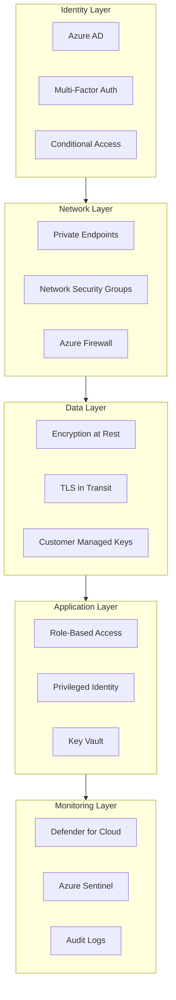

# Security Architecture

> __🏠 [Home](../../../../README.md)__ | __📚 [Documentation](../../../README.md)__ | __🏗️ [Solutions](../../README.md)__ | __⚡ [Real-Time Analytics](../README.md)__ | __🏛️ [Architecture](README.md)__ | __🔒 Security__

---


## Overview

This document describes the security architecture for the Azure Real-Time Analytics solution, implementing defense-in-depth with zero-trust principles, identity-based access control, and comprehensive security monitoring.

## Table of Contents

- [Security Principles](#security-principles)
- [Identity and Access Management](#identity-and-access-management)
- [Data Protection](#data-protection)
- [Network Security](#network-security)
- [Threat Protection](#threat-protection)
- [Compliance and Governance](#compliance-and-governance)
- [Security Monitoring](#security-monitoring)
- [Incident Response](#incident-response)

---

## Security Principles

### Zero Trust Architecture



### Defense-in-Depth Layers

| Layer | Controls | Purpose |
|-------|----------|---------|
| __Identity__ | Azure AD, MFA, Conditional Access | Verify user identity |
| __Network__ | Private Link, NSG, Firewall | Isolate resources |
| __Data__ | Encryption, Masking, CMK | Protect data |
| __Application__ | RBAC, Managed Identity, Secrets | Control access |
| __Monitoring__ | Defender, Sentinel, Logs | Detect threats |

---

## Identity and Access Management

### Azure Active Directory Integration

```bash
# Configure Azure AD authentication for Databricks
az databricks workspace update \
  --resource-group analytics-rg \
  --name databricks-workspace \
  --aad-tenant-id <tenant-id> \
  --prepare-encryption

# Enable SCIM provisioning
# Via Azure Portal: Azure AD > Enterprise Applications > Databricks > Provisioning
```

### Conditional Access Policies

```json
{
  "displayName": "Require MFA for Databricks Access",
  "state": "enabled",
  "conditions": {
    "applications": {
      "includeApplications": ["2ff814a6-3304-4ab8-85cb-cd0e6f879c1d"]
    },
    "users": {
      "includeGroups": ["DataEngineers", "DataScientists"]
    },
    "locations": {
      "includeLocations": ["All"],
      "excludeLocations": ["TrustedNetwork"]
    }
  },
  "grantControls": {
    "operator": "AND",
    "builtInControls": ["mfa", "compliantDevice"]
  }
}
```

### Role-Based Access Control

#### Databricks Workspace Roles

```python
# Unity Catalog role assignments
from databricks.sdk import WorkspaceClient

w = WorkspaceClient()

# Grant catalog access
w.grants.update(
    securable_type="catalog",
    full_name="realtime_analytics",
    changes=[
        {
            "principal": "data-engineers",
            "add": ["USE_CATALOG", "USE_SCHEMA", "SELECT", "MODIFY"]
        },
        {
            "principal": "analysts",
            "add": ["USE_CATALOG", "USE_SCHEMA", "SELECT"]
        },
        {
            "principal": "data-scientists",
            "add": ["USE_CATALOG", "USE_SCHEMA", "SELECT", "EXECUTE"]
        }
    ]
)
```

#### Azure RBAC Assignments

```bash
# Assign Storage Blob Data Contributor to Databricks MSI
az role assignment create \
  --role "Storage Blob Data Contributor" \
  --assignee-object-id <databricks-msi-object-id> \
  --scope /subscriptions/{subscription-id}/resourceGroups/{rg}/providers/Microsoft.Storage/storageAccounts/{storage-account}

# Assign Event Hubs Data Receiver
az role assignment create \
  --role "Azure Event Hubs Data Receiver" \
  --assignee-object-id <databricks-msi-object-id> \
  --scope /subscriptions/{subscription-id}/resourceGroups/{rg}/providers/Microsoft.EventHub/namespaces/{namespace}
```

### Managed Identities

```python
# Use managed identity in Databricks
from azure.identity import DefaultAzureCredential
from azure.storage.blob import BlobServiceClient

# Authenticate with managed identity
credential = DefaultAzureCredential()

# Access storage
blob_service_client = BlobServiceClient(
    account_url="https://storageaccount.blob.core.windows.net",
    credential=credential
)

# List containers
containers = blob_service_client.list_containers()
for container in containers:
    print(container.name)
```

### Privileged Identity Management

```bash
# Configure PIM for Azure resources
# Via Azure Portal: Azure AD > Privileged Identity Management

# Sample PIM settings:
{
  "roleName": "Owner",
  "resourceScope": "/subscriptions/{sub-id}/resourceGroups/analytics-rg",
  "settings": {
    "activationDuration": "PT8H",
    "requireMFA": true,
    "requireJustification": true,
    "requireApproval": true,
    "approvers": ["security-team@company.com"]
  }
}
```

---

## Data Protection

### Encryption at Rest

```bash
# Enable customer-managed keys for Storage Account
az storage account update \
  --resource-group analytics-rg \
  --name realtimeanalyticsstorage \
  --encryption-key-source Microsoft.Keyvault \
  --encryption-key-vault https://analytics-kv.vault.azure.net \
  --encryption-key-name storage-encryption-key

# Enable encryption for Databricks managed services
az databricks workspace update \
  --resource-group analytics-rg \
  --name databricks-workspace \
  --key-source Microsoft.Keyvault \
  --key-vault-uri https://analytics-kv.vault.azure.net \
  --key-name databricks-encryption-key \
  --key-version <version>
```

### Encryption in Transit

```python
# Enforce TLS 1.2 for all connections
spark.conf.set("spark.databricks.delta.ssl.enabled", "true")
spark.conf.set("spark.databricks.delta.ssl.protocolVersion", "TLSv1.2")

# Event Hubs with TLS
from azure.eventhub import EventHubProducerClient

producer = EventHubProducerClient.from_connection_string(
    conn_str=connection_string,
    eventhub_name=eventhub_name,
    transport_type="AmqpOverWebsocket",  # Forces HTTPS
)
```

### Data Masking and Classification

```sql
-- Apply dynamic data masking
CREATE TABLE gold.customer_sensitive (
    customer_id STRING,
    customer_name STRING,
    email STRING MASK 'email',  -- Mask email addresses
    ssn STRING MASK 'hash',     -- Hash SSN
    credit_score INT MASK 'default'  -- Show default value
)
USING DELTA
TBLPROPERTIES (
    'delta.feature.columnMapping.enabled' = 'true',
    'delta.columnMapping.mode' = 'name'
);

-- Tag sensitive columns
ALTER TABLE gold.customer_sensitive
ALTER COLUMN ssn
SET TAGS ('classification' = 'PII', 'sensitivity' = 'HIGH');
```

### Key Vault Integration

```bash
# Create Key Vault
az keyvault create \
  --resource-group analytics-rg \
  --name analytics-kv-prod \
  --location eastus \
  --enable-purge-protection true \
  --enable-soft-delete true \
  --retention-days 90 \
  --sku premium

# Store secrets
az keyvault secret set \
  --vault-name analytics-kv-prod \
  --name "storage-account-key" \
  --value "<storage-key>"

az keyvault secret set \
  --vault-name analytics-kv-prod \
  --name "eventhub-connection-string" \
  --value "<connection-string>"
```

```python
# Access secrets in Databricks
# Create secret scope backed by Key Vault
databricks secrets create-scope \
  --scope kv-secrets \
  --scope-backend-type AZURE_KEYVAULT \
  --resource-id /subscriptions/{sub-id}/resourceGroups/{rg}/providers/Microsoft.KeyVault/vaults/analytics-kv-prod \
  --dns-name https://analytics-kv-prod.vault.azure.net/

# Use secrets in code
storage_account_key = dbutils.secrets.get(scope="kv-secrets", key="storage-account-key")

spark.conf.set(
    f"fs.azure.account.key.storageaccount.dfs.core.windows.net",
    storage_account_key
)
```

---

## Network Security

### Private Link Configuration

```bash
# Disable public access to Storage Account
az storage account update \
  --resource-group analytics-rg \
  --name realtimeanalyticsstorage \
  --public-network-access Disabled

# Create private endpoint
az network private-endpoint create \
  --resource-group analytics-rg \
  --name storage-pe \
  --vnet-name analytics-vnet \
  --subnet private-endpoints \
  --private-connection-resource-id /subscriptions/{sub-id}/resourceGroups/{rg}/providers/Microsoft.Storage/storageAccounts/realtimeanalyticsstorage \
  --group-id blob \
  --connection-name storage-blob-pe-connection
```

### Network Security Groups

```bash
# Create NSG rule to deny internet outbound
az network nsg rule create \
  --resource-group analytics-rg \
  --nsg-name databricks-nsg \
  --name DenyInternetOutbound \
  --priority 4000 \
  --direction Outbound \
  --access Deny \
  --protocol '*' \
  --source-address-prefixes '*' \
  --source-port-ranges '*' \
  --destination-address-prefixes Internet \
  --destination-port-ranges '*'

# Allow only required Azure services
az network nsg rule create \
  --resource-group analytics-rg \
  --nsg-name databricks-nsg \
  --name AllowAzureServices \
  --priority 100 \
  --direction Outbound \
  --access Allow \
  --protocol Tcp \
  --source-address-prefixes VirtualNetwork \
  --destination-address-prefixes AzureCloud \
  --destination-port-ranges 443
```

### Service Endpoints and Private Endpoints

| Service | Connectivity | Security |
|---------|--------------|----------|
| __Storage Account__ | Private Endpoint | No public access |
| __Event Hubs__ | Private Endpoint | VNet only |
| __Key Vault__ | Private Endpoint | IP whitelist |
| __Databricks__ | VNet Injection | Private Link |
| __SQL Endpoint__ | Private Endpoint | Azure AD auth |

---

## Threat Protection

### Microsoft Defender for Cloud

```bash
# Enable Defender for Cloud plans
az security pricing create \
  --name VirtualMachines \
  --tier Standard

az security pricing create \
  --name StorageAccounts \
  --tier Standard

az security pricing create \
  --name SqlServers \
  --tier Standard

az security pricing create \
  --name KeyVaults \
  --tier Standard
```

### Azure Sentinel Integration

```kusto
// Create analytics rule for suspicious Databricks activity
let SuspiciousCommands = dynamic(["rm -rf", "DROP DATABASE", "DROP TABLE", "TRUNCATE"]);
AzureDiagnostics
| where Category == "clusters" or Category == "jobs"
| where TimeGenerated > ago(1h)
| extend Command = tostring(parse_json(properties_s).commandText)
| where Command has_any (SuspiciousCommands)
| project TimeGenerated, User = identity_s, Command, ClusterName = resourceId
| summarize Count = count() by User, Command
| where Count > 5
```

### Advanced Threat Protection

```bash
# Enable ATP for Storage Account
az storage account update \
  --resource-group analytics-rg \
  --name realtimeanalyticsstorage \
  --enable-advanced-threat-protection true

# Configure ATP policies
az security atp storage update \
  --resource-group analytics-rg \
  --storage-account realtimeanalyticsstorage \
  --is-enabled true
```

---

## Compliance and Governance

### Azure Policy

```json
{
  "properties": {
    "displayName": "Require encryption for all storage accounts",
    "policyType": "Custom",
    "mode": "All",
    "parameters": {},
    "policyRule": {
      "if": {
        "allOf": [
          {
            "field": "type",
            "equals": "Microsoft.Storage/storageAccounts"
          },
          {
            "field": "Microsoft.Storage/storageAccounts/encryption.services.blob.enabled",
            "notEquals": "true"
          }
        ]
      },
      "then": {
        "effect": "deny"
      }
    }
  }
}
```

### Compliance Frameworks

| Framework | Status | Controls Implemented |
|-----------|--------|---------------------|
| __SOC 2 Type II__ | ✅ Compliant | 150+ controls |
| __ISO 27001__ | ✅ Certified | Information security |
| __GDPR__ | ✅ Ready | Data privacy |
| __HIPAA__ | ✅ Compatible | Health data protection |
| __PCI DSS__ | 🔄 In Progress | Payment data security |

### Data Governance with Purview

```bash
# Register data sources in Purview
az purview account create \
  --resource-group analytics-rg \
  --name analytics-purview \
  --location eastus

# Scan ADLS Gen2
# Via Purview Studio: Register and scan
{
  "name": "ADLS-Gen2-Scan",
  "kind": "AdlsGen2Msi",
  "properties": {
    "scanRulesetName": "AdlsGen2",
    "scanRulesetType": "System"
  }
}
```

---

## Security Monitoring

### Diagnostic Settings

```bash
# Enable diagnostics for Storage Account
az monitor diagnostic-settings create \
  --resource /subscriptions/{sub-id}/resourceGroups/{rg}/providers/Microsoft.Storage/storageAccounts/realtimeanalyticsstorage \
  --name storage-diagnostics \
  --logs '[{"category":"StorageRead","enabled":true},{"category":"StorageWrite","enabled":true},{"category":"StorageDelete","enabled":true}]' \
  --metrics '[{"category":"Transaction","enabled":true}]' \
  --workspace /subscriptions/{sub-id}/resourceGroups/{rg}/providers/Microsoft.OperationalInsights/workspaces/analytics-workspace
```

### Security Alerts

```kusto
// Alert on failed authentication attempts
SigninLogs
| where TimeGenerated > ago(1h)
| where ResultType != "0"  // Failed sign-in
| where AppDisplayName == "Azure Databricks"
| summarize FailedAttempts = count() by UserPrincipalName, IPAddress
| where FailedAttempts > 5
| project TimeGenerated = now(), User = UserPrincipalName, IPAddress, FailedAttempts
```

### Audit Logging

```sql
-- Enable audit logging for Unity Catalog
ALTER CATALOG realtime_analytics
SET TBLPROPERTIES (
    'delta.enableChangeDataFeed' = 'true',
    'audit.enabled' = 'true'
);

-- Query audit logs
SELECT *
FROM system.access.audit
WHERE action_name IN ('CREATE', 'DROP', 'ALTER', 'SELECT', 'INSERT', 'UPDATE', 'DELETE')
AND event_time > current_timestamp() - INTERVAL 24 HOURS
ORDER BY event_time DESC;
```

---

## Incident Response

### Security Incident Playbook

#### 1. Detection and Analysis

```kusto
// Investigate security incident
SecurityAlert
| where TimeGenerated > ago(24h)
| where AlertSeverity in ("High", "Medium")
| summarize AlertCount = count() by AlertName, CompromisedEntity
| order by AlertCount desc
```

#### 2. Containment

```bash
# Revoke access for compromised account
az ad user update \
  --id compromised.user@company.com \
  --account-enabled false

# Rotate storage account keys
az storage account keys renew \
  --resource-group analytics-rg \
  --account-name realtimeanalyticsstorage \
  --key primary

# Revoke Databricks personal access tokens
databricks tokens revoke --token-id <token-id>
```

#### 3. Eradication

```bash
# Remove malicious resources
az databricks cluster delete \
  --resource-group analytics-rg \
  --workspace-name databricks-workspace \
  --cluster-id <cluster-id>

# Update firewall rules
az network firewall network-rule create \
  --collection-name block-malicious-ips \
  --destination-addresses <malicious-ip> \
  --action Deny
```

#### 4. Recovery

```bash
# Restore from backup
az storage blob restore \
  --account-name realtimeanalyticsstorage \
  --time-to-restore "2024-01-01T00:00:00Z" \
  --blob-range container1

# Re-enable account
az ad user update \
  --id user@company.com \
  --account-enabled true
```

#### 5. Post-Incident Activities

- Document incident timeline
- Update security controls
- Conduct lessons learned session
- Update incident response plan

---

## Security Checklist

### Pre-Production

- [ ] Enable Azure AD authentication
- [ ] Configure MFA for all users
- [ ] Implement RBAC with least privilege
- [ ] Enable encryption at rest and in transit
- [ ] Configure private endpoints
- [ ] Enable NSG flow logs
- [ ] Configure Azure Firewall
- [ ] Enable Defender for Cloud
- [ ] Set up Azure Sentinel
- [ ] Configure audit logging
- [ ] Implement backup and DR
- [ ] Document security architecture
- [ ] Conduct security assessment
- [ ] Perform penetration testing
- [ ] Train security team

### Ongoing

- [ ] Review access permissions monthly
- [ ] Rotate secrets quarterly
- [ ] Update security policies
- [ ] Review security alerts daily
- [ ] Conduct security drills quarterly
- [ ] Update incident response plan
- [ ] Review compliance status
- [ ] Patch and update systems
- [ ] Monitor threat intelligence
- [ ] Conduct security audits

---

## Related Documentation

- [Network Architecture](network.md)
- [Architecture Components](components.md)
- [Security Implementation](../implementation/security-setup.md)
- [Identity Setup](../implementation/identity-setup.md)
- [Security Monitoring](../operations/security-monitoring.md)

---

**Last Updated:** January 2025
**Version:** 1.0.0
**Status:** Production Ready
