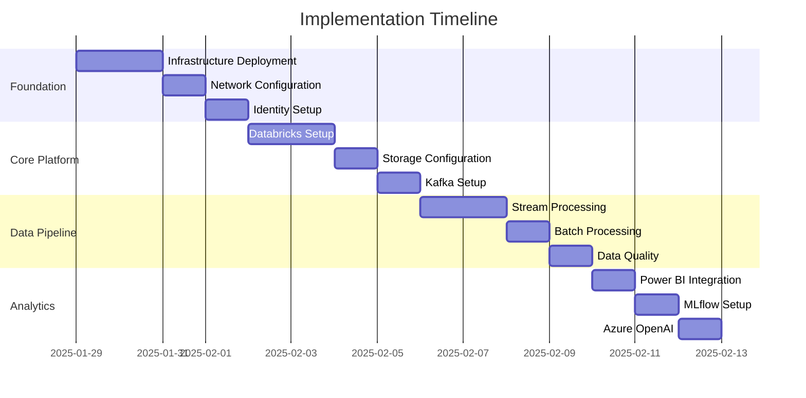

# 🚀 Implementation Guides

> __🏠 [Home](../../../../README.md)__ | __📚 [Documentation](../../../README.md)__ | __🚀 Solution__ | __🚀 Implementation__

---

## 📋 Overview

Comprehensive implementation guides for deploying and configuring the Azure Real-Time Analytics platform. These guides provide step-by-step instructions for setting up each component of the solution.

## 📑 Table of Contents

- [Deployment Guide](#deployment-guide)
- [Databricks Setup](#databricks-setup)
- [Stream Processing](#stream-processing)
- [Power BI Integration](#power-bi-integration)
- [MLflow Configuration](#mlflow-configuration)
- [Security Setup](#security-setup)

---

## 🎯 Implementation Roadmap

### Phase 1: Foundation (Week 1)

1. __[Infrastructure Deployment](./deployment.md)__ - Deploy base Azure resources
2. __[Network Configuration](./network-setup.md)__ - Configure VNets and security
3. __[Identity Setup](./identity-setup.md)__ - Configure Azure AD and RBAC

### Phase 2: Core Platform (Week 2)

1. __[Databricks Workspace](./databricks-setup.md)__ - Configure Databricks environment
2. __[Storage Configuration](./storage-setup.md)__ - Set up ADLS Gen2 and Delta Lake
3. __[Kafka Setup](./kafka-setup.md)__ - Configure Confluent Cloud or Event Hubs

### Phase 3: Data Pipeline (Week 3)

1. __[Stream Processing](./stream-processing.md)__ - Implement real-time pipelines
2. __[Batch Processing](./batch-processing.md)__ - Set up scheduled jobs
3. __[Data Quality](./data-quality.md)__ - Implement validation rules

### Phase 4: Analytics & AI (Week 4)

1. __[Power BI Integration](./power-bi.md)__ - Configure Direct Lake
2. __[MLflow Setup](./mlflow.md)__ - Machine learning lifecycle
3. __[Azure OpenAI](./azure-openai.md)__ - AI enrichment setup

---

## 📚 Implementation Guides

### 🔧 [Deployment Guide](./deployment.md)

__Complete infrastructure deployment using Infrastructure as Code__

| Aspect | Details |
|--------|---------|
| __Duration__ | 4 hours |
| __Complexity__ | Medium |
| __Prerequisites__ | Azure subscription, DevOps account |
| __Deliverables__ | Deployed infrastructure |

__Key Steps:__

- Azure resource provisioning
- Infrastructure as Code deployment
- Network configuration
- Security baseline

---

### 🔥 [Databricks Setup](./databricks-setup.md)

__Configure Azure Databricks workspace and clusters__

| Aspect | Details |
|--------|---------|
| __Duration__ | 2 hours |
| __Complexity__ | Medium |
| __Prerequisites__ | Deployed infrastructure |
| __Deliverables__ | Configured Databricks workspace |

__Key Steps:__

- Workspace initialization
- Cluster configuration
- Unity Catalog setup
- Libraries installation

---

### 🌊 [Stream Processing](./stream-processing.md)

__Implement real-time data processing pipelines__

| Aspect | Details |
|--------|---------|
| __Duration__ | 3 hours |
| __Complexity__ | High |
| __Prerequisites__ | Databricks, Kafka/Event Hubs |
| __Deliverables__ | Running stream pipelines |

__Key Steps:__

- Structured Streaming setup
- Checkpoint configuration
- Error handling
- Performance tuning

---

### 📊 [Power BI Integration](./power-bi.md)

__Configure Power BI Direct Lake mode__

| Aspect | Details |
|--------|---------|
| __Duration__ | 2 hours |
| __Complexity__ | Low |
| __Prerequisites__ | Power BI Premium, Gold layer |
| __Deliverables__ | Connected Power BI workspace |

__Key Steps:__

- Direct Lake connection
- Dataset configuration
- Report development
- Row-level security

---

### 🤖 [MLflow Configuration](./mlflow.md)

__Set up machine learning lifecycle management__

| Aspect | Details |
|--------|---------|
| __Duration__ | 3 hours |
| __Complexity__ | Medium |
| __Prerequisites__ | Databricks workspace |
| __Deliverables__ | MLflow tracking server |

__Key Steps:__

- MLflow installation
- Experiment tracking
- Model registry
- Deployment pipelines

---

## 🛠️ Prerequisites Checklist

### Required Access

- [ ] Azure subscription (Owner/Contributor)
- [ ] Azure DevOps or GitHub account
- [ ] Power BI Premium capacity
- [ ] Confluent Cloud account (optional)

### Required Knowledge

- [ ] Basic Azure services understanding
- [ ] Familiarity with Python/SQL
- [ ] Understanding of streaming concepts
- [ ] Basic DevOps practices

### Required Tools

- [ ] Azure CLI installed
- [ ] Databricks CLI configured
- [ ] Power BI Desktop
- [ ] Git client

---

## 🎯 Implementation Best Practices

### Planning

1. __Capacity Planning__ - Size resources based on expected load
2. __Network Design__ - Plan IP ranges and security groups
3. __Naming Conventions__ - Follow consistent naming standards
4. __Cost Estimation__ - Use Azure calculator for budgeting

### Deployment

1. __Infrastructure as Code__ - Use Terraform or Bicep
2. __Staged Rollout__ - Deploy to dev, test, then production
3. __Configuration Management__ - Use Azure App Configuration
4. __Secret Management__ - Store secrets in Key Vault

### Testing

1. __Unit Testing__ - Test individual components
2. __Integration Testing__ - Test end-to-end flows
3. __Performance Testing__ - Validate under load
4. __Security Testing__ - Run vulnerability scans

### Operations

1. __Monitoring Setup__ - Configure comprehensive monitoring
2. __Alerting Rules__ - Set up proactive alerts
3. __Backup Strategy__ - Implement regular backups
4. __Documentation__ - Keep runbooks updated

---

## 📊 Implementation Timeline

---

## 🔄 Validation Steps

### Post-Implementation Validation

1. __Infrastructure Validation__
   - All resources deployed successfully
   - Network connectivity verified
   - Security policies applied

2. __Platform Validation__
   - Databricks clusters operational
   - Storage accessible
   - Streaming endpoints active

3. __Pipeline Validation__
   - Data flowing through Bronze layer
   - Silver layer transformations working
   - Gold layer aggregations correct

4. __Analytics Validation__
   - Power BI reports loading
   - ML models deployed
   - AI enrichment functional

---

## 🚨 Common Issues & Solutions

| Issue | Solution |
|-------|----------|
| __Cluster startup failures__ | Check VNet configuration and resource quotas |
| __Stream processing lag__ | Increase cluster size or optimize code |
| __Power BI connection issues__ | Verify Direct Lake prerequisites |
| __Cost overruns__ | Implement auto-scaling and spot instances |
| __Security violations__ | Review network rules and RBAC permissions |

---

## 📚 Related Documentation

- [Architecture Overview](../architecture/README.md)
- [Operations Guide](../operations/README.md)
- [Security Implementation](./security-setup.md)
- [Troubleshooting Guide](../operations/troubleshooting.md)

---

__Last Updated:__ January 29, 2025  
__Version:__ 1.0.0  
__Maintainer:__ Platform Implementation Team
