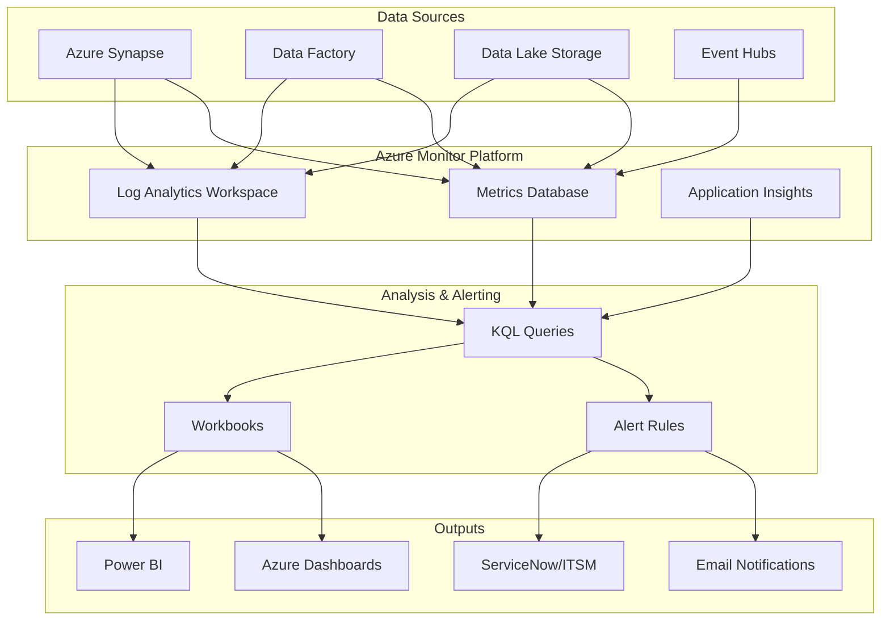

# 📊 Monitoring & Observability

> **🏠 [Home](../README.md)** | **📖 Documentation** | **📊 Monitoring**


Comprehensive monitoring and observability guidance for Cloud Scale Analytics services using Azure Monitor, Log Analytics, and Application Insights.

---

## 🌟 Monitoring Overview

Effective monitoring is essential for maintaining healthy, performant, and secure analytics environments. This guide covers monitoring strategies, tools, and best practices for Azure Cloud Scale Analytics services.

### 🔥 Key Monitoring Objectives

- **Performance Monitoring**: Track resource utilization, query performance, and throughput
- **Availability Monitoring**: Ensure services are running and accessible
- **Security Monitoring**: Detect and respond to security threats
- **Cost Monitoring**: Track spending and optimize resource usage
- **Compliance Monitoring**: Ensure adherence to regulatory requirements

---

## 🏗️ Monitoring Architecture



---

## 🛠️ Core Monitoring Components

### ⚡ Azure Monitor

Azure Monitor is the central platform for monitoring all Azure services.

**Key Features**:

- **Metrics**: Time-series data collected at regular intervals
- **Logs**: Event and diagnostic data stored in Log Analytics
- **Alerts**: Proactive notifications based on conditions
- **Dashboards**: Visual representation of monitoring data

**[📖 Azure Monitor Documentation →](https://learn.microsoft.com/en-us/azure/azure-monitor/)**

---

### 🔍 Log Analytics Workspace

Centralized log collection and analysis using KQL (Kusto Query Language).

**Configuration Steps**:

```bash
# Create Log Analytics workspace
az monitor log-analytics workspace create \
  --resource-group rg-monitoring \
  --workspace-name law-csa-monitoring \
  --location eastus \
  --sku PerGB2018 \
  --retention-time 90

# Get workspace ID
WORKSPACE_ID=$(az monitor log-analytics workspace show \
  --resource-group rg-monitoring \
  --workspace-name law-csa-monitoring \
  --query customerId -o tsv)

echo "Workspace ID: $WORKSPACE_ID"
```

**Key Features**:

- **Centralized Logging**: Single location for all diagnostic logs
- **KQL Queries**: Powerful query language for log analysis
- **Data Retention**: Configurable retention from 30 to 730 days
- **Cross-Resource Queries**: Query across multiple resources

---

### 📊 Application Insights

Application performance monitoring (APM) for custom applications and services.

**Use Cases**:

- Monitor custom analytics applications
- Track API performance and availability
- Detect application exceptions and failures
- Analyze user behavior and telemetry

**Integration Example**:

```python
from opencensus.ext.azure.log_exporter import AzureLogHandler
import logging

# Configure Application Insights logging
logger = logging.getLogger(__name__)
logger.addHandler(AzureLogHandler(
    connection_string='InstrumentationKey=your-key'
))

# Log custom events
logger.info('Pipeline execution started', extra={'custom_dimensions': {
    'pipeline_name': 'sales_processing',
    'execution_id': '12345'
}})
```

---

## 📈 Key Metrics to Monitor

### Azure Synapse Analytics

| Metric Category | Key Metrics | Threshold | Action |
|----------------|-------------|-----------|---------|
| **Performance** | DWU percentage<br/>Active queries<br/>Queue wait time | > 90%<br/> > 100<br/> > 60s | Scale up resources<br/>Optimize queries<br/>Review workload |
| **Availability** | Workspace availability<br/>Connection success rate | < 99.9%<br/> < 95% | Check health<br/>Review firewall rules |
| **Storage** | Data storage used<br/>Snapshot storage | > 85%<br/> > 50TB | Archive old data<br/>Review retention |
| **Security** | Failed login attempts<br/>Firewall rule changes | > 5/hour<br/> Any change | Review access logs<br/>Audit changes |

### Data Lake Storage Gen2

| Metric Category | Key Metrics | Threshold | Action |
|----------------|-------------|-----------|---------|
| **Performance** | Transactions per second<br/>End-to-end latency<br/>Availability | > 20,000<br/> > 500ms<br/> < 99.9% | Scale storage<br/>Optimize queries<br/>Check health |
| **Capacity** | Used capacity<br/>Blob count | > 80%<br/> > 5M | Archive data<br/>Implement lifecycle |
| **Security** | Anonymous requests<br/>Client errors (403) | > 0<br/> > 100/hour | Review access<br/>Check permissions |

### Azure Data Factory

| Metric Category | Key Metrics | Threshold | Action |
|----------------|-------------|-----------|---------|
| **Reliability** | Pipeline failure rate<br/>Activity failure rate | > 5%<br/> > 10% | Review pipeline logic<br/>Check connections |
| **Performance** | Pipeline run duration<br/>Activity run duration | > baseline + 50%<br/> > SLA | Optimize activities<br/>Review parallelism |
| **Cost** | Total factory size<br/>Integration runtime hours | > budget<br/> > baseline + 30% | Review resource usage<br/>Optimize IR |

---

## 🔍 Log Analytics KQL Queries

### Common Query Patterns

#### Failed Pipeline Runs

```kusto
// Azure Synapse pipeline failures with error details
SynapseIntegrationPipelineRuns
| where TimeGenerated > ago(24h)
| where Status == "Failed"
| project TimeGenerated, PipelineName, RunId,
          Parameters, ErrorCode, ErrorMessage
| order by TimeGenerated desc
| take 50
```

#### Query Performance Analysis

```kusto
// Long-running queries in Synapse SQL Pools
SynapseSqlPoolExecRequests
| where TimeGenerated > ago(7d)
| where TotalElapsedTime > 60000  // queries > 60 seconds
| summarize
    AvgDuration = avg(TotalElapsedTime),
    MaxDuration = max(TotalElapsedTime),
    Count = count()
    by Command, ResourceClass
| order by AvgDuration desc
```

#### Storage Access Patterns

```kusto
// Data Lake Storage access patterns
StorageBlobLogs
| where TimeGenerated > ago(1d)
| where OperationName == "GetBlob" or OperationName == "PutBlob"
| summarize
    Requests = count(),
    TotalBytes = sum(ResponseBodySize),
    AvgLatency = avg(DurationMs)
    by bin(TimeGenerated, 1h), OperationName
| render timechart
```

#### Security Audit

```kusto
// Failed authentication attempts
AzureDiagnostics
| where ResourceType == "SYNAPSE/WORKSPACES"
| where Category == "SQLSecurityAuditEvents"
| where OperationName == "Login"
| where ResultType == "Failed"
| summarize FailedAttempts = count() by ClientIP, UserPrincipalName
| where FailedAttempts > 5
| order by FailedAttempts desc
```

#### Resource Utilization Trends

```kusto
// Synapse SQL Pool resource consumption trends
AzureMetrics
| where ResourceProvider == "MICROSOFT.SYNAPSE"
| where MetricName in ("DWULimit", "DWUUsed", "DWUPercentage")
| summarize
    AvgDWU = avg(Average),
    MaxDWU = max(Maximum)
    by bin(TimeGenerated, 1h), MetricName
| render timechart
```

---

## 🔔 Alert Configuration

### Alert Rule Template

```json
{
  "location": "Global",
  "properties": {
    "description": "Alert when SQL pool utilization is high",
    "severity": 2,
    "enabled": true,
    "scopes": [
      "/subscriptions/{subscription-id}/resourceGroups/{rg}/providers/Microsoft.Synapse/workspaces/{workspace}/sqlPools/{pool}"
    ],
    "evaluationFrequency": "PT5M",
    "windowSize": "PT15M",
    "criteria": {
      "allOf": [
        {
          "metricName": "DWUPercentage",
          "metricNamespace": "Microsoft.Synapse/workspaces/sqlPools",
          "operator": "GreaterThan",
          "threshold": 90,
          "timeAggregation": "Average"
        }
      ]
    },
    "autoMitigate": true,
    "actions": [
      {
        "actionGroupId": "/subscriptions/{subscription-id}/resourceGroups/{rg}/providers/microsoft.insights/actionGroups/{action-group}"
      }
    ]
  }
}
```

### Critical Alerts

**Performance Alerts**:

- SQL Pool DWU > 90% for 15 minutes (Severity: 2)
- Query duration > 120 seconds (Severity: 3)
- Pipeline failure rate > 10% (Severity: 1)

**Availability Alerts**:

- Service availability < 99.9% (Severity: 0)
- Failed connection attempts > 50 in 5 minutes (Severity: 1)
- Integration runtime unavailable (Severity: 1)

**Security Alerts**:

- Multiple failed authentications from single IP (Severity: 1)
- Firewall rule modifications (Severity: 2)
- Unusual data access patterns (Severity: 2)

**Cost Alerts**:

- Daily spending > budget threshold + 20% (Severity: 2)
- Unexpected resource scaling events (Severity: 3)

---

## 📊 Dashboard Templates

### Executive Dashboard

**Key Metrics**:

- Service health status
- Daily cost trends
- Pipeline success rate
- Query performance summary

### Operations Dashboard

**Key Metrics**:

- Resource utilization (CPU, Memory, I/O)
- Active queries and wait times
- Storage capacity and growth
- Pipeline execution timeline

### Security Dashboard

**Key Metrics**:

- Authentication events
- Access control changes
- Firewall rule modifications
- Suspicious activity alerts

---

## 🔧 Diagnostic Settings Configuration

### Enable Diagnostic Settings via Azure CLI

```bash
# Configure diagnostic settings for Synapse workspace
az monitor diagnostic-settings create \
  --name synapse-diagnostics \
  --resource "/subscriptions/{sub-id}/resourceGroups/{rg}/providers/Microsoft.Synapse/workspaces/{workspace}" \
  --workspace "/subscriptions/{sub-id}/resourceGroups/{rg}/providers/Microsoft.OperationalInsights/workspaces/{law}" \
  --logs '[
    {"category": "SynapseRbacOperations", "enabled": true, "retentionPolicy": {"days": 90, "enabled": true}},
    {"category": "GatewayApiRequests", "enabled": true, "retentionPolicy": {"days": 30, "enabled": true}},
    {"category": "BuiltinSqlReqsEnded", "enabled": true, "retentionPolicy": {"days": 30, "enabled": true}},
    {"category": "IntegrationPipelineRuns", "enabled": true, "retentionPolicy": {"days": 90, "enabled": true}},
    {"category": "IntegrationActivityRuns", "enabled": true, "retentionPolicy": {"days": 90, "enabled": true}},
    {"category": "IntegrationTriggerRuns", "enabled": true, "retentionPolicy": {"days": 90, "enabled": true}}
  ]' \
  --metrics '[
    {"category": "AllMetrics", "enabled": true, "retentionPolicy": {"days": 90, "enabled": true}}
  ]'
```

### Log Categories Reference

| Category | Description | Recommended Retention | Use Case |
|----------|-------------|----------------------|----------|
| **SQLSecurityAuditEvents** | SQL authentication and authorization events | 90 days | Security auditing |
| **SynapseRbacOperations** | Role-based access control changes | 90 days | Access management |
| **GatewayApiRequests** | API gateway requests | 30 days | API monitoring |
| **BuiltinSqlReqsEnded** | SQL query execution details | 30 days | Performance tuning |
| **IntegrationPipelineRuns** | Pipeline execution logs | 90 days | Pipeline monitoring |
| **IntegrationActivityRuns** | Activity execution logs | 90 days | Debugging |
| **IntegrationTriggerRuns** | Trigger execution logs | 90 days | Schedule monitoring |

---

## 🎯 Service-Specific Monitoring

### [Azure Synapse Analytics Monitoring](service-monitoring/synapse/README.md)

Detailed monitoring guidance for Azure Synapse Analytics including:

- SQL Pools monitoring
- Spark Pools monitoring
- Pipeline monitoring
- Dedicated KQL queries
- Service-specific alerts

**[📖 Synapse Monitoring Guide →](service-monitoring/synapse/README.md)**

### Azure Data Factory Monitoring

Key monitoring areas:

- Pipeline runs and failures
- Activity performance
- Integration runtime health
- Trigger execution

### Azure Data Lake Storage Monitoring

Key monitoring areas:

- Storage capacity and growth
- Transaction patterns
- Access latency
- Security events

---

## 🚀 Quick Start Checklist

- [ ] Create Log Analytics workspace for centralized logging
- [ ] Enable diagnostic settings on all analytics resources
- [ ] Configure action groups for alert notifications
- [ ] Set up critical performance and availability alerts
- [ ] Create monitoring dashboards for different audiences
- [ ] Document alert response procedures
- [ ] Schedule regular monitoring reviews
- [ ] Implement automated remediation where possible

---

## 💡 Best Practices

### Monitoring Strategy

1. **Start with Baseline**: Establish performance baselines before alerting
2. **Layer Monitoring**: Use multiple monitoring layers (metrics, logs, traces)
3. **Automate Response**: Implement auto-scaling and self-healing where possible
4. **Regular Review**: Schedule monthly monitoring configuration reviews
5. **Cost Awareness**: Monitor diagnostic log costs and adjust retention

### Alert Design

1. **Actionable Alerts**: Only alert on conditions requiring action
2. **Clear Context**: Include relevant details in alert descriptions
3. **Severity Levels**: Use consistent severity classifications
4. **Alert Fatigue**: Avoid too many low-priority alerts
5. **Escalation Paths**: Define clear escalation procedures

### Query Optimization

1. **Time Ranges**: Use appropriate time ranges to balance detail and performance
2. **Aggregations**: Use summarize for large datasets
3. **Filters**: Apply filters early in query pipeline
4. **Saved Queries**: Save commonly used queries for reuse
5. **Query Costs**: Monitor query costs in large workspaces

---

## 📚 Related Resources

### Microsoft Documentation

- [Azure Monitor Overview](https://learn.microsoft.com/en-us/azure/azure-monitor/overview)
- [Log Analytics Tutorial](https://learn.microsoft.com/en-us/azure/azure-monitor/logs/log-analytics-tutorial)
- [KQL Quick Reference](https://learn.microsoft.com/en-us/azure/data-explorer/kusto/query/)
- [Alert Rules Best Practices](https://learn.microsoft.com/en-us/azure/azure-monitor/alerts/alerts-best-practices)

### Additional Guides

- [Security Monitoring Guide](../best-practices/security.md)
- [Performance Optimization](../best-practices/performance-optimization.md)
- [Cost Optimization](../best-practices/cost-optimization.md)
- [Troubleshooting Guide](../troubleshooting/README.md)

---

## 🔄 Continuous Improvement

Monitoring is not a one-time setup. Regularly:

- Review and adjust alert thresholds based on actual patterns
- Update dashboards to reflect changing business needs
- Optimize KQL queries for performance
- Archive old diagnostic data to control costs
- Document lessons learned from incidents

---

*Last Updated: 2025-01-28*
*Version: 1.0.0*
*Documentation Status: Complete*
