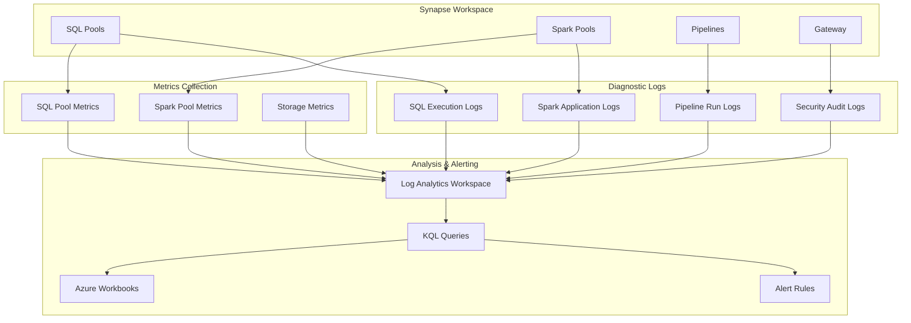

# 🎯 Azure Synapse Analytics Monitoring

> **🏠 [Home](../../../README.md)** | **📖 [Monitoring](../../README.md)** | **🎯 Synapse Monitoring**


Comprehensive monitoring guide for Azure Synapse Analytics workspaces, SQL pools, Spark pools, and data integration pipelines.

---

## 🌟 Overview

Azure Synapse Analytics monitoring requires a multi-faceted approach covering workspace operations, SQL pools, Spark pools, and data integration pipelines. This guide provides detailed monitoring strategies, KQL queries, and alert configurations specific to Synapse Analytics.

### 🔥 Key Monitoring Areas

- **SQL Pool Monitoring**: Dedicated and serverless SQL pool performance
- **Spark Pool Monitoring**: Apache Spark job execution and resource utilization
- **Pipeline Monitoring**: Data integration pipeline runs and activities
- **Workspace Monitoring**: Overall workspace health and operations
- **Security Monitoring**: Access control and audit events

---

## 🏗️ Synapse Monitoring Architecture



---

## 🛠️ Initial Setup

### Step 1: Create Log Analytics Workspace

```bash
# Create dedicated Log Analytics workspace for Synapse monitoring
az monitor log-analytics workspace create \
  --resource-group rg-synapse-monitoring \
  --workspace-name law-synapse-analytics \
  --location eastus \
  --sku PerGB2018 \
  --retention-time 90 \
  --tags Environment=Production Service=Synapse

# Get workspace details
WORKSPACE_ID=$(az monitor log-analytics workspace show \
  --resource-group rg-synapse-monitoring \
  --workspace-name law-synapse-analytics \
  --query customerId -o tsv)

WORKSPACE_KEY=$(az monitor log-analytics workspace get-shared-keys \
  --resource-group rg-synapse-monitoring \
  --workspace-name law-synapse-analytics \
  --query primarySharedKey -o tsv)

echo "Workspace ID: $WORKSPACE_ID"
```

### Step 2: Configure Diagnostic Settings

```bash
# Enable comprehensive diagnostic logging for Synapse workspace
SYNAPSE_RESOURCE_ID="/subscriptions/{subscription-id}/resourceGroups/{rg}/providers/Microsoft.Synapse/workspaces/{workspace}"
LAW_RESOURCE_ID="/subscriptions/{subscription-id}/resourceGroups/{rg}/providers/Microsoft.OperationalInsights/workspaces/{law}"

az monitor diagnostic-settings create \
  --name synapse-comprehensive-diagnostics \
  --resource "$SYNAPSE_RESOURCE_ID" \
  --workspace "$LAW_RESOURCE_ID" \
  --logs '[
    {
      "category": "SQLSecurityAuditEvents",
      "enabled": true,
      "retentionPolicy": {"days": 90, "enabled": true}
    },
    {
      "category": "SynapseRbacOperations",
      "enabled": true,
      "retentionPolicy": {"days": 90, "enabled": true}
    },
    {
      "category": "GatewayApiRequests",
      "enabled": true,
      "retentionPolicy": {"days": 30, "enabled": true}
    },
    {
      "category": "BuiltinSqlReqsEnded",
      "enabled": true,
      "retentionPolicy": {"days": 30, "enabled": true}
    },
    {
      "category": "IntegrationPipelineRuns",
      "enabled": true,
      "retentionPolicy": {"days": 90, "enabled": true}
    },
    {
      "category": "IntegrationActivityRuns",
      "enabled": true,
      "retentionPolicy": {"days": 90, "enabled": true}
    },
    {
      "category": "IntegrationTriggerRuns",
      "enabled": true,
      "retentionPolicy": {"days": 90, "enabled": true}
    },
    {
      "category": "SynapseSparkApplications",
      "enabled": true,
      "retentionPolicy": {"days": 30, "enabled": true}
    }
  ]' \
  --metrics '[
    {
      "category": "AllMetrics",
      "enabled": true,
      "retentionPolicy": {"days": 90, "enabled": true}
    }
  ]'
```

### Step 3: Create Action Groups

```bash
# Create action group for critical alerts
az monitor action-group create \
  --resource-group rg-synapse-monitoring \
  --name ag-synapse-critical \
  --short-name synapseOps \
  --email-receiver name=OpsTeam email=ops@contoso.com \
  --email-receiver name=Manager email=manager@contoso.com \
  --sms-receiver name=OnCallEngineer countryCode=1 phoneNumber=5555551234

# Create action group for warning alerts
az monitor action-group create \
  --resource-group rg-synapse-monitoring \
  --name ag-synapse-warning \
  --short-name synapseWarn \
  --email-receiver name=DevTeam email=devteam@contoso.com
```

---

## 📊 Key Metrics to Monitor

### SQL Pool Metrics

| Metric | Description | Threshold | Alert Severity |
|--------|-------------|-----------|----------------|
| **DWULimit** | Maximum DWU configured | Informational | N/A |
| **DWUUsed** | Current DWU consumption | > 90% for 15 min | Warning |
| **DWUPercentage** | Percentage of DWU capacity | > 95% for 5 min | Critical |
| **ActiveQueries** | Number of concurrent active queries | > 120 | Warning |
| **QueuedQueries** | Queries waiting for resources | > 10 for 10 min | Warning |
| **ConnectionsBlocked** | Failed connection attempts | > 5 in 5 min | Critical |
| **CacheLitPercentage** | Cache hit rate | < 80% | Info |
| **CPUPercent** | CPU utilization | > 90% for 15 min | Warning |

### Spark Pool Metrics

| Metric | Description | Threshold | Alert Severity |
|--------|-------------|-----------|----------------|
| **AppRunningCount** | Active Spark applications | > pool capacity | Warning |
| **AppEndedSuccess** | Successfully completed apps | Trend analysis | Info |
| **AppEndedFailed** | Failed Spark applications | > 5 in 1 hour | Critical |
| **MemoryAllocatedGB** | Allocated memory | > 90% capacity | Warning |
| **VCoresAllocated** | Allocated vCores | > 90% capacity | Warning |
| **BigDataPoolAllocatedNodes** | Number of active nodes | Trend analysis | Info |

### Pipeline Metrics

| Metric | Description | Threshold | Alert Severity |
|--------|-------------|-----------|----------------|
| **PipelineSucceededRuns** | Successful pipeline runs | Trend analysis | Info |
| **PipelineFailedRuns** | Failed pipeline runs | > 0 | Critical |
| **PipelineRunsEnded** | Total completed runs | Trend analysis | Info |
| **ActivitySucceededRuns** | Successful activities | Trend analysis | Info |
| **ActivityFailedRuns** | Failed activities | > 5 in 1 hour | Warning |
| **TriggerSucceededRuns** | Successful trigger executions | Trend analysis | Info |
| **TriggerFailedRuns** | Failed trigger executions | > 0 | Critical |

---

## 🔍 KQL Query Library

### SQL Pool Performance Queries

#### Long-Running Queries

```kusto
// Identify queries running longer than expected
SynapseSqlPoolExecRequests
| where TimeGenerated > ago(24h)
| where Status == "Completed"
| where TotalElapsedTime > 60000  // Queries > 60 seconds
| project
    TimeGenerated,
    RequestId,
    Command,
    TotalElapsedTime_Seconds = TotalElapsedTime / 1000,
    ResourceClass,
    Importance,
    SubmitTime = format_datetime(StartTime, 'yyyy-MM-dd HH:mm:ss'),
    RowCount
| order by TotalElapsedTime_Seconds desc
| take 100
```

#### Query Wait Analysis

```kusto
// Analyze query wait times by wait type
SynapseSqlPoolWaitsStats
| where TimeGenerated > ago(24h)
| summarize
    TotalWaitTime_Minutes = sum(WaitTimeMs) / 60000,
    WaitCount = sum(SignalWaitCount)
    by WaitType
| where TotalWaitTime_Minutes > 1
| order by TotalWaitTime_Minutes desc
| render columnchart
```

#### Resource Utilization Trends

```kusto
// SQL Pool DWU utilization over time
AzureMetrics
| where TimeGenerated > ago(7d)
| where ResourceProvider == "MICROSOFT.SYNAPSE"
| where ResourceId contains "sqlPools"
| where MetricName in ("DWULimit", "DWUUsed", "DWUPercentage")
| project TimeGenerated, MetricName, Average, Maximum, ResourceId
| summarize
    AvgValue = avg(Average),
    MaxValue = max(Maximum)
    by bin(TimeGenerated, 1h), MetricName
| render timechart
```

#### Expensive Queries by Resource Class

```kusto
// Most expensive queries by resource consumption
SynapseSqlPoolExecRequests
| where TimeGenerated > ago(7d)
| where Status == "Completed"
| summarize
    QueryCount = count(),
    AvgElapsedTime_Sec = avg(TotalElapsedTime) / 1000,
    MaxElapsedTime_Sec = max(TotalElapsedTime) / 1000,
    TotalCPU_Hours = sum(TotalElapsedTime) / 1000 / 3600
    by Command, ResourceClass, Importance
| where QueryCount > 10
| order by TotalCPU_Hours desc
| take 50
```

### Spark Pool Monitoring Queries

#### Failed Spark Applications

```kusto
// Spark applications that failed with error details
SynapseSparkApplications
| where TimeGenerated > ago(24h)
| where Status == "Failed"
| project
    TimeGenerated,
    ApplicationId,
    ApplicationName,
    SparkPoolName,
    SubmitTime = format_datetime(SubmitTime, 'yyyy-MM-dd HH:mm:ss'),
    EndTime = format_datetime(EndTime, 'yyyy-MM-dd HH:mm:ss'),
    ErrorMessage,
    ErrorInfo
| order by TimeGenerated desc
```

#### Spark Job Performance

```kusto
// Analyze Spark job execution times
SynapseSparkJobs
| where TimeGenerated > ago(7d)
| where Status == "Succeeded"
| project
    TimeGenerated,
    ApplicationId,
    JobId,
    ExecutionTime_Minutes = (EndTime - SubmitTime) / 1m,
    Stage_Count = StageIds_Count,
    Task_Count = TaskIds_Count
| summarize
    AvgExecution = avg(ExecutionTime_Minutes),
    MaxExecution = max(ExecutionTime_Minutes),
    JobCount = count()
    by ApplicationId
| where JobCount > 5
| order by AvgExecution desc
```

#### Spark Resource Utilization

```kusto
// Spark pool resource utilization patterns
AzureMetrics
| where TimeGenerated > ago(24h)
| where ResourceProvider == "MICROSOFT.SYNAPSE"
| where ResourceId contains "bigDataPools"
| where MetricName in ("MemoryAllocatedGB", "VCoresAllocated", "AppRunningCount")
| summarize
    AvgValue = avg(Average),
    MaxValue = max(Maximum)
    by bin(TimeGenerated, 5m), MetricName, ResourceId
| render timechart
```

#### Spark Stage Analysis

```kusto
// Identify slow Spark stages
SynapseSparkStages
| where TimeGenerated > ago(24h)
| where Status == "Succeeded"
| project
    TimeGenerated,
    ApplicationId,
    StageId,
    Duration_Minutes = (EndTime - SubmitTime) / 1m,
    TaskCount = TaskIds_Count,
    InputBytes = InputBytes / 1024 / 1024,  // Convert to MB
    OutputBytes = OutputBytes / 1024 / 1024  // Convert to MB
| where Duration_Minutes > 5
| order by Duration_Minutes desc
| take 100
```

### Pipeline Monitoring Queries

#### Failed Pipeline Runs with Error Details

```kusto
// Detailed failure analysis for pipelines
SynapseIntegrationPipelineRuns
| where TimeGenerated > ago(24h)
| where Status == "Failed"
| project
    TimeGenerated,
    PipelineName,
    RunId,
    Parameters,
    SystemParameters,
    ErrorCode,
    ErrorMessage,
    FailureType,
    Duration_Minutes = (End - Start) / 1m
| order by TimeGenerated desc
| take 100
```

#### Pipeline Execution Duration Trends

```kusto
// Track pipeline execution time trends
SynapseIntegrationPipelineRuns
| where TimeGenerated > ago(30d)
| where Status == "Succeeded"
| project
    Date = format_datetime(TimeGenerated, 'yyyy-MM-dd'),
    PipelineName,
    Duration_Minutes = (End - Start) / 1m
| summarize
    AvgDuration = avg(Duration_Minutes),
    MaxDuration = max(Duration_Minutes),
    RunCount = count()
    by Date, PipelineName
| render timechart
```

#### Activity Failure Analysis

```kusto
// Analyze which activities fail most frequently
SynapseIntegrationActivityRuns
| where TimeGenerated > ago(7d)
| where Status == "Failed"
| summarize
    FailureCount = count(),
    ErrorMessages = make_set(ErrorMessage, 5)
    by ActivityName, ActivityType, PipelineName
| order by FailureCount desc
| take 50
```

#### Trigger Execution Monitoring

```kusto
// Monitor trigger execution patterns
SynapseIntegrationTriggerRuns
| where TimeGenerated > ago(24h)
| summarize
    Executions = count(),
    Succeeded = countif(Status == "Succeeded"),
    Failed = countif(Status == "Failed"),
    SuccessRate = round(100.0 * countif(Status == "Succeeded") / count(), 2)
    by TriggerName, TriggerType
| order by Failed desc
```

### Security and Audit Queries

#### Failed Authentication Attempts

```kusto
// Detect potential brute force attacks
AzureDiagnostics
| where ResourceType == "SYNAPSE/WORKSPACES"
| where Category == "SQLSecurityAuditEvents"
| where OperationName == "Login"
| where ResultType == "Failed"
| where TimeGenerated > ago(24h)
| summarize
    FailedAttempts = count(),
    LastAttempt = max(TimeGenerated),
    Accounts = make_set(UserPrincipalName)
    by ClientIP
| where FailedAttempts > 5
| order by FailedAttempts desc
```

#### RBAC Operations Audit

```kusto
// Track role assignment changes
SynapseRbacOperations
| where TimeGenerated > ago(7d)
| where OperationName in (
    "Create role assignment",
    "Delete role assignment",
    "Update role assignment"
)
| project
    TimeGenerated,
    Caller = CallerIdentity,
    Operation = OperationName,
    RoleDefinition = Properties.roleDefinitionId,
    PrincipalId = Properties.principalId,
    Scope = Properties.scope,
    Result = ResultType
| order by TimeGenerated desc
```

#### Data Access Patterns

```kusto
// Monitor unusual data access patterns
SynapseSqlPoolExecRequests
| where TimeGenerated > ago(24h)
| where Command contains "SELECT"
| summarize
    QueryCount = count(),
    UniqueUsers = dcount(SessionId),
    DataRead_MB = sum(RowCount) / 1024
    by bin(TimeGenerated, 1h), DatabaseName
| where QueryCount > 100 or DataRead_MB > 10000
| order by TimeGenerated desc
```

---

## 🔔 Alert Rule Configurations

### Critical Performance Alerts

#### High DWU Utilization

```bash
# Create alert for SQL Pool near capacity
az monitor metrics alert create \
  --name alert-sqlpool-high-dwu \
  --resource-group rg-synapse-monitoring \
  --scopes "$SYNAPSE_RESOURCE_ID/sqlPools/sqlpool01" \
  --condition "avg DWUPercentage > 90" \
  --window-size 15m \
  --evaluation-frequency 5m \
  --severity 2 \
  --description "SQL Pool DWU utilization exceeds 90%" \
  --action ag-synapse-warning
```

#### Long Query Wait Times

```json
{
  "name": "alert-long-query-waits",
  "location": "Global",
  "properties": {
    "description": "Alert when queries wait too long for resources",
    "severity": 2,
    "enabled": true,
    "scopes": [
      "/subscriptions/{sub-id}/resourceGroups/{rg}/providers/Microsoft.Synapse/workspaces/{workspace}"
    ],
    "evaluationFrequency": "PT5M",
    "windowSize": "PT15M",
    "criteria": {
      "allOf": [
        {
          "query": "SynapseSqlPoolWaitsStats | where WaitTimeMs > 30000 | summarize count()",
          "timeAggregation": "Count",
          "operator": "GreaterThan",
          "threshold": 10
        }
      ]
    },
    "actions": [
      {
        "actionGroupId": "/subscriptions/{sub-id}/resourceGroups/{rg}/providers/microsoft.insights/actionGroups/ag-synapse-warning"
      }
    ]
  }
}
```

### Pipeline and Integration Alerts

#### Pipeline Failure Alert

```json
{
  "name": "alert-pipeline-failures",
  "location": "Global",
  "properties": {
    "description": "Alert on pipeline execution failures",
    "severity": 1,
    "enabled": true,
    "scopes": [
      "/subscriptions/{sub-id}/resourceGroups/{rg}/providers/Microsoft.Synapse/workspaces/{workspace}"
    ],
    "evaluationFrequency": "PT5M",
    "windowSize": "PT15M",
    "criteria": {
      "allOf": [
        {
          "query": "SynapseIntegrationPipelineRuns | where Status == 'Failed' | summarize count()",
          "timeAggregation": "Count",
          "operator": "GreaterThan",
          "threshold": 0
        }
      ]
    },
    "autoMitigate": false,
    "actions": [
      {
        "actionGroupId": "/subscriptions/{sub-id}/resourceGroups/{rg}/providers/microsoft.insights/actionGroups/ag-synapse-critical"
      }
    ]
  }
}
```

#### Spark Application Failures

```bash
# Alert on Spark application failures
az monitor metrics alert create \
  --name alert-spark-app-failures \
  --resource-group rg-synapse-monitoring \
  --scopes "$SYNAPSE_RESOURCE_ID/bigDataPools/sparkpool01" \
  --condition "total AppEndedFailed > 3" \
  --window-size 1h \
  --evaluation-frequency 15m \
  --severity 2 \
  --description "Multiple Spark application failures detected" \
  --action ag-synapse-warning
```

### Security Alerts

#### Failed Authentication Alert

```json
{
  "name": "alert-failed-auth-attempts",
  "location": "Global",
  "properties": {
    "description": "Alert on multiple failed authentication attempts",
    "severity": 1,
    "enabled": true,
    "scopes": [
      "/subscriptions/{sub-id}/resourceGroups/{rg}/providers/Microsoft.Synapse/workspaces/{workspace}"
    ],
    "evaluationFrequency": "PT5M",
    "windowSize": "PT15M",
    "criteria": {
      "allOf": [
        {
          "query": "AzureDiagnostics | where Category == 'SQLSecurityAuditEvents' | where OperationName == 'Login' | where ResultType == 'Failed' | summarize FailedAttempts = count() by ClientIP | where FailedAttempts > 5",
          "timeAggregation": "Count",
          "operator": "GreaterThan",
          "threshold": 0
        }
      ]
    },
    "actions": [
      {
        "actionGroupId": "/subscriptions/{sub-id}/resourceGroups/{rg}/providers/microsoft.insights/actionGroups/ag-synapse-critical"
      }
    ]
  }
}
```

---

## 📊 Dashboard Templates

### Executive Synapse Dashboard

**Key Widgets**:

1. **Service Health Status** - Overall workspace availability
2. **Daily Pipeline Success Rate** - Percentage of successful pipeline runs
3. **Query Performance Summary** - Average query duration trends
4. **Cost Trends** - Daily spending on compute resources
5. **Security Events** - Failed authentication attempts

### Operations Dashboard

**Key Widgets**:

1. **SQL Pool Utilization** - DWU percentage over time
2. **Active and Queued Queries** - Concurrent query load
3. **Spark Application Status** - Running, succeeded, and failed apps
4. **Pipeline Execution Timeline** - Gantt chart of pipeline runs
5. **Storage Growth** - Data lake storage trends

### Performance Tuning Dashboard

**Key Widgets**:

1. **Top 10 Slowest Queries** - Queries by execution time
2. **Query Wait Statistics** - Wait time by wait type
3. **Cache Hit Rates** - Result set cache efficiency
4. **Spark Stage Duration** - Slowest Spark stages
5. **Resource Utilization Heatmap** - Hourly compute usage

---

## 🚀 Automated Responses

### Auto-Scaling Based on Metrics

```python
from azure.identity import DefaultAzureCredential
from azure.mgmt.synapse import SynapseManagementClient
from azure.monitor.query import LogsQueryClient
import datetime

def check_and_scale_sql_pool():
    """Monitor SQL Pool utilization and scale if needed."""
    credential = DefaultAzureCredential()
    synapse_client = SynapseManagementClient(credential, subscription_id)
    logs_client = LogsQueryClient(credential)

    # Query current DWU utilization
    query = """
    AzureMetrics
    | where TimeGenerated > ago(15m)
    | where MetricName == "DWUPercentage"
    | summarize AvgDWU = avg(Average)
    """

    response = logs_client.query_workspace(
        workspace_id=workspace_id,
        query=query,
        timespan=(datetime.timedelta(minutes=15))
    )

    avg_dwu = response.tables[0].rows[0][0]

    # Scale up if utilization is high
    if avg_dwu > 85:
        synapse_client.sql_pools.begin_resume(
            resource_group_name=resource_group,
            workspace_name=workspace_name,
            sql_pool_name=sql_pool_name
        )
        print(f"SQL Pool scaled up due to high utilization: {avg_dwu}%")

if __name__ == "__main__":
    check_and_scale_sql_pool()
```

### Pipeline Retry Logic

```python
from azure.synapse.artifacts import ArtifactsClient
from azure.identity import DefaultAzureCredential

def retry_failed_pipeline(pipeline_run_id):
    """Automatically retry failed pipeline runs."""
    credential = DefaultAzureCredential()
    client = ArtifactsClient(
        credential=credential,
        endpoint=synapse_endpoint
    )

    # Get pipeline run details
    run_status = client.pipeline_run.get_pipeline_run(pipeline_run_id)

    if run_status.status == "Failed":
        # Rerun the pipeline
        client.pipeline_run.rerun_pipeline(pipeline_run_id)
        print(f"Pipeline {pipeline_run_id} retried automatically")

if __name__ == "__main__":
    # This would be triggered by an Azure Function or Logic App
    retry_failed_pipeline("pipeline-run-id-here")
```

---

## 💡 Best Practices

### Monitoring Strategy

1. **Establish Baselines**: Run workloads for 2-4 weeks to establish performance baselines
2. **Layer Alerts**: Use multiple severity levels (critical, warning, info)
3. **Reduce Alert Fatigue**: Only alert on actionable conditions
4. **Regular Reviews**: Monthly review of alert thresholds and effectiveness
5. **Document Responses**: Maintain runbooks for common alert scenarios

### Query Optimization

1. **Use Time Ranges Wisely**: Balance detail with query performance
2. **Leverage Aggregations**: Use summarize for large datasets
3. **Filter Early**: Apply where clauses before aggregations
4. **Save Common Queries**: Create query packs for reusable queries
5. **Monitor Query Costs**: Track query costs in large workspaces

### Dashboard Design

1. **Audience-Specific**: Create different dashboards for different roles
2. **Key Metrics First**: Place most important metrics prominently
3. **Visual Hierarchy**: Use size and position to indicate importance
4. **Actionable Insights**: Include links to troubleshooting guides
5. **Regular Updates**: Review and update dashboards quarterly

---

## 🔧 Troubleshooting Common Issues

### High Query Wait Times

**Symptoms**: Queries queuing, long wait times

**Investigation**:

```kusto
SynapseSqlPoolWaitsStats
| where TimeGenerated > ago(1h)
| summarize TotalWaitTime = sum(WaitTimeMs) by WaitType
| order by TotalWaitTime desc
```

**Resolution**:

- Scale up SQL Pool DWU
- Optimize query resource classes
- Implement workload management
- Review and optimize slow queries

### Spark Application Failures

**Symptoms**: Spark jobs failing or hanging

**Investigation**:

```kusto
SynapseSparkApplications
| where Status == "Failed"
| where TimeGenerated > ago(24h)
| project ApplicationId, ErrorMessage, ErrorInfo
```

**Resolution**:

- Review error messages and stack traces
- Check Spark pool sizing
- Optimize Spark configurations
- Review data partitioning strategy

### Pipeline Failures

**Symptoms**: Data integration pipelines failing

**Investigation**:

```kusto
SynapseIntegrationPipelineRuns
| where Status == "Failed"
| where TimeGenerated > ago(24h)
| project PipelineName, ErrorCode, ErrorMessage, ActivityName
```

**Resolution**:

- Review error messages for root cause
- Check data source connectivity
- Verify transformation logic
- Review linked service configurations

---

## 📚 Related Resources

### Microsoft Documentation

- [Monitor Azure Synapse Analytics](https://learn.microsoft.com/en-us/azure/synapse-analytics/monitoring/how-to-monitor-using-azure-monitor)
- [SQL Pool Performance Tuning](https://learn.microsoft.com/en-us/azure/synapse-analytics/sql-data-warehouse/sql-data-warehouse-best-practices)
- [Spark Pool Monitoring](https://learn.microsoft.com/en-us/azure/synapse-analytics/monitoring/apache-spark-applications)
- [Pipeline Monitoring](https://learn.microsoft.com/en-us/azure/synapse-analytics/monitoring/how-to-monitor-pipeline-runs)

### Additional Guides

- [General Monitoring Guide](../../README.md)
- [Performance Optimization](../../../best-practices/performance-optimization.md)
- [Security Best Practices](../../../best-practices/security.md)
- [Cost Optimization](../../../best-practices/cost-optimization.md)

---

## ✅ Implementation Checklist

- [ ] Create dedicated Log Analytics workspace for Synapse
- [ ] Enable diagnostic settings on workspace and all pools
- [ ] Configure action groups for different severity levels
- [ ] Set up SQL Pool performance alerts (DWU, query waits)
- [ ] Set up Spark Pool monitoring alerts (failures, resource usage)
- [ ] Set up Pipeline failure alerts
- [ ] Create security audit alerts (failed auth, RBAC changes)
- [ ] Build executive and operations dashboards
- [ ] Document alert response procedures
- [ ] Test alert notifications and escalation paths
- [ ] Schedule monthly monitoring configuration reviews
- [ ] Implement automated remediation where appropriate

---

*Last Updated: 2025-01-28*
*Service: Azure Synapse Analytics*
*Version: 1.0.0*
*Documentation Status: Complete*
