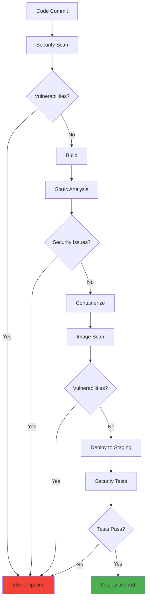

# Security Best Practices for DevOps

> **Home [Home](../../README.md)** | **Documentation** | **DevOps**

---

## Overview

This guide provides comprehensive security best practices for DevOps processes in the CSA-in-a-Box project, covering secure CI/CD pipelines, secret management, infrastructure security, and compliance automation.

## Table of Contents

- [Secure CI/CD Pipelines](#secure-cicd-pipelines)
- [Secret Management](#secret-management)
- [Infrastructure as Code Security](#infrastructure-as-code-security)
- [Container Security](#container-security)
- [Access Control](#access-control)
- [Compliance and Auditing](#compliance-and-auditing)
- [Incident Response](#incident-response)
- [Security Monitoring](#security-monitoring)

---

## Secure CI/CD Pipelines

### Pipeline Security Architecture



### Security Scanning Integration

**Azure DevOps Pipeline with Security:**

```yaml
trigger:
  branches:
    include:
      - main
      - develop

pool:
  vmImage: 'ubuntu-latest'

variables:
  - group: security-scan-credentials
  - name: SCAN_SEVERITY_THRESHOLD
    value: 'HIGH'

stages:
- stage: SecurityScan
  displayName: 'Security Scanning'
  jobs:
  - job: CredentialScanning
    displayName: 'Credential Scanner'
    steps:
    - task: CredScan@3
      displayName: 'Run Credential Scanner'
      inputs:
        toolMajorVersion: 'V2'
        suppressionsFile: 'CredScanSuppressions.json'

    - task: ComponentGovernanceComponentDetection@0
      displayName: 'Component Detection'
      inputs:
        scanType: 'Register'
        verbosity: 'Verbose'
        alertWarningLevel: 'High'

  - job: StaticCodeAnalysis
    displayName: 'Static Analysis Security Testing (SAST)'
    steps:
    - task: SonarCloudPrepare@1
      displayName: 'Prepare SonarCloud'
      inputs:
        SonarCloud: 'SonarCloud-Connection'
        organization: 'csa-inabox'
        scannerMode: 'CLI'
        configMode: 'manual'

    - task: SonarCloudAnalyze@1
      displayName: 'Run Code Analysis'

    - task: SonarCloudPublish@1
      displayName: 'Publish Quality Gate Result'
      inputs:
        pollingTimeoutSec: '300'

  - job: DependencyScanning
    displayName: 'Dependency Vulnerability Scan'
    steps:
    - task: dependency-check-build-task@6
      displayName: 'OWASP Dependency Check'
      inputs:
        projectName: 'CSA-in-a-Box'
        scanPath: '$(Build.SourcesDirectory)'
        format: 'ALL'
        suppressionPath: '$(Build.SourcesDirectory)/dependency-check-suppressions.xml'

    - task: PublishTestResults@2
      displayName: 'Publish Dependency Check Results'
      inputs:
        testResultsFormat: 'JUnit'
        testResultsFiles: '**/dependency-check-junit.xml'
        failTaskOnFailedTests: true

- stage: Build
  displayName: 'Build and Package'
  dependsOn: SecurityScan
  condition: succeeded()
  jobs:
  - job: BuildJob
    displayName: 'Build Application'
    steps:
    - task: UsePythonVersion@0
      inputs:
        versionSpec: '3.11'

    - script: |
        pip install -r requirements.txt
        pip install -r requirements-test.txt
      displayName: 'Install dependencies'

    - script: |
        pytest tests/ --cov=src --cov-report=xml
      displayName: 'Run tests with coverage'

    - task: PublishCodeCoverageResults@1
      displayName: 'Publish code coverage'
      inputs:
        codeCoverageTool: 'Cobertura'
        summaryFileLocation: '$(Build.SourcesDirectory)/coverage.xml'

- stage: ContainerSecurity
  displayName: 'Container Security Scan'
  dependsOn: Build
  condition: succeeded()
  jobs:
  - job: ContainerScan
    displayName: 'Scan Container Images'
    steps:
    - task: Docker@2
      displayName: 'Build Docker Image'
      inputs:
        command: 'build'
        Dockerfile: '**/Dockerfile'
        tags: '$(Build.BuildId)'

    - task: AzureCLI@2
      displayName: 'Scan with Microsoft Defender for Containers'
      inputs:
        azureSubscription: 'Azure-Service-Connection'
        scriptType: 'bash'
        scriptLocation: 'inlineScript'
        inlineScript: |
          # Scan image with Azure Defender
          az acr task run \
            --registry csa-acr \
            --name security-scan \
            --context /dev/null \
            --arg IMAGE=$(Build.BuildId)

    - task: aquasecScanner@4
      displayName: 'Aqua Security Scanner'
      inputs:
        image: 'csa-acr.azurecr.io/csa-docs:$(Build.BuildId)'
        scanner: 'aqua'
        connection: 'Aqua-Security-Connection'
        hideBase: false

- stage: DeployStaging
  displayName: 'Deploy to Staging'
  dependsOn: ContainerSecurity
  condition: succeeded()
  jobs:
  - deployment: DeployStaging
    environment: 'staging'
    strategy:
      runOnce:
        deploy:
          steps:
          - task: AzureWebApp@1
            displayName: 'Deploy to Staging'
            inputs:
              azureSubscription: 'Azure-Service-Connection'
              appName: 'csa-docs-staging'
              deploymentMethod: 'zipDeploy'

- stage: SecurityTesting
  displayName: 'Security Testing'
  dependsOn: DeployStaging
  condition: succeeded()
  jobs:
  - job: DAST
    displayName: 'Dynamic Application Security Testing'
    steps:
    - task: owaspzap@1
      displayName: 'OWASP ZAP Security Scan'
      inputs:
        aggressivemode: false
        threshold: '50'
        targetUrl: 'https://csa-docs-staging.azurewebsites.net'

    - task: PublishTestResults@2
      displayName: 'Publish ZAP Results'
      inputs:
        testResultsFormat: 'JUnit'
        testResultsFiles: '**/OWASP-ZAP-Report.xml'

  - job: PenetrationTesting
    displayName: 'Automated Penetration Testing'
    steps:
    - script: |
        # Run automated penetration tests
        docker run --rm \
          -v $(Build.SourcesDirectory):/zap/wrk/:rw \
          owasp/zap2docker-stable \
          zap-full-scan.py \
          -t https://csa-docs-staging.azurewebsites.net \
          -r penetration-test-report.html
      displayName: 'Run penetration tests'

- stage: DeployProduction
  displayName: 'Deploy to Production'
  dependsOn: SecurityTesting
  condition: and(succeeded(), eq(variables['Build.SourceBranch'], 'refs/heads/main'))
  jobs:
  - deployment: DeployProduction
    environment: 'production'
    strategy:
      runOnce:
        deploy:
          steps:
          - task: AzureWebApp@1
            displayName: 'Deploy to Production'
            inputs:
              azureSubscription: 'Azure-Service-Connection'
              appName: 'csa-docs-prod'
              deploymentMethod: 'zipDeploy'
```

### Security Gates

**Quality Gate Configuration:**

```yaml
security_gates:
  code_quality:
    coverage_threshold: 80
    quality_gate: "PASSED"
    security_hotspots: "REVIEWED"

  vulnerabilities:
    critical: 0
    high: 0
    medium: 5
    low: 10

  license_compliance:
    prohibited_licenses:
      - GPL-3.0
      - AGPL-3.0
    action: "BLOCK"

  secrets_detection:
    block_on_detection: true
    allowed_patterns:
      - "test-*"
      - "example-*"
```

---

## Secret Management

### Azure Key Vault Integration

**Secure Secret Retrieval:**

```python
# secure_config.py
from azure.identity import DefaultAzureCredential
from azure.keyvault.secrets import SecretClient
import os

class SecureConfigManager:
    """Secure configuration management using Azure Key Vault."""

    def __init__(self, vault_url: str = None):
        self.vault_url = vault_url or os.getenv("KEY_VAULT_URL")
        self.credential = DefaultAzureCredential()
        self.client = SecretClient(
            vault_url=self.vault_url,
            credential=self.credential
        )
        self._cache = {}

    def get_secret(self, secret_name: str) -> str:
        """
        Retrieve secret from Key Vault with caching.

        Args:
            secret_name: Name of the secret to retrieve

        Returns:
            Secret value

        Raises:
            SecretNotFoundError: If secret doesn't exist
        """
        # Check cache first
        if secret_name in self._cache:
            return self._cache[secret_name]

        try:
            secret = self.client.get_secret(secret_name)
            self._cache[secret_name] = secret.value
            return secret.value
        except Exception as e:
            raise SecretNotFoundError(
                f"Failed to retrieve secret '{secret_name}': {str(e)}"
            )

    def set_secret(self, secret_name: str, secret_value: str):
        """Store secret in Key Vault."""
        self.client.set_secret(secret_name, secret_value)
        # Invalidate cache
        if secret_name in self._cache:
            del self._cache[secret_name]

    def rotate_secret(self, secret_name: str, new_value: str):
        """Rotate secret with zero-downtime strategy."""
        # Store new version
        self.client.set_secret(secret_name, new_value)

        # Update cache
        self._cache[secret_name] = new_value

        # Application should use the new value immediately

class SecretNotFoundError(Exception):
    """Raised when secret cannot be retrieved."""
    pass
```

**Pipeline Secret Usage:**

```yaml
variables:
- group: production-secrets  # Azure DevOps variable group linked to Key Vault

steps:
- task: AzureKeyVault@2
  displayName: 'Fetch secrets from Key Vault'
  inputs:
    azureSubscription: 'Azure-Service-Connection'
    KeyVaultName: 'csa-prod-kv'
    SecretsFilter: '*'
    RunAsPreJob: true

- script: |
    # Secrets are now available as environment variables
    echo "Connecting to database..."
    # Use $(DB-CONNECTION-STRING) from Key Vault
  displayName: 'Use secrets securely'
  env:
    DB_CONNECTION_STRING: $(DB-CONNECTION-STRING)
```

### Secret Rotation Automation

```bash
#!/bin/bash
# rotate_secrets.sh - Automated secret rotation

# Configuration
KEY_VAULT_NAME="csa-prod-kv"
SECRETS_TO_ROTATE=(
    "storage-account-key"
    "api-key"
    "database-password"
)

# Function to rotate secret
rotate_secret() {
    local secret_name=$1

    echo "Rotating secret: $secret_name"

    # Generate new secret value
    new_value=$(openssl rand -base64 32)

    # Store new secret version
    az keyvault secret set \
        --vault-name $KEY_VAULT_NAME \
        --name $secret_name \
        --value $new_value

    # Update dependent services
    update_dependent_services $secret_name $new_value

    echo "Secret $secret_name rotated successfully"
}

# Function to update services
update_dependent_services() {
    local secret_name=$1
    local new_value=$2

    case $secret_name in
        "storage-account-key")
            # Update storage account connections
            az webapp config appsettings set \
                --name csa-docs-prod \
                --resource-group rg-csa-docs \
                --settings STORAGE_KEY="$new_value"
            ;;
        "api-key")
            # Update API configurations
            # ...
            ;;
    esac
}

# Rotate all secrets
for secret in "${SECRETS_TO_ROTATE[@]}"; do
    rotate_secret "$secret"
done
```

---

## Infrastructure as Code Security

### Terraform Security Scanning

```hcl
# security_rules.tf
# Enforce security best practices in IaC

resource "azurerm_policy_assignment" "security_policies" {
  name                 = "security-compliance"
  scope                = azurerm_resource_group.main.id
  policy_definition_id = "/providers/Microsoft.Authorization/policySetDefinitions/1f3afdf9-d0c9-4c3d-847f-89da613e70a8"

  parameters = <<PARAMETERS
{
  "effect": {
    "value": "Audit"
  }
}
PARAMETERS
}

# Enable Azure Defender
resource "azurerm_security_center_subscription_pricing" "defender" {
  tier          = "Standard"
  resource_type = "VirtualMachines"
}

# Network security group with restrictive rules
resource "azurerm_network_security_group" "main" {
  name                = "nsg-secure"
  location            = azurerm_resource_group.main.location
  resource_group_name = azurerm_resource_group.main.name

  security_rule {
    name                       = "DenyAllInbound"
    priority                   = 4096
    direction                  = "Inbound"
    access                     = "Deny"
    protocol                   = "*"
    source_port_range          = "*"
    destination_port_range     = "*"
    source_address_prefix      = "*"
    destination_address_prefix = "*"
  }
}
```

**Checkov Security Scanning:**

```bash
# .pre-commit-config.yaml
repos:
  - repo: https://github.com/bridgecrewio/checkov
    rev: '2.3.187'
    hooks:
      - id: checkov
        args: [
          '--framework', 'terraform',
          '--skip-check', 'CKV_AZURE_1',
          '--quiet',
          '--compact'
        ]
```

---

## Container Security

### Secure Dockerfile

```dockerfile
# Use specific version tags, not 'latest'
FROM python:3.11.6-slim-bullseye AS base

# Create non-root user
RUN groupadd -r appuser && useradd -r -g appuser appuser

# Install security updates
RUN apt-get update && \
    apt-get upgrade -y && \
    apt-get install -y --no-install-recommends \
        ca-certificates && \
    apt-get clean && \
    rm -rf /var/lib/apt/lists/*

# Set working directory
WORKDIR /app

# Copy requirements first (layer caching)
COPY requirements.txt .

# Install dependencies
RUN pip install --no-cache-dir --upgrade pip && \
    pip install --no-cache-dir -r requirements.txt

# Copy application code
COPY --chown=appuser:appuser . .

# Switch to non-root user
USER appuser

# Health check
HEALTHCHECK --interval=30s --timeout=3s --start-period=5s --retries=3 \
  CMD python health_check.py || exit 1

# Run application
CMD ["python", "app.py"]
```

### Container Registry Security

```bash
# Enable vulnerability scanning
az acr update \
  --name csa-acr \
  --resource-group rg-csa-docs \
  --anonymous-pull-enabled false

# Enable Defender for Container Registries
az security pricing create \
  --name ContainerRegistry \
  --tier Standard

# Configure image retention
az acr config retention update \
  --registry csa-acr \
  --status enabled \
  --days 30 \
  --type UntaggedManifests
```

---

## Access Control

### Role-Based Access Control (RBAC)

```yaml
# rbac-config.yaml
rbac_assignments:
  developers:
    role: "Contributor"
    scope: "/subscriptions/{sub-id}/resourceGroups/rg-csa-docs-dev"
    condition: "environment == 'development'"

  devops_team:
    role: "DevOps Engineer"
    scope: "/subscriptions/{sub-id}/resourceGroups/rg-csa-docs-prod"
    permissions:
      - "Microsoft.Web/sites/write"
      - "Microsoft.Web/sites/config/write"
      - "Microsoft.KeyVault/vaults/secrets/read"

  security_team:
    role: "Security Reader"
    scope: "/subscriptions/{sub-id}"
    permissions:
      - "Microsoft.Security/*/read"
      - "Microsoft.Security/assessments/read"
```

### Just-In-Time (JIT) Access

```bash
# Enable JIT VM access
az security jit-policy create \
  --resource-group rg-csa-docs \
  --name jit-policy \
  --location eastus2 \
  --kind "Basic" \
  --security-contact-emails "security@company.com" \
  --security-contact-phone "+1234567890"
```

---

## Compliance and Auditing

### Compliance Automation

```python
# compliance_check.py
from azure.mgmt.policyinsights import PolicyInsightsClient
from azure.identity import DefaultAzureCredential

def check_compliance():
    """Check Azure Policy compliance status."""

    credential = DefaultAzureCredential()
    client = PolicyInsightsClient(credential)

    # Get compliance summary
    subscription_id = "your-subscription-id"
    summary = client.policy_states.summarize_for_subscription(
        subscription_id=subscription_id
    )

    compliance_report = {
        "total_resources": summary.results.resource_details.compliant +
                          summary.results.resource_details.non_compliant,
        "compliant": summary.results.resource_details.compliant,
        "non_compliant": summary.results.resource_details.non_compliant,
        "compliance_percentage": (
            summary.results.resource_details.compliant /
            (summary.results.resource_details.compliant +
             summary.results.resource_details.non_compliant)
        ) * 100
    }

    return compliance_report
```

### Audit Logging

```bash
# Enable diagnostic settings for audit logs
az monitor diagnostic-settings create \
  --name audit-logs \
  --resource /subscriptions/{sub-id}/resourceGroups/rg-csa-docs/providers/Microsoft.Web/sites/csa-docs-prod \
  --logs '[
    {
      "category": "AuditEvent",
      "enabled": true,
      "retentionPolicy": {
        "days": 365,
        "enabled": true
      }
    }
  ]' \
  --workspace /subscriptions/{sub-id}/resourceGroups/rg-monitoring/providers/Microsoft.OperationalInsights/workspaces/law-csa-audit
```

---

## Incident Response

### Security Incident Playbook

```yaml
# incident_response.yaml
incident_types:
  credential_exposure:
    severity: CRITICAL
    response_time: 15_minutes
    actions:
      - Rotate exposed credentials immediately
      - Revoke access tokens
      - Notify security team
      - Review access logs
      - Update breach register

  vulnerability_detected:
    severity: HIGH
    response_time: 24_hours
    actions:
      - Assess impact and exploitability
      - Apply patches or workarounds
      - Update dependency versions
      - Run security scans
      - Document remediation

  unauthorized_access:
    severity: CRITICAL
    response_time: 15_minutes
    actions:
      - Disable compromised accounts
      - Review access patterns
      - Enable MFA if not already enabled
      - Investigate breach scope
      - Report to management
```

---

## Security Monitoring

### Security Metrics Dashboard

```kusto
// Azure Sentinel - Security Monitoring Query
// Monitor for suspicious activities

SecurityEvent
| where TimeGenerated > ago(24h)
| where EventID in (4625, 4648, 4672)  // Failed logins, explicit credentials, special privileges
| summarize
    FailedLogins = countif(EventID == 4625),
    ExplicitCreds = countif(EventID == 4648),
    SpecialPrivileges = countif(EventID == 4672)
    by Account, Computer
| where FailedLogins > 5 or SpecialPrivileges > 10
| project Account, Computer, FailedLogins, ExplicitCreds, SpecialPrivileges
| order by FailedLogins desc
```

---

## Best Practices Checklist

- [ ] All secrets stored in Azure Key Vault
- [ ] Credential scanning enabled in CI/CD
- [ ] Container images scanned for vulnerabilities
- [ ] RBAC properly configured with least privilege
- [ ] Network segmentation implemented
- [ ] Audit logging enabled for all resources
- [ ] Security monitoring and alerting configured
- [ ] Incident response plan documented
- [ ] Regular security assessments scheduled
- [ ] Compliance policies automated

---

## Additional Resources

- [Azure Security Best Practices](https://learn.microsoft.com/azure/security/)
- [OWASP DevSecOps Guideline](https://owasp.org/www-project-devsecops-guideline/)
- [CIS Azure Foundations Benchmark](https://www.cisecurity.org/benchmark/azure)

---

**Last Updated:** December 9, 2025
**Version:** 1.0.0
**Maintainer:** CSA Security Team
