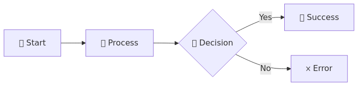

# 🎨 Visual Style Guide for Azure Synapse Analytics Documentation

Home > Visual Style Guide

<div align="center">


## 📚 Consistent Visual Standards for Professional Documentation

</div>

---

## 📖 Overview

This guide establishes visual standards for creating consistent, professional, and engaging documentation across the Azure Synapse Analytics documentation project.

---

## 🎯 Icon Usage Guidelines

### 📋 Standard Icon Mappings

| Category | Primary Icon | Alternative Icons | Usage |
|:---------|:------------|:------------------|:------|
| __Architecture__ | 🏗️ | 🏛️, 🌉 | System design, patterns |
| __Code/Development__ | 💻 | 🔧, ⚙️, 🛠️ | Code examples, tools |
| __Security__ | 🔒 | 🔐, 🛡️, 🔑 | Security topics |
| __Performance__ | ⚡ | 🚀, 📈, ⏱️ | Optimization, speed |
| __Best Practices__ | 💡 | 📋, ✨, 🎯 | Guidelines, tips |
| __Warning/Caution__ | ⚠️ | 🚨, ❗, ⛔ | Important notices |
| __Success/Complete__ | ✅ | ✔️, 🎉, 👍 | Positive outcomes |
| __Error/Failed__ | ❌ | ❗, 🔴, 🚫 | Negative outcomes |
| __Documentation__ | 📚 | 📖, 📝, 📄 | Text content |
| __Data/Analytics__ | 📊 | 📈, 📉, 💾 | Data topics |
| __Cloud/Azure__ | ☁️ | 🌐, 🔷, 🌍 | Cloud services |
| __Process/Workflow__ | 🔄 | ➡️, 🔀, 📍 | Steps, flows |

### 🎨 Heading Icon Rules

```markdown
# 🚀 Main Title (H1) - Use bold, distinctive icons
## 📖 Major Section (H2) - Use category-specific icons
### 🎯 Subsection (H3) - Use relevant contextual icons
#### 📝 Detail Level (H4) - Optional, smaller scope icons
```

---

## 🏷️ Badge Standards

### 🎯 Badge Types and Usage

#### Status Badges

```markdown


```

#### Complexity Badges

```markdown


```

#### Performance Impact Badges

```markdown


```

---

## 📊 Table Formatting

### 🎯 Standard Table Structure

```markdown
| Column 1 | Column 2 | Column 3 |
|:---------|:---------|:---------|
| Left-aligned | Center content | Right info |
| Use icons 🎯 | Add badges | Include links |
```

### 📋 Feature Comparison Tables

```markdown
| Feature | Basic | Premium | Enterprise |
|:--------|:-----:|:-------:|:----------:|
| Users | 10 | 100 | Unlimited |
| Storage | 1GB | 10GB | 100GB |
| Support | ❌ | ✅ | ✅ |
```

---

## 🎨 Visual Elements

### 📐 Section Separators

Always use horizontal rules between major sections:

```markdown
---
```

### 💬 Blockquotes for Important Information

```markdown
> **💡 Pro Tip:** Use blockquotes for insights and important notes
> 
> **⚠️ Warning:** Critical information that requires attention
> 
> **📝 Note:** Additional context or clarification
```

### 📦 Code Block Formatting

Always specify language for syntax highlighting:

```python
# Python example with proper highlighting
def example_function():
    return "Always specify language"
```

---

## 🌈 Color Coding Guidelines

### 🎨 Badge Color Meanings

| Color | Hex Code | Usage | Examples |
|:------|:---------|:------|:---------|
| 🟢 __Green__ | `#28a745` | Success, Good, Complete | Active, Low Impact |
| 🟡 __Yellow__ | `#ffc107` | Warning, Caution, Medium | Beta, Medium Impact |
| 🔴 __Red__ | `#dc3545` | Error, High Priority | Critical, High Impact |
| 🔵 __Blue__ | `#007bff` | Information, Primary | Default, Links |
| ⚫ __Gray__ | `#6c757d` | Disabled, Inactive | Deprecated, N/A |

---

## 📋 Navigation Patterns

### 🎯 Breadcrumb Navigation

```markdown
<div align="center">

[](../README.md) › 
[](./README.md) › 
**Current Page**

</div>
```

### 🔗 Quick Links Section

```markdown
## 🔗 Quick Links

- 📖 [Documentation](#documentation)
- 🚀 [Getting Started](#getting-started)
- 💡 [Best Practices](#best-practices)
- 🔧 [Troubleshooting](#troubleshooting)
```

---

## 📊 Mermaid Diagrams

### 🎯 Standard Flow Diagram



---

## ✅ Checklist for New Documents

Before adding new documentation, ensure:

- [ ] 🎯 Appropriate icons in all headings
- [ ] 🏷️ Status/complexity badges where relevant
- [ ] 📊 Tables for comparison data
- [ ] ➖ Section separators between major topics
- [ ] 💬 Blockquotes for important information
- [ ] 🎨 Consistent color coding
- [ ] 📐 Proper navigation elements
- [ ] 🔗 Quick links for long documents
- [ ] 📝 Language specified in code blocks
- [ ] ✨ Professional and clean appearance

---

## 🚀 Quick Reference

### Copy-Paste Templates

#### Document Header

```markdown
# 🚀 Document Title

<div align="center">


### 📚 Brief Description

</div>

---
```

#### Section Header

```markdown
## 📖 Section Title

> **Brief section description or key insight**

### 🎯 Subsection
```

#### Feature Table

```markdown
| Feature | Description | Status |
|:--------|:------------|:-------|
| 🎯 **Feature 1** | Description | ✅ Active |
| 🚀 **Feature 2** | Description | 🚧 Beta |
| 💡 **Feature 3** | Description | 📅 Planned |
```

---

## 📚 Additional Resources

- [Emoji Reference](https://emojipedia.org/) - Complete emoji encyclopedia
- [Shields.io](https://shields.io/) - Badge generation service
- [Mermaid Docs](https://mermaid-js.github.io/) - Diagram syntax reference
- [Markdown Guide](https://www.markdownguide.org/) - Comprehensive markdown reference

---

<div align="center">

### 🌟 Maintaining Visual Excellence

__Consistency • Clarity • Professionalism__

</div>
