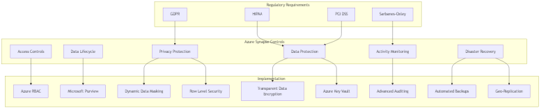

# Azure Synapse Analytics Delta Lakehouse Architecture

[Home](/) > [Architecture](./index.md) > Delta Lakehouse Overview

## Overview

Azure Synapse Analytics Delta Lakehouse is a unified analytics platform that combines the best of data warehousing and big data processing. This architecture enables organizations to build a modern data architecture that supports both analytics and operational workloads.

## Key Components

### 1. Delta Lake

- Open-source storage layer that brings ACID transactions to Apache Spark and big data workloads

- Built on top of Apache Parquet

- Supports schema evolution and enforcement

- Provides time travel capabilities

- Optimized for both streaming and batch processing

### 2. Spark Processing

- Apache Spark as the compute engine

- Runs on Synapse Spark pools

- Supports both batch and real-time processing

- Native integration with Delta Lake

### 3. Storage Layer

- Azure Data Lake Storage Gen2

- ADLS Gen2 provides:

  - High scalability
  - Secure access control
  - Cost-effective storage
  - Integration with Azure services

## Architecture Diagram

## Key Features

### 1. Schema Management

- Schema enforcement

- Schema evolution

- Version control

- Time travel capabilities

### 2. Performance Optimization

- Data skipping

- Z-ordering

- Clustering

- Statistics collection

### 3. Security

- Role-based access control

- Row-level security

- Data masking

- Audit logging

## Best Practices

### Storage Organization

- Use hierarchical folder structure

- Implement proper partitioning

- Regularly optimize files

- Use appropriate file sizes

### Schema Design

- Start with a flexible schema

- Plan for schema evolution

- Use appropriate data types

- Implement proper indexing

### Performance

- Use appropriate partitioning

- Implement proper bucketing

- Use Z-ordering for queries

- Regularly optimize files

## Next Steps

1. [Serverless SQL Architecture](../serverless-sql/index.md)
1. [Shared Metadata Architecture](../shared-metadata/index.md)
1. [Best Practices](../best-practices/index.md)
1. [Code Examples](../code-examples/index.md)
