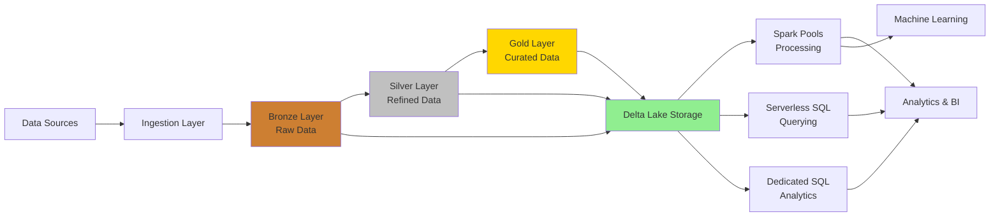

# Delta Lakehouse Architecture

[🏠 Home](../../../README.md) > [🏗️ Architecture](../../README.md) > 📄 Delta Lakehouse

## Overview

The Delta Lakehouse architecture combines the flexibility and cost-efficiency of a data lake with the data management and ACID transaction capabilities of a data warehouse. Azure Synapse Analytics provides native integration with Delta Lake format, enabling a modern and efficient lakehouse implementation.

## Architecture Components


### Core Components

1. __Azure Data Lake Storage Gen2__
   - Foundation for storing all data in raw, refined, and curated zones
   - Hierarchical namespace for efficient file organization
   - Fine-grained ACLs for security at folder and file levels

2. __Delta Lake__
   - Open-source storage layer that brings ACID transactions to data lakes
   - Schema enforcement and evolution capabilities
   - Time travel (data versioning) for auditing and rollbacks
   - Support for optimized Parquet format for performance

3. __Azure Synapse Spark Pools__
   - Distributed processing engine for data transformation
   - Native support for Delta Lake format
   - Scalable compute for batch and stream processing
   - Integration with Azure Machine Learning for advanced analytics

4. __Azure Synapse SQL__
   - SQL interface for querying Delta tables
   - Serverless pool for ad-hoc analytics
   - Dedicated pool for enterprise data warehousing

## Implementation Patterns

### Multi-Zone Data Organization

```text
adls://data/
├── raw/                  # Raw ingested data
├── refined/              # Cleansed and conformed data
└── curated/              # Business-ready data products
```

### Data Flow Diagram

The following diagram illustrates the end-to-end data flow through the Delta Lakehouse architecture:



### Medallion Architecture

The medallion architecture organizes your Delta Lake data into layers with increasing data quality and refinement:

1. __Bronze Layer__ (Raw Data)
   - Ingestion sink for all source data
   - Preserves original data format and content
   - Minimal transformation, primarily ELT
   - Schema-on-read approach

2. __Silver Layer__ (Refined Data)
   - Cleansed and conformed data
   - Standardized formats and resolved duplicates
   - Common data quality rules applied
   - Typically organized by domain or source system

3. __Gold Layer__ (Curated Data)
   - Business-level aggregates and metrics
   - Dimensional models for reporting
   - Feature tables for machine learning
   - Optimized for specific analytical use cases

## Performance Optimization

### Delta Optimizations

- __Data Skipping__: Delta maintains statistics to skip irrelevant files during queries
- __Z-Ordering__: Multi-dimensional clustering for improved filtering performance
- __Compaction__: Small file consolidation to optimize read performance
- __Caching__: Metadata and data caching for frequently accessed tables

### Spark Tuning

- __Autoscaling__: Configure Spark pools to scale based on workload
- __Partition Management__: Right-size partitions to optimize parallelism
- __Memory Configuration__: Allocate appropriate memory for shuffle and execution
- __Query Plan Optimization__: Analyze and tune Spark execution plans

## Governance and Security

- __Azure Purview Integration__: Data cataloging and lineage tracking
- __Column-Level Security__: Fine-grained access control within tables
- __Row-Level Security__: Filter data based on user context
- __Transparent Data Encryption__: Data encryption at rest

## Deployment and DevOps

- __Infrastructure as Code__: Deploy lakehouse components using ARM templates or Terraform
- __CI/CD Pipelines__: Automated testing and deployment of Spark notebooks and SQL scripts
- __Monitoring__: Azure Monitor integration for performance tracking and alerts
- __Delta Live Tables__: Declarative ETL framework for reliable pipeline development

## Best Practices

1. Implement a systematic approach to schema evolution
2. Use appropriate partitioning strategies based on data access patterns
3. Apply retention policies to manage data lifecycle efficiently
4. Leverage checkpoint files for streaming workloads
5. Implement Slowly Changing Dimension patterns for tracking historical changes
6. Use Z-Ordering on frequently filtered columns
7. Maintain separate compute clusters for ETL and query workloads
8. Implement CI/CD practices for Delta table schema changes
