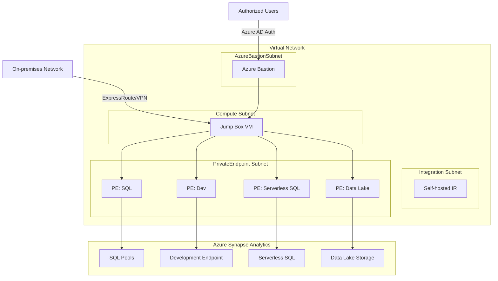
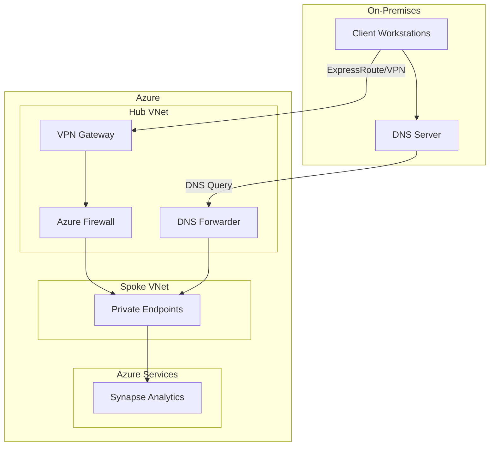

# Private Link Architecture

!!! abstract "Overview"
    This guide details the architecture patterns for implementing Azure Private Link with Azure Synapse Analytics, ensuring secure network isolation and private connectivity.

## :material-lock-network: Private Link Architecture Components

Azure Private Link provides secure private connectivity to Azure Synapse Analytics and related services.

<!-- Markdown lint exception: Inline HTML is used here for Material for MkDocs grid cards feature -->
<div class="grid cards" markdown>

- :material-connection:{ .lg .middle } __Private Endpoints__

    ---
    
    The interface for connecting privately to Azure services
    
    [:octicons-arrow-right-24: Endpoint design](#private-endpoint-design)

- :material-dns:{ .lg .middle } __DNS Configuration__

    ---
    
    Private DNS integration for name resolution
    
    [:octicons-arrow-right-24: DNS setup](#private-dns-configuration)

- :material-virtual-reality:{ .lg .middle } __Network Topology__

    ---
    
    VNet design for Synapse with Private Link
    
    [:octicons-arrow-right-24: Network design](#network-topology)

- :material-check-network:{ .lg .middle } __Connectivity Validation__

    ---
    
    Testing and validating private connectivity
    
    [:octicons-arrow-right-24: Validation](#connectivity-validation)

</div>

## Reference Architecture




## Private Endpoint Design

!!! warning "Security Alert"
    Each Synapse component requires its own private endpoint with the correct group ID to function properly.

Azure Synapse Analytics requires multiple private endpoints for complete private connectivity:

| Component | Group ID | DNS Zone | Purpose |
|-----------|----------|----------|---------|
| SQL | Sql | privatelink.sql.azuresynapse.net | SQL pools access |
| SQL On-Demand | SqlOnDemand | privatelink.sql.azuresynapse.net | Serverless SQL access |
| Dev | Dev | privatelink.dev.azuresynapse.net | Development experience |
| Web | Web | privatelink.azuresynapse.net | Web UI access |

!!! example "ARM Template for Private Endpoints"
    ```json
    {
      "type": "Microsoft.Network/privateEndpoints",
      "apiVersion": "2020-11-01",
      "name": "synapse-sql-endpoint",
      "location": "[parameters('location')]",
      "properties": {
        "privateLinkServiceConnections": [
          {
            "name": "synapse-sql-endpoint",
            "properties": {
              "privateLinkServiceId": "[resourceId('Microsoft.Synapse/workspaces', parameters('workspaceName'))]",
              "groupIds": [
                "Sql"
              ]
            }
          }
        ],
        "subnet": {
          "id": "[variables('subnetId')]"
        }
      },
      "dependsOn": [
        "[resourceId('Microsoft.Synapse/workspaces', parameters('workspaceName'))]"
      ]
    }
    ```

## Private DNS Configuration

Each private endpoint requires corresponding DNS zone configuration:

1. __Create private DNS zones__ for each endpoint type
2. __Link DNS zones__ to your virtual network
3. __Create A records__ for each private endpoint
4. __Configure DNS resolution__ between on-premises and Azure


```powershell
# Example: Create Private DNS Zones
$resourceGroup = "myResourceGroup"
$vnetName = "myVNet"
$vnetId = (Get-AzVirtualNetwork -Name $vnetName -ResourceGroupName $resourceGroup).Id

# Create DNS zones
New-AzPrivateDnsZone -ResourceGroupName $resourceGroup -Name "privatelink.sql.azuresynapse.net"
New-AzPrivateDnsZone -ResourceGroupName $resourceGroup -Name "privatelink.dev.azuresynapse.net"
New-AzPrivateDnsZone -ResourceGroupName $resourceGroup -Name "privatelink.azuresynapse.net"

# Link DNS zones to VNet
New-AzPrivateDnsVirtualNetworkLink -ResourceGroupName $resourceGroup `
  -ZoneName "privatelink.sql.azuresynapse.net" `
  -Name "link-to-$vnetName" `
  -VirtualNetworkId $vnetId `
  -EnableRegistration $false

# Repeat for other DNS zones
```

## Network Topology


Implement these network topology best practices:

1. __Hub-Spoke Model__ - Central connectivity hub with Synapse in a spoke VNet
2. __Dedicated Subnets__ - Separate subnet for private endpoints
3. __Network Security Groups__ - Control traffic flow between subnets
4. __Route Tables__ - Direct traffic through security appliances when needed
5. __Azure Firewall__ - Filter outbound traffic from Synapse

!!! tip "Best Practice"
    Use subnet segregation to separate private endpoints by service type for better security and management.

## Connectivity Validation

Validate your private link configuration with these methods:

1. **DNS Resolution Testing**:
```bash
# Test DNS resolution
nslookup myworkspace.sql.azuresynapse.net
# Should resolve to private IP address
```

2. **Connection Testing**:
```bash
# Test SQL connection
sqlcmd -S myworkspace.sql.azuresynapse.net -U username -P password
```

3. **Network Path Analysis**:
```bash
# Trace route should not go through internet
tracert myworkspace.sql.azuresynapse.net
```

## Hybrid Connectivity Scenarios

!!! info "Integration Point"
    ExpressRoute or Site-to-Site VPN integration is essential for on-premises to Azure Synapse private connectivity.

Configure these hybrid connectivity patterns:

1. __ExpressRoute with Private Peering__ - Dedicated circuit for low-latency connectivity
2. __Site-to-Site VPN__ - Encrypted connection over the internet
3. __Point-to-Site VPN__ - For individual client connections
4. __DNS Forwarding__ - Configure DNS forwarding for on-premises name resolution




## Scalability and High Availability

Design your private link architecture for scalability and high availability:

1. __Multiple Private Endpoints__ in different subnets for load distribution
2. __Redundant ExpressRoute Circuits__ for hybrid connectivity
3. __Zone-Redundant VPN Gateways__ for high availability
4. __Multiple DNS Servers__ for resilient name resolution
5. __Cross-Region Private Endpoints__ for disaster recovery scenarios

## Implementation Checklist

- [ ] Create virtual network with dedicated subnet for private endpoints
- [ ] Create private endpoints for all Synapse components (SQL, Dev, Web, etc.)
- [ ] Configure private DNS zones and link to your virtual network
- [ ] Set up DNS resolution between on-premises and Azure
- [ ] Configure NSGs with appropriate security rules
- [ ] Implement hybrid connectivity (ExpressRoute or VPN)
- [ ] Test connectivity from all required client locations
- [ ] Document network architecture and DNS configuration

## Related Resources

- [Azure Private Link documentation](https://learn.microsoft.com/en-us/azure/private-link/)
- [Azure Synapse private link documentation](https://learn.microsoft.com/en-us/azure/synapse-analytics/security/how-to-connect-to-workspace-with-private-links)
- [ExpressRoute documentation](https://learn.microsoft.com/en-us/azure/expressroute/)
- [Azure Private DNS documentation](https://learn.microsoft.com/en-us/azure/dns/private-dns-overview)
