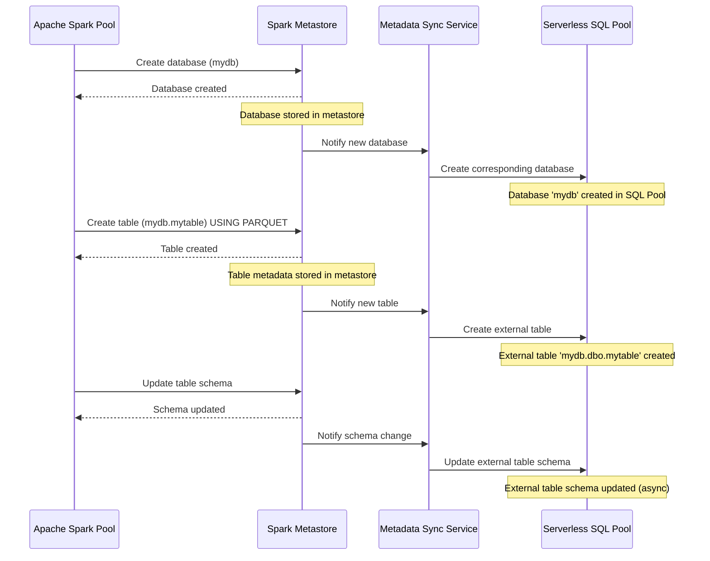
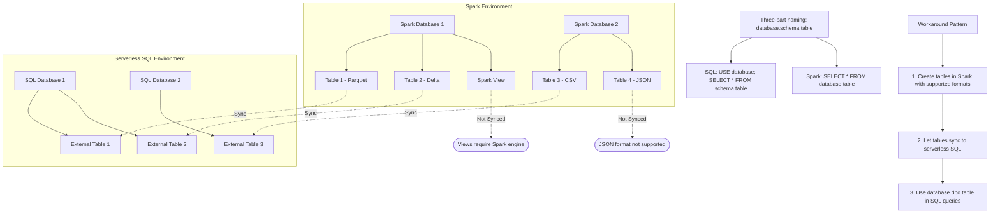

# Azure Synapse Shared Metadata Architecture - Visual Guides

[Home](/README.md) > [Architecture](../README.md) > [Shared Metadata](README.md) > Visual Guides

## Serverless Replicated Database Synchronization

## Three-Part Naming Limitations and Workarounds

## Layered Data Architecture with Shared Metadata

## Creating and Accessing Synchronized Tables - Process Flow

