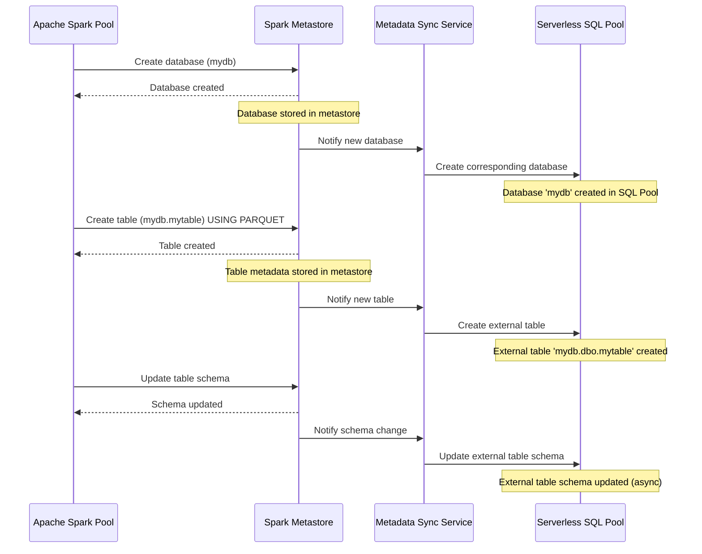
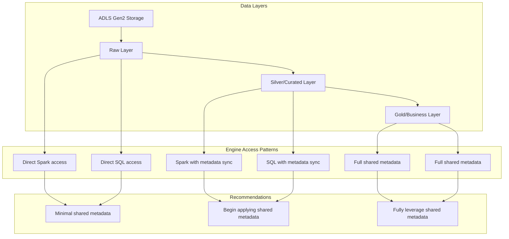
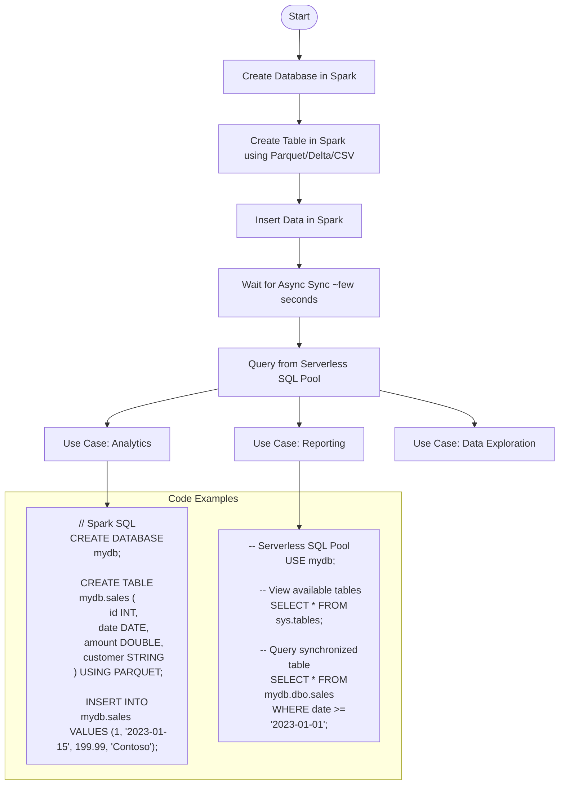

# Azure Synapse Shared Metadata Architecture - Visual Guides

[Home](/README.md) > [Architecture](../index.md) > [Shared Metadata](index.md) > Visual Guides

## Serverless Replicated Database Synchronization

## Three-Part Naming Limitations and Workarounds

## Layered Data Architecture with Shared Metadata

## Creating and Accessing Synchronized Tables - Process Flow

