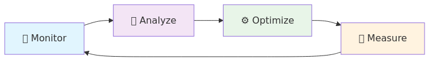

# ⚡ Performance Optimization Best Practices

[Home](../../README.md) > [Best Practices](../README.md) > Performance Optimization

> 🚀 **Performance Excellence Framework**  
> Comprehensive guide to optimizing performance across all Azure Synapse Analytics components for maximum throughput and efficiency.

---

## 🔍 Query Performance Optimization

### 🔥 Spark Pool Optimization

> ⚡ **Spark Excellence**  
> Optimize Apache Spark performance through strategic resource configuration and code optimization.

#### ⚙️ Resource Configuration

| Configuration Area | Optimization Focus | Impact Level |

|-----------|-------------|-------------|
| 📈 **Autoscale Configuration** | Set appropriate min and max node counts based on workload patterns |  |
| 💻 **Node Size Selection** | Choose the right memory-to-core ratio based on workload characteristics |  |
| 🔄 **Dynamic Allocation** | Enable dynamic executor allocation for variable workloads |  |

##### 🔧 Critical Spark Configurations

```python
# ⚡ Adaptive Query Execution - Essential for performance
spark.sql.adaptive.enabled = true
spark.sql.adaptive.coalescePartitions.enabled = true
spark.sql.adaptive.skewJoin.enabled = true
```

> 💡 **Configuration Impact**  
> These settings enable automatic optimization of query execution plans based on runtime statistics.

---

#### 💻 Code Optimization Techniques

| Technique | Code Example | Performance Benefit |
|-----------|--------------|---------------------|
| 📊 **DataFrame Caching** | Cache intermediate DataFrames for reuse |  |

```python
# 📊 DataFrame Caching - Reuse expensive computations
df = spark.read.format("delta").load("/path/to/data")
df.cache()  # ✨ Cache the DataFrame for repeated use
df.count()  # Trigger caching
```

| Technique | Code Example | Performance Benefit |
|-----------|--------------|---------------------|
| 🚀 **Partition Pruning** | Structure filters to leverage partitioning |  |

```python
# ✅ Good - enables partition pruning
df.filter(df.date_column == "2025-01-01").show()

# ❌ Bad - prevents partition pruning
df.filter(year(df.date_column) == 2025).show()
```

| Technique | Code Example | Performance Benefit |
|-----------|--------------|---------------------|
| 📊 **Broadcast Joins** | Optimize small-to-large table joins |  |

```python
from pyspark.sql.functions import broadcast

large_df = spark.table("large_table")
small_df = spark.table("small_table")

# ✨ Broadcast the smaller table (< 10MB recommended)
result = large_df.join(broadcast(small_df), "join_key")
```

---

### ☁️ Serverless SQL Optimization

> 💰 **Cost-Effective Performance**  
> Optimize Serverless SQL queries for both performance and cost efficiency.

#### 🔍 Query Structure Optimization

| Optimization | Impact | Cost Savings |
|--------------|--------|---------------|
| 🚀 **Predicate Pushdown** | Filter at storage layer |  |
| 📋 **Column Pruning** | Read only needed columns |  |

```sql
-- ✅ Good: Enables predicate pushdown
SELECT * FROM external_table 
WHERE date_column = '2025-01-01'

-- ❌ Avoid: Prevents pushdown optimization
SELECT * FROM external_table 
WHERE YEAR(date_column) = 2025
```

```sql
-- ✅ Good: Column pruning - reads only required data
SELECT customer_id, order_total, order_date 
FROM large_orders_table

-- ❌ Avoid: Reads all columns unnecessarily
SELECT * FROM large_orders_table
```

---

#### 📊 External Table Design

| Design Element | Implementation | Query Performance |
|----------------|----------------|-------------------|
| 📈 **Statistics** | Create stats on query columns |  |
| 📄 **File Format** | Use columnar formats |  |
| 📋 **Partitioning** | Align with query patterns |  |

```sql
-- 📈 Create statistics for query optimization
CREATE STATISTICS stats_customer_id ON external_table (customer_id);
CREATE STATISTICS stats_order_date ON external_table (order_date);
```

> 💡 **File Format Performance Comparison**

| Format | Query Speed | Storage Efficiency | Best Use Case |
|--------|-------------|-------------------|---------------|
| 🏞️ **Delta** |  |  | ACID transactions, versioning |
| 📋 **Parquet** |  |  | Analytics, reporting |
| 📄 **CSV** |  |  | Simple data exchange |
| 📜 **JSON** |  |  | Semi-structured data |

---

## 🗄️ Data Storage Optimization

> 🏗️ **Storage Excellence**  
> Optimize your data storage layer for maximum query performance and cost efficiency.

### 📄 File Format Optimization

#### 🏞️ Delta Lake Optimization

| Optimization | Command | Performance Impact | Frequency |
|--------------|---------|-------------------|----------|
| 📠**File Compaction** | `OPTIMIZE tableName` |  |  |
| 🔄 **Z-Ordering** | `OPTIMIZE ... ZORDER BY` |  |  |
| 🌸 **Bloom Filters** | `CREATE BLOOMFILTER INDEX` |  |  |

```sql
-- 📁 File Compaction - Merge small files for better performance
OPTIMIZE sales_data;

-- 🔄 Z-Ordering - Co-locate data for faster queries
OPTIMIZE sales_data 
ZORDER BY (customer_id, order_date);

-- 🌸 Bloom Filter - Fast string column filtering
CREATE BLOOMFILTER INDEX ON TABLE sales_data 
FOR COLUMNS(product_category, customer_segment);
```

> ⚡ **Z-Ordering Strategy**  
> Choose Z-order columns based on your most frequent WHERE clause combinations.

---

#### 📋 Parquet Optimization

| Configuration | Recommendation | Use Case | Performance |
|---------------|----------------|----------|-------------|
| 🗑️ **Compression** | Snappy for balance, Zstd for storage | General use vs. archival |  |
| 📋 **Row Group Size** | 128MB for optimal performance | Analytics workloads |  |

```python
# 🗑️ Compression optimization
df.write \
  .option("compression", "snappy") \
  .format("parquet") \
  .save("/path/to/data")

# 📋 Row group size optimization (128MB = 134217728 bytes)
df.write \
  .option("parquet.block.size", 134217728) \
  .format("parquet") \
  .save("/path/to/data")
```

> 💡 **Compression Comparison**

| Codec | Compression Ratio | Decode Speed | Best For |
|-------|------------------|--------------|----------|
| **Snappy** |  |  | General analytics |
| **Zstd** |  |  | Cold storage |
| **LZ4** |  |  | Real-time processing |

---

### 🗺️ Data Layout Optimization

#### 📋 Strategic Partitioning

| Partitioning Strategy | Best For | Cardinality | Query Performance |
|----------------------|----------|-------------|-------------------|
| 📅 **Date-Based** | Time series data | Low-Medium |  |
| 🭠**Categorical** | Business dimensions | Low |  |
| 🔗 **Hybrid** | Complex analytics | Low-Medium |  |

```python
# 📅 Date-based partitioning strategies

# Daily partitioning - for frequently accessed recent data
recent_data.write \
  .partitionBy("year", "month", "day") \
  .format("delta") \
  .save("/data/bronze/daily/")

# Monthly partitioning - for historical analysis
historical_data.write \
  .partitionBy("year", "month") \
  .format("delta") \
  .save("/data/bronze/historical/")
```

```python
# 🏭 Categorical partitioning guidelines

# ✅ Good: Low cardinality (regions, countries)
sales_data.write \
  .partitionBy("region") \
  .format("delta") \
  .save("/data/silver/sales/")

# ❌ Avoid: High cardinality (customer_id, product_id)
# This creates too many small partitions
```

```python
# 🔗 Hybrid partitioning - best of both worlds
combined_data.write \
  .partitionBy("year", "month", "region") \
  .format("delta") \
  .save("/data/gold/analytics/")
```

> ⚠️ **Partition Guidelines**  
> - Keep partition count under 10,000
> - Aim for partition sizes > 1GB
> - Avoid high-cardinality columns

---

## 💻 Memory Optimization

> 🧠 **Memory Excellence**  
> Optimize memory usage for maximum performance and stability.

### 🔥 Spark Memory Management

#### ⚙️ Memory Configuration Strategy

| Memory Setting | Recommendation | Purpose | Impact |
|----------------|----------------|---------|--------|
| 💻 **Executor Memory** | 2-8GB per executor | JVM heap allocation |  |
| 📈 **Memory Fraction** | 0.8 (80% of heap) | Execution vs. other JVM usage |  |
| 🗄️ **Storage Fraction** | 0.5 (50% of execution memory) | Caching vs. computation |  |

```python
# 💻 Memory configuration for different workload sizes

# Small workloads (< 100GB)
spark.conf.set("spark.executor.memory", "2g")

# Medium workloads (100GB - 1TB)
spark.conf.set("spark.executor.memory", "4g")

# Large workloads (> 1TB)
spark.conf.set("spark.executor.memory", "8g")

# 📈 Memory fraction optimization
spark.conf.set("spark.memory.fraction", "0.8")
spark.conf.set("spark.memory.storageFraction", "0.5")
```

> 💡 **Memory Sizing Rules**  
> - Start with 4GB executors and adjust based on monitoring
> - Monitor GC time - if > 10%, increase memory
> - Use memory-optimized nodes for ML workloads

---

#### 🔄 Data Skew Handling

| Technique | Use Case | Implementation Complexity | Effectiveness |
|-----------|----------|---------------------------|---------------|
| 🧒 **Salting** | Skewed join keys |  |  |
| 🤖 **Adaptive Query Execution** | General skew handling |  |  |

```python
# 🧒 Salting technique for skewed joins
from pyspark.sql.functions import monotonically_increasing_id, col

# Add salt column to distribute skewed keys
skewed_df = df.withColumn(
    "salt", 
    (col("skewed_column").hash() % 10).cast("int")
)

# Join with salted key
result = skewed_df.join(other_df, ["salted_key", "salt"])
```

```python
# 🤖 Adaptive Query Execution - automatic skew detection
spark.conf.set("spark.sql.adaptive.enabled", "true")
spark.conf.set("spark.sql.adaptive.skewJoin.enabled", "true")
spark.conf.set("spark.sql.adaptive.skewJoin.skewedPartitionThresholdInBytes", "256MB")
```

> ⚡ **Skew Detection Signs**  
> - Some tasks take much longer than others
> - Memory errors on specific executors
> - Uneven data distribution in Spark UI

---

## 📈 Monitoring and Tuning

> 🔍 **Continuous Improvement**  
> Implement comprehensive monitoring to identify and resolve performance bottlenecks.

### 📊 Performance Monitoring

#### 📈 Critical Metrics Dashboard

| Metric Category | Key Indicators | Monitoring Tool | Alert Threshold |
|----------------|----------------|-----------------|----------------|
| 🚀 **Spark UI Metrics** | Stage duration, task skew, shuffle data | Spark History Server |  |
| 🔠**Execution Plans** | Physical vs. logical plan efficiency | DataFrame explain() |  |
| 📊 **I/O Performance** | Read/write throughput and latency | Azure Monitor |  |

```python
# 🔍 Query plan analysis for optimization

# Show all execution plan details
df.explain(True)  # Physical, logical, optimized, and code gen plans

# Quick performance check
df.explain("cost")  # Show cost-based optimization details

# Analyze specific operations
df.filter(...).join(...).explain()
```

> 📈 **Spark UI Key Areas**  
> 1. **Jobs Tab**: Overall job duration and failures
> 2. **Stages Tab**: Task distribution and skew
> 3. **Storage Tab**: Cached DataFrame efficiency
> 4. **Executors Tab**: Resource utilization

---

#### 🔧 Performance Tuning Methodology

| Phase | Action | Success Criteria | Duration |
|-------|--------|------------------|----------|
| 📊 **Baseline** | Establish performance metrics | Documented current state |  |
| 🔄 **Iterative Tuning** | One change at a time | 10%+ improvement per iteration |  |
| 🔠**Workload Analysis** | Pattern-based optimization | Consistent performance |  |

> 📋 **Tuning Checklist**
> 
> - [ ] 📈 Document baseline metrics
> - [ ] 🎯 Identify performance bottlenecks
> - [ ] ⚙️ Apply single optimization
> - [ ] 📈 Measure impact
> - [ ] 🔄 Repeat for next optimization
> - [ ] 📊 Monitor production performance

---

## 💰 Cost Optimization

> 💲 **Cost Excellence**  
> Balance performance and cost through intelligent resource management.

### 📉 Resource Utilization

#### 📈 Auto-Scaling Strategy

| Auto-scaling Component | Configuration | Cost Impact | Performance Impact |
|------------------------|---------------|-------------|--------------------|
| 📋 **Min Nodes** | 2-3 nodes |  |  |
| 📈 **Max Nodes** | Based on peak demand |  |  |
| ⏱️ **Idle Timeout** | 15-30 minutes |  |  |

```json
{
  "autoscale": {
    "minNodeCount": 2,
    "maxNodeCount": 10,
    "enabled": true
  },
  "autoPause": {
    "enabled": true,
    "delayInMinutes": 15
  }
}
```

---

#### 📀 Right-Sizing Strategy

| Resource Type | Starting Size | Scaling Trigger | Cost Optimization |
|---------------|---------------|-----------------|-------------------|
| 🔥 **Spark Pools** | Small (4 cores) | CPU > 80% for 10 min |  |
| 📊 **SQL Pools** | DW100c | Query queue > 5 |  |
| 🗄️ **Storage** | Hot tier | Access pattern analysis |  |

> 📈 **Utilization Monitoring**
> 
> ```python
> # Monitor resource utilization patterns
> spark.sparkContext.statusTracker().getExecutorInfos()
> 
> # Check memory and CPU usage
> for executor in executors:
>     print(f"Executor {executor.executorId}: "
>           f"Memory: {executor.memoryUsed}/{executor.maxMemory}, "
>           f"CPU: {executor.totalCores}")
> ```

---

### 🗄️ Storage Cost Optimization

#### 🔄 Data Lifecycle Management

| Data Age | Access Pattern | Recommended Tier | Cost Savings |
|----------|----------------|------------------|---------------|
| 🆕 **< 30 days** | Frequent access | Hot tier |  |
| 📅 **30-90 days** | Occasional access | Cool tier |  |
| 📜 **> 90 days** | Rare access | Archive tier |  |

```python
# 🔄 Implement data lifecycle policies
def configure_lifecycle_policy():
    lifecycle_rules = [
        {
            "name": "MoveTocool",
            "enabled": True,
            "filters": {
                "blobTypes": ["blockBlob"],
                "prefixMatch": ["data/bronze/"]
            },
            "actions": {
                "baseBlob": {
                    "tierToCool": {"daysAfterModificationGreaterThan": 30}
                }
            }
        }
    ]
    return lifecycle_rules
```

---

#### 🧩 Vacuum Operations

| Operation | Purpose | Frequency | Storage Savings |
|-----------|---------|-----------|----------------|
| 🧩 **VACUUM** | Remove old data files | Weekly |  |
| 📋 **Log Cleanup** | Clean transaction logs | Monthly |  |

```sql
-- 🧩 Regular vacuum operations
VACUUM sales_data RETAIN 7 DAYS;

-- 📋 Clean up old transaction logs (Delta 2.0+)
VACUUM sales_data RETAIN 30 DAYS DRY RUN; -- Preview cleanup
VACUUM sales_data RETAIN 30 DAYS;         -- Execute cleanup
```

> ⚠️ **Vacuum Best Practices**  
> - Never vacuum with RETAIN < 7 DAYS in production
> - Run VACUUM during low-activity periods
> - Consider time travel requirements when setting retention

---

## 🎆 Performance Optimization Summary

> 🚀 **Excellence Achieved**  
> Optimizing performance in Azure Synapse Analytics requires a holistic approach covering storage organization, query design, resource configuration, and ongoing monitoring.

### 🏆 Key Success Metrics

| Performance Area | Target Improvement | Measurement Method |
|------------------|-------------------|--------------------|
| 🔍 **Query Performance** | 2-5x faster queries | Query execution time |
| 💰 **Cost Optimization** | 30-60% cost reduction | Monthly Azure spend |
| 📈 **Resource Efficiency** | 80%+ utilization | CPU/Memory monitoring |
| 🚀 **User Experience** | < 10s response time | End-user feedback |

### 🔄 Continuous Improvement Process



---

> 💡 **Remember**  
> Performance optimization is an iterative process that should be tailored to your specific workload characteristics and business requirements. Start with the highest-impact optimizations and measure results before proceeding.

> 🔗 **Next Steps**  
> Ready to implement? Start with our [Delta Lake optimization examples](../code-examples/delta-lake-guide.md) for hands-on guidance.
