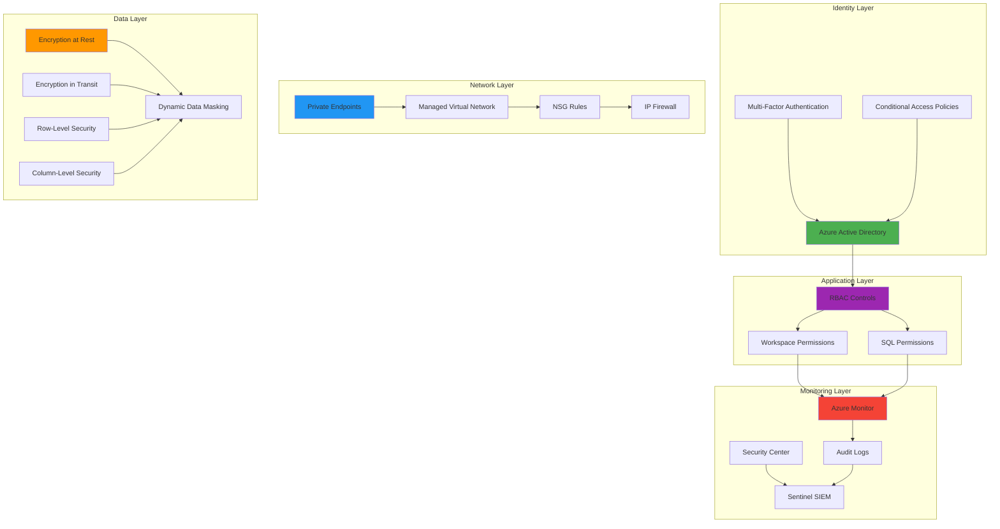
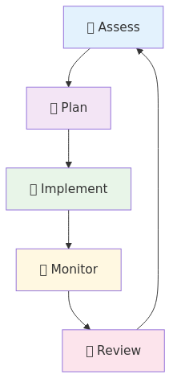

# Security Best Practices for Azure Synapse Analytics

[Home](../../README.md) > Best Practices > Security

> 🏡 __Defense-in-Depth Security__  
> Comprehensive security framework for protecting your Azure Synapse Analytics environment with enterprise-grade controls and compliance capabilities.

---

## 🔐 Identity and Access Management

> 🏗️ __Security Foundation__
> Identity and access management forms the cornerstone of your Synapse security architecture.

### Security Architecture Overview

The following diagram illustrates the layered security architecture for Azure Synapse Analytics:



### 🌐 Azure Active Directory Integration

#### 🔐 Authentication Controls

| Security Control | Implementation | Compliance Level | Risk Mitigation |
|------------------|----------------|------------------|-----------------|
| 🔐 __AAD Authentication__ | Primary authentication method |  |  |
| 🤖 __Managed Identities__ | Service-to-service authentication |  |  |
| 🔐 __Multi-Factor Authentication__ | Required for all user access |  |  |

```json
{
  "type": "Microsoft.Synapse/workspaces",
  "properties": {
    "identity": {
      "type": "SystemAssigned"
    },
    "azureADOnlyAuthentication": true,
    "trustedServiceBypassEnabled": false
  }
}
```

> ⚠️ __Security Alert__  
> Always enable AAD-only authentication to prevent SQL authentication bypass attempts.

---

#### 🔒 Authorization Framework

| Authorization Layer | Control Type | Implementation | Security Impact |
|--------------------|--------------|----------------|------------------|
| 🔐 __RBAC (Built-in Roles)__ | Least privilege principle | Azure built-in roles |  |
| 📋 __Custom Roles__ | Specialized access requirements | Custom role definitions |  |
| 🌐 __Conditional Access__ | Context-based access control | Azure AD policies |  |

```powershell
# 🔐 Assign appropriate Synapse roles
New-AzRoleAssignment -SignInName user@contoso.com `
    -RoleDefinitionName "Synapse SQL Administrator" `
    -Scope "/subscriptions/<sub-id>/resourceGroups/<rg>/providers/Microsoft.Synapse/workspaces/<workspace>"

# 🔍 Read-only access for analysts
New-AzRoleAssignment -SignInName analyst@contoso.com `
    -RoleDefinitionName "Synapse Artifact User" `
    -Scope "/subscriptions/<sub-id>/resourceGroups/<rg>/providers/Microsoft.Synapse/workspaces/<workspace>"
```

> 📋 __RBAC Best Practices__  
>
> - Start with least privilege
> - Use built-in roles when possible
> - Regular access reviews (quarterly)
> - Implement break-glass procedures

---

#### 🏭 Workspace-Level Security Controls

| Security Feature | Purpose | Implementation Complexity | Security Level |
|------------------|---------|---------------------------|----------------|
| 🌐 __IP Firewall Rules__ | Restrict network access by IP range |  |  |
| 🔗 __Private Link__ | Secure VNet connectivity |  |  |
| 🌐 __Managed VNet__ | Network isolation |  |  |

```json
{
  "properties": {
    "managedVirtualNetwork": "default",
    "trustedServiceBypassEnabled": false,
    "azureADOnlyAuthentication": true,
    "publicNetworkAccess": "Disabled",
    "firewallRules": [
      {
        "name": "CorporateNetwork",
        "properties": {
          "startIpAddress": "10.0.0.0",
          "endIpAddress": "10.0.255.255"
        }
      }
    ]
  }
}
```

> 🔒 __Network Security Layers__  
>
> 1. __Private Link__ - Secure VNet communication
> 2. __Managed VNet__ - Isolated compute environment  
> 3. __IP Firewall__ - Additional IP-based filtering
> 4. __NSG Rules__ - Subnet-level traffic control

---

## 📜 Data Security

> 🔒 __Data Protection Excellence__  
> Implement comprehensive data protection controls to secure sensitive information at rest, in transit, and in use.

### 🔐 Encryption and Data Protection

#### 🔒 Encryption Strategy

| Encryption Type | Implementation | Key Management | Compliance Impact |
|----------------|----------------|----------------|-------------------|
| 🔒 __At Rest__ | All storage encrypted by default | Microsoft or customer-managed |  |
| 💪 __In Transit__ | TLS 1.2+ for all connections | Certificate-based |  |
| 🏭 __TDE (SQL Pools)__ | Transparent database encryption | Service or customer-managed |  |

```powershell
# 🔐 Configure customer-managed encryption
Set-AzSynapseWorkspace -Name $workspaceName `
    -ResourceGroupName $resourceGroupName `
    -KeyVaultUrl $keyVaultUrl `
    -KeyName $keyName `
    -KeyVersion $keyVersion

# 🔒 Enable TDE for dedicated SQL pools
Set-AzSqlDatabaseTransparentDataEncryption `
    -ResourceGroupName $resourceGroupName `
    -ServerName $serverName `
    -DatabaseName $databaseName `
    -State "Enabled"
```

> 🔑 __Key Management Best Practices__  
>
> - Use Azure Key Vault for centralized key management
> - Implement key rotation policies (annual)
> - Separate encryption keys by environment
> - Monitor key access and usage

---

#### 🎭 Sensitive Data Protection

| Protection Technique | Use Case | Implementation | Privacy Level |
|---------------------|----------|----------------|---------------|
| 🏷️ __Data Classification__ | Discover and label sensitive data | SQL sensitivity labels |  |
| 🎭 __Dynamic Data Masking__ | Hide sensitive data from unauthorized users | Column-level masking |  |
| 🔄 __Data Anonymization__ | De-identify data for analytics | Tokenization, perturbation |  |

```sql
-- 🏷️ Data Classification - Label sensitive columns
ADD SENSITIVITY CLASSIFICATION TO
  customers.customer_table.credit_card_number
WITH (
  LABEL = 'Highly Confidential',
  INFORMATION_TYPE = 'Financial',
  LABEL_ID = '331c8da8-4c3c-4d3b-b4e1-3d5c8d3f4a2b',
  INFORMATION_TYPE_ID = 'd22fa6e9-5ee4-3bde-4c2b-a409604c4646'
);
```

```sql
-- 🎭 Dynamic Data Masking - Hide sensitive data
ALTER TABLE customers 
ADD MASKED WITH (FUNCTION = 'partial(2,"XXXXXXX",0)') 
FOR COLUMN credit_card_number;

-- Email masking
ALTER TABLE customers 
ADD MASKED WITH (FUNCTION = 'email()') 
FOR COLUMN email_address;
```

> 🔍 __Data Protection Layers__  
>
> 1. __Discovery__: Identify sensitive data automatically
> 2. __Classification__: Label data based on sensitivity  
> 3. __Protection__: Apply appropriate controls
> 4. __Monitoring__: Track access to sensitive data

---

### 📊 SQL Security Features

#### 🔐 Advanced SQL Security Controls

| Security Control | Implementation | Granularity | Use Cases |
|------------------|----------------|-------------|----------|
| 📋 __Row-Level Security (RLS)__ | Filter predicates and policies | Row-level | Multi-tenant, regional data |
| 📜 __Column-Level Security__ | GRANT/DENY permissions | Column-level | Salary data, PII protection |
| 🔍 __SQL Vulnerability Assessment__ | Automated security scanning | Database-level | Compliance, risk management |

```sql
-- 📋 Row-Level Security Implementation
CREATE FUNCTION dbo.fn_territoryFilter(@TerritoryId INT)  
RETURNS TABLE  
WITH SCHEMABINDING  
AS  
RETURN SELECT 1 AS fn_securitypredicate_result
WHERE 
    @TerritoryId = CAST(SESSION_CONTEXT(N'TerritoryId') AS INT)
    OR IS_MEMBER('db_datareader') = 1;

-- Apply security policy
CREATE SECURITY POLICY TerritoryFilter  
ADD FILTER PREDICATE dbo.fn_territoryFilter(territory_id)
ON dbo.sales_data
WITH (STATE = ON);
```

```sql
-- 📜 Column-Level Security
-- Restrict salary access to HR role only
DENY SELECT ON employees(salary, bonus) TO analyst_role;
GRANT SELECT ON employees(salary, bonus) TO hr_role;

-- Create a view with masked sensitive columns
CREATE VIEW employees_public AS
SELECT 
    employee_id, 
    first_name, 
    last_name, 
    department,
    -- Salary hidden from non-HR users
    CASE WHEN IS_MEMBER('hr_role') = 1 
         THEN salary 
         ELSE NULL 
    END AS salary
FROM employees;
```

> 🔒 __Security Policy Management__  
>
> - Test policies thoroughly before production deployment
> - Monitor policy performance impact
> - Document security predicates for maintenance
> - Regular policy reviews and updates

---

## 🌐 Network Security

> 🏡 __Network Defense Strategy__  
> Implement multi-layered network security controls to protect against unauthorized access and data exfiltration.

### 🔒 Network Isolation Architecture

#### 🔗 Private Endpoints Configuration

| Endpoint Type | Security Level | Use Case | Network Traffic |
|---------------|----------------|----------|------------------|
| 🔗 __Private Endpoints__ | Highest security | Production workloads |  |
| 🌐 __Service Endpoints__ | Medium security | Legacy compatibility |  |
| 🌍 __Public Endpoints__ | Basic security | Development/testing |  |

```json
{
  "name": "synapse-sql-private-endpoint",
  "properties": {
    "privateLinkServiceConnections": [
      {
        "name": "synapse-sql-connection",
        "properties": {
          "privateLinkServiceId": "/subscriptions/<sub-id>/resourceGroups/<rg>/providers/Microsoft.Synapse/workspaces/<workspace>",
          "groupIds": ["Sql"],
          "requestMessage": "Private endpoint for Synapse SQL"
        }
      }
    ],
    "subnet": {
      "id": "/subscriptions/<sub-id>/resourceGroups/<rg>/providers/Microsoft.Network/virtualNetworks/<vnet>/subnets/<pe-subnet>"
    }
  }
}
```

> 🔗 __Private Endpoint Best Practices__  
>
> - Create separate private endpoints for different Synapse services (SQL, Dev, SqlOnDemand)
> - Use dedicated subnets for private endpoints  
> - Configure private DNS zones for name resolution
> - Monitor private endpoint connections

---

#### 🏡 Network Security Groups (NSG)

| NSG Rule Type | Direction | Purpose | Security Impact |
|---------------|-----------|---------|------------------|
| 📌 __Restrictive Inbound__ | Inbound | Limit access to necessary ports only |  |
| 📎 __Controlled Outbound__ | Outbound | Prevent data exfiltration |  |
| 📊 __Application Security Groups__ | Both | Logical grouping of resources |  |

```json
{
  "securityRules": [
    {
      "name": "AllowSynapseSQL",
      "properties": {
        "protocol": "Tcp",
        "sourcePortRange": "*",
        "destinationPortRange": "1433",
        "sourceAddressPrefix": "10.0.0.0/16",
        "destinationAddressPrefix": "*",
        "access": "Allow",
        "priority": 100,
        "direction": "Inbound"
      }
    },
    {
      "name": "DenyAllInbound",
      "properties": {
        "protocol": "*",
        "sourcePortRange": "*",
        "destinationPortRange": "*",
        "sourceAddressPrefix": "*",
        "destinationAddressPrefix": "*",
        "access": "Deny",
        "priority": 4096,
        "direction": "Inbound"
      }
    }
  ]
}
```

> 🏡 __NSG Security Strategy__  
>
> - Default deny for all traffic
> - Explicit allow rules for required traffic only
> - Regular review of NSG rules
> - Log and monitor denied traffic

---

#### 🏡 Managed Virtual Network

| Feature | Security Benefit | Implementation | Risk Mitigation |
|---------|------------------|----------------|------------------|
| 🔒 __Data Exfiltration Protection__ | Prevents unauthorized data export | Managed VNet isolation |  |
| ✅ __Approved Private Endpoints__ | Controls outbound connectivity | Whitelist approach |  |
| 📋 __Network Monitoring__ | Detect suspicious activity | Azure Monitor integration |  |

```json
{
  "managedVirtualNetwork": {
    "type": "default",
    "preventDataExfiltration": true,
    "allowedAadTenantIdsForLinking": [
      "your-tenant-id"
    ]
  },
  "managedPrivateEndpoints": [
    {
      "name": "approved-storage-endpoint",
      "privateLinkResourceId": "/subscriptions/<sub-id>/resourceGroups/<rg>/providers/Microsoft.Storage/storageAccounts/<storage>",
      "groupId": "blob"
    }
  ]
}
```

> 🔒 __Data Exfiltration Protection__  
> When enabled, Synapse managed VNet prevents:
>
> - Unauthorized data copying to external storage
> - Connections to non-approved private endpoints
> - Data transfer outside approved Azure AD tenants

---

## 🔑 Secret Management

> 🔐 __Secure Credential Management__  
> Implement centralized, secure credential management using Azure Key Vault integration.

### 🔑 Azure Key Vault Integration

#### 📄 Secure Credential Storage

| Secret Type | Storage Method | Rotation Policy | Access Control |
|-------------|----------------|------------------|----------------|
| 📊 __Connection Strings__ | Key Vault secrets | Every 90 days |  |
| 🔑 __API Keys__ | Key Vault secrets | Every 30 days |  |
| 📜 __Certificates__ | Key Vault certificates | Every 365 days |  |

```python
# 🔑 Secure secret retrieval in Synapse Spark

# Using Key Vault-backed secret scope
connection_string = dbutils.secrets.get(
    scope="production-keyvault-scope", 
    key="adls-connection-string"
)

# Using secrets in Delta Lake operations
df.write \
  .format("delta") \
  .option("checkpointLocation", 
          f"abfss://container@storage.dfs.core.windows.net/checkpoints/") \
  .option("fs.azure.account.key.storage.dfs.core.windows.net", 
          dbutils.secrets.get(scope="keyvault-scope", key="storage-key")) \
  .save("/delta/table")
```

> 🔄 __Key Rotation Best Practices__  
>
> - Automate rotation using Azure Automation or Logic Apps
> - Implement dual-key strategy for zero-downtime rotation
> - Monitor key usage and expiration dates
> - Test rotation procedures regularly

---

#### 🔐 Secure Parameter Management

| Parameter Type | Security Method | Implementation | Risk Level |
|----------------|-----------------|----------------|------------|
| 📊 __Pipeline Parameters__ | Secure string type | Azure Synapse pipelines |  |
| 🔗 __Linked Service Credentials__ | Key Vault integration | JSON configuration |  |
| 🌐 __Environment Variables__ | Key Vault references | Runtime configuration |  |

```json
{
  "name": "SecureAzureStorageLinkedService",
  "properties": {
    "type": "AzureBlobStorage",
    "typeProperties": {
      "connectionString": {
        "type": "AzureKeyVaultSecret",
        "store": {
          "referenceName": "ProductionKeyVaultLinkedService",
          "type": "LinkedServiceReference"
        },
        "secretName": "prod-storage-connection-string"
      }
    },
    "annotations": ["production", "secure"]
  }
}
```

```json
{
  "name": "ProductionKeyVaultLinkedService",
  "properties": {
    "type": "AzureKeyVault",
    "typeProperties": {
      "baseUrl": "https://prod-synapse-kv.vault.azure.net/"
    },
    "description": "Production Key Vault for secure credential storage"
  }
}
```

> 🔐 __Secure Configuration Pattern__  
>
> 1. Store all credentials in Key Vault
> 2. Reference secrets using linked services
> 3. Never hardcode credentials in pipelines
> 4. Use managed identities where possible

---

## 📈 Auditing and Monitoring

> 🔍 __Security Observability__  
> Implement comprehensive logging and monitoring to detect, investigate, and respond to security incidents.

### 📋 Comprehensive Audit Strategy

#### 📈 Advanced Audit Configuration

| Audit Component | Log Categories | Retention | Compliance Impact |
|----------------|----------------|-----------|-------------------|
| 🏭 __Synapse Workspace__ | RBAC, pipelines, SQL requests | 90 days minimum |  |
| 📊 __SQL Pools__ | DDL, DML, login events | 1 year recommended |  |
| 🔥 __Spark Pools__ | Job execution, data access | 90 days minimum |  |

```json
{
  "name": "synapse-diagnostic-settings",
  "properties": {
    "workspaceId": "/subscriptions/<sub>/resourceGroups/<rg>/providers/microsoft.operationalinsights/workspaces/<law>",
    "logs": [
      {
        "category": "SynapseRbacOperations",
        "enabled": true,
        "retentionPolicy": {"days": 365, "enabled": true}
      },
      {
        "category": "GatewayApiRequests",
        "enabled": true,
        "retentionPolicy": {"days": 90, "enabled": true}
      },
      {
        "category": "BuiltinSqlReqsEnded",
        "enabled": true,
        "retentionPolicy": {"days": 365, "enabled": true}
      }
    ]
  }
}
```

```sql
-- 📈 SQL Pool Auditing Configuration
CRETE SERVER AUDIT [SynapseSecurityAudit]
TO BLOB_STORAGE (
    STORAGE_ENDPOINT = 'https://auditlogs.blob.core.windows.net/',
    STORAGE_ACCOUNT_ACCESS_KEY = '<stored-in-key-vault>',
    RETENTION_DAYS = 365
)
WITH (
    QUEUE_DELAY = 1000,
    ON_FAILURE = CONTINUE,
    AUDIT_GUID = NEWID()
);

-- Enable audit for specific actions
CREATE SERVER AUDIT SPECIFICATION [SynapseAuditSpec]
FOR SERVER AUDIT [SynapseSecurityAudit]
ADD (SUCCESSFUL_LOGIN_GROUP),
ADD (FAILED_LOGIN_GROUP),
ADD (DATABASE_ROLE_MEMBER_CHANGE_GROUP)
WITH (STATE = ON);
```

> 🔍 __Advanced Threat Protection Features__  
>
> - __SQL Injection Detection__: Identify potential injection attacks
> - __Anomalous Database Access__: Detect unusual access patterns
> - __Potentially Harmful Application__: Monitor suspicious applications
> - __Brute Force Attacks__: Detect password attack attempts

---

#### 🚨 Security Monitoring and Response

| Monitoring Tool | Purpose | Detection Capability | Response Time |
|----------------|---------|---------------------|---------------|
| 🛡️ __Azure Security Center__ | Vulnerability assessment |  |  |
| 🔍 __Azure Sentinel__ | SIEM and SOAR capabilities |  |  |
| 🚨 __Security Alerts__ | Real-time incident notification |  |  |

```kusto
// 🔍 Azure Sentinel - Synapse suspicious activity query
SynapseSqlPoolExecRequests
| where TimeGenerated > ago(1d)
| where Command contains "DROP" or Command contains "DELETE"
| where Identity !in ("service-account@company.com")
| project TimeGenerated, Identity, Command, Database, ClientIP
| summarize Count = count() by Identity, ClientIP
| where Count > 10
| order by Count desc
```

```powershell
# 🚨 Configure security alerts for anomalous activities
$alertRule = @{
    name = "SynapseAnomalousLogin"
    description = "Detect suspicious login patterns to Synapse"
    severity = "High"
    query = @"
        SigninLogs
        | where TimeGenerated > ago(1h)
        | where AppDisplayName contains "Synapse"
        | where ResultType != "0"
        | summarize FailedAttempts = count() by UserPrincipalName, IPAddress
        | where FailedAttempts > 5
    "@
    frequency = "PT5M"
    timeWindow = "PT1H"
}

New-AzSentinelAlertRule @alertRule
```

> 🚨 __Security Incident Response Plan__  
>
> 1. __Detection__: Automated alerts and monitoring
> 2. __Investigation__: Use Sentinel workbooks for analysis
> 3. __Containment__: Disable accounts, block IPs
> 4. __Eradication__: Remove threat, patch vulnerabilities
> 5. __Recovery__: Restore services, monitor for reoccurrence
> 6. __Lessons Learned__: Update procedures and controls

---

## 📋 Compliance and Governance

> 🏛️ __Regulatory Excellence__  
> Implement comprehensive governance frameworks to meet regulatory requirements and maintain data integrity.

### 🏠 Data Governance Framework

#### 🗺️ Data Lineage and Discovery

| Governance Component | Tool | Capability | Compliance Benefit |
|---------------------|------|------------|-------------------|
| 🔍 __Data Discovery__ | Azure Purview | Automated data classification |  |
| 🗺️ __Data Lineage__ | Purview + Synapse integration | End-to-end data tracking |  |
| 📋 __Metadata Management__ | Purview Data Catalog | Centralized metadata repository |  |

```json
{
  "purviewIntegration": {
    "enabled": true,
    "purviewResourceId": "/subscriptions/<sub>/resourceGroups/<rg>/providers/Microsoft.Purview/accounts/<purview>",
    "managedIdentity": {
      "type": "SystemAssigned"
    }
  },
  "dataLineage": {
    "captureMode": "Automatic",
    "includeSystemMetadata": true
  }
}
```

> 🔍 __Data Classification Strategy__  
>
> - __Public__: No restrictions (marketing data)
> - __Internal__: Company confidential (business metrics)
> - __Confidential__: Restricted access (customer PII)
> - __Restricted__: Highest protection (financial, health data)

---

#### 📋 Regulatory Compliance Controls

| Compliance Framework | Requirements | Implementation | Audit Frequency |
|---------------------|--------------|----------------|------------------|
| 🌍 __GDPR__ | Data subject rights, consent management | Privacy controls, data masking |  |
| 🏥 __HIPAA__ | PHI protection, access logging | Encryption, audit trails |  |
| 💼 __SOX__ | Financial data controls, change management | Segregation of duties, approval workflows |  |

```sql
-- 🗺️ Data retention policies for compliance
ALTER TABLE customer_data SET TBLPROPERTIES (
  -- GDPR: Right to be forgotten (7 years)
  'delta.logRetentionDuration' = 'interval 2555 days',
  
  -- Operational efficiency (30 days for deleted files)
  'delta.deletedFileRetentionDuration' = 'interval 30 days',
  
  -- Compliance metadata
  'compliance.framework' = 'GDPR',
  'compliance.dataClassification' = 'PersonalData',
  'compliance.retentionPeriod' = '7years'
);

-- HIPAA-compliant table for healthcare data
ALTER TABLE patient_records SET TBLPROPERTIES (
  'delta.logRetentionDuration' = 'interval 2190 days', -- 6 years
  'compliance.framework' = 'HIPAA',
  'compliance.dataType' = 'PHI',
  'compliance.encryptionRequired' = 'true'
);
```

> 🗺️ __Data Residency Compliance__  
>
> ```json
> {
>   "geoReplication": {
>     "enabled": false,
>     "allowedRegions": ["East US 2", "Central US"],
>     "dataResidencyCompliance": "US-Only"
>   },
>   "crossBorderDataTransfer": {
>     "enabled": false,
>     "approvalRequired": true
>   }
> }
> ```

---

## 🚀 Security DevOps (SecDevOps)

> 🔒 __Shift-Left Security__  
> Integrate security controls throughout the development lifecycle for continuous security validation.

### 🔄 Security-Integrated CI/CD

#### 🏗️ Secure Deployment Pipeline

| Pipeline Stage | Security Control | Implementation | Automation Level |
|---------------|------------------|----------------|-------------------|
| 📋 __Code Commit__ | Static analysis, credential scanning | GitHub Advanced Security |  |
| 🏗️ __Infrastructure__ | Template validation, policy compliance | Azure Policy, Bicep |  |
| 🧪 __Testing__ | Security testing, vulnerability scanning | Automated test suites |  |
| 🚀 __Deployment__ | Secure configuration, access validation | ARM templates, RBAC |  |

```yaml
# 🚀 Azure DevOps pipeline with security controls
name: SecureSynapseDeployment

trigger:
  branches:
    include: [main]

stages:
- stage: SecurityScan
  displayName: 'Security Validation'
  jobs:
  - job: StaticAnalysis
    steps:
    - task: CredScan@3
      displayName: 'Credential Scanner'
    - task: SdtReport@2
      displayName: 'Security Analysis Report'
    - task: AzurePolicyCheck@1
      displayName: 'Policy Compliance Check'

- stage: Deploy
  displayName: 'Secure Deployment'
  dependsOn: SecurityScan
  condition: succeeded()
  jobs:
  - job: DeployInfrastructure
    steps:
    - task: AzureResourceManagerTemplateDeployment@3
      inputs:
        azureResourceManagerConnection: '$(serviceConnection)'
        resourceGroupName: '$(resourceGroup)'
        location: '$(location)'
        csmFile: 'templates/synapse-secure.bicep'
        overrideParameters: |
          -workspaceName $(workspaceName)
          -enablePrivateLink true
          -enableManagedVNet true
          -enableDataExfiltrationProtection true
```

> 🔒 __Security Gate Criteria__  
>
> - Zero high-severity vulnerabilities
> - No exposed credentials or secrets
> - All security policies compliant
> - Encryption enabled for all data stores

---

#### 🛡️ Security Posture Management

| Management Activity | Frequency | Automation | Responsibility |
|--------------------|-----------|------------|----------------|
| 🔍 __Security Assessment__ | Monthly |  | Security team |
| 🛠️ __Vulnerability Scanning__ | Weekly |  | DevOps team |
| 📈 __Security Metrics__ | Daily |  | Monitoring system |
| 📋 __Compliance Review__ | Quarterly |  | Compliance team |

```powershell
# 📈 Automated security posture assessment
$securityBaseline = @{
    "encryption" = @{
        "atRest" = $true
        "inTransit" = $true
        "customerManagedKeys" = $true
    }
    "networking" = @{
        "privateEndpoints" = $true
        "managedVNet" = $true
        "publicAccess" = $false
    }
    "access" = @{
        "aadOnlyAuth" = $true
        "mfaRequired" = $true
        "rbacEnabled" = $true
    }
    "monitoring" = @{
        "auditingEnabled" = $true
        "advancedThreatProtection" = $true
        "diagnosticLogging" = $true
    }
}

# Validate current security posture against baseline
function Test-SynapseSecurityPosture {
    param($WorkspaceName, $ResourceGroupName)
    
    $workspace = Get-AzSynapseWorkspace -Name $WorkspaceName -ResourceGroupName $ResourceGroupName
    $violations = @()
    
    if (-not $workspace.Encryption.CustomerManagedKeyDetails) {
        $violations += "Customer-managed encryption not enabled"
    }
    
    if ($workspace.PublicNetworkAccess -eq "Enabled") {
        $violations += "Public network access is enabled"
    }
    
    return $violations
}
```

> 📈 __Security Metrics Dashboard__  
>
> - __Security Score__: Overall security posture (0-100)
> - __Vulnerability Count__: High/Medium/Low severity issues
> - __Compliance Status__: % compliant with security policies
> - __Incident Response Time__: Average time to resolution

---

## 🎆 Security Excellence Summary

> 🏡 __Defense-in-Depth Achieved__  
> Implementing a comprehensive security strategy requires coordinated controls across all architectural layers.

### 📋 Security Implementation Checklist

| Security Layer | Implementation Status | Key Controls | Risk Mitigation |
|----------------|----------------------|--------------|------------------|
| ✅ __Identity & Access__ | Complete | AAD, MFA, RBAC, Conditional Access |  |
| ✅ __Data Protection__ | Complete | Encryption, Classification, Masking |  |
| ✅ __Network Security__ | Complete | Private Link, NSG, Managed VNet |  |
| ✅ __Monitoring & Audit__ | Complete | Logging, SIEM, Threat Detection |  |
| ✅ __Governance__ | Complete | Policies, Compliance, Lineage |  |

### 🔄 Continuous Security Improvement



### 📚 Additional Resources

| Resource Type | Description | Link |
|---------------|-------------|------|
| 📚 __Official Documentation__ | Microsoft's comprehensive security guidance | [](https://learn.microsoft.com/en-us/azure/synapse-analytics/security/overview) |
| 📋 __Security Checklist__ | Detailed security implementation checklist | [Security Checklist](../reference/security-checklist.md) |
| 🔧 __Troubleshooting__ | Security issue resolution procedures | [Security Troubleshooting](../troubleshooting/security-troubleshooting.md) |

---

> 🔒 __Security is a Journey__
> Security is not a one-time implementation but an ongoing process of continuous improvement. Regular reviews, updates, and adaptations to emerging threats ensure your Azure Synapse Analytics environment remains secure and compliant.
>
> 🚀 __Next Steps__
> Ready to implement these security controls? Start with our [security implementation checklist](../reference/security-checklist.md) and [security troubleshooting guide](../troubleshooting/security-troubleshooting.md).
