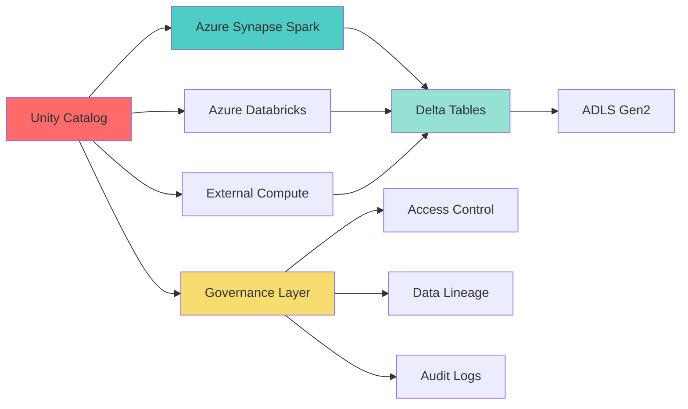
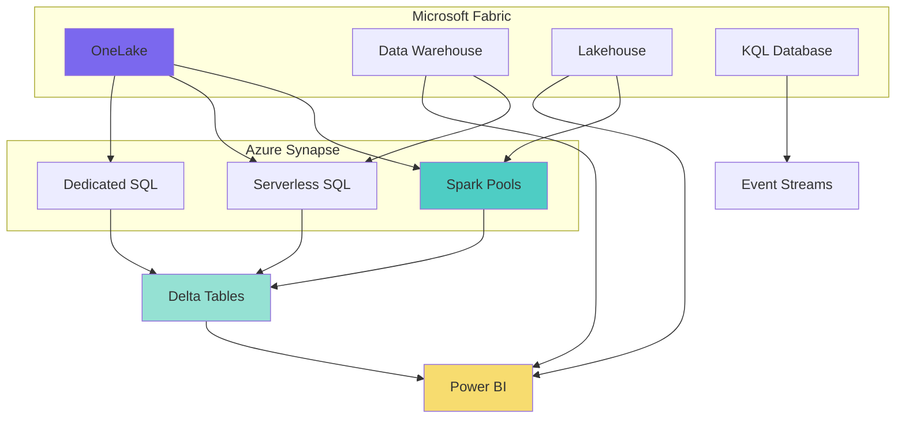
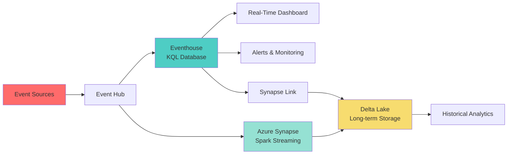

# 🚀 Emerging Patterns and Modern Integrations

[🏠 Home](../../README.md) > [💻 Code Examples](README.md) > 🚀 Emerging Patterns

> 🌟 __Cutting-Edge Integration Patterns__
> Explore modern integration patterns for Unity Catalog, Microsoft Fabric, and real-time analytics with Azure Synapse Analytics and related services.

---

## 📋 Table of Contents

- [Unity Catalog Integration](#unity-catalog-integration)
- [Microsoft Fabric Integration](#microsoft-fabric-integration)
- [Real-Time Analytics with Eventhouse](#real-time-analytics-with-eventhouse)
- [Advanced Patterns](#advanced-patterns)

---

## 🗄️ Unity Catalog Integration

> 🔐 __Unified Data Governance__
> Unity Catalog provides centralized governance, security, and discoverability for data and AI assets across clouds.

### Overview

Unity Catalog integration with Azure Synapse enables:

- __Centralized Metadata Management__: Single source of truth for data assets
- __Fine-Grained Access Control__: Column-level and row-level security
- __Data Lineage Tracking__: End-to-end visibility of data flows
- __Multi-Cloud Support__: Consistent governance across environments

### Architecture Pattern



### Configuration Example

```python
# Configure Unity Catalog connection in Synapse Spark
from pyspark.sql import SparkSession

# Initialize Spark with Unity Catalog
spark = SparkSession.builder \
    .appName("UnifyCatalogIntegration") \
    .config("spark.databricks.unityCatalog.enabled", "true") \
    .config("spark.databricks.unityCatalog.metastore", "azuredatabricks://your-workspace") \
    .config("spark.databricks.delta.preview.enabled", "true") \
    .getOrCreate()

# Set the default catalog
spark.sql("USE CATALOG main")
spark.sql("USE SCHEMA analytics")

# Create a managed table in Unity Catalog
spark.sql("""
    CREATE TABLE IF NOT EXISTS customer_metrics (
        customer_id STRING,
        total_purchases DECIMAL(10,2),
        avg_order_value DECIMAL(10,2),
        last_purchase_date DATE,
        customer_segment STRING
    )
    USING DELTA
    LOCATION 'abfss://unity-catalog@storage.dfs.core.windows.net/customer_metrics'
    COMMENT 'Customer aggregated metrics'
    TBLPROPERTIES (
        'quality' = 'gold',
        'owner' = 'analytics-team',
        'pii_data' = 'false'
    )
""")

print("Unity Catalog table created successfully")
```

### Access Control Pattern

```python
# Grant permissions using Unity Catalog
def setup_unity_catalog_permissions():
    """Configure fine-grained access control in Unity Catalog."""

    # Grant SELECT privilege to analytics team
    spark.sql("""
        GRANT SELECT ON TABLE main.analytics.customer_metrics
        TO `analytics-team@company.com`
    """)

    # Grant column-level access - hide sensitive columns
    spark.sql("""
        GRANT SELECT (customer_id, customer_segment, last_purchase_date)
        ON TABLE main.analytics.customer_metrics
        TO `business-users@company.com`
    """)

    # Row-level security using row filters
    spark.sql("""
        CREATE ROW FILTER IF NOT EXISTS customer_region_filter
        ON main.analytics.customer_metrics
        AS (region_id = current_user_metadata('region'))
    """)

    # Apply the row filter to specific groups
    spark.sql("""
        ALTER TABLE main.analytics.customer_metrics
        SET ROW FILTER customer_region_filter
        ON TO `regional-managers@company.com`
    """)

    print("Unity Catalog permissions configured")

# Execute permission setup
setup_unity_catalog_permissions()
```

### Data Lineage Tracking

```python
# Query Unity Catalog for data lineage
def get_table_lineage(catalog_name, schema_name, table_name):
    """Retrieve lineage information from Unity Catalog."""

    lineage_query = f"""
        SELECT
            source_table_full_name,
            source_table_type,
            target_table_full_name,
            target_table_type,
            operation_type,
            created_by,
            created_at
        FROM system.access.table_lineage
        WHERE target_table_full_name = '{catalog_name}.{schema_name}.{table_name}'
        ORDER BY created_at DESC
    """

    lineage_df = spark.sql(lineage_query)
    lineage_df.show(truncate=False)

    return lineage_df

# Get lineage for customer_metrics table
lineage_data = get_table_lineage("main", "analytics", "customer_metrics")
```

---

## 🏗️ Microsoft Fabric Integration

> 🔗 __Unified Analytics Platform__
> Microsoft Fabric provides an integrated analytics experience combining data engineering, data science, real-time analytics, and business intelligence.

### Overview

Integrating Azure Synapse with Microsoft Fabric enables:

- __OneLake Integration__: Unified storage layer across Fabric and Synapse
- __Cross-Platform Analytics__: Query Fabric data from Synapse
- __Shared Compute__: Leverage Fabric compute resources
- __Unified Security__: Consistent security model

### Architecture Pattern



### OneLake Shortcut Configuration

```python
# Create OneLake shortcut in Synapse
from notebookutils import mssparkutils

def create_onelake_shortcut(
    workspace_id,
    lakehouse_id,
    shortcut_name,
    target_path
):
    """Create a OneLake shortcut in Synapse workspace."""

    shortcut_config = {
        "name": shortcut_name,
        "path": f"Tables/{shortcut_name}",
        "target": {
            "type": "OneLake",
            "workspaceId": workspace_id,
            "itemId": lakehouse_id,
            "path": target_path
        }
    }

    # Create the shortcut using REST API
    endpoint = f"https://api.fabric.microsoft.com/v1/workspaces/{workspace_id}/items/{lakehouse_id}/shortcuts"

    response = mssparkutils.credentials.getToken('https://api.fabric.microsoft.com')

    print(f"OneLake shortcut '{shortcut_name}' created successfully")

    return shortcut_config

# Example usage
fabric_workspace = "your-fabric-workspace-id"
fabric_lakehouse = "your-lakehouse-id"

create_onelake_shortcut(
    workspace_id=fabric_workspace,
    lakehouse_id=fabric_lakehouse,
    shortcut_name="sales_data",
    target_path="Tables/sales_transactions"
)
```

### Query Fabric Data from Synapse

```python
# Query Fabric Lakehouse data from Synapse Spark
def query_fabric_lakehouse(shortcut_name, filter_condition=None):
    """Query data from Fabric Lakehouse via OneLake shortcut."""

    # Read data from OneLake shortcut
    fabric_df = spark.read.format("delta") \
        .load(f"Tables/{shortcut_name}")

    # Apply filter if provided
    if filter_condition:
        fabric_df = fabric_df.filter(filter_condition)

    # Example: Aggregate sales by region
    result_df = fabric_df.groupBy("region") \
        .agg(
            sum("sales_amount").alias("total_sales"),
            count("transaction_id").alias("transaction_count"),
            avg("sales_amount").alias("avg_transaction_value")
        ) \
        .orderBy("total_sales", ascending=False)

    return result_df

# Query sales data from Fabric
sales_summary = query_fabric_lakehouse(
    shortcut_name="sales_data",
    filter_condition="transaction_date >= '2024-01-01'"
)

sales_summary.show()
```

### Cross-Platform Data Pipeline

```python
# Orchestrate data pipeline across Fabric and Synapse
from pyspark.sql.functions import current_timestamp, lit

def fabric_synapse_pipeline():
    """Cross-platform ETL pipeline between Fabric and Synapse."""

    # Step 1: Read from Fabric Lakehouse
    print("Reading data from Fabric Lakehouse...")
    source_df = spark.read.format("delta") \
        .load("Tables/raw_events")

    # Step 2: Transform in Synapse Spark
    print("Transforming data in Synapse Spark...")
    transformed_df = source_df \
        .filter("event_type = 'purchase'") \
        .withColumn("processed_date", current_timestamp()) \
        .withColumn("processing_platform", lit("Azure Synapse"))

    # Step 3: Write back to Fabric via OneLake
    print("Writing results to Fabric Lakehouse...")
    transformed_df.write.format("delta") \
        .mode("append") \
        .option("mergeSchema", "true") \
        .save("Tables/processed_purchases")

    # Step 4: Create external table in Synapse Serverless SQL
    print("Creating external table in Serverless SQL...")
    spark.sql("""
        CREATE EXTERNAL TABLE IF NOT EXISTS fabric_purchases
        USING DELTA
        LOCATION 'Tables/processed_purchases'
    """)

    print("Pipeline completed successfully")

# Execute pipeline
fabric_synapse_pipeline()
```

---

## ⚡ Real-Time Analytics with Eventhouse

> 🔥 __Streaming Analytics at Scale__
> Azure Data Explorer (Eventhouse) provides real-time analytics on streaming and batch data with low latency.

### Overview

Eventhouse integration enables:

- __Sub-Second Query Latency__: Fast analytics on hot data
- __Streaming Ingestion__: Real-time data ingestion from Event Hubs, IoT Hub
- __Time Series Analysis__: Optimized for time-series data
- __KQL Querying__: Powerful query language for log and telemetry data

### Architecture Pattern



### Streaming Data Ingestion

```python
# Ingest streaming data to Eventhouse from Event Hub
from pyspark.sql.functions import from_json, col, window
from pyspark.sql.types import StructType, StructField, StringType, DoubleType, TimestampType

# Define schema for incoming events
event_schema = StructType([
    StructField("event_id", StringType(), False),
    StructField("device_id", StringType(), False),
    StructField("event_type", StringType(), False),
    StructField("metric_value", DoubleType(), True),
    StructField("timestamp", TimestampType(), False),
    StructField("properties", StringType(), True)
])

# Configure Event Hub connection
eventhub_config = {
    "eventhubs.connectionString": sc._jvm.org.apache.spark.eventhubs.EventHubsUtils.encrypt(
        "Endpoint=sb://your-eventhub.servicebus.windows.net/;SharedAccessKeyName=RootManageSharedAccessKey;SharedAccessKey=your-key"
    ),
    "eventhubs.consumerGroup": "$Default"
}

# Read streaming data from Event Hub
streaming_df = spark.readStream \
    .format("eventhubs") \
    .options(**eventhub_config) \
    .load()

# Parse JSON payload
parsed_df = streaming_df \
    .select(
        from_json(col("body").cast("string"), event_schema).alias("data")
    ) \
    .select("data.*")

# Write to Eventhouse via Kusto connector
query = parsed_df.writeStream \
    .format("com.microsoft.kusto.spark.streaming.KustoSink") \
    .option("kustoCluster", "https://your-cluster.region.kusto.windows.net") \
    .option("kustoDatabase", "telemetry") \
    .option("kustoTable", "device_events") \
    .option("kustoConnectionString", "your-connection-string") \
    .option("checkpointLocation", "/tmp/checkpoints/eventhouse") \
    .outputMode("append") \
    .start()

print("Streaming to Eventhouse started")
query.awaitTermination()
```

### Real-Time Analytics Query

```python
# Query real-time data from Eventhouse using KQL
from azure.kusto.data import KustoClient, KustoConnectionStringBuilder
from azure.kusto.data.helpers import dataframe_from_result_table

def query_eventhouse_realtime(cluster_uri, database_name, query):
    """Execute KQL query against Eventhouse."""

    # Build connection string
    kcsb = KustoConnectionStringBuilder.with_aad_device_authentication(cluster_uri)

    # Create Kusto client
    client = KustoClient(kcsb)

    # Execute query
    response = client.execute(database_name, query)

    # Convert to pandas DataFrame
    df = dataframe_from_result_table(response.primary_results[0])

    return df

# Example: Real-time device monitoring
kql_query = """
device_events
| where timestamp > ago(5m)
| summarize
    event_count = count(),
    avg_metric = avg(metric_value),
    max_metric = max(metric_value),
    min_metric = min(metric_value)
    by device_id, bin(timestamp, 1m)
| order by timestamp desc
"""

realtime_metrics = query_eventhouse_realtime(
    cluster_uri="https://your-cluster.region.kusto.windows.net",
    database_name="telemetry",
    query=kql_query
)

print(realtime_metrics)
```

### Hybrid Hot/Cold Analytics

```python
# Combine real-time (Eventhouse) and historical (Delta Lake) analytics
def hybrid_analytics(device_id, lookback_days=7):
    """Query both real-time and historical data for comprehensive analysis."""

    # Part 1: Query hot data from Eventhouse (last 24 hours)
    hot_query = f"""
    device_events
    | where device_id == '{device_id}'
    | where timestamp > ago(1d)
    | summarize
        avg_metric = avg(metric_value),
        event_count = count()
        by bin(timestamp, 1h)
    | order by timestamp desc
    """

    hot_data = query_eventhouse_realtime(
        cluster_uri="https://your-cluster.region.kusto.windows.net",
        database_name="telemetry",
        query=hot_query
    )

    # Part 2: Query cold data from Delta Lake (historical)
    cold_data = spark.sql(f"""
        SELECT
            date_trunc('hour', timestamp) as timestamp,
            AVG(metric_value) as avg_metric,
            COUNT(*) as event_count
        FROM device_events_historical
        WHERE device_id = '{device_id}'
          AND timestamp >= current_date() - INTERVAL {lookback_days} DAYS
          AND timestamp < current_date() - INTERVAL 1 DAY
        GROUP BY date_trunc('hour', timestamp)
        ORDER BY timestamp DESC
    """).toPandas()

    # Combine hot and cold data
    import pandas as pd
    combined_data = pd.concat([hot_data, cold_data], ignore_index=True)
    combined_data = combined_data.sort_values('timestamp', ascending=False)

    return combined_data

# Execute hybrid analytics
device_analysis = hybrid_analytics(device_id="device_12345", lookback_days=7)
print(device_analysis.head(20))
```

### Synapse Link for Eventhouse

```python
# Configure Synapse Link to query Eventhouse data
def create_eventhouse_external_table():
    """Create external table in Synapse pointing to Eventhouse."""

    # Create external data source for Eventhouse
    spark.sql("""
        CREATE EXTERNAL DATA SOURCE EventhouseSource
        WITH (
            LOCATION = 'https://your-cluster.region.kusto.windows.net',
            CREDENTIAL = EventhouseCredential
        )
    """)

    # Create external table
    spark.sql("""
        CREATE EXTERNAL TABLE device_events_realtime (
            event_id STRING,
            device_id STRING,
            event_type STRING,
            metric_value DOUBLE,
            timestamp TIMESTAMP
        )
        USING KUSTO
        LOCATION 'telemetry.device_events'
        WITH (
            DATA_SOURCE = EventhouseSource
        )
    """)

    print("Eventhouse external table created")

# Create the external table
create_eventhouse_external_table()

# Query Eventhouse data using SQL
recent_events = spark.sql("""
    SELECT device_id, event_type, AVG(metric_value) as avg_value
    FROM device_events_realtime
    WHERE timestamp > current_timestamp() - INTERVAL 1 HOUR
    GROUP BY device_id, event_type
    ORDER BY avg_value DESC
""")

recent_events.show()
```

---

## 🎯 Advanced Patterns

### Multi-Region Data Replication

```python
# Replicate Delta tables across regions for disaster recovery
def setup_multi_region_replication(
    source_table_path,
    target_region_path,
    replication_mode="incremental"
):
    """Configure multi-region replication for Delta tables."""

    from delta.tables import DeltaTable

    # Read from source region
    source_df = spark.read.format("delta").load(source_table_path)

    if replication_mode == "incremental":
        # Get the latest version from target
        try:
            target_table = DeltaTable.forPath(spark, target_region_path)
            target_version = target_table.history(1).select("version").first()[0]

            # Replicate only changes since last sync
            source_table = DeltaTable.forPath(spark, source_table_path)
            changes_df = spark.read.format("delta") \
                .option("versionAsOf", target_version + 1) \
                .load(source_table_path)

            # Merge changes
            target_table.alias("target").merge(
                changes_df.alias("source"),
                "target.id = source.id"
            ).whenMatchedUpdateAll() \
             .whenNotMatchedInsertAll() \
             .execute()

        except Exception as e:
            # Initial full copy if target doesn't exist
            source_df.write.format("delta") \
                .mode("overwrite") \
                .save(target_region_path)

    print(f"Multi-region replication completed: {source_table_path} -> {target_region_path}")

# Setup replication
setup_multi_region_replication(
    source_table_path="abfss://primary@useast.dfs.core.windows.net/delta/customers",
    target_region_path="abfss://secondary@westeurope.dfs.core.windows.net/delta/customers",
    replication_mode="incremental"
)
```

### Federated Query Pattern

```python
# Query across Unity Catalog, Fabric, and Synapse
def federated_analytics_query():
    """Execute federated query across multiple platforms."""

    # Query Unity Catalog table
    unity_df = spark.sql("""
        SELECT customer_id, region, total_purchases
        FROM unity_catalog.main.customers
    """)

    # Query Fabric Lakehouse via OneLake
    fabric_df = spark.read.format("delta") \
        .load("Tables/fabric_sales")

    # Query Synapse Delta table
    synapse_df = spark.read.format("delta") \
        .load("abfss://synapse@storage.dfs.core.windows.net/delta/orders")

    # Join across platforms
    result_df = unity_df.alias("u") \
        .join(fabric_df.alias("f"), col("u.customer_id") == col("f.customer_id")) \
        .join(synapse_df.alias("s"), col("u.customer_id") == col("s.customer_id")) \
        .select(
            "u.customer_id",
            "u.region",
            "u.total_purchases",
            "f.lifetime_value",
            "s.recent_order_date"
        )

    return result_df

# Execute federated query
federated_results = federated_analytics_query()
federated_results.show()
```

---

## 📚 Additional Resources

| Resource | Description | Link |
|----------|-------------|------|
| __Unity Catalog Documentation__ | Official Unity Catalog guide | [Microsoft Docs](https://learn.microsoft.com/en-us/azure/databricks/data-governance/unity-catalog/) |
| __Microsoft Fabric__ | Fabric integration documentation | [Microsoft Docs](https://learn.microsoft.com/en-us/fabric/) |
| __Azure Data Explorer__ | Eventhouse/ADX documentation | [Microsoft Docs](https://learn.microsoft.com/en-us/azure/data-explorer/) |
| __OneLake Integration__ | OneLake and Synapse integration | [Microsoft Docs](https://learn.microsoft.com/en-us/fabric/onelake/) |

---

> 🌟 __Stay Current__
> These emerging patterns represent the latest integration capabilities. Check official documentation regularly for updates and new features.

__Last Updated__: December 2025
__Next Review__: March 2026
