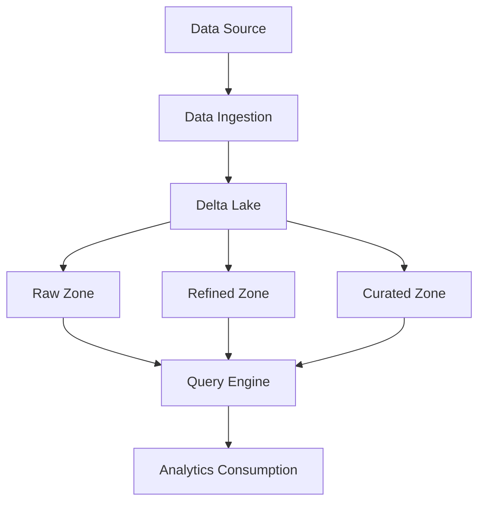
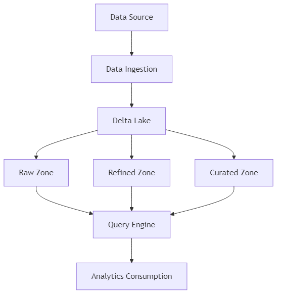
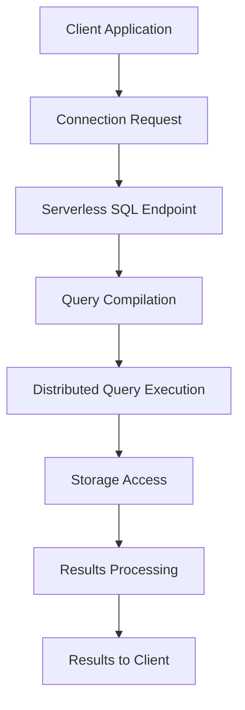
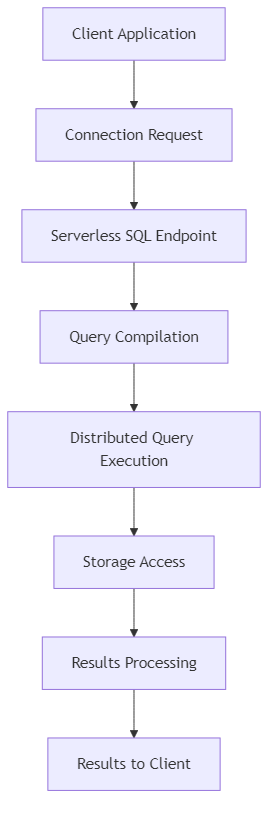

# Azure Synapse Analytics Architecture Diagrams

[Home](../) > Diagrams

This section contains architecture diagrams for Azure Synapse Analytics components and workflows, focusing on Delta Lakehouse and Serverless SQL capabilities.

## Delta Lakehouse Architecture

*Delta Lakehouse logical architecture implementation in Azure Synapse Analytics*

### Components Description

1. __Azure Data Lake Storage Gen2__ - Provides the foundation for storing Delta tables
2. __Azure Synapse Spark Pools__ - Executes Spark jobs for data processing
3. __Delta Lake__ - Provides ACID transactions, time travel, and schema enforcement
4. __Azure Synapse Pipeline__ - Orchestrates data movement and transformation
5. __Azure Synapse Serverless SQL__ - Provides SQL query capabilities over the Delta Lake

## Serverless SQL Architecture

*Serverless SQL query architecture in Azure Synapse Analytics*

### Components Description

1. __Azure Synapse Serverless SQL Pool__ - On-demand SQL query service
2. __Storage Accounts__ - ADLS Gen2, Blob Storage, etc.
3. __File Formats__ - Support for Parquet, Delta, CSV, JSON
4. __Query Service__ - Distributed query processing engine
5. __Results__ - Query results available via JDBC/ODBC or direct export

## Shared Metadata Architecture

*Shared metadata architecture across different compute engines in Azure Synapse Analytics*

### Components Description

1. __Azure Synapse Workspace__ - Central workspace for all analytics services
2. __Metadata Services__ - Shared metadata layer
3. __Spark Metastore__ - Hive metastore for Spark
4. __SQL Metadata__ - SQL catalog and metadata
5. __Integration Runtime__ - Shared integration services

## Data Flow Diagrams

### Delta Lake Write Flow

<!-- Mermaid diagram for MkDocs rendering -->

<!-- Static image fallback for GitHub -->

### Serverless SQL Query Flow

<!-- Mermaid diagram for MkDocs rendering -->

<!-- Static image fallback for GitHub -->

## Integration Architecture Diagrams

### Azure ML Integration

*Integration architecture between Azure Synapse Analytics and Azure Machine Learning*

### Azure Purview Integration

*Integration architecture between Azure Synapse Analytics and Microsoft Purview for data governance*

## Related Resources

- [Delta Lakehouse Architecture](../architecture/delta-lakehouse/) - Detailed documentation
- [Serverless SQL Architecture](../architecture/serverless-sql/) - Detailed documentation
- [Shared Metadata Architecture](../architecture/shared-metadata/) - Detailed documentation
