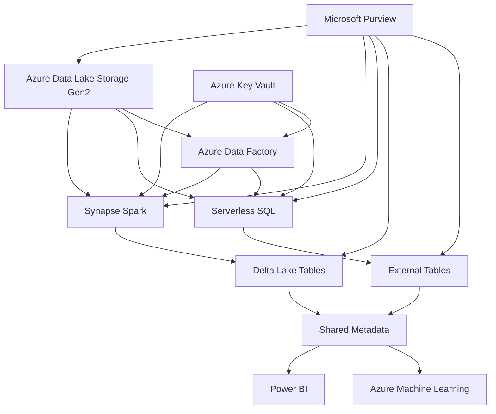
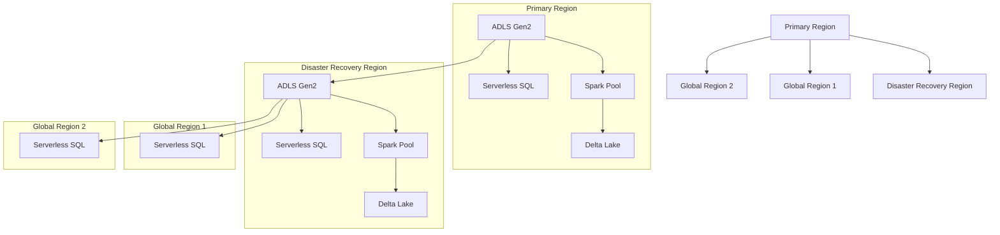

# Azure Synapse Analytics Architecture Diagrams

This section contains architecture diagrams for Azure Synapse Analytics, focusing on Delta Lakehouse and Serverless SQL implementations.

## Delta Lakehouse Architecture

The Delta Lakehouse architecture combines the best features of data lakes and data warehouses, providing ACID transactions, schema enforcement, and data versioning.

### Key Components

1. **Azure Data Lake Storage Gen2**: The foundation storage layer
2. **Delta Lake Format**: Provides ACID transactions and data versioning
3. **Azure Synapse Spark Pools**: Processing engine for big data transformations
4. **Azure Synapse Serverless SQL**: SQL interface for data querying
5. **Azure Synapse Pipelines**: Orchestration for data processing workflows

## Serverless SQL Architecture

The Serverless SQL architecture enables on-demand, scalable analytics without pre-provisioning resources.

### Key Components

1. **Azure Data Lake Storage Gen2**: Primary data storage
2. **Serverless SQL Pool**: On-demand SQL query processing
3. **External Tables**: Data access layer for files in storage
4. **Views and Stored Procedures**: Business logic implementation
5. **PolyBase**: Technology for querying external data sources

## Shared Metadata Architecture

The Shared Metadata architecture enables consistent data access across Spark and SQL.

### Key Components

1. **Metastore**: Central repository for metadata
2. **Spark Database Definitions**: Schema information for Spark
3. **SQL Database Definitions**: Schema information for SQL
4. **Cross-Service Access Patterns**: Patterns for accessing the same data from different services

## Enterprise-Scale Reference Architecture

This reference architecture demonstrates a comprehensive enterprise implementation of Azure Synapse Analytics.

### Key Integration Points

1. **Data Lake Integration**: Unified data storage with Azure Data Lake Storage Gen2
2. **Processing Integration**: Seamless handoff between batch and interactive processing
3. **Security Integration**: Centralized security with Azure Key Vault and Azure Active Directory
4. **Governance Integration**: End-to-end data governance with Microsoft Purview
5. **Monitoring Integration**: Unified monitoring with Azure Monitor and Application Insights

## Multi-Region Deployment Architecture

For enterprise deployments requiring high availability and global distribution:

### Key Design Considerations

1. **Data Replication**: Geo-redundant storage with RA-GRS
2. **Workload Distribution**: Region-specific workloads for performance
3. **Disaster Recovery**: Automated failover mechanisms
4. **Global Data Access**: Consistent data access patterns across regions
