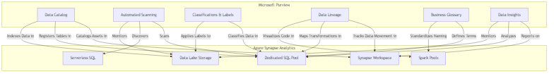
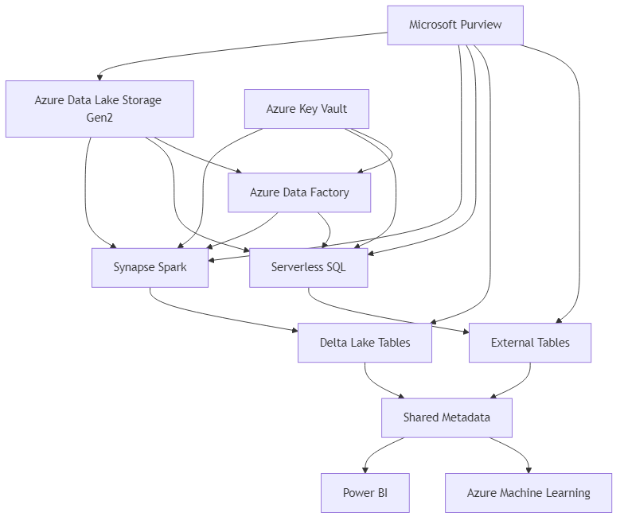
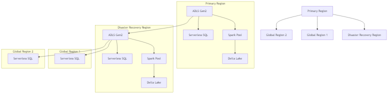

# Azure Synapse Analytics Architecture Diagrams

This section contains architecture diagrams for Azure Synapse Analytics, focusing on Delta Lakehouse and Serverless SQL implementations.

## Delta Lakehouse Architecture

The Delta Lakehouse architecture combines the best features of data lakes and data warehouses, providing ACID transactions, schema enforcement, and data versioning.

### Key Components

1. __Azure Data Lake Storage Gen2__: The foundation storage layer
2. __Delta Lake Format__: Provides ACID transactions and data versioning
3. __Azure Synapse Spark Pools__: Processing engine for big data transformations
4. __Azure Synapse Serverless SQL__: SQL interface for data querying
5. __Azure Synapse Pipelines__: Orchestration for data processing workflows

## Serverless SQL Architecture

The Serverless SQL architecture enables on-demand, scalable analytics without pre-provisioning resources.

### Key Components

1. __Azure Data Lake Storage Gen2__: Primary data storage
2. __Serverless SQL Pool__: On-demand SQL query processing
3. __External Tables__: Data access layer for files in storage
4. __Views and Stored Procedures__: Business logic implementation
5. __PolyBase__: Technology for querying external data sources

## Shared Metadata Architecture

The Shared Metadata architecture enables consistent data access across Spark and SQL.

### Key Components

1. __Metastore__: Central repository for metadata
2. __Spark Database Definitions__: Schema information for Spark
3. __SQL Database Definitions__: Schema information for SQL
4. __Cross-Service Access Patterns__: Patterns for accessing the same data from different services

## Enterprise-Scale Reference Architecture

This reference architecture demonstrates a comprehensive enterprise implementation of Azure Synapse Analytics.

<!-- Mermaid diagram for MkDocs rendering -->

<!-- Static image fallback for GitHub -->

### Key Integration Points

1. __Data Lake Integration__: Unified data storage with Azure Data Lake Storage Gen2
2. __Processing Integration__: Seamless handoff between batch and interactive processing
3. __Security Integration__: Centralized security with Azure Key Vault and Azure Active Directory
4. __Governance Integration__: End-to-end data governance with Microsoft Purview
5. __Monitoring Integration__: Unified monitoring with Azure Monitor and Application Insights

## Multi-Region Deployment Architecture

For enterprise deployments requiring high availability and global distribution:

<!-- Mermaid diagram for MkDocs rendering -->

<!-- Static image fallback for GitHub -->

### Key Design Considerations

1. __Data Replication__: Geo-redundant storage with RA-GRS
2. __Workload Distribution__: Region-specific workloads for performance
3. __Disaster Recovery__: Automated failover mechanisms
4. __Global Data Access__: Consistent data access patterns across regions
