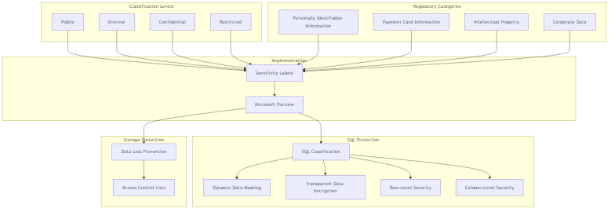
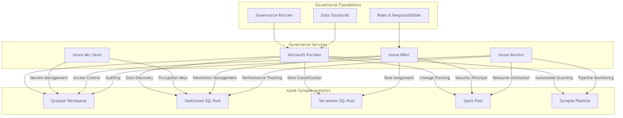
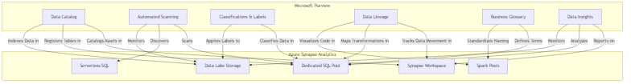
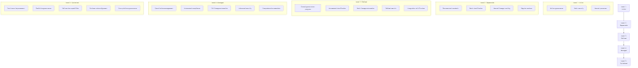
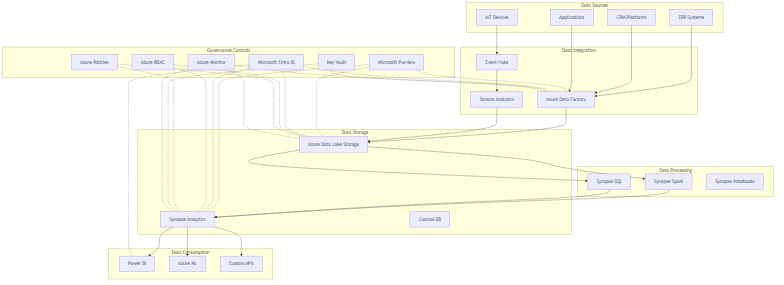
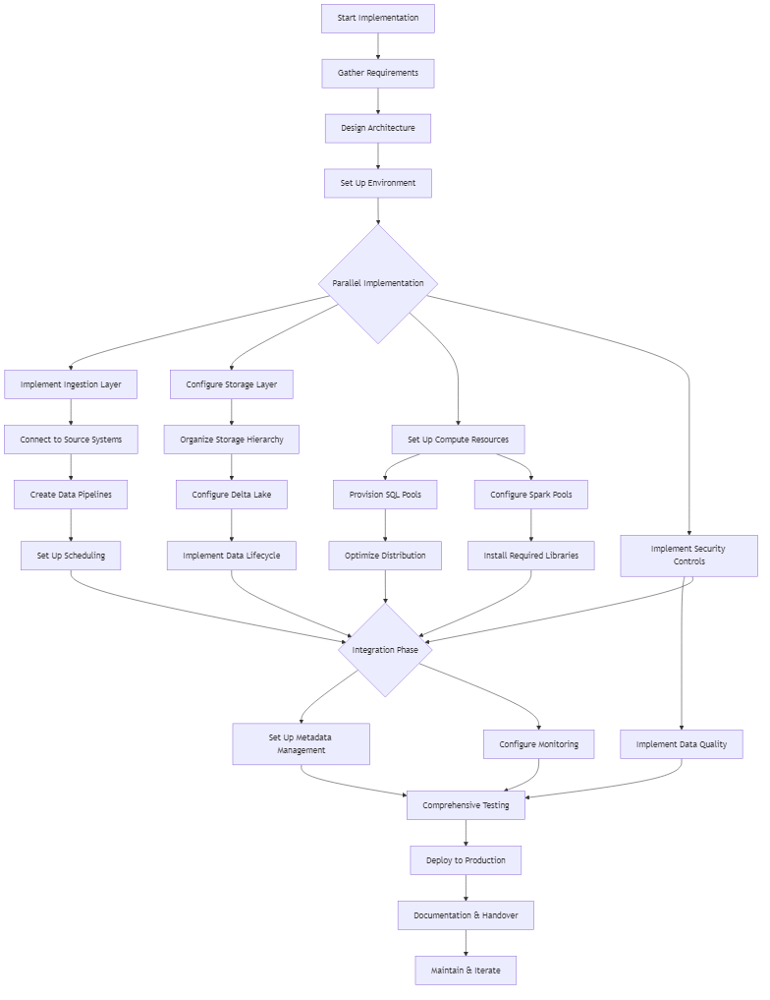
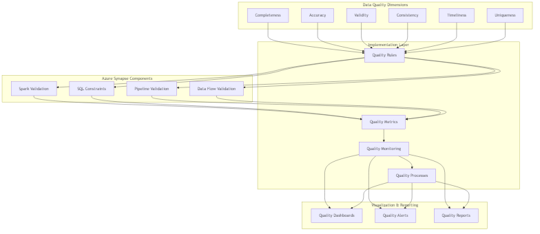
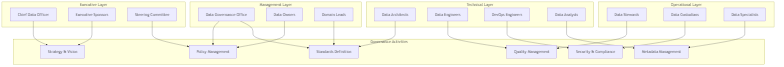

# Data Governance Architecture Diagrams for Azure Synapse Analytics

This section provides comprehensive diagrams illustrating data governance architectures and frameworks for Azure Synapse Analytics.

## Integrated Data Governance Architecture

This diagram illustrates how data governance components integrate with Azure Synapse Analytics.

<!-- Mermaid diagram for MkDocs rendering -->

<!-- Static image fallback for GitHub -->

## Data Governance Maturity Model

This diagram illustrates the maturity model for data governance in Azure Synapse Analytics implementations.

<!-- Mermaid diagram for MkDocs rendering -->

<!-- Static image fallback for GitHub -->

## End-to-End Data Governance Architecture

This diagram illustrates an end-to-end data governance architecture for Azure Synapse Analytics.

<!-- Mermaid diagram for MkDocs rendering -->

<!-- Static image fallback for GitHub -->

## Data Classification Framework

This diagram illustrates a comprehensive data classification framework for Azure Synapse Analytics.

<!-- Mermaid diagram for MkDocs rendering -->

<!-- Static image fallback for GitHub -->

## Microsoft Purview Integration Architecture

This diagram illustrates how Microsoft Purview integrates with Azure Synapse Analytics for comprehensive data governance.

<!-- Mermaid diagram for MkDocs rendering -->

<!-- Static image fallback for GitHub -->

## Data Quality Framework

This diagram illustrates a comprehensive data quality framework for Azure Synapse Analytics.

<!-- Mermaid diagram for MkDocs rendering -->

<!-- Static image fallback for GitHub -->

## Data Governance Roles and Responsibilities

This diagram illustrates the roles and responsibilities within a data governance framework for Azure Synapse Analytics.

<!-- Mermaid diagram for MkDocs rendering -->

<!-- Static image fallback for GitHub -->

## Best Practices for Data Governance

When implementing data governance for Azure Synapse Analytics, follow these best practices:

1. __Establish Clear Ownership__
   - Designate data owners for all data domains
   - Define clear roles and responsibilities
   - Create accountability for data quality and security

2. __Implement Comprehensive Classification__
   - Use Microsoft Purview for automated classification
   - Apply sensitivity labels consistently
   - Implement protection controls based on classification

3. __Automate Governance Processes__
   - Set up automated scanning and discovery
   - Implement automated policy enforcement
   - Configure automated lineage tracking

4. __Monitor Compliance Continuously__
   - Create dashboards for governance metrics
   - Set up alerts for policy violations
   - Perform regular compliance audits

5. __Establish Data Quality Framework__
   - Define quality dimensions and metrics
   - Implement quality validation in pipelines
   - Create remediation workflows for quality issues
