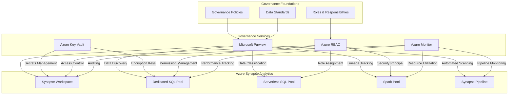
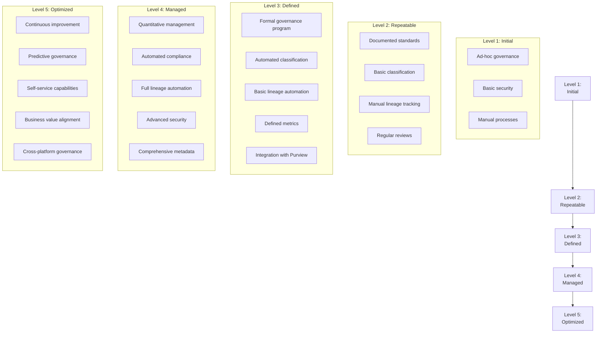
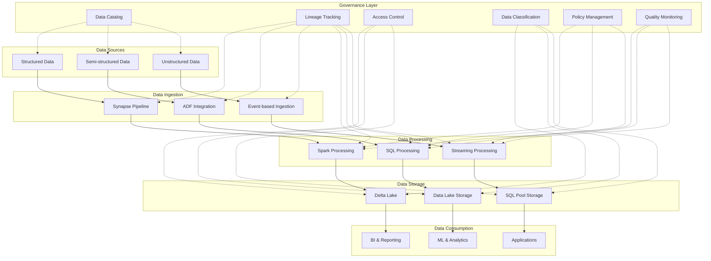
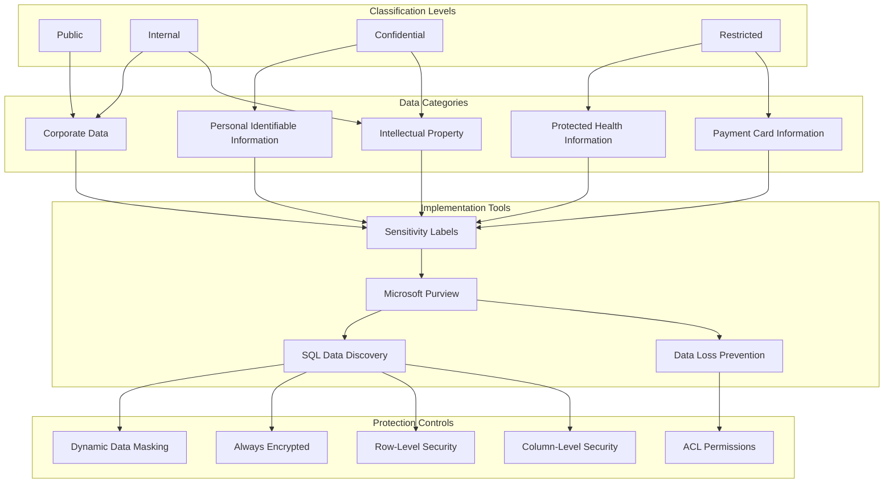
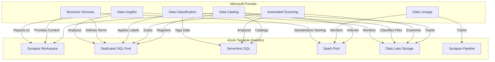
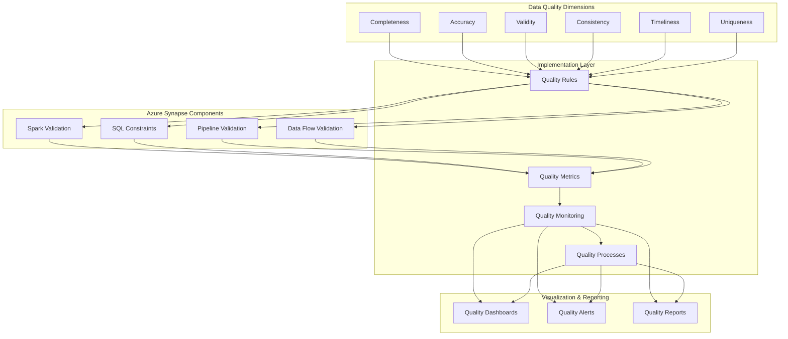

# Data Governance Architecture Diagrams for Azure Synapse Analytics

This section provides comprehensive diagrams illustrating data governance architectures and frameworks for Azure Synapse Analytics.

## Integrated Data Governance Architecture

This diagram illustrates how data governance components integrate with Azure Synapse Analytics.

<!-- Mermaid diagram for MkDocs rendering -->

<!-- Static image fallback for GitHub -->

## Data Governance Maturity Model

This diagram illustrates the maturity model for data governance in Azure Synapse Analytics implementations.

<!-- Mermaid diagram for MkDocs rendering -->

<!-- Static image fallback for GitHub -->

## End-to-End Data Governance Architecture

This diagram illustrates an end-to-end data governance architecture for Azure Synapse Analytics.

<!-- Mermaid diagram for MkDocs rendering -->

<!-- Static image fallback for GitHub -->

## Data Classification Framework

This diagram illustrates a comprehensive data classification framework for Azure Synapse Analytics.

<!-- Mermaid diagram for MkDocs rendering -->

<!-- Static image fallback for GitHub -->

## Microsoft Purview Integration Architecture

This diagram illustrates how Microsoft Purview integrates with Azure Synapse Analytics for comprehensive data governance.

<!-- Mermaid diagram for MkDocs rendering -->

<!-- Static image fallback for GitHub -->

## Data Quality Framework

This diagram illustrates a comprehensive data quality framework for Azure Synapse Analytics.

<!-- Mermaid diagram for MkDocs rendering -->

<!-- Static image fallback for GitHub -->

## Data Governance Roles and Responsibilities

This diagram illustrates the roles and responsibilities within a data governance framework for Azure Synapse Analytics.

```mermaid
graph TD
    subgraph "Executive Layer"
        CDO[Chief Data Officer]
        EXEC[Executive Sponsors]
        STEER[Steering Committee]
    end
    
    subgraph "Management Layer"
        DGO[Data Governance Office]
        DATA_OWNERS[Data Owners]
        DOMAIN_LEADS[Domain Leads]
    end
    
    subgraph "Operational Layer"
        DATA_STEWARDS[Data Stewards]
        DATA_CUSTODIANS[Data Custodians]
        DATA_SPECIALISTS[Data Specialists]
    end
    
    subgraph "Technical Layer"
        ARCHITECTS[Data Architects]
        ENGINEERS[Data Engineers]
        DEVOPS[DevOps Engineers]
        ANALYSTS[Data Analysts]
    end
    
    subgraph "Governance Activities"
        STRATEGY[Strategy & Vision]
        POLICY[Policy Management]
        STANDARDS[Standards Definition]
        QUALITY[Quality Management]
        SECURITY[Security & Compliance]
        METADATA[Metadata Management]
    end
    
    CDO --> STRATEGY
    EXEC --> STRATEGY
    STEER --> POLICY
    
    DGO --> POLICY
    DGO --> STANDARDS
    DATA_OWNERS --> POLICY
    DOMAIN_LEADS --> STANDARDS
    
    DATA_STEWARDS --> QUALITY
    DATA_CUSTODIANS --> SECURITY
    DATA_SPECIALISTS --> METADATA
    
    ARCHITECTS --> STANDARDS
    ENGINEERS --> QUALITY
    DEVOPS --> SECURITY
    ANALYSTS --> METADATA
```

<!-- Mermaid diagram for MkDocs rendering -->

<!-- Static image fallback for GitHub -->

## Best Practices for Data Governance

When implementing data governance for Azure Synapse Analytics, follow these best practices:

1. __Establish Clear Ownership__
   - Designate data owners for all data domains
   - Define clear roles and responsibilities
   - Create accountability for data quality and security

2. __Implement Comprehensive Classification__
   - Use Microsoft Purview for automated classification
   - Apply sensitivity labels consistently
   - Implement protection controls based on classification

3. __Automate Governance Processes__
   - Set up automated scanning and discovery
   - Implement automated policy enforcement
   - Configure automated lineage tracking

4. __Monitor Compliance Continuously__
   - Create dashboards for governance metrics
   - Set up alerts for policy violations
   - Perform regular compliance audits

5. __Establish Data Quality Framework__
   - Define quality dimensions and metrics
   - Implement quality validation in pipelines
   - Create remediation workflows for quality issues
