# 🏞️ Delta Lakehouse Architecture Description

> __🏠 [Home](../../README.md)__ | __📊 [Diagrams](README.md)__ | __🏞️ Delta Lakehouse Architecture__


Detailed description and visual representation of the Delta Lakehouse architecture pattern in Azure Synapse Analytics.

---

## 🎯 Overview

The Delta Lakehouse architecture combines the best features of data lakes and data warehouses, providing a unified platform for both batch and streaming analytics with ACID transaction support, schema enforcement, and time travel capabilities.

## 📊 Visual Architecture

### High-Level Architecture Diagram

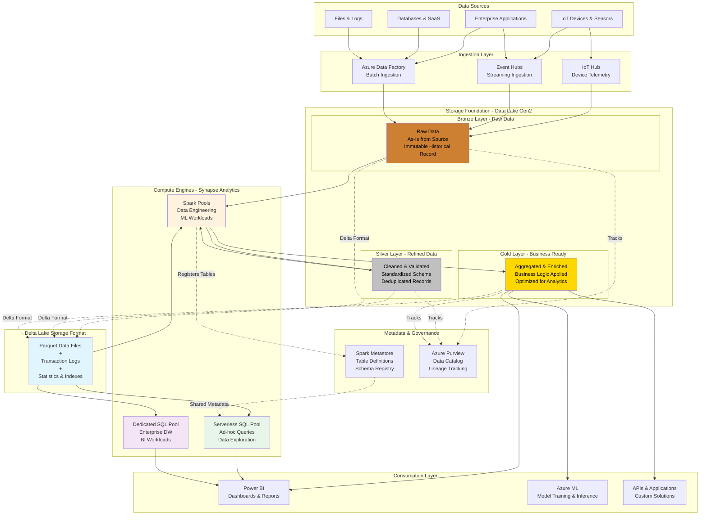

---

## 🏗️ Architecture Components

### 1. Data Sources Layer

Multiple heterogeneous data sources feeding into the lakehouse:

| Source Type | Examples | Ingestion Method | Frequency |
|------------|----------|------------------|-----------|
| __IoT Devices__ | Sensors, smart devices, industrial equipment | IoT Hub, Event Hubs | Real-time streaming |
| __Enterprise Applications__ | ERP, CRM, custom apps | Data Factory, CDC | Batch, scheduled |
| __Databases__ | SQL Server, Oracle, PostgreSQL | Data Factory, linked services | Incremental, CDC |
| __Files & Logs__ | CSV, JSON, Parquet, logs | Data Factory, auto-loader | Batch, event-driven |

### 2. Ingestion Layer

#### Azure Data Factory

- __Purpose__: Orchestrate batch data ingestion and transformation
- __Capabilities__:
  - 90+ native connectors for data sources
  - Code-free ETL pipeline design
  - Incremental data loading with watermarking
  - Scheduled and trigger-based execution

#### Event Hubs

- __Purpose__: High-throughput streaming data ingestion
- __Capabilities__:
  - Millions of events per second
  - Kafka protocol compatibility
  - Event capture to Data Lake
  - Partition-based scalability

#### IoT Hub

- __Purpose__: Specialized IoT device connectivity
- __Capabilities__:
  - Per-device security and authentication
  - Bidirectional communication
  - Device management and provisioning
  - Edge intelligence support

### 3. Storage Foundation - Medallion Architecture

#### Bronze Layer (Raw Zone)

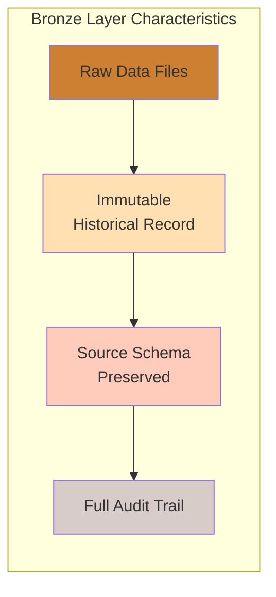

__Characteristics__:

- **Data Quality**: As-is from source, no transformations
- **Schema**: Source system schema preserved
- **Format**: Delta Lake (Parquet + transaction log)
- **Purpose**: Historical record, replay capability, audit trail
- **Retention**: Long-term (years), move to archive tier

__Example Table Structure__:

```sql
-- Bronze layer table
CREATE TABLE bronze.iot_telemetry (
    event_data STRING,          -- Raw JSON payload
    event_timestamp TIMESTAMP,  -- Source timestamp
    device_id STRING,
    _ingestion_time TIMESTAMP,  -- System ingestion time
    _source_file STRING,        -- Source file reference
    _partition_date DATE        -- Partition key
)
USING DELTA
PARTITIONED BY (_partition_date)
LOCATION 'abfss://bronze@datalake.dfs.core.windows.net/iot_telemetry';
```

#### Silver Layer (Refined Zone)

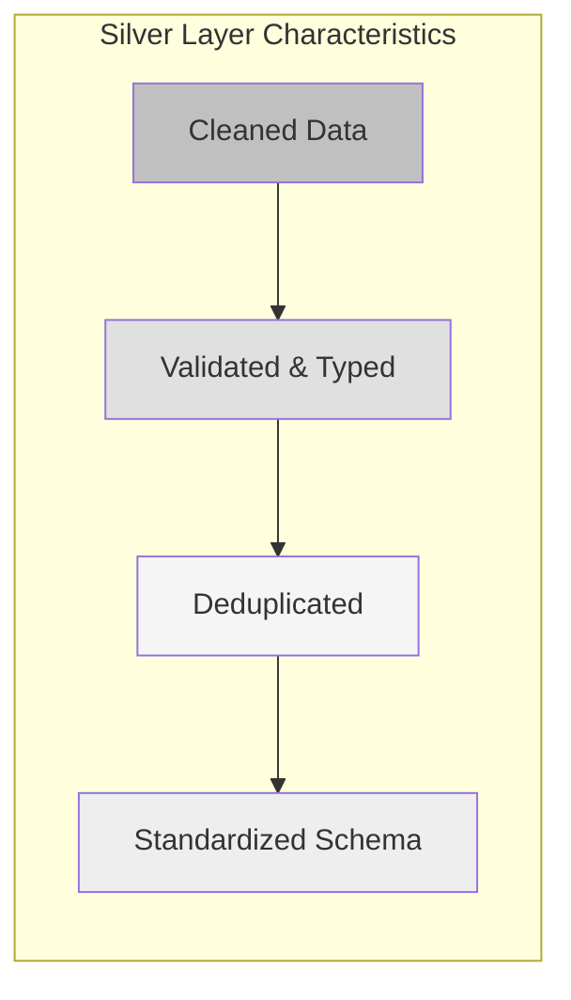

__Characteristics__:

- **Data Quality**: Cleaned, validated, deduplicated
- **Schema**: Standardized across sources
- **Format**: Delta Lake with schema enforcement
- **Purpose**: Source of truth for analytics
- **Retention**: Medium-term (months to years)

__Transformations Applied__:

1. **Data Cleansing**
   - Null handling and default values
   - Invalid data filtering
   - Data type conversions

2. **Standardization**
   - Consistent naming conventions
   - Uniform date/time formats
   - Standardized units and measures

3. **Deduplication**
   - Remove exact duplicates
   - Handle late-arriving data
   - Merge updates and corrections

__Example Table Structure__:

```sql
-- Silver layer table
CREATE TABLE silver.iot_telemetry (
    device_id STRING NOT NULL,
    event_timestamp TIMESTAMP NOT NULL,
    temperature DOUBLE,
    humidity DOUBLE,
    pressure DOUBLE,
    battery_level INT,
    device_status STRING,
    location_lat DOUBLE,
    location_long DOUBLE,
    _source STRING,
    _processed_time TIMESTAMP,
    _quality_score DOUBLE
)
USING DELTA
PARTITIONED BY (DATE(event_timestamp))
LOCATION 'abfss://silver@datalake.dfs.core.windows.net/iot_telemetry';
```

#### Gold Layer (Consumption Zone)

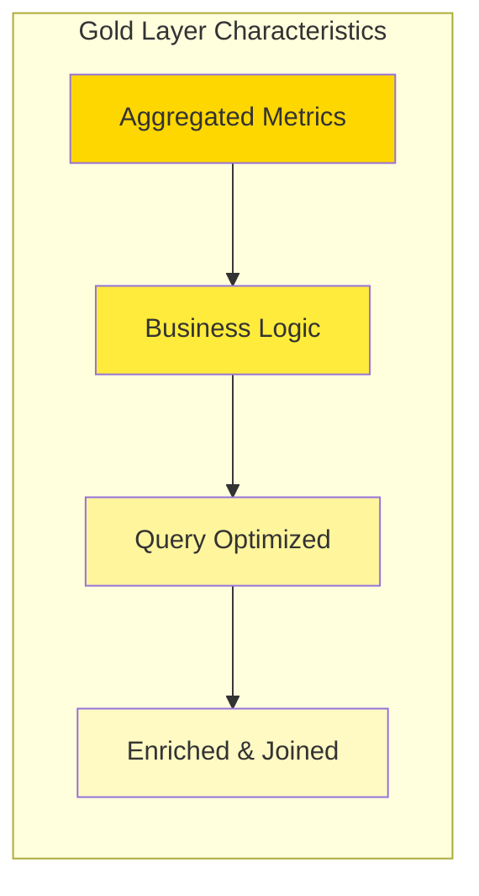

__Characteristics__:

- **Data Quality**: Business-ready, aggregated
- **Schema**: Dimensional models, business entities
- **Format**: Delta Lake optimized for queries
- **Purpose**: Direct consumption by BI tools
- **Retention**: Active data (days to months)

__Data Models__:

1. **Fact Tables**: Metrics and measurements
2. **Dimension Tables**: Descriptive attributes
3. **Aggregated Views**: Pre-computed summaries
4. **Business Entities**: Customer 360, Product catalogs

__Example Table Structure__:

```sql
-- Gold layer fact table
CREATE TABLE gold.device_daily_metrics (
    device_id STRING NOT NULL,
    metric_date DATE NOT NULL,
    avg_temperature DOUBLE,
    max_temperature DOUBLE,
    min_temperature DOUBLE,
    avg_humidity DOUBLE,
    total_events BIGINT,
    uptime_minutes INT,
    alert_count INT,
    device_type STRING,      -- Enriched from dimension
    location_name STRING,    -- Enriched from dimension
    customer_segment STRING  -- Business categorization
)
USING DELTA
PARTITIONED BY (metric_date)
LOCATION 'abfss://gold@datalake.dfs.core.windows.net/device_daily_metrics'
TBLPROPERTIES (
    'delta.autoOptimize.optimizeWrite' = 'true',
    'delta.autoOptimize.autoCompact' = 'true'
);
```

### 4. Delta Lake Storage Format

#### Core Components

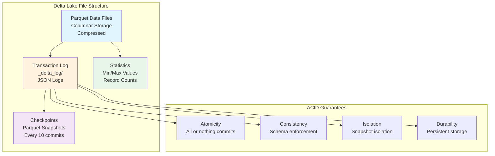

#### Key Features

| Feature | Description | Benefit |
|---------|-------------|---------|
| __ACID Transactions__ | Full ACID compliance for data operations | Data reliability and consistency |
| __Time Travel__ | Query historical versions of data | Audit, rollback, reproduce analyses |
| __Schema Evolution__ | Add, rename, change columns safely | Flexibility without breaking changes |
| __Upserts/Merges__ | Efficient UPDATE and MERGE operations | Simplified CDC and SCD patterns |
| __Data Skipping__ | Statistics-based file pruning | Faster queries through data skipping |
| __Compaction__ | Automatic small file optimization | Better query performance |

#### Delta Lake Operations

**Write Operations**:

```python
# Append new data
df.write.format("delta").mode("append").save("/path/to/delta-table")

# Overwrite partition
df.write.format("delta") \
    .mode("overwrite") \
    .option("replaceWhere", "date = '2025-01-28'") \
    .save("/path/to/delta-table")

# Merge (Upsert)
from delta.tables import DeltaTable

deltaTable = DeltaTable.forPath(spark, "/path/to/delta-table")
deltaTable.alias("target").merge(
    updates.alias("source"),
    "target.id = source.id"
).whenMatchedUpdateAll() \
 .whenNotMatchedInsertAll() \
 .execute()
```

**Read Operations**:

```python
# Current version
df = spark.read.format("delta").load("/path/to/delta-table")

# Time travel - specific version
df = spark.read.format("delta") \
    .option("versionAsOf", 5) \
    .load("/path/to/delta-table")

# Time travel - specific timestamp
df = spark.read.format("delta") \
    .option("timestampAsOf", "2025-01-28") \
    .load("/path/to/delta-table")
```

### 5. Compute Engines

#### Synapse Spark Pools

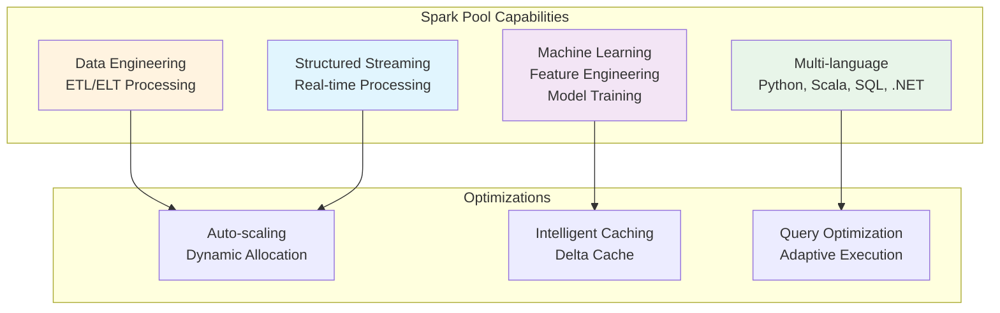

__Primary Use Cases__:

- **ETL/ELT Processing**: Transform data between medallion layers
- **Machine Learning**: Feature engineering and model training
- **Streaming**: Real-time data processing with Spark Structured Streaming
- **Data Engineering**: Complex transformations and data quality rules

__Configuration Guidance__:

| Workload Type | Node Size | Node Count | Auto-scaling |
|--------------|-----------|------------|--------------|
| Development/Testing | Small (4 cores, 32GB) | 3-5 | Enabled |
| Production ETL | Medium (8 cores, 64GB) | 5-20 | Enabled |
| ML Training | Large (16 cores, 128GB) | 10-50 | Enabled |
| Streaming | Medium (8 cores, 64GB) | 5-10 | Limited |

#### Synapse Serverless SQL Pool

__Architecture__:

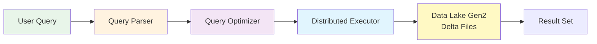

__Characteristics__:

- **Pricing**: Pay-per-query (per TB scanned)
- **Startup**: Instant, no cluster management
- **Language**: T-SQL compatible
- **Formats**: Parquet, Delta, CSV, JSON
- **Best For**: Ad-hoc queries, data exploration, BI queries

__Query Optimization Tips__:

1. **Partitioning**: Leverage partition pruning
2. **File Size**: Larger files (>100MB) perform better
3. **Statistics**: Use OPENROWSET hints
4. **Caching**: Query results cached for 48 hours

#### Synapse Dedicated SQL Pool

__Purpose**: Enterprise data warehousing for consistent, high-performance workloads

__Architecture Pattern**:

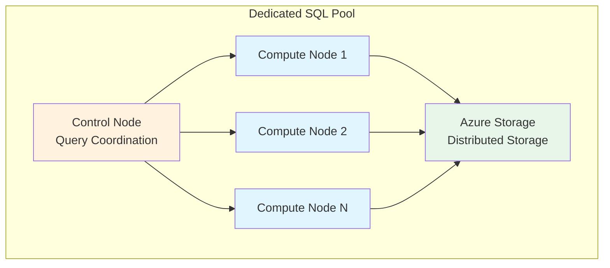

__When to Use__:

- Consistent query workloads
- Predictable performance requirements
- Complex dimensional models
- High concurrency BI workloads

### 6. Metadata & Governance

#### Spark Metastore

- **Purpose**: Centralized catalog of tables and schemas
- **Scope**: Shared across Spark pools
- **Compatibility**: Hive metastore compatible
- **Storage**: Backed by Azure SQL Database

#### Azure Purview

- **Data Catalog**: Discover and understand data assets
- **Data Lineage**: Track data movement and transformations
- **Classification**: Automatically classify sensitive data
- **Compliance**: Support regulatory compliance requirements

---

## 🔄 Data Flow Patterns

### Batch Processing Flow

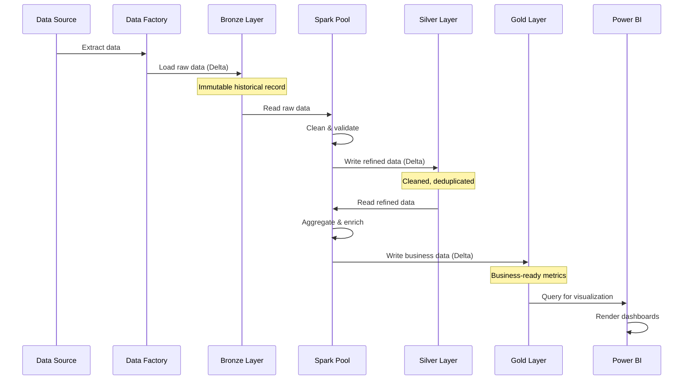

### Streaming Processing Flow

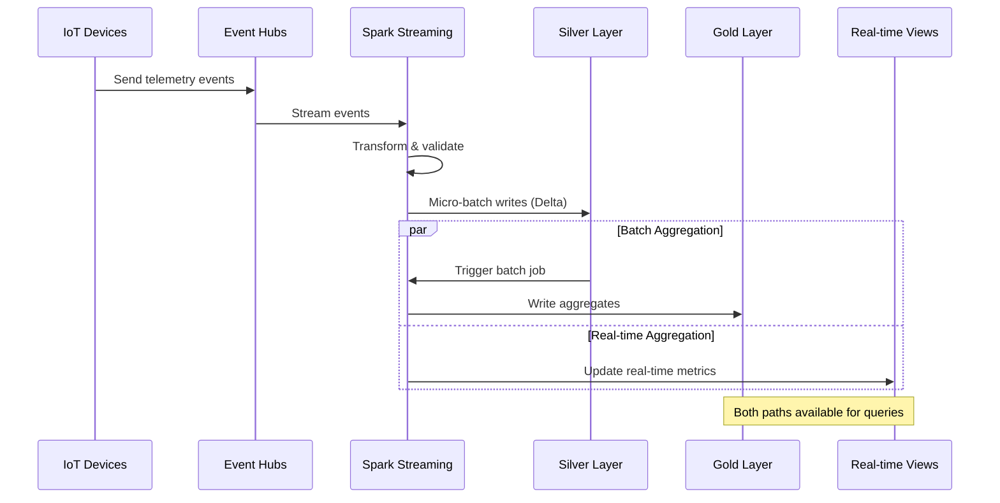

### Time Travel & Versioning

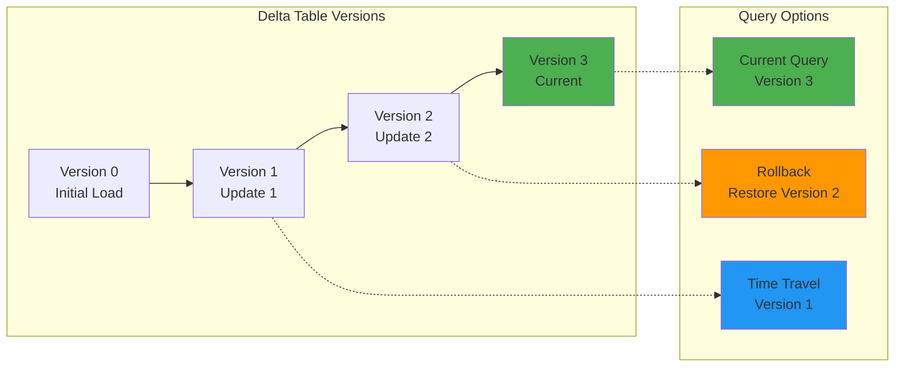

---

## 💡 Key Benefits

### 1. Unified Platform

- **Single storage layer** for both batch and streaming
- **Consistent data format** across all compute engines
- **Shared metadata** accessible from SQL and Spark

### 2. ACID Guarantees

- **Reliable writes** with transaction support
- **Consistent reads** with snapshot isolation
- **Safe concurrent operations** from multiple users
- **Data quality** with schema enforcement

### 3. Performance

- **Data skipping** with statistics-based pruning
- **Partition pruning** for efficient queries
- **Compaction** for optimal file sizes
- **Caching** with Delta Cache in Spark

### 4. Cost Efficiency

- **Storage costs**: Parquet compression reduces storage needs
- **Compute costs**: Serverless SQL for ad-hoc queries
- **Lifecycle management**: Auto-archive old data to cool/archive tiers

### 5. Flexibility

- **Schema evolution** without breaking changes
- **Time travel** for audit and analysis
- **Multiple compute engines** for different workloads
- **Open format** based on Parquet and open-source Delta Lake

---

## 🎯 Implementation Best Practices

### 1. Data Organization

- **Layer Separation**: Strictly separate Bronze, Silver, Gold
- **Partitioning**: Partition by date for time-series data
- **File Sizes**: Target 100MB-1GB per file
- **Naming Conventions**: Consistent, descriptive table names

### 2. Performance Optimization

- **Z-ordering**: Optimize for common query patterns
- **Compaction**: Regular small file compaction
- **Statistics**: Maintain up-to-date statistics
- **Caching**: Leverage Delta Cache for hot data

### 3. Data Quality

- **Validation**: Implement data quality checks at each layer
- **Schema Management**: Use schema evolution carefully
- **Deduplication**: Handle duplicates in Silver layer
- **Audit Trail**: Preserve raw data in Bronze

### 4. Governance

- **Access Control**: Implement fine-grained ACLs
- **Data Classification**: Tag sensitive data
- **Lineage**: Track data movement with Purview
- **Retention**: Define retention policies per layer

---

## 🔗 Related Resources

### Architecture Documentation

- [Delta Lakehouse Overview](../architecture/delta-lakehouse-overview.md)
- [Detailed Architecture](../architecture/delta-lakehouse/detailed-architecture.md)
- [Architecture Patterns](../03-architecture-patterns/README.md)

### Implementation Guides

- [Delta Lake Guide](../code-examples/delta-lake-guide.md)
- [Synapse Spark Tutorial](../tutorials/synapse/README.md)
- [Best Practices](../best-practices/delta-lake-optimization.md)

### Code Examples

- [Auto-loader Implementation](../code-examples/delta-lake/ingestion/auto-loader.md)
- [Table Optimization](../code-examples/delta-lake/optimization/table-optimization.md)
- [Change Data Capture](../code-examples/delta-lake/cdc/change-data-capture.md)

---

*Last Updated: 2025-01-28*
*Architecture Version: 2.0*
*Pattern: Medallion + Delta Lake*
