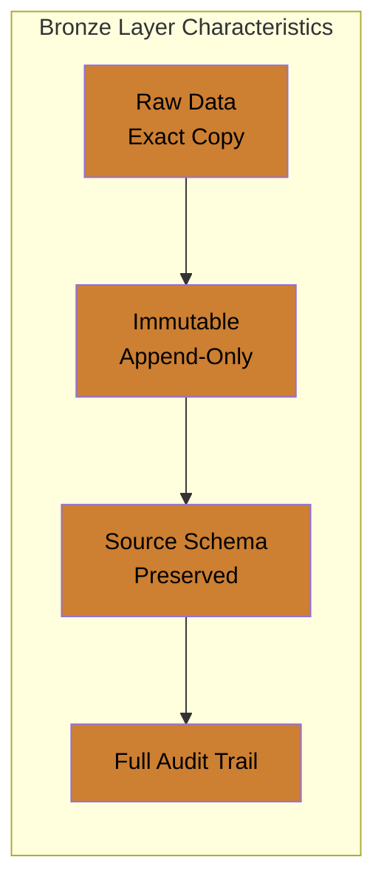
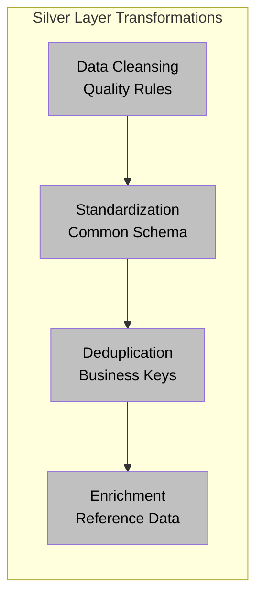
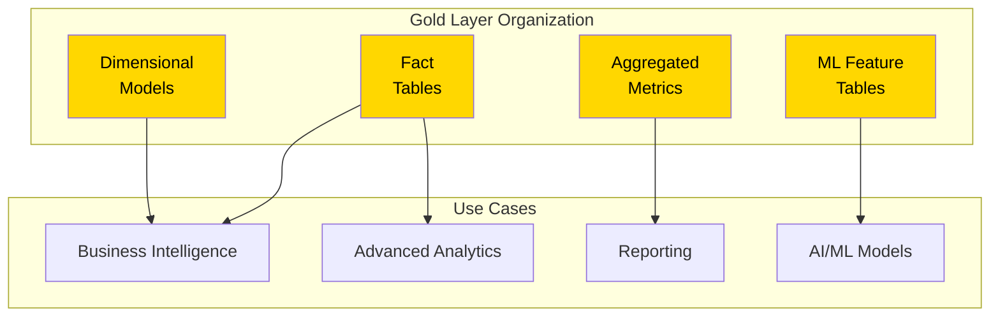
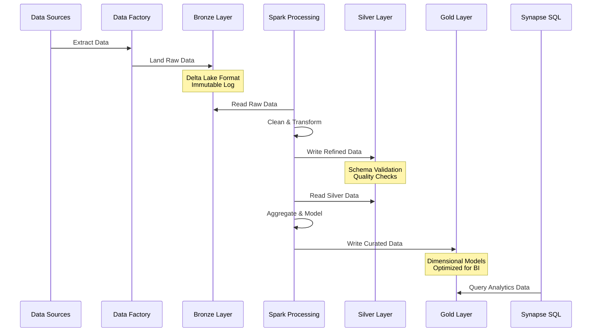
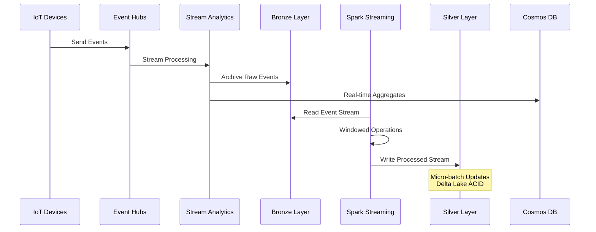
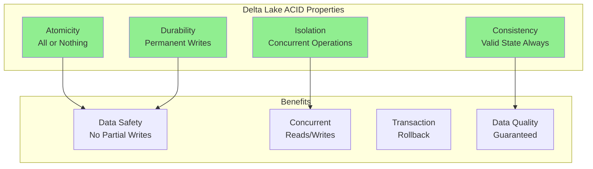
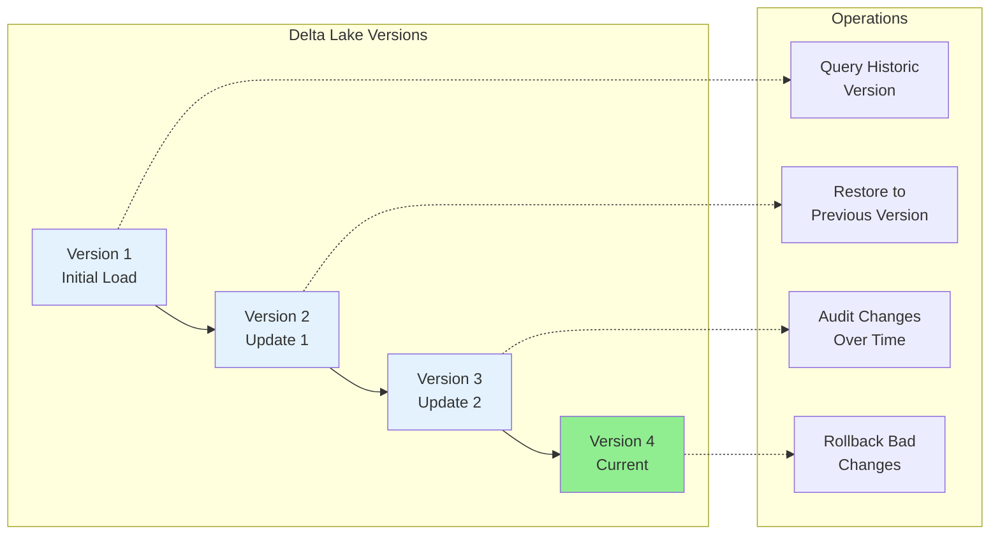
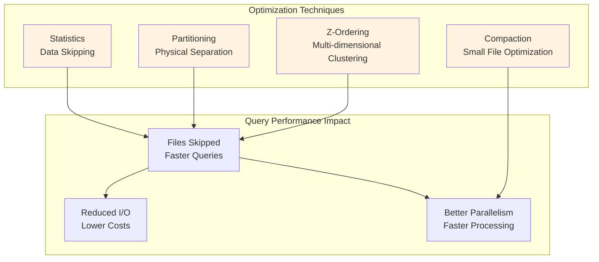
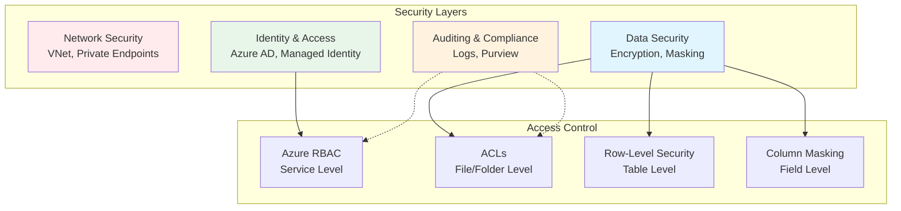

# Delta Lakehouse Architecture Diagram

[🏠 Home](../../README.md) > [📊 Diagrams](README.md) > Delta Lakehouse Architecture

## Overview

This diagram illustrates the comprehensive Delta Lakehouse architecture pattern using Azure Synapse Analytics and Data Lake Storage Gen2. The architecture implements the Medallion pattern (Bronze/Silver/Gold) with Delta Lake format for ACID transactions and data versioning.

---

## Complete Architecture Diagram

```mermaid
graph TB
    subgraph "Data Sources"
        DB[(Databases<br/>SQL Server, Oracle)]
        Files[File Systems<br/>CSV, JSON, Parquet]
        Apps[Applications<br/>APIs, SaaS]
        Stream[Streaming<br/>IoT, Events]
    end

    subgraph "Ingestion Layer"
        ADF[Azure Data Factory<br/>ETL/ELT Pipelines]
        EH[Event Hubs<br/>Stream Ingestion]
        ASA[Stream Analytics<br/>Real-time Processing]
    end

    subgraph "Azure Data Lake Storage Gen2"
        subgraph "Bronze Layer - Raw Zone"
            BronzeDB[Database Extracts]
            BronzeFiles[Raw Files]
            BronzeStream[Streaming Data]
        end

        subgraph "Silver Layer - Refined Zone"
            SilverCleaned[Cleansed Data]
            SilverConformed[Conformed Data]
            SilverValidated[Validated Data]
        end

        subgraph "Gold Layer - Curated Zone"
            GoldDim[Dimension Tables]
            GoldFact[Fact Tables]
            GoldAgg[Aggregated Metrics]
            GoldML[ML Feature Tables]
        end
    end

    subgraph "Delta Lake Format"
        DeltaACID[ACID Transactions]
        DeltaVersion[Time Travel]
        DeltaSchema[Schema Evolution]
        DeltaOptimize[Z-Ordering & Compaction]
    end

    subgraph "Processing - Synapse Spark Pools"
        SparkETL[ETL Processing<br/>PySpark, Scala]
        SparkML[ML Workloads<br/>MLlib, AutoML]
        SparkStream[Streaming Jobs<br/>Structured Streaming]
    end

    subgraph "Query & Analytics - Synapse SQL"
        ServerlessSQL[Serverless SQL Pool<br/>On-demand Queries]
        DedicatedSQL[Dedicated SQL Pool<br/>Data Warehouse]
    end

    subgraph "Consumption Layer"
        PowerBI[Power BI<br/>Dashboards & Reports]
        AzureML[Azure ML<br/>ML Models]
        Apps2[Applications<br/>APIs & Services]
        Excel[Excel<br/>Self-service BI]
    end

    subgraph "Governance & Security"
        Purview[Azure Purview<br/>Data Catalog & Lineage]
        AAD[Azure AD<br/>Authentication]
        RBAC[RBAC & ACLs<br/>Authorization]
        Encryption[Encryption<br/>At Rest & In Transit]
    end

    subgraph "Operations & Monitoring"
        Monitor[Azure Monitor<br/>Metrics & Logs]
        LogAnalytics[Log Analytics<br/>Diagnostics]
        Alerts[Alerts & Actions<br/>Automation]
    end

    %% Data Flow Connections
    DB --> ADF
    Files --> ADF
    Apps --> ADF
    Stream --> EH
    EH --> ASA

    ADF --> BronzeDB
    ADF --> BronzeFiles
    ASA --> BronzeStream

    BronzeDB --> SparkETL
    BronzeFiles --> SparkETL
    BronzeStream --> SparkStream

    SparkETL --> SilverCleaned
    SilverCleaned --> SilverConformed
    SilverConformed --> SilverValidated
    SparkStream --> SilverCleaned

    SilverValidated --> SparkETL
    SparkETL --> GoldDim
    SparkETL --> GoldFact
    SparkETL --> GoldAgg
    SparkML --> GoldML

    %% Delta Lake Integration
    BronzeDB -.-> DeltaACID
    SilverCleaned -.-> DeltaACID
    GoldDim -.-> DeltaACID
    SilverValidated -.-> DeltaVersion
    GoldFact -.-> DeltaSchema
    GoldAgg -.-> DeltaOptimize

    %% Query Layer
    GoldDim --> ServerlessSQL
    GoldFact --> ServerlessSQL
    GoldAgg --> ServerlessSQL
    GoldDim --> DedicatedSQL
    GoldFact --> DedicatedSQL

    %% Consumption
    ServerlessSQL --> PowerBI
    DedicatedSQL --> PowerBI
    ServerlessSQL --> Excel
    GoldML --> AzureML
    DedicatedSQL --> Apps2

    %% Governance
    SparkETL -.-> Purview
    ServerlessSQL -.-> Purview
    ADF -.-> Purview

    AAD -.-> ServerlessSQL
    AAD -.-> SparkETL
    RBAC -.-> BronzeDB
    RBAC -.-> SilverCleaned
    RBAC -.-> GoldDim

    %% Monitoring
    SparkETL -.-> Monitor
    ServerlessSQL -.-> Monitor
    DedicatedSQL -.-> Monitor
    Monitor --> LogAnalytics
    LogAnalytics --> Alerts

    %% Styling
    style BronzeDB fill:#CD7F32,color:#000
    style BronzeFiles fill:#CD7F32,color:#000
    style BronzeStream fill:#CD7F32,color:#000

    style SilverCleaned fill:#C0C0C0,color:#000
    style SilverConformed fill:#C0C0C0,color:#000
    style SilverValidated fill:#C0C0C0,color:#000

    style GoldDim fill:#FFD700,color:#000
    style GoldFact fill:#FFD700,color:#000
    style GoldAgg fill:#FFD700,color:#000
    style GoldML fill:#FFD700,color:#000

    style DeltaACID fill:#90EE90
    style DeltaVersion fill:#90EE90
    style DeltaSchema fill:#90EE90
    style DeltaOptimize fill:#90EE90

    style SparkETL fill:#E1F5FE
    style SparkML fill:#E1F5FE
    style SparkStream fill:#E1F5FE

    style ServerlessSQL fill:#FFF3E0
    style DedicatedSQL fill:#FFF3E0

    style PowerBI fill:#F3E5F5
    style AzureML fill:#F3E5F5
```



---

## Medallion Architecture Layers

### Bronze Layer (Raw Data)



**Purpose**: Land all raw data exactly as received from sources

**Characteristics**:
- No transformation beyond format conversion
- Preserves original data structure
- Includes metadata (timestamp, source system, batch ID)
- Supports data reprocessing and lineage

---

### Silver Layer (Refined Data)



**Purpose**: Cleansed, conformed, and validated data ready for analytics

**Transformations**:
- Data quality validation and cleansing
- Standardized schemas across sources
- Deduplication using business keys
- Reference data enrichment
- Type casting and format standardization

---

### Gold Layer (Business-Ready Data)



**Purpose**: Business-ready aggregates and dimensional models

**Organization**:
- Star/snowflake dimensional models
- Pre-aggregated metrics and KPIs
- Feature stores for ML models
- Business-friendly naming conventions
- Optimized for query performance

---

## Data Flow Patterns

### Batch Processing Flow



---

### Streaming Processing Flow



---

## Delta Lake Features

### ACID Transactions



---

### Time Travel & Versioning



**Time Travel Queries**:
```sql
-- Query data as of specific version
SELECT * FROM delta.`/path/to/table` VERSION AS OF 2

-- Query data as of specific timestamp
SELECT * FROM delta.`/path/to/table` TIMESTAMP AS OF '2025-01-01'
```

---

## Performance Optimization

### Z-Ordering & Data Skipping



**Optimization Commands**:
```sql
-- Z-Order optimization (multi-column)
OPTIMIZE table_name ZORDER BY (col1, col2, col3)

-- Compact small files
OPTIMIZE table_name

-- Vacuum old files (cleanup)
VACUUM table_name RETAIN 168 HOURS
```

---

## Security & Governance

### Multi-Layer Security



---

## Reference Architecture Links

- [Detailed Architecture](../architecture/delta-lakehouse/detailed-architecture.md)
- [Implementation Guide](../tutorials/synapse/delta-lakehouse-tutorial.md)
- [Best Practices](../best-practices/delta-lake-optimization.md)
- [Code Examples](../code-examples/delta-lake/README.md)

---

*Last Updated: 2025-01-28*
*Diagram Type: Architecture Pattern*
*Technology: Azure Synapse, Delta Lake, Data Lake Gen2*
