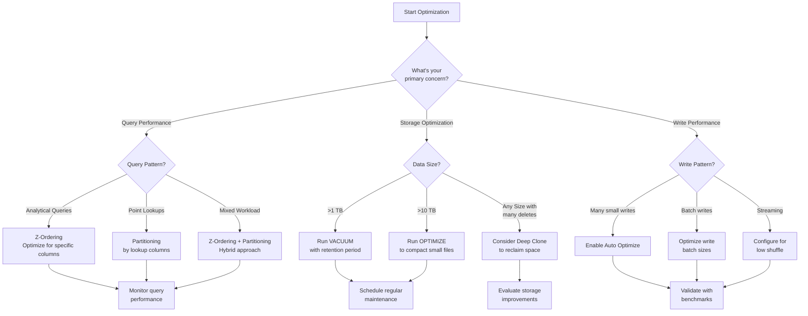
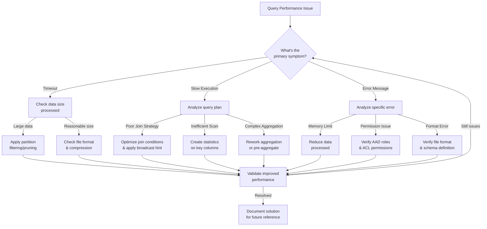
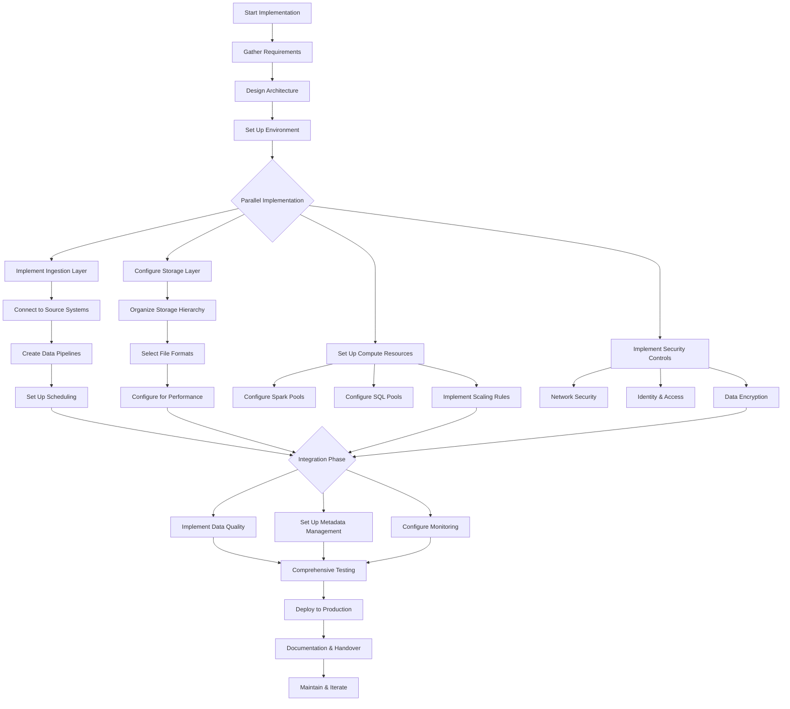
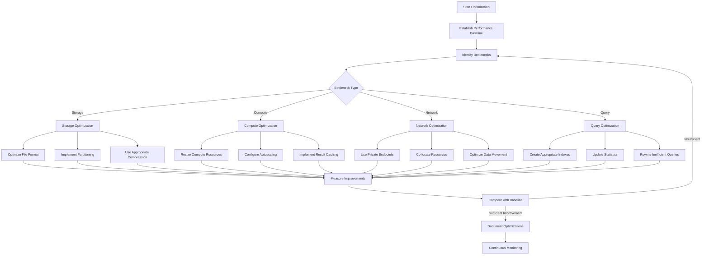
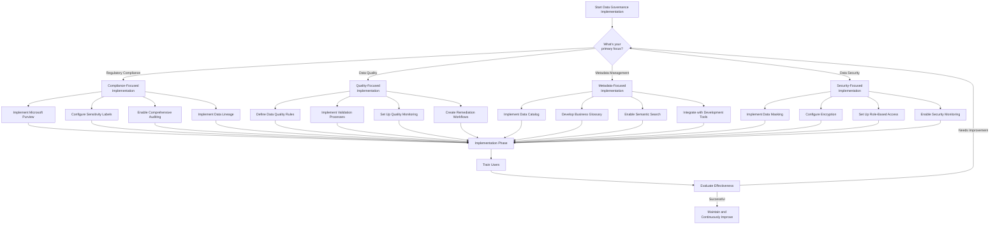
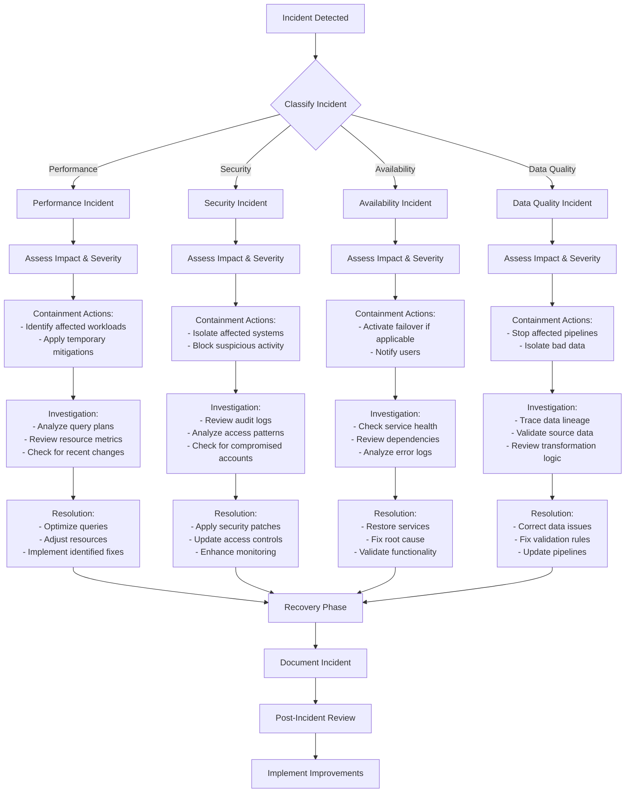

# Process Flowcharts for Azure Synapse Analytics

This section provides flowcharts for common processes related to Azure Synapse Analytics, including troubleshooting, optimization, and implementation workflows.

## Delta Lake Optimization Decision Tree

This flowchart helps you decide which Delta Lake optimization techniques to apply based on your workload characteristics.

## Serverless SQL Query Troubleshooting Flowchart

This flowchart provides a systematic approach to troubleshooting performance issues with Serverless SQL queries.

## End-to-End Data Pipeline Implementation Flowchart

This flowchart outlines the implementation process for an end-to-end data pipeline in Azure Synapse Analytics.

## Performance Optimization Process

This flowchart outlines the process for optimizing the performance of Azure Synapse Analytics workloads.

## Data Governance Implementation Decision Tree

This flowchart helps you decide which data governance features to implement based on your requirements.

## Incident Response Process for Azure Synapse

This flowchart outlines the incident response process for Azure Synapse Analytics-related issues.

## Best Practices for Using Process Flowcharts

1. **Customize for Your Environment**: Adapt these flowcharts to your specific Azure Synapse implementation and requirements.

2. **Incorporate into Documentation**: Include these flowcharts in your operational documentation and runbooks.

3. **Use for Training**: Utilize these flowcharts to train new team members on standard processes and troubleshooting approaches.

4. **Iterate and Improve**: Regularly review and update the flowcharts based on new features, lessons learned, and evolving best practices.

5. **Automate Where Possible**: Consider implementing automated versions of these processes where applicable.

6. **Include in Incident Response**: Make these flowcharts accessible during incident response situations to guide resolution efforts.
