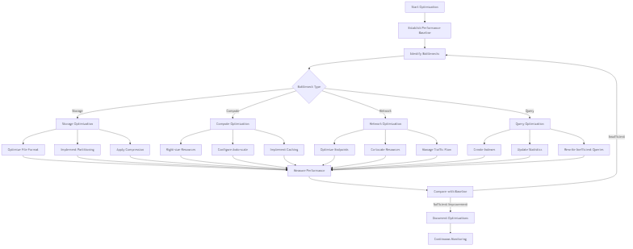
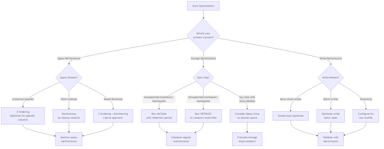
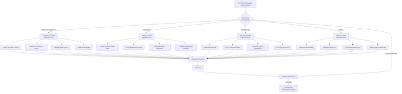
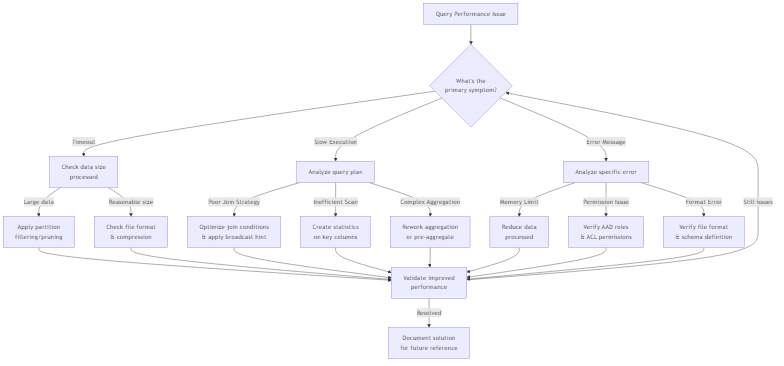

# Process Flowcharts for Azure Synapse Analytics

This section provides flowcharts for common processes related to Azure Synapse Analytics, including troubleshooting, optimization, and implementation workflows.

## Delta Lake Optimization Decision Tree

This flowchart helps you decide which Delta Lake optimization techniques to apply based on your workload characteristics.

<!-- Mermaid diagram for MkDocs rendering -->

<!-- Static image fallback for GitHub -->

## Serverless SQL Query Troubleshooting Flowchart

This flowchart provides a systematic approach to troubleshooting performance issues with Serverless SQL queries.

<!-- Mermaid diagram for MkDocs rendering -->

<!-- Static image fallback for GitHub -->

## End-to-End Data Pipeline Implementation Flowchart

This flowchart outlines the implementation process for an end-to-end data pipeline in Azure Synapse Analytics.

<!-- Mermaid diagram for MkDocs rendering -->

<!-- Static image fallback for GitHub -->

## Performance Optimization Process

This flowchart outlines the process for optimizing the performance of Azure Synapse Analytics workloads.

<!-- Mermaid diagram for MkDocs rendering -->

<!-- Static image fallback for GitHub -->

## Data Governance Implementation Decision Tree

This flowchart helps you decide which data governance features to implement based on your requirements.

<!-- Mermaid diagram for MkDocs rendering -->

<!-- Static image fallback for GitHub -->

## Incident Response Process for Azure Synapse

This flowchart outlines the incident response process for Azure Synapse Analytics-related issues.

<!-- Mermaid diagram for MkDocs rendering -->

<!-- Static image fallback for GitHub -->

## Best Practices for Using Process Flowcharts

1. __Customize for Your Environment__: Adapt these flowcharts to your specific Azure Synapse implementation and requirements.

2. __Incorporate into Documentation__: Include these flowcharts in your operational documentation and runbooks.

3. __Use for Training__: Utilize these flowcharts to train new team members on standard processes and troubleshooting approaches.

4. __Iterate and Improve__: Regularly review and update the flowcharts based on new features, lessons learned, and evolving best practices.

5. __Automate Where Possible__: Consider implementing automated versions of these processes where applicable.

6. __Include in Incident Response__: Make these flowcharts accessible during incident response situations to guide resolution efforts.
